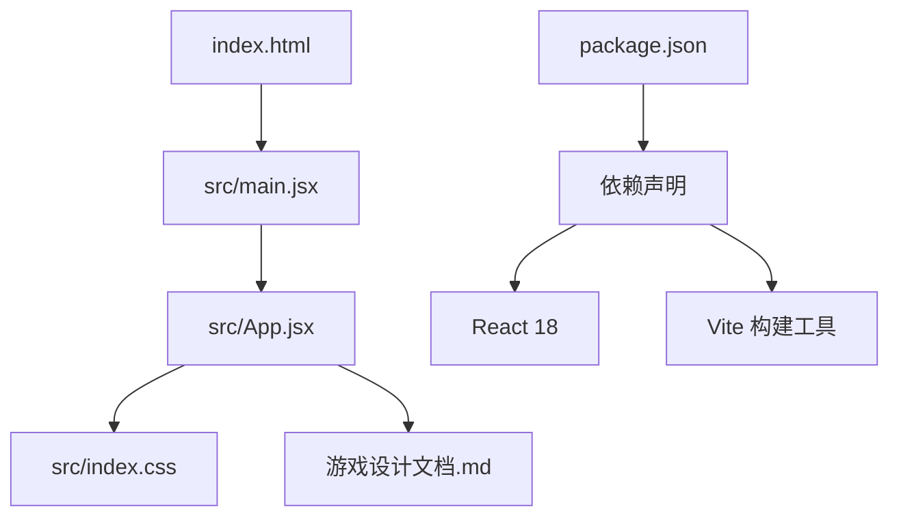
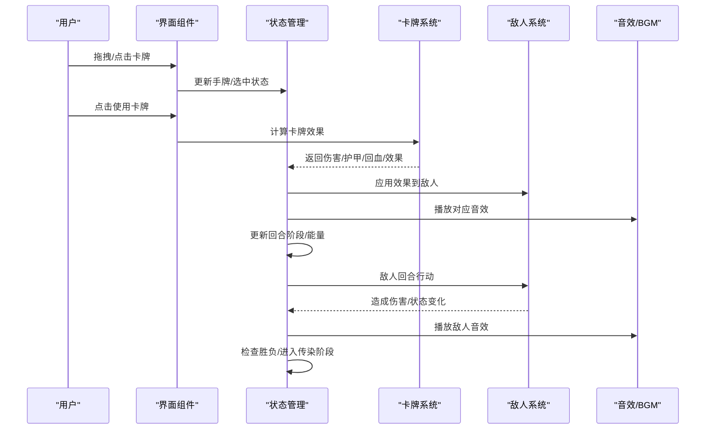
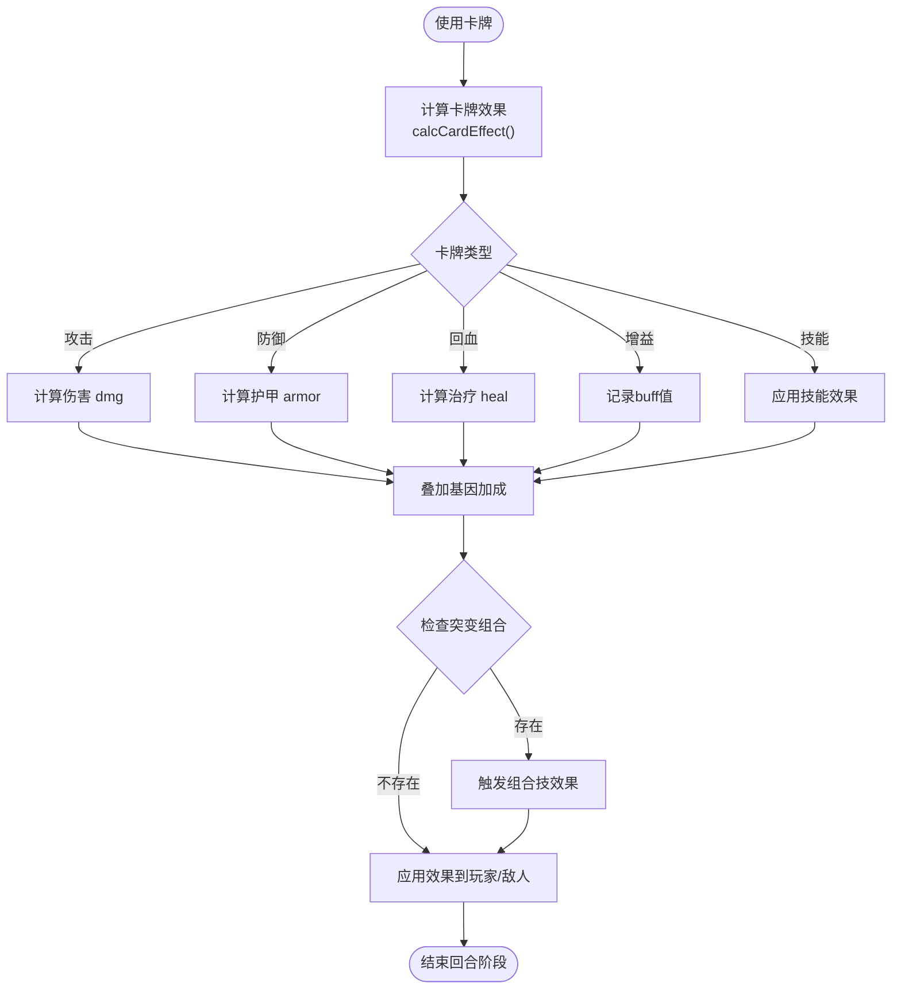
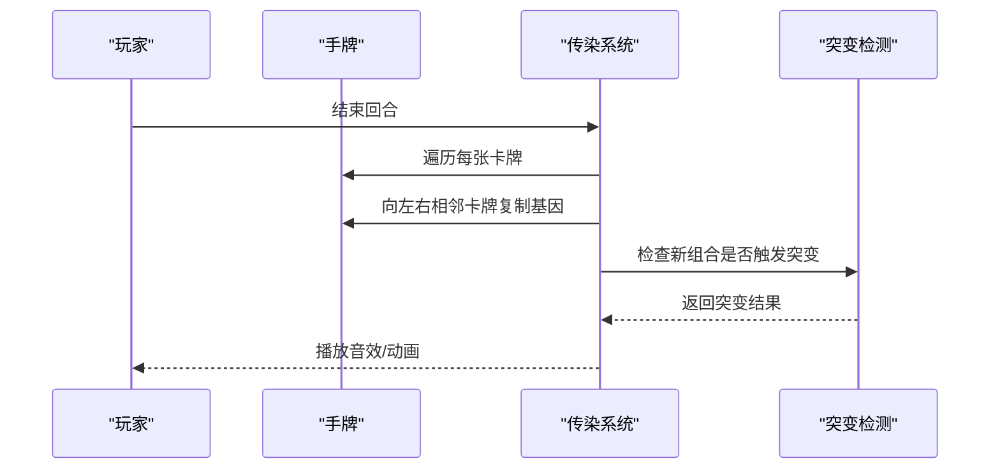
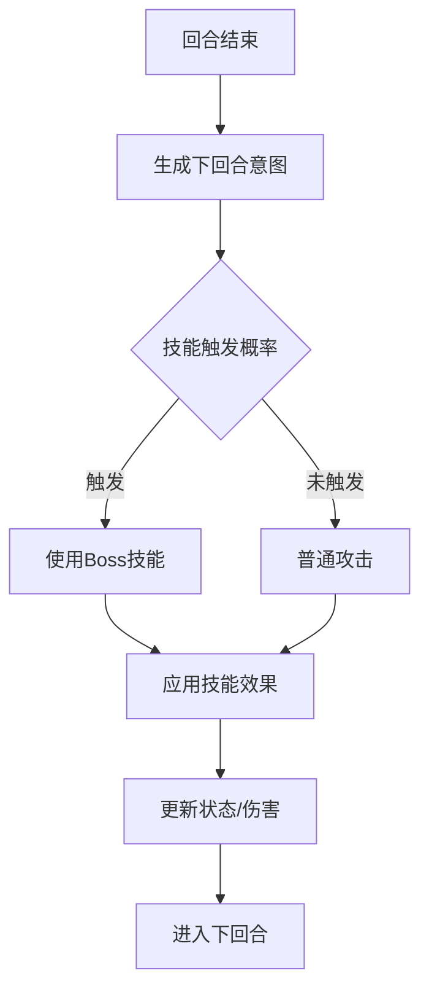
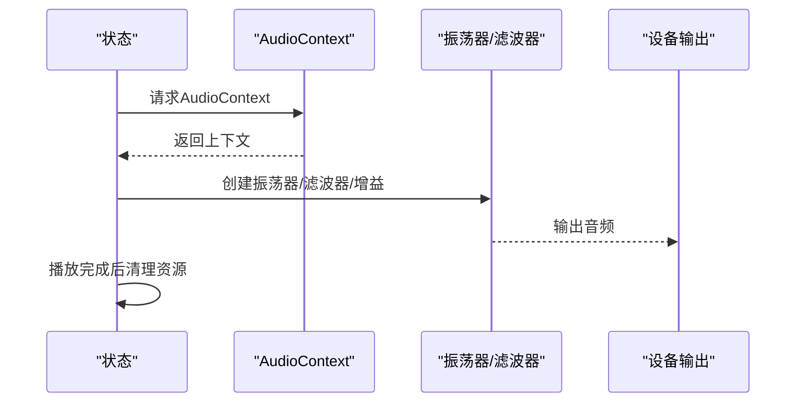
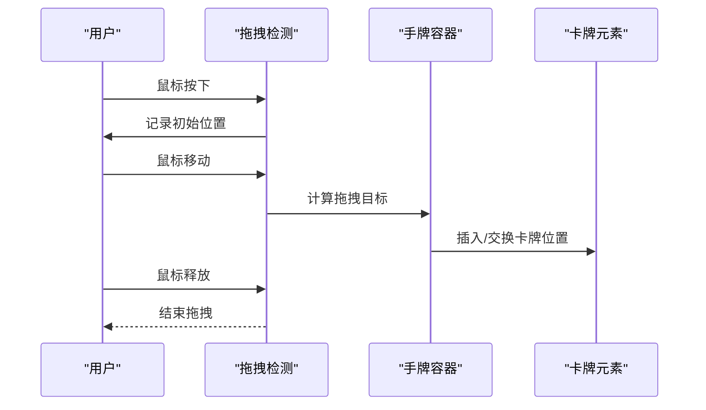
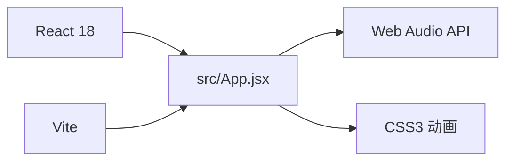

# 卡牌系统

<cite>
**本文引用的文件**
- [README.md](file://README.md)
- [游戏设计文档.md](file://游戏设计文档.md)
- [src/App.jsx](file://src/App.jsx)
- [src/main.jsx](file://src/main.jsx)
- [src/index.css](file://src/index.css)
- [index.html](file://index.html)
- [package.json](file://package.json)
</cite>

## 更新摘要
**变更内容**
- 更新了卡牌系统的实际实现细节，包括4种基础卡牌类型和基因携带机制
- 完善了卡牌效果计算函数calcCardEffect的实现逻辑
- 修正了基因系统与组合技的详细配置
- 增强了传染系统的具体实现和动画效果
- 优化了音效系统和BGM的8bit风格实现

## 目录
1. [简介](#简介)
2. [项目结构](#项目结构)
3. [核心组件](#核心组件)
4. [架构总览](#架构总览)
5. [详细组件分析](#详细组件分析)
6. [依赖关系分析](#依赖关系分析)
7. [性能考量](#性能考量)
8. [故障排除指南](#故障排除指南)
9. [结论](#结论)
10. [附录](#附录)

## 简介
本项目是一个以雪纳瑞犬"小雪"为主角的卡牌Roguelike游戏，核心围绕卡牌系统展开。玩家在每回合通过拖拽或点击选择卡牌，消耗能量执行攻击、防御、回血或技能，同时通过"传染系统"将基因传递给相邻卡牌，触发"组合技"（突变），从而形成多样化的Build策略。游戏包含完整的前端技术栈与音效系统，提供流畅的交互体验与视觉反馈。

## 项目结构
项目采用Vite + React 18的现代前端架构，核心入口为App.jsx，负责渲染标题页、战斗界面、游戏结束与胜利界面，并实现卡牌拖拽、战斗逻辑、音效与动画等全部功能。

**图表来源**
- [index.html:1-14](file://index.html#L1-L14)
- [src/main.jsx:1-8](file://src/main.jsx#L1-L8)
- [src/App.jsx:1-20](file://src/App.jsx#L1-L20)
- [package.json:1-28](file://package.json#L1-L28)

**章节来源**
- [README.md:1-17](file://README.md#L1-L17)
- [package.json:1-28](file://package.json#L1-L28)
- [index.html:1-14](file://index.html#L1-L14)
- [src/main.jsx:1-8](file://src/main.jsx#L1-L8)
- [src/App.jsx:1-20](file://src/App.jsx#L1-L20)

## 核心组件
- **卡牌系统**：包含攻击、防御、回血、增益、技能五种类型，每张卡牌可携带0-3个基因，通过组合触发突变。
- **基因系统**：8种基因，提供伤害、护甲、先攻、标记、吸血、弹射、抽牌、效果翻倍等加成。
- **组合技系统**：10种组合技配方，当卡牌携带两个特定基因组合时触发，如"铁齿铜牙"、"闪电爪"、"致命一击"等。
- **传染系统**：每回合结束时，相邻卡牌互相传递基因，形成Build进化。
- **敌人AI系统**：基于意图的AI，每回合预测下回合行动（普通攻击或Boss技能），并显示给玩家。
- **音效与BGM系统**：使用Web Audio API生成8bit风格音效与BGM，增强沉浸感。
- **拖拽与交互**：完整的鼠标拖拽与点击选择交互，支持目标选择与卡牌排序。

**章节来源**
- [src/App.jsx:8-37](file://src/App.jsx#L8-L37)
- [src/App.jsx:40-59](file://src/App.jsx#L40-L59)
- [src/App.jsx:62-89](file://src/App.jsx#L62-L89)
- [src/App.jsx:91-100](file://src/App.jsx#L91-L100)
- [src/App.jsx:103-116](file://src/App.jsx#L103-L116)
- [src/App.jsx:164-167](file://src/App.jsx#L164-L167)
- [src/App.jsx:169-216](file://src/App.jsx#L169-L216)
- [src/App.jsx:264-335](file://src/App.jsx#L264-L335)
- [src/App.jsx:341-720](file://src/App.jsx#L341-L720)
- [src/App.jsx:787-862](file://src/App.jsx#L787-L862)
- [src/App.jsx:864-988](file://src/App.jsx#L864-L988)
- [src/App.jsx:1001-1028](file://src/App.jsx#L1001-L1028)
- [src/App.jsx:1030-1293](file://src/App.jsx#L1030-L1293)
- [src/App.jsx:1295-1300](file://src/App.jsx#L1295-L1300)
- [src/App.jsx:1302-1385](file://src/App.jsx#L1302-L1385)
- [src/App.jsx:1387-1643](file://src/App.jsx#L1387-L1643)
- [src/App.jsx:1645-1826](file://src/App.jsx#L1645-L1826)
- [src/App.jsx:1828-1973](file://src/App.jsx#L1828-L1973)
- [src/App.jsx:1975-2029](file://src/App.jsx#L1975-L2029)
- [src/App.jsx:2031-2254](file://src/App.jsx#L2031-L2254)
- [src/App.jsx:2256-2719](file://src/App.jsx#L2256-L2719)

## 架构总览
系统采用函数式组件与Hooks的状态管理模式，通过useState、useEffect、useRef实现状态同步与副作用管理。卡牌效果计算集中在calcCardEffect函数中，战斗流程由回合阶段控制，音效与BGM通过Web Audio API动态生成。

**图表来源**
- [src/App.jsx:1030-1293](file://src/App.jsx#L1030-L1293)
- [src/App.jsx:864-988](file://src/App.jsx#L864-L988)
- [src/App.jsx:341-720](file://src/App.jsx#L341-L720)

## 详细组件分析

### 卡牌系统
- **类型与属性**：攻击类（伤害）、防御类（护甲）、回血类（治疗）、增益类（下次攻击加成）、技能类（特殊效果）。
- **基因与突变**：每张卡牌可携带0-3个基因，基因组合触发突变，如"利齿+硬毛"="铁齿铜牙"，"嗅探+利齿"="致命一击"等。
- **效果计算**：calcCardEffect综合基础属性、基因加成、增益buff与突变效果，返回最终伤害、护甲、治疗与效果列表。

**图表来源**
- [src/App.jsx:169-216](file://src/App.jsx#L169-L216)
- [src/App.jsx:1030-1293](file://src/App.jsx#L1030-L1293)

**章节来源**
- [src/App.jsx:8-37](file://src/App.jsx#L8-L37)
- [src/App.jsx:40-59](file://src/App.jsx#L40-L59)
- [src/App.jsx:62-89](file://src/App.jsx#L62-L89)
- [src/App.jsx:169-216](file://src/App.jsx#L169-L216)
- [src/App.jsx:1030-1293](file://src/App.jsx#L1030-L1293)

### 基因与组合技系统
- **基因定义**：利齿、硬毛、疾跑、嗅探、卖萌、吠叫、零食、忠诚，分别提供伤害、护甲、先攻、标记、吸血、弹射、抽牌、效果翻倍等效果。
- **组合技配方**：10种组合技，如"闪电爪"、"致命一击"、"狮吼功"等，提供AOE、冻结、无视护甲、治疗+抽牌等强力效果。
- **传染机制**：doInfection遍历手牌，向左右相邻卡牌传递基因，最多3个基因，触发突变即标记为变异。

**图表来源**
- [src/App.jsx:787-862](file://src/App.jsx#L787-L862)
- [src/App.jsx:20-32](file://src/App.jsx#L20-L32)
- [src/App.jsx:34-37](file://src/App.jsx#L34-L37)

**章节来源**
- [src/App.jsx:8-18](file://src/App.jsx#L8-L18)
- [src/App.jsx:20-32](file://src/App.jsx#L20-L32)
- [src/App.jsx:34-37](file://src/App.jsx#L34-L37)
- [src/App.jsx:787-862](file://src/App.jsx#L787-L862)

### 敌人AI与Boss技能
- **敌人模板**：7种敌人，分布在6个关卡，具备不同生命值、攻击力、护甲与Boss技能。
- **AI意图**：每回合结束预测下回合行动（普通攻击或Boss技能），并以概率控制技能触发。
- **状态影响**：冰冻、迷惑、虚弱、暴露、中毒等状态影响敌人行为与伤害。

**图表来源**
- [src/App.jsx:864-988](file://src/App.jsx#L864-L988)
- [src/App.jsx:91-100](file://src/App.jsx#L91-L100)
- [src/App.jsx:103-116](file://src/App.jsx#L103-L116)

**章节来源**
- [src/App.jsx:91-100](file://src/App.jsx#L91-L100)
- [src/App.jsx:103-116](file://src/App.jsx#L103-L116)
- [src/App.jsx:864-988](file://src/App.jsx#L864-L988)

### 音效与BGM系统
- **Web Audio API**：动态生成8bit风格音效，包括狗叫声、攻击音、技能音、BGM等。
- **BGM**：Loading界面与战斗界面分别播放不同BGM，营造氛围。
- **音效映射**：不同卡牌与Boss技能对应专属音效，增强反馈。

**图表来源**
- [src/App.jsx:341-720](file://src/App.jsx#L341-L720)

**章节来源**
- [src/App.jsx:341-720](file://src/App.jsx#L341-L720)

### 拖拽与交互系统
- **拖拽检测**：通过鼠标事件与阈值判断实现拖拽，支持在手牌间插入与排序。
- **目标选择**：攻击类卡牌需要选择目标，点击敌人执行攻击。
- **提示系统**：Tooltip在悬停时显示卡牌/敌人详情，支持触摸设备优化。

**图表来源**
- [src/App.jsx:264-335](file://src/App.jsx#L264-L335)
- [src/App.jsx:1302-1385](file://src/App.jsx#L1302-L1385)
- [src/App.jsx:1604-1630](file://src/App.jsx#L1604-L1630)

**章节来源**
- [src/App.jsx:264-335](file://src/App.jsx#L264-L335)
- [src/App.jsx:1302-1385](file://src/App.jsx#L1302-L1385)
- [src/App.jsx:1604-1630](file://src/App.jsx#L1604-L1630)

## 依赖关系分析
- **React 18**：函数组件与Hooks驱动状态管理与生命周期。
- **Vite**：快速开发与构建工具，支持热更新与模块解析。
- **Web Audio API**：音效与BGM生成，避免外部依赖。
- **CSS3**：动画与响应式布局，提供流畅视觉体验。

**图表来源**
- [package.json:12-25](file://package.json#L12-L25)
- [src/App.jsx:341-720](file://src/App.jsx#L341-L720)
- [src/index.css:1-9](file://src/index.css#L1-L9)

**章节来源**
- [package.json:12-25](file://package.json#L12-L25)
- [src/index.css:1-9](file://src/index.css#L1-L9)

## 性能考量
- **虚拟DOM优化**：使用key属性与不可变更新减少重渲染。
- **状态同步**：useRef同步手牌与拖拽状态，避免闭包陷阱。
- **动画性能**：使用transform与opacity实现GPU加速，避免布局重排。
- **音效优化**：单例AudioContext，避免重复创建；音效播放使用低延迟振荡器。
- **响应式设计**：使用clamp()与vw单位实现平滑缩放，移动端优化触摸交互。

## 故障排除指南
- **音效无法播放**：检查浏览器权限与AudioContext状态，确保在用户手势后初始化。
- **拖拽异常**：确认鼠标事件绑定与阈值设置，避免与点击事件冲突。
- **卡牌效果异常**：核对calcCardEffect中的基因与突变逻辑，确保组合键排序一致。
- **敌人AI不触发技能**：检查BOSS_SKILLS的chance配置与回合意图生成逻辑。

**章节来源**
- [src/App.jsx:341-720](file://src/App.jsx#L341-L720)
- [src/App.jsx:264-335](file://src/App.jsx#L264-L335)
- [src/App.jsx:169-216](file://src/App.jsx#L169-L216)
- [src/App.jsx:864-988](file://src/App.jsx#L864-L988)

## 结论
本卡牌系统通过基因与突变机制，结合Roguelike的单局进化特性，为玩家提供了高策略深度与可重复游玩性。配合完整的拖拽交互、音效与动画系统，整体体验流畅且富有沉浸感。建议在未来版本中扩展更多卡牌类型、敌人与关卡，丰富Build多样性与挑战性。

## 附录
- **游戏设计文档**：详细描述了玩法循环、卡牌类型、基因系统、突变系统、传染系统、敌人AI与Boss技能设计、数值平衡与策略深度等内容。
- **技术实现要点**：包括卡牌拖拽系统、战斗计算系统、敌人AI系统、传染系统、音效系统、动画系统、响应式设计与性能优化。

**章节来源**
- [游戏设计文档.md:1-250](file://游戏设计文档.md#L1-L250)