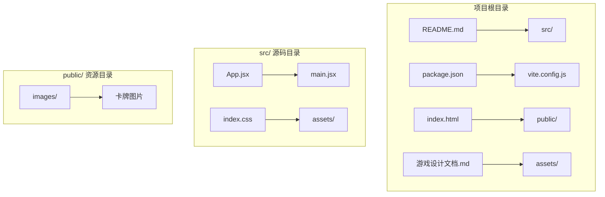
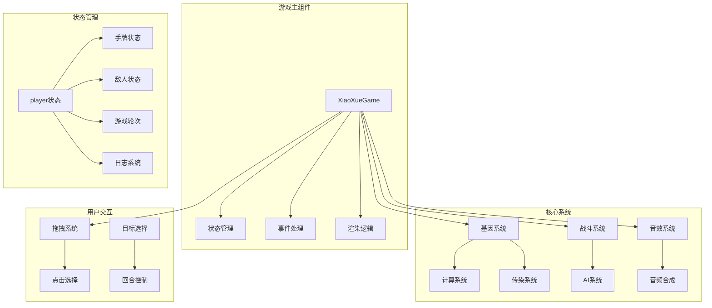
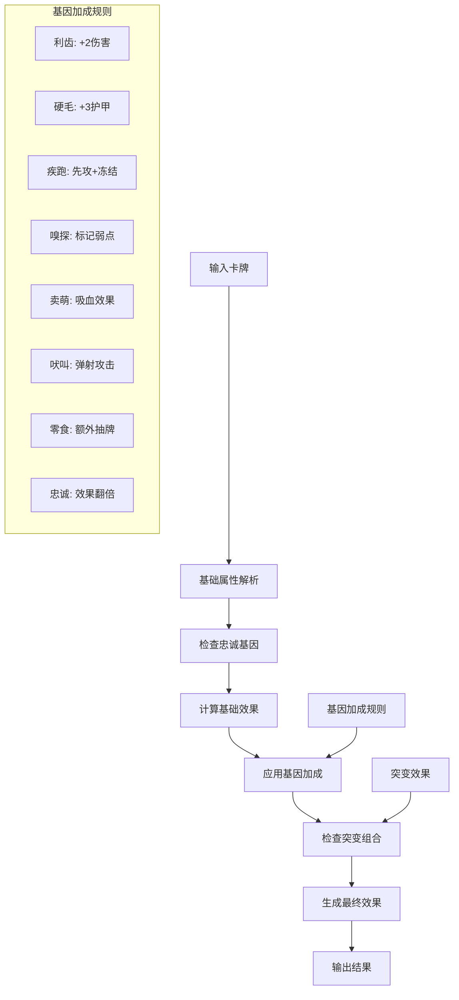
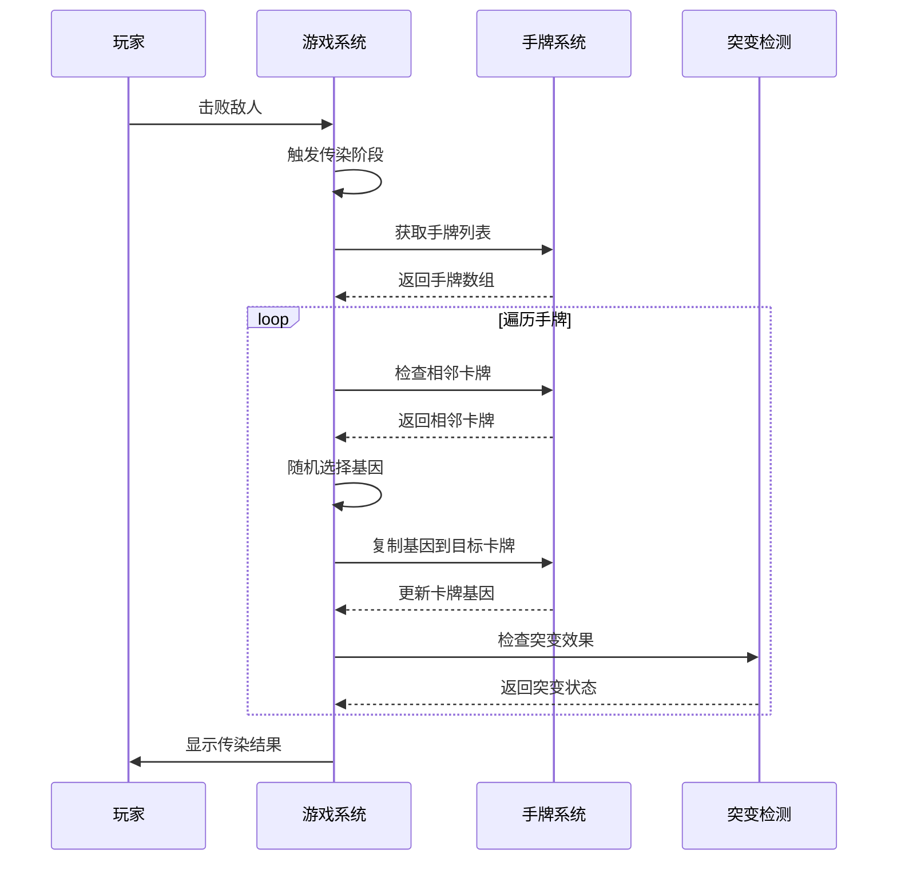
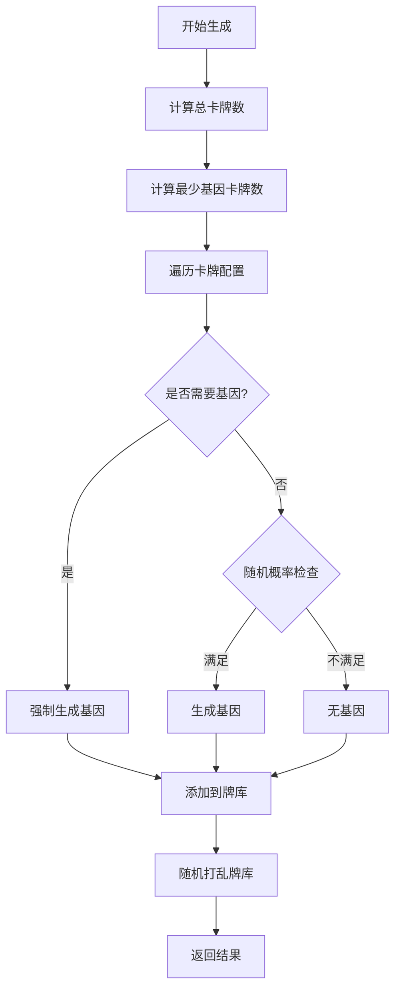
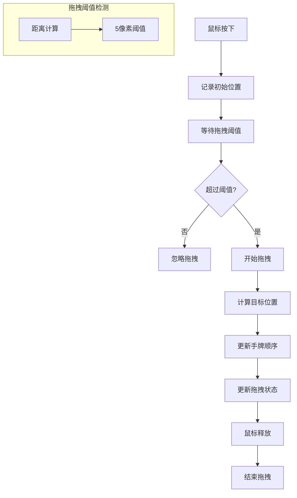
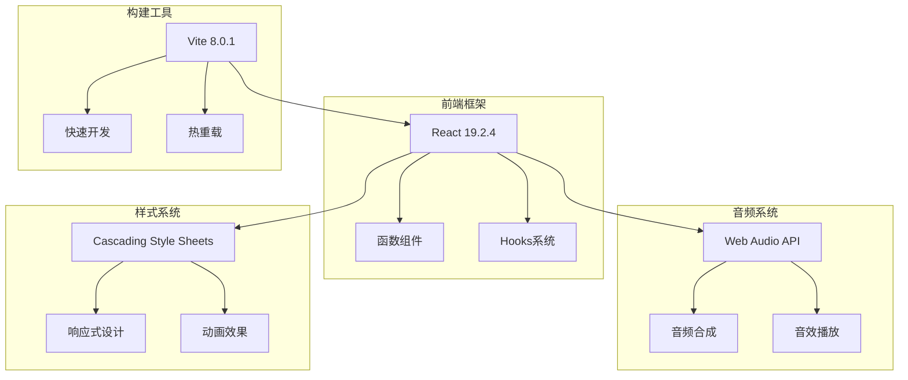

# 基因系统

<cite>
**本文引用的文件**
- [src/App.jsx](file://src/App.jsx)
- [游戏设计文档.md](file://游戏设计文档.md)
- [README.md](file://README.md)
- [package.json](file://package.json)
</cite>

## 更新摘要
**变更内容**
- 更新了基因定义与属性，确认现有8种基因的完整列表
- 修正了基因随机生成算法的实现细节
- 完善了基因效果计算机制的说明
- 更新了突变系统的详细效果描述
- 增强了传染系统的实现分析

## 目录
1. [简介](#简介)
2. [项目结构](#项目结构)
3. [核心组件](#核心组件)
4. [架构概览](#架构概览)
5. [详细组件分析](#详细组件分析)
6. [依赖关系分析](#依赖关系分析)
7. [性能考量](#性能考量)
8. [故障排除指南](#故障排除指南)
9. [结论](#结论)

## 简介

《小雪闯上海》是一款以雪纳瑞犬"小雪"为主角的卡牌Roguelike游戏。游戏的核心创新在于其独特的基因系统，为传统的卡牌战斗增添了深度的Build构筑乐趣。

在这个游戏中，每张卡牌都可以携带0-1个基因，通过随机生成的方式为卡牌提供额外的技能效果。玩家可以通过"传染系统"将基因从一张卡牌传递到其他卡牌上，从而形成强大的组合效果（突变）。这种设计让每局游戏都充满变数和策略性。

游戏采用React 18 + Vite的技术栈，结合Web Audio API实现了完整的8bit风格音效系统，为玩家提供沉浸式的游戏体验。

## 项目结构

该项目采用标准的Vite + React项目结构，主要文件组织如下：

**图表来源**
- [src/App.jsx:1-50](file://src/App.jsx#L1-L50)
- [src/main.jsx:1-8](file://src/main.jsx#L1-L8)

**章节来源**
- [README.md:1-17](file://README.md#L1-L17)
- [package.json:1-28](file://package.json#L1-L28)

## 核心组件

### 基因系统架构

基因系统是整个游戏的核心机制，包含三个主要组成部分：

#### 基因定义（GENES）
游戏定义了8种不同的基因，每种基因都有独特的外观标识、名称和效果描述：

| 基因 | 符号 | 名称 | 效果描述 | 颜色 |
|------|------|------|----------|------|
| sharp | 🦷 | 利齿 | +2伤害 | #ffb199 |
| tough | 🛡️ | 硬毛 | +3护甲 | #b8c5cc |
| fast | 💨 | 疾跑 | 先攻+冻结敌人1回合 | #a5e4fb |
| smell | 👃 | 嗅探 | 标记弱点，下回合伤害翻倍 | #c5e1a5 |
| cute | 🥺 | 卖萌 | 回复伤害50%生命 | #f48fb1 |
| loud | 📢 | 吠叫 | 弹射到随机敌人 | #ffeaa7 |
| snack | 🦴 | 零食 | 回合结束额外抽1张 | #d7ccc8 |
| loyal | ❤️ | 忠诚 | 效果翻倍 | #fca5a5 |

#### 突变配方（MUTATIONS）
当两张不同基因在同一张卡牌上时，会触发特殊的组合效果（突变）。目前已设计了10种突变组合：

| 组合 | 名称 | 效果描述 | 类型 | 数值 |
|------|------|----------|------|------|
| sharp+tough | 铁齿铜牙 | 10伤害+5护甲 | 攻击+防御 | 10 |
| sharp+fast | 闪电爪 | 15伤害冻结 | 攻击+控制 | 15 |
| smell+sharp | 致命一击 | 20无视护甲伤害 | 攻击+穿透 | 20 |
| cute+loyal | 治愈之吻 | 回复15HP | 治疗 | 15 |
| loud+loyal | 狮吼功 | 全体8伤害 | AOEs | 8 |
| snack+smell | 寻味追踪 | 抽3张牌 | 抽牌 | 3 |
| fast+smell | 幽灵犬 | 闪避下回合攻击 | 防御 | 1 |
| tough+loyal | 铜墙铁壁 | +15护甲 | 防御 | 15 |
| sharp+loud | 狂吠乱咬 | 随机攻击3次 | 攻击 | 6 |
| cute+snack | 大餐时间 | 回10HP抽2张 | 治疗+抽牌 | 10 |

#### 传染系统（Infection System）
这是Roguelike元素的核心体现，每击败一个敌人后触发。玩家选择一张手牌作为"传染源"，系统随机选择另一张手牌作为"传染目标"，将传染源的一个随机基因复制给目标卡牌。

**章节来源**
- [src/App.jsx:9:18](file://src/App.jsx#L9-L18)
- [src/App.jsx:21:32](file://src/App.jsx#L21-L32)
- [src/App.jsx:787:862](file://src/App.jsx#L787-L862)

## 架构概览

游戏的整体架构采用函数式组件和Hooks的设计模式，核心状态管理通过React的状态钩子实现：

**图表来源**
- [src/App.jsx:218:2756](file://src/App.jsx#L218-L2756)

## 详细组件分析

### 基因计算系统

基因计算系统是整个基因系统的核心，负责根据卡牌的基础属性、基因加成和突变效果计算最终的战斗效果。

#### 计算流程

**图表来源**
- [src/App.jsx:169:216](file://src/App.jsx#L169-L216)

#### 突变检测算法

突变检测算法采用双重循环遍历卡牌上的所有基因组合，通过基因键值对（如"sharp+tough"）在突变字典中查找对应的组合效果。

**章节来源**
- [src/App.jsx:169:216](file://src/App.jsx#L169-L216)
- [src/App.jsx:195:213](file://src/App.jsx#L195-L213)

### 传染系统实现

传染系统是Roguelike元素的核心，实现了卡牌的进化机制。

#### 传染流程

**图表来源**
- [src/App.jsx:787:862](file://src/App.jsx#L787-L862)

#### 传染算法细节

传染算法采用相邻卡牌检测机制，对于每张手牌：
1. 检查左侧相邻卡牌（如果存在）
2. 检查右侧相邻卡牌（如果存在）
3. 对于每个相邻卡牌，随机选择当前卡牌的一个基因
4. 将基因复制到目标卡牌，前提是目标卡牌基因数量小于3
5. 标记目标卡牌为"刚被传染"状态

**章节来源**
- [src/App.jsx:800:862](file://src/App.jsx#L800-L862)

### 基因随机生成算法

基因随机生成算法确保了游戏的随机性和平衡性。

#### 生成策略

**图表来源**
- [src/App.jsx:61:89](file://src/App.jsx#L61-L89)

#### 生成算法细节

基因生成算法采用两阶段策略：
1. **保证比例**：至少34%的卡牌必须带有基因
2. **随机补充**：剩余卡牌以30%的概率随机生成基因
3. **唯一性**：每张卡牌只生成一个随机基因

**章节来源**
- [src/App.jsx:61:89](file://src/App.jsx#L61-L89)
- [src/App.jsx:164:167](file://src/App.jsx#L164-L167)

### 音效系统

游戏使用Web Audio API实现了完整的8bit风格音效系统，为每种卡牌和Boss技能都设计了独特的音效。

#### 音效类型分类

| 音效类别 | 描述 | 示例 |
|----------|------|------|
| 卡牌音效 | 玩家使用的卡牌音效 | 爪击、扑咬、翻滚攻击、防御、回血、增益 |
| Boss技能音效 | 敌人使用的特殊技能 | 猫爪三连、狂吠震慑、肥猫压顶、网兜抓捕、撕咬、扔石头、终极抓捕 |
| 通用音效 | 游戏通用效果 | 出牌、攻击、技能传授、组合技触发、敌人攻击、受伤 |

#### 音频合成技术

音效系统使用多种波形和合成技术：
- **方波（Square Wave）**: 用于主要音效和BGM
- **锯齿波（Sawtooth Wave）**: 用于攻击和技能音效
- **正弦波（Sine Wave）**: 用于回血和特殊效果
- **带通滤波器**: 模拟狗叫声的共鸣特性
- **扫频效果**: 创建动态音效变化

**章节来源**
- [src/App.jsx:341:719](file://src/App.jsx#L341-L719)

### 拖拽交互系统

游戏实现了完整的卡牌拖拽交互系统，支持鼠标拖拽和点击选择两种操作方式。

#### 拖拽系统架构

**图表来源**
- [src/App.jsx:264:335](file://src/App.jsx#L264-L335)

#### 拖拽优化技术

拖拽系统采用了多项性能优化技术：
- **阈值检测**: 避免轻微移动触发拖拽
- **批量更新**: 使用函数式更新避免状态竞争
- **硬件加速**: 使用CSS transform实现流畅动画
- **事件委托**: 使用useRef避免闭包陷阱

**章节来源**
- [src/App.jsx:264:335](file://src/App.jsx#L264-L335)

## 依赖关系分析

### 技术栈依赖

**图表来源**
- [package.json:12:26](file://package.json#L12-L26)

### 核心依赖关系

游戏的核心依赖关系主要体现在以下几个方面：

1. **React Hooks**: 用于状态管理和副作用处理
2. **Web Audio API**: 用于音效合成和播放
3. **CSS3**: 用于动画和视觉效果
4. **Vite**: 用于开发环境和构建优化

**章节来源**
- [package.json:12:26](file://package.json#L12-L26)

## 性能考量

### 状态管理优化

游戏采用了多项状态管理优化技术：

1. **useRef同步**: 使用useRef同步手牌状态，避免闭包陷阱
2. **函数式更新**: 使用函数式更新避免状态竞争
3. **批量更新**: 合理安排状态更新时机，减少重渲染

### 渲染性能优化

1. **虚拟DOM优化**: 正确使用React的key属性，避免不必要的重渲染
2. **CSS动画**: 使用transform和opacity实现GPU加速
3. **响应式设计**: 使用clamp()函数实现平滑缩放

### 音效性能优化

1. **单例AudioContext**: 避免重复创建音频上下文
2. **低延迟合成**: 使用振荡器直接合成音效
3. **音效缓存**: 预生成常用音效参数

## 故障排除指南

### 常见问题及解决方案

#### 基因系统问题

**问题**: 基因无法正常触发
- 检查基因键值对格式是否正确
- 确认基因数量不超过3个
- 验证突变检测算法是否正常运行

**问题**: 传染系统失效
- 检查手牌数组索引范围
- 确认相邻卡牌检测逻辑
- 验证基因复制条件

#### 音效系统问题

**问题**: 音效无法播放
- 检查浏览器音频权限设置
- 确认AudioContext状态
- 验证音效参数配置

**问题**: 音效质量差
- 检查音频采样率设置
- 确认滤波器参数配置
- 验证音量包络设置

#### 拖拽系统问题

**问题**: 拖拽不灵敏
- 调整拖拽阈值参数
- 检查鼠标事件绑定
- 验证CSS transform设置

**问题**: 拖拽动画卡顿
- 检查硬件加速设置
- 确认CSS动画性能
- 验证JavaScript执行效率

**章节来源**
- [src/App.jsx:341:719](file://src/App.jsx#L341-L719)
- [src/App.jsx:264:335](file://src/App.jsx#L264-L335)

## 结论

《小雪闯上海》的基因系统成功地将Roguelike元素与卡牌战斗相结合，创造了一个既有趣又具有深度的游戏体验。通过8种基础基因、10种突变组合和智能的传染机制，游戏为玩家提供了丰富的Build构筑选择和策略思考空间。

系统的主要优势包括：

1. **创新性**: 基因系统为传统卡牌游戏注入了新的活力
2. **策略深度**: 多层次的策略选择和Build规划
3. **技术实现**: 现代Web技术的完美应用
4. **用户体验**: 流畅的交互和沉浸式的音效体验

未来可以考虑的扩展方向包括：
- 增加更多基因类型和突变组合
- 实现难度选择和存档功能
- 添加成就系统和收集要素
- 增强视觉效果和音效质量

这个游戏展示了如何通过巧妙的系统设计和技术实现，将简单的概念转化为丰富而有趣的游戏体验。