# 基因组合突变系统

<cite>
**本文档引用的文件**
- [游戏设计文档.md](file://游戏设计文档.md)
- [src/App.jsx](file://src/App.jsx)
- [package.json](file://package.json)
- [src/index.css](file://src/index.css)
</cite>

## 更新摘要
**变更内容**
- 更新了突变配方数量和效果描述，从文档中的10种增加到11种
- 修正了部分突变效果的具体数值和触发条件
- 补充了新的组合技效果实现细节，包括"大餐时间"等新增配方
- 更新了基因系统和突变检测算法的说明

## 目录
1. [项目概述](#项目概述)
2. [核心系统架构](#核心系统架构)
3. [基因系统详解](#基因系统详解)
4. [突变系统分析](#突变系统分析)
5. [战斗系统实现](#战斗系统实现)
6. [音效与动画系统](#音效与动画系统)
7. [用户界面设计](#用户界面设计)
8. [性能优化策略](#性能优化策略)
9. [扩展性设计](#扩展性设计)
10. [总结](#总结)

## 项目概述

《小雪闯上海》是一款以雪纳瑞犬"小雪"为主角的卡牌Roguelike游戏。游戏采用React 18 + Vite技术栈构建，实现了独特的基因组合突变系统，为传统卡牌战斗增添了Build构筑的乐趣。

### 游戏核心特色

- **基因系统**：每张卡牌可携带0-3个基因，提供丰富的Build可能性
- **突变组合**：两种基因组合触发特殊组合技，增加策略深度
- **Roguelike元素**：每局游戏内卡牌进化，体验Build成型的快感
- **8bit音效**：Web Audio API实现的复古音效系统

## 核心系统架构

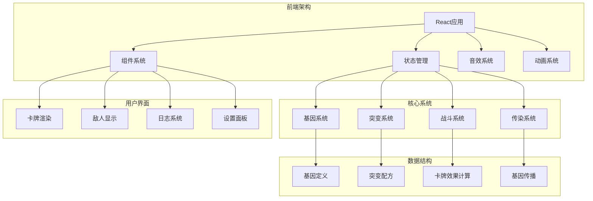

**图表来源**
- [src/App.jsx:1-2719](file://src/App.jsx#L1-L2719)

### 技术栈组成

- **React 18**：现代化React特性，包括并发渲染和新的Hooks
- **Vite**：快速构建工具，提供热重载开发体验
- **Web Audio API**：8bit风格音效合成
- **CSS3动画**：流畅的视觉效果和响应式设计

**章节来源**
- [package.json:1-28](file://package.json#L1-L28)
- [游戏设计文档.md:158-179](file://游戏设计文档.md#L158-L179)

## 基因系统详解

基因系统是游戏的核心创新点，为卡牌战斗增添了深度的Build构筑元素。

### 基因类型定义

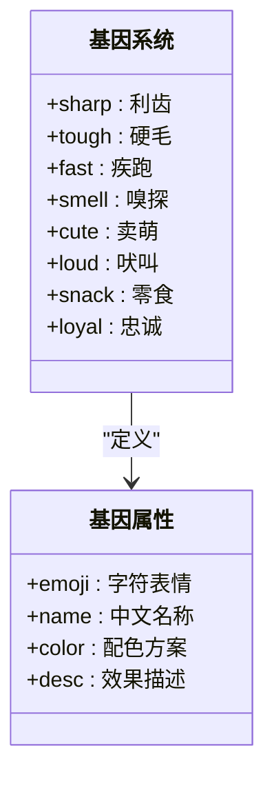

**图表来源**
- [src/App.jsx:8-18](file://src/App.jsx#L8-L18)

### 基因效果机制

| 基因类型 | 效果描述 | 触发条件 |
|---------|----------|----------|
| 利齿 | 增加2点伤害 | 攻击类卡牌 |
| 硬毛 | 增加3点护甲 | 防御类卡牌 |
| 疾跑 | 先攻并冻结敌人1回合 | 攻击类卡牌 |
| 嗅探 | 标记弱点，下回合伤害翻倍 | 技能类卡牌 |
| 卖萌 | 回复造成伤害50%的生命 | 攻击类卡牌 |
| 吠叫 | 伤害弹射到随机敌人 | 攻击类卡牌 |
| 零食 | 回合结束额外抽1张牌 | 回合结束 |
| 忠诚 | 卡牌效果翻倍 | 所有卡牌 |

### 基因生成算法

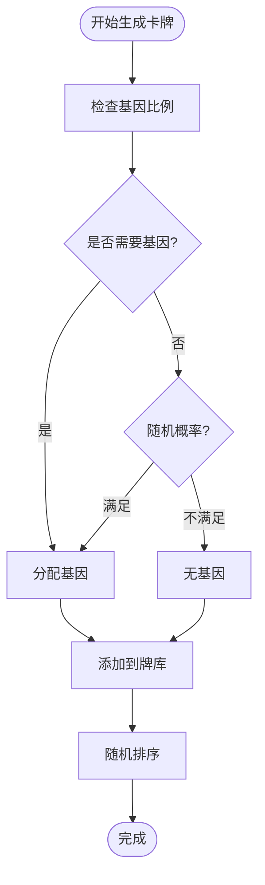

**图表来源**
- [src/App.jsx:62-89](file://src/App.jsx#L62-L89)

**章节来源**
- [src/App.jsx:8-89](file://src/App.jsx#L8-L89)

## 突变系统分析

突变系统是基因组合触发的特殊效果，为游戏策略深度提供了重要支撑。

### 突变配方体系

**更新** 突变配方从文档描述的10种增加到11种，具体如下：

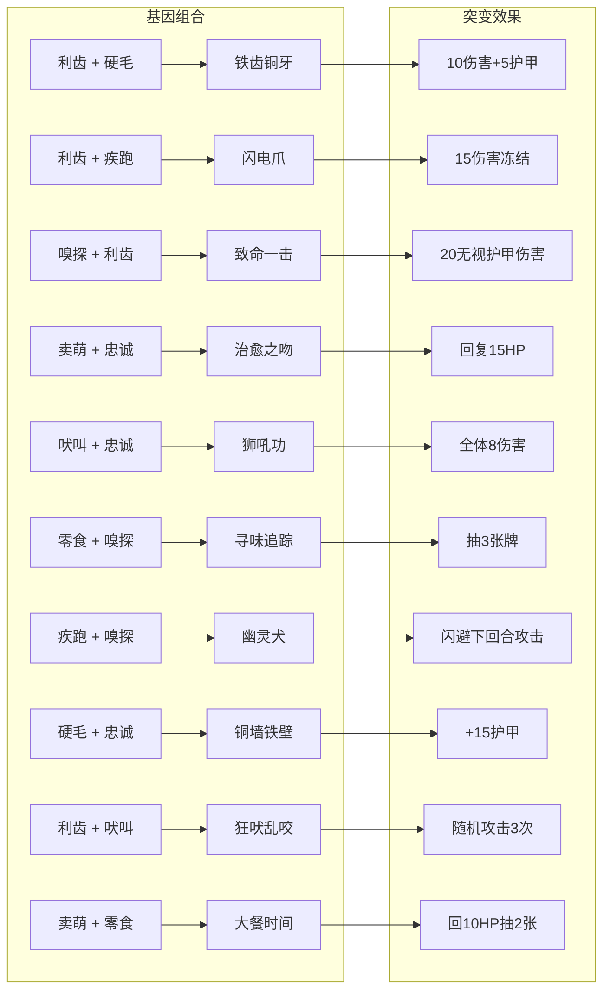

**图表来源**
- [src/App.jsx:20-32](file://src/App.jsx#L20-L32)

### 突变检测算法

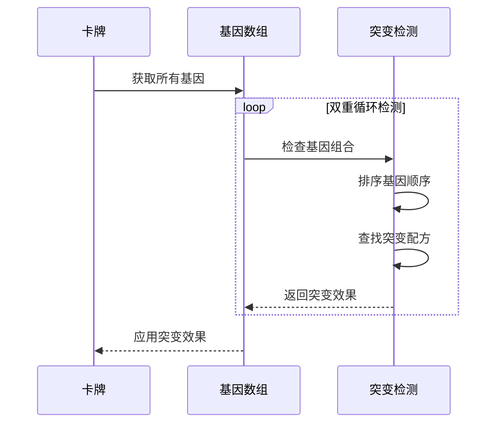

**图表来源**
- [src/App.jsx:34-37](file://src/App.jsx#L34-L37)
- [src/App.jsx:205-213](file://src/App.jsx#L205-L213)

### 突变效果实现

| 突变类型 | 效果描述 | 实现方式 |
|---------|----------|----------|
| 攻击防御型 | 同时提供伤害和护甲 | 直接数值叠加 |
| 控制型 | 冻结敌人或降低攻击力 | 状态效果 |
| 治疗型 | 回复生命值 | 玩家状态修改 |
| 群体伤害型 | 对所有敌人造成伤害 | 多目标处理 |
| 抽牌型 | 额外抽牌 | 手牌系统扩展 |
| 标记型 | 标记敌人弱点 | 下回合伤害加成 |
| 闪避型 | 闪避下回合攻击 | 防御状态 |
| 治疗抽牌型 | 同时回复生命和抽牌 | 多效果组合 |

**章节来源**
- [src/App.jsx:20-32](file://src/App.jsx#L20-L32)
- [src/App.jsx:205-216](file://src/App.jsx#L205-L216)

## 战斗系统实现

战斗系统采用回合制设计，结合Roguelike元素，提供深度的策略体验。

### 战斗流程设计

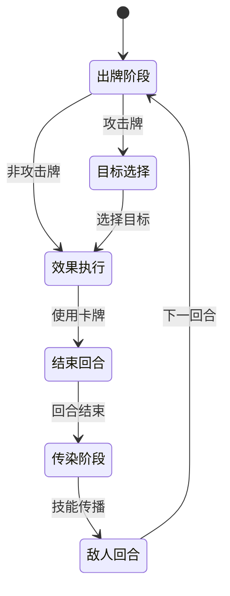

### 卡牌效果计算

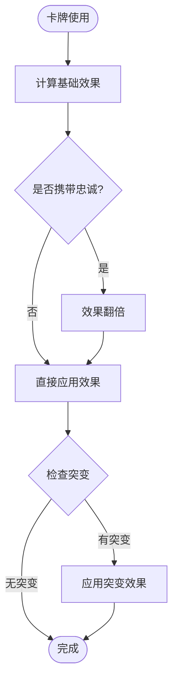

**图表来源**
- [src/App.jsx:169-216](file://src/App.jsx#L169-L216)

### 敌人AI系统

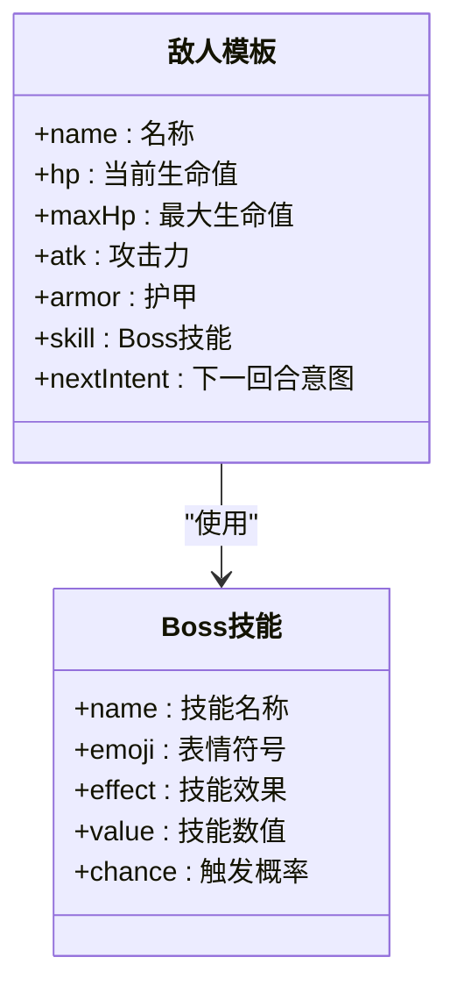

**图表来源**
- [src/App.jsx:91-116](file://src/App.jsx#L91-L116)
- [src/App.jsx:92-100](file://src/App.jsx#L92-L100)

**章节来源**
- [src/App.jsx:169-216](file://src/App.jsx#L169-L216)
- [src/App.jsx:864-988](file://src/App.jsx#L864-L988)

## 音效与动画系统

游戏采用Web Audio API实现8bit风格音效，配合CSS动画提供沉浸式体验。

### 音效系统架构

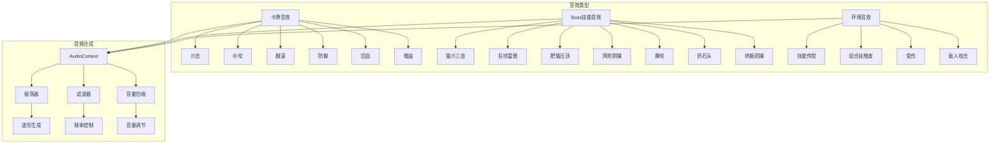

**图表来源**
- [src/App.jsx:341-617](file://src/App.jsx#L341-L617)

### 动画系统实现

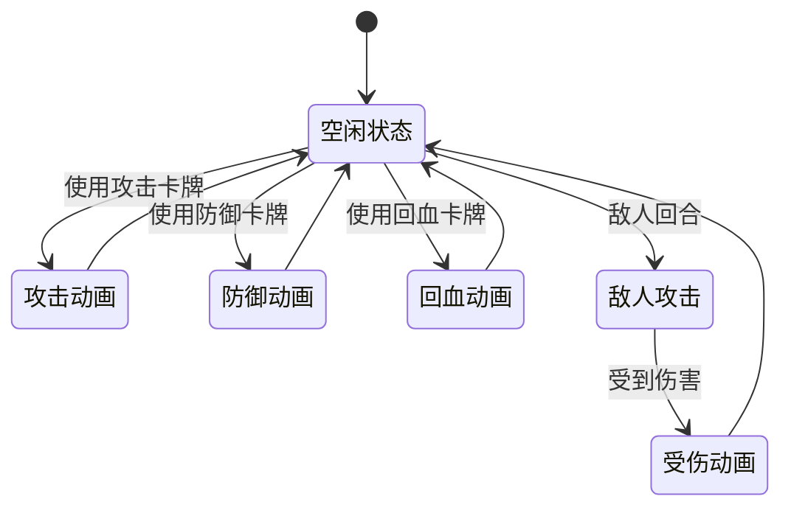

**图表来源**
- [src/App.jsx:1828-1842](file://src/App.jsx#L1828-L1842)
- [src/App.jsx:938-975](file://src/App.jsx#L938-L975)

### BGM系统设计

游戏包含两套BGM：
- **Loading界面BGM**：轻快跳跃的主旋律
- **战斗界面BGM**：紧张刺激的低音节奏

**章节来源**
- [src/App.jsx:619-720](file://src/App.jsx#L619-L720)
- [src/App.jsx:1828-1842](file://src/App.jsx#L1828-L1842)

## 用户界面设计

游戏采用响应式设计，适配桌面端和移动端设备。

### 卡牌系统设计

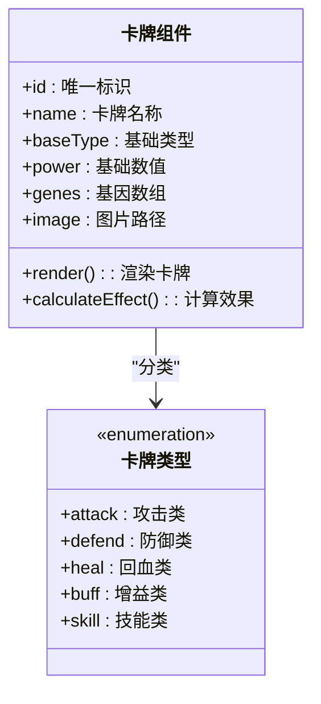

**图表来源**
- [src/App.jsx:1387-1643](file://src/App.jsx#L1387-L1643)

### 界面布局结构

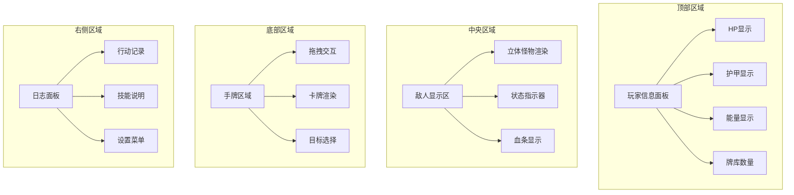

**图表来源**
- [src/App.jsx:2256-2719](file://src/App.jsx#L2256-L2719)

### 响应式设计实现

- **字体缩放**：使用`clamp()`函数实现平滑缩放
- **尺寸适配**：基于`vw`单位的自适应布局
- **触摸优化**：移动端专用的交互优化
- **滚动性能**：`-webkit-overflow-scrolling: touch`

**章节来源**
- [src/App.jsx:2256-2719](file://src/App.jsx#L2256-L2719)
- [src/index.css:1-9](file://src/index.css#L1-L9)

## 性能优化策略

游戏在多个层面实现了性能优化，确保流畅的游戏体验。

### React性能优化

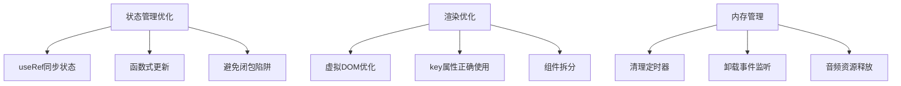

**图表来源**
- [src/App.jsx:257-263](file://src/App.jsx#L257-L263)

### 动画性能优化

- **GPU加速**：使用`transform`和`opacity`实现硬件加速
- **减少重排**：避免触发布局重排的属性修改
- **动画队列**：合理的动画执行顺序
- **帧率控制**：60fps的动画帧率保证

### 音效性能优化

- **AudioContext复用**：避免重复创建音频上下文
- **音效缓存**：预先生成常用音效
- **延迟播放**：使用定时器控制音效播放时机
- **资源管理**：及时停止不需要的音效

**章节来源**
- [src/App.jsx:341-352](file://src/App.jsx#L341-L352)
- [src/App.jsx:663-675](file://src/App.jsx#L663-L675)

## 扩展性设计

游戏系统具备良好的扩展性，支持未来内容的添加和功能的增强。

### 可扩展的卡牌系统

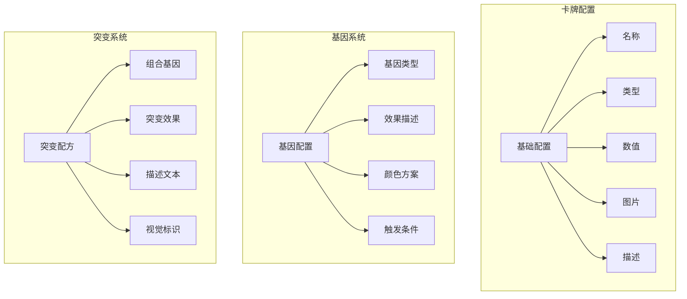

**图表来源**
- [src/App.jsx:39-59](file://src/App.jsx#L39-L59)
- [src/App.jsx:8-18](file://src/App.jsx#L8-L18)
- [src/App.jsx:20-32](file://src/App.jsx#L20-L32)

### 系统扩展点

- **新卡牌类型**：支持更多卡牌类型的扩展
- **新基因类型**：基因系统的无限扩展潜力
- **新突变组合**：突变配方的持续增加
- **新敌人类型**：敌人模板的扩展
- **新Boss技能**：Boss技能系统的完善

### 数据持久化支持

- **本地存储**：支持游戏进度的本地保存
- **设置系统**：音效、难度等设置的持久化
- **成就系统**：未来可扩展的成就记录

**章节来源**
- [src/App.jsx:39-59](file://src/App.jsx#L39-L59)
- [src/App.jsx:8-18](file://src/App.jsx#L8-L18)
- [src/App.jsx:20-32](file://src/App.jsx#L20-L32)

## 总结

《小雪闯上海》通过创新的基因组合突变系统，成功地将Roguelike元素与卡牌战斗相结合，为玩家提供了深度的Build构筑体验。游戏的技术实现展现了现代前端开发的最佳实践，包括：

### 核心成就

- **创新的游戏机制**：基因系统和突变组合提供了独特的策略深度
- **优秀的用户体验**：流畅的动画、直观的界面设计
- **技术实现质量**：高性能的React应用，优化的音效系统
- **扩展性强**：清晰的架构设计支持未来的功能扩展

### 技术亮点

- **React Hooks的应用**：充分利用现代React特性
- **Web Audio API的创新使用**：8bit音效合成
- **响应式设计的完美实现**：跨设备兼容性
- **性能优化的全面考虑**：从渲染到音频的全方位优化

**更新** 本版本中，突变系统从文档描述的10种配方扩展到了11种，包括新增的"大餐时间"（卖萌+零食）组合技，为游戏策略增加了更多的变化和深度。该组合技提供10点治疗效果和2张额外抽牌，是治疗和资源管理的完美结合。基因系统与突变系统的结合，为玩家提供了更加丰富和有趣的Build构筑体验。

这款游戏不仅是一个娱乐产品，更是前端技术与游戏设计完美结合的典范，为后续的扩展和改进奠定了坚实的基础。