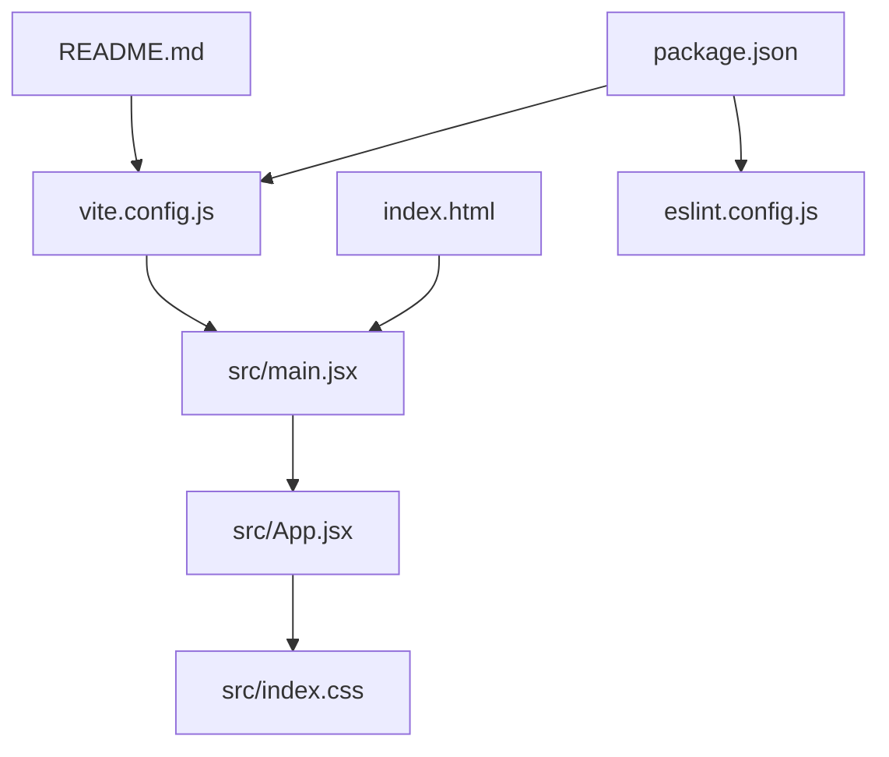
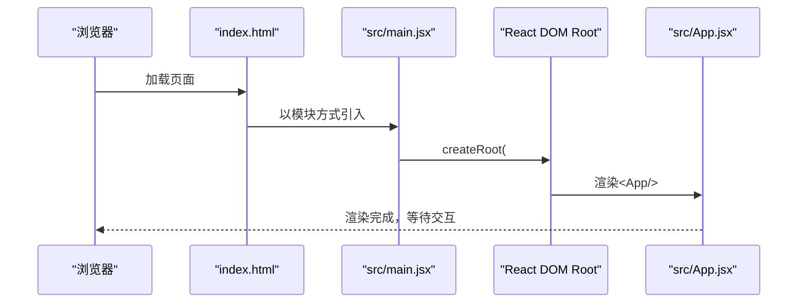
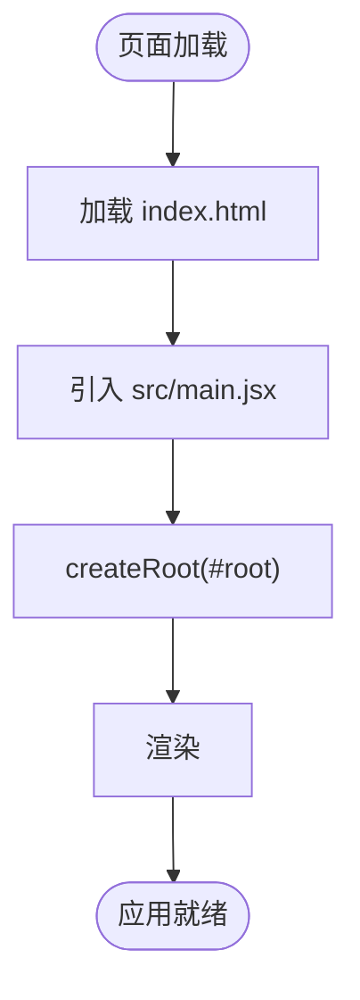
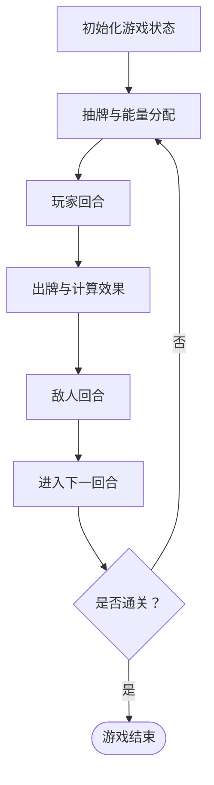

# 快速开始

<cite>
**本文引用的文件**   
- [package.json](file://package.json)
- [vite.config.js](file://vite.config.js)
- [README.md](file://README.md)
- [src/main.jsx](file://src/main.jsx)
- [src/App.jsx](file://src/App.jsx)
- [src/index.css](file://src/index.css)
- [index.html](file://index.html)
- [eslint.config.js](file://eslint.config.js)
- [游戏设计文档.md](file://游戏设计文档.md)
</cite>

## 目录
1. [简介](#简介)
2. [项目结构](#项目结构)
3. [核心组件](#核心组件)
4. [架构总览](#架构总览)
5. [详细组件分析](#详细组件分析)
6. [依赖与构建工具配置](#依赖与构建工具配置)
7. [性能与优化建议](#性能与优化建议)
8. [故障排查指南](#故障排查指南)
9. [结论](#结论)
10. [附录：安装与运行步骤](#附录安装与运行步骤)

## 简介
本指南面向新手开发者，帮助你在30分钟内完成《小雪闯上海》项目的环境准备、安装、本地开发与首次运行。项目基于 React 19 与 Vite 构建，提供热重载、ESLint 规则与最小化模板配置，适合快速上手与迭代开发。

## 项目结构
项目采用“前端单页应用”典型结构，核心入口与资源分布如下：
- HTML 入口：index.html
- 应用入口脚本：src/main.jsx
- 根组件：src/App.jsx
- 全局样式：src/index.css
- 构建与插件配置：vite.config.js
- 包管理与脚本：package.json
- Lint 配置：eslint.config.js
- 项目说明与模板信息：README.md
- 游戏设计文档：游戏设计文档.md

图表来源
- [index.html:1-14](file://index.html#L1-L14)
- [src/main.jsx:1-8](file://src/main.jsx#L1-L8)
- [src/App.jsx:1-20](file://src/App.jsx#L1-L20)
- [src/index.css:1-9](file://src/index.css#L1-L9)
- [vite.config.js:1-8](file://vite.config.js#L1-L8)
- [package.json:1-28](file://package.json#L1-L28)
- [eslint.config.js:1-30](file://eslint.config.js#L1-L30)
- [README.md:1-17](file://README.md#L1-L17)

章节来源
- [index.html:1-14](file://index.html#L1-L14)
- [src/main.jsx:1-8](file://src/main.jsx#L1-L8)
- [src/App.jsx:1-20](file://src/App.jsx#L1-L20)
- [src/index.css:1-9](file://src/index.css#L1-L9)
- [vite.config.js:1-8](file://vite.config.js#L1-L8)
- [package.json:1-28](file://package.json#L1-L28)
- [eslint.config.js:1-30](file://eslint.config.js#L1-L30)
- [README.md:1-17](file://README.md#L1-L17)

## 核心组件
- 应用入口与挂载
  - index.html 提供根节点容器，加载模块脚本 src/main.jsx
  - src/main.jsx 使用 React DOM 的 createRoot 将 App 根组件挂载到 #root
- 根组件与游戏逻辑
  - src/App.jsx 是主组件，包含卡牌系统、战斗循环、基因与突变、敌人AI、音效与BGM等核心逻辑
- 样式与主题
  - src/index.css 设置全局背景与视口尺寸，为游戏提供统一视觉基底
- 构建与开发
  - vite.config.js 仅启用 @vitejs/plugin-react 插件，提供 React 开发体验与热重载
  - package.json 定义开发、构建、预览与 Lint 脚本，便于一键操作

章节来源
- [index.html:1-14](file://index.html#L1-L14)
- [src/main.jsx:1-8](file://src/main.jsx#L1-L8)
- [src/App.jsx:1-20](file://src/App.jsx#L1-L20)
- [src/index.css:1-9](file://src/index.css#L1-L9)
- [vite.config.js:1-8](file://vite.config.js#L1-L8)
- [package.json:6-11](file://package.json#L6-L11)

## 架构总览
下面的序列图展示了从浏览器加载到 React 应用渲染的关键流程，以及 Vite 的热重载参与过程。

图表来源
- [index.html:1-14](file://index.html#L1-L14)
- [src/main.jsx:1-8](file://src/main.jsx#L1-L8)
- [src/App.jsx:1-20](file://src/App.jsx#L1-L20)

## 详细组件分析

### 应用入口与挂载流程
- index.html 提供 #root 容器与基础 meta 标签
- src/main.jsx 使用 createRoot 将 App 组件挂载到 #root
- 该流程确保 React 应用在页面加载后立即渲染

图表来源
- [index.html:1-14](file://index.html#L1-L14)
- [src/main.jsx:1-8](file://src/main.jsx#L1-L8)

章节来源
- [index.html:1-14](file://index.html#L1-L14)
- [src/main.jsx:1-8](file://src/main.jsx#L1-L8)

### 根组件与游戏主循环
- src/App.jsx 是主组件，负责：
  - 状态管理：手牌、牌库、敌人、玩家属性、回合数、日志等
  - 卡牌系统：生成牌库、计算卡牌效果、处理基因与突变
  - 战斗循环：抽牌、出牌、回合结束、敌人行动
  - 互动系统：拖拽、点击、目标选择、动画与音效
  - 传染系统：战斗后将基因复制到其他卡牌
- 该组件体量较大，包含大量业务逻辑与状态分支，建议结合游戏设计文档理解玩法机制

图表来源
- [src/App.jsx:219-746](file://src/App.jsx#L219-L746)

章节来源
- [src/App.jsx:1-20](file://src/App.jsx#L1-L20)
- [src/App.jsx:219-746](file://src/App.jsx#L219-L746)

### 样式与主题
- src/index.css 设置全局背景色、视口尺寸与滚动行为，为游戏提供一致的视觉基底
- 建议在开发过程中通过该文件统一管理全局样式，避免分散污染

章节来源
- [src/index.css:1-9](file://src/index.css#L1-L9)

### Lint 配置与规则
- eslint.config.js 使用 flat 配置风格，集成推荐规则、React Hooks 规则与 React Refresh 规则
- 语言选项设置为 ES2020，支持 JSX 语法与浏览器全局变量
- 规则示例：忽略大写或下划线开头的未使用变量命名模式

章节来源
- [eslint.config.js:1-30](file://eslint.config.js#L1-L30)

## 依赖与构建工具配置

### 环境要求与兼容性
- Node.js 版本
  - 项目未在 package.json 中声明 engines.node 字段，但依赖的 ESLint 等工具通常要求较新的 Node.js 版本
  - 建议使用 Node.js 18 或更高版本，以获得最佳兼容性与性能
- 操作系统
  - 本项目为前端单页应用，可在 macOS、Windows、Linux 上正常运行
  - 若需在 CI/CD 中构建，请确保 CI 环境使用 Node.js 18+

章节来源
- [package.json:1-28](file://package.json#L1-L28)
- [eslint.config.js:16-24](file://eslint.config.js#L16-L24)

### 依赖项概览
- 运行时依赖
  - react 与 react-dom：React 19 核心库
- 开发时依赖
  - vite：构建与开发服务器
  - @vitejs/plugin-react：React 插件
  - eslint 及相关插件：代码质量与规范
  - 类型声明：@types/react 与 @types/react-dom

章节来源
- [package.json:12-26](file://package.json#L12-L26)

### 构建与开发脚本
- 开发：vite（热重载）
- 预览：vite preview（静态服务）
- 构建：vite build（产物输出至 dist）
- Lint：eslint .

章节来源
- [package.json:6-11](file://package.json#L6-L11)

### Vite 配置
- 仅启用 @vitejs/plugin-react 插件，提供 React 开发热重载与最小化配置
- 如需扩展（如代理、别名、插件链），可在此基础上添加

章节来源
- [vite.config.js:1-8](file://vite.config.js#L1-L8)

### Lint 配置
- 使用 eslint/config 的 flat 配置风格
- 集成推荐规则、React Hooks 与 React Refresh 规则
- 语言选项设置为 ES2020，支持 JSX 与浏览器全局

章节来源
- [eslint.config.js:1-30](file://eslint.config.js#L1-L30)

## 性能与优化建议
- 开发期
  - 使用 Vite 的热重载与按需编译，减少等待时间
  - 合理拆分组件，避免单文件过大导致热更新缓慢
- 生产构建
  - 使用 vite build 生成静态资源，配合 CDN 分发
  - 在浏览器缓存策略上设置合适的缓存头，提升二次访问速度
- 游戏性能
  - src/App.jsx 中存在大量状态与副作用，建议在大型组件中拆分逻辑，减少不必要的重渲染
  - 动画与音效使用 Web Audio API，注意在移动端的音频激活策略

[本节为通用建议，不直接分析具体文件，故无章节来源]

## 故障排查指南

### 无法启动开发服务器
- 症状：执行 npm run dev 报错
- 排查要点
  - 确认 Node.js 版本满足要求（建议 18+）
  - 确认网络可访问 npm registry
  - 确认 package-lock.json 存在且未损坏
  - 确认端口未被占用（默认 5173）

章节来源
- [package.json:6-11](file://package.json#L6-L11)

### 页面空白或未渲染
- 症状：页面白屏或无内容
- 排查要点
  - 检查 index.html 是否正确引入 src/main.jsx
  - 检查 src/main.jsx 是否正确挂载到 #root
  - 检查浏览器控制台是否有报错（如模块解析错误）

章节来源
- [index.html:1-14](file://index.html#L1-L14)
- [src/main.jsx:1-8](file://src/main.jsx#L1-L8)

### Lint 报错
- 症状：执行 npm run lint 报告规则错误
- 排查要点
  - 按照 eslint.config.js 的规则修正代码
  - 如需放宽规则，可在规则对象中调整相应配置

章节来源
- [eslint.config.js:25-27](file://eslint.config.js#L25-L27)

### 构建失败
- 症状：执行 npm run build 报错
- 排查要点
  - 检查是否存在语法错误或类型错误
  - 确认依赖安装完整（删除 node_modules 与 lock 文件后重装）

章节来源
- [package.json:8-10](file://package.json#L8-L10)

## 结论
通过本指南，你可以在 30 分钟内完成环境准备、安装与本地运行。项目采用 React 19 + Vite + ESLint 的现代前端技术栈，具备良好的开发体验与扩展空间。建议在首次运行后，结合游戏设计文档深入理解玩法机制，并逐步完善本地开发与生产构建流程。

[本节为总结性内容，不直接分析具体文件，故无章节来源]

## 附录：安装与运行步骤

### 步骤 1：克隆仓库
- 在终端执行克隆命令，将仓库拉取到本地

章节来源
- [README.md:1-17](file://README.md#L1-L17)

### 步骤 2：安装依赖
- 在项目根目录执行依赖安装命令（建议使用 npm）

章节来源
- [package.json:1-28](file://package.json#L1-L28)

### 步骤 3：启动开发服务器
- 在项目根目录执行开发命令，启动 Vite 开发服务器

章节来源
- [package.json:7](file://package.json#L7)

### 步骤 4：打开浏览器
- 在浏览器中访问开发服务器地址（默认 http://localhost:5173）

章节来源
- [vite.config.js:1-8](file://vite.config.js#L1-L8)

### 步骤 5：本地开发与调试
- 修改 src 下文件后，保存即触发热重载
- 使用浏览器开发者工具进行断点调试与性能分析

章节来源
- [vite.config.js:1-8](file://vite.config.js#L1-L8)

### 步骤 6：预览与构建
- 预览生产构建：执行预览命令
- 生成生产构建：执行构建命令

章节来源
- [package.json:9-10](file://package.json#L9-L10)

### 步骤 7：运行 Lint
- 在提交前执行 Lint 命令，确保代码风格与质量

章节来源
- [package.json:9](file://package.json#L9)
- [eslint.config.js:1-30](file://eslint.config.js#L1-L30)

### 步骤 8：生产环境部署（基本指导）
- 将 dist 目录下的静态资源部署到任意静态站点或 CDN
- 确保服务器正确配置 MIME 类型与缓存策略
- 如使用 SPA 路由，确保回退到 index.html 的重写规则

章节来源
- [package.json:8](file://package.json#L8)
- [index.html:1-14](file://index.html#L1-L14)