# 战斗系统

<cite>
**本文档引用的文件**
- [App.jsx](file://src/App.jsx)
- [main.jsx](file://src/main.jsx)
- [游戏设计文档.md](file://游戏设计文档.md)
- [package.json](file://package.json)
</cite>

## 更新摘要
**变更内容**
- 更新了回合制战斗系统的完整实现，包括卡牌效果计算、敌人AI和战斗流程
- 新增了基因系统和突变组合技的详细说明
- 完善了技能传染系统的具体实现机制
- 增强了音效系统和动画系统的描述
- 更新了战斗状态管理和回合控制逻辑

## 目录
1. [简介](#简介)
2. [项目结构](#项目结构)
3. [核心组件](#核心组件)
4. [架构概览](#架构概览)
5. [详细组件分析](#详细组件分析)
6. [依赖关系分析](#依赖关系分析)
7. [性能考虑](#性能考虑)
8. [故障排除指南](#故障排除指南)
9. [结论](#结论)

## 简介

《小雪闯上海》是一款以雪纳瑞犬"小雪"为主角的卡牌Roguelike游戏。游戏采用React + Vite技术栈，实现了完整的回合制战斗系统，包括卡牌战斗、基因系统、突变组合技、敌人AI等核心功能。

游戏的核心玩法围绕"基因传染"展开，玩家通过战斗获得技能点数，将技能传授给其他卡牌，形成独特的Build体系。每局游戏包含6个关卡，难度逐步提升，最终挑战捕狗大队队长。

## 项目结构

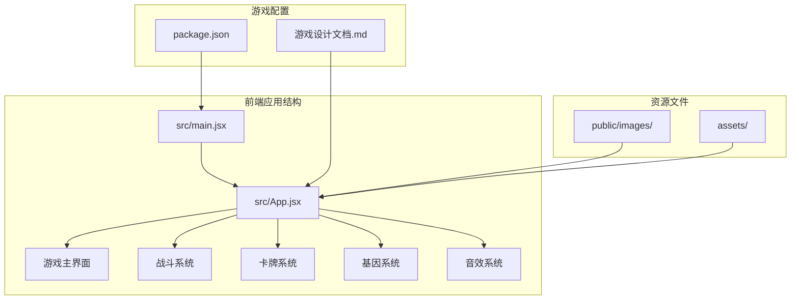

**图表来源**
- [main.jsx:1-8](file://src/main.jsx#L1-L8)
- [App.jsx:1-2719](file://src/App.jsx#L1-L2719)

**章节来源**
- [main.jsx:1-8](file://src/main.jsx#L1-L8)
- [package.json:1-28](file://package.json#L1-L28)

## 核心组件

### 战斗系统核心架构

游戏采用函数式编程和React Hooks模式，将战斗逻辑分解为多个独立的功能模块：

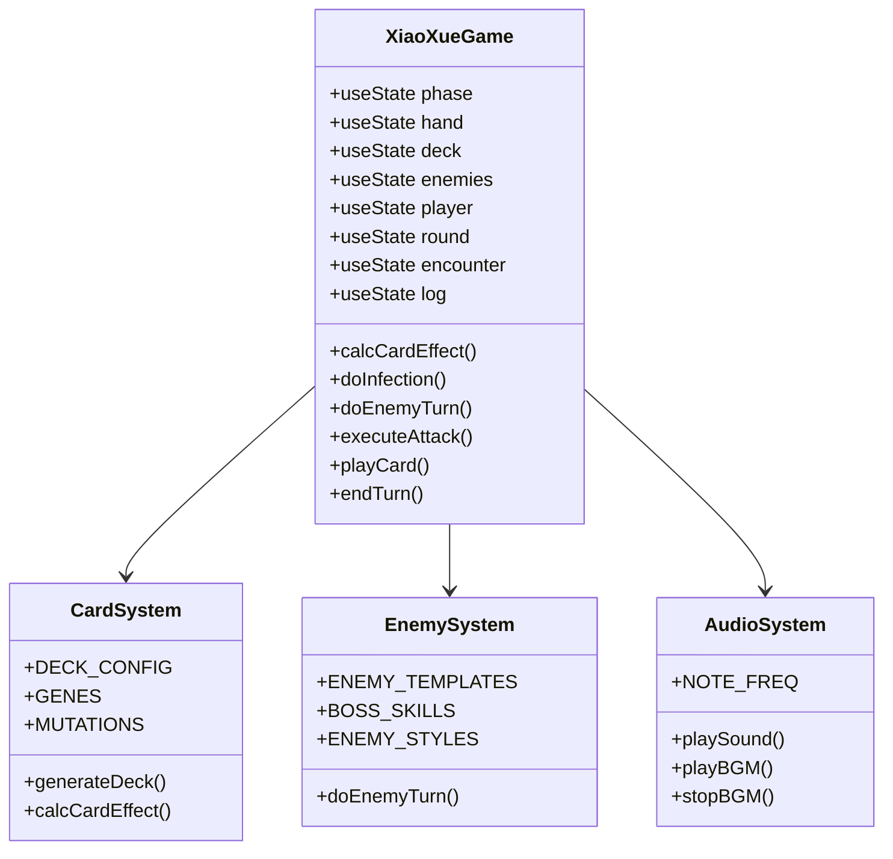

**图表来源**
- [App.jsx:8-32](file://src/App.jsx#L8-L32)
- [App.jsx:91-162](file://src/App.jsx#L91-L162)
- [App.jsx:341-720](file://src/App.jsx#L341-L720)

### 游戏状态管理

游戏使用React的useState和useEffect管理复杂的状态流转：

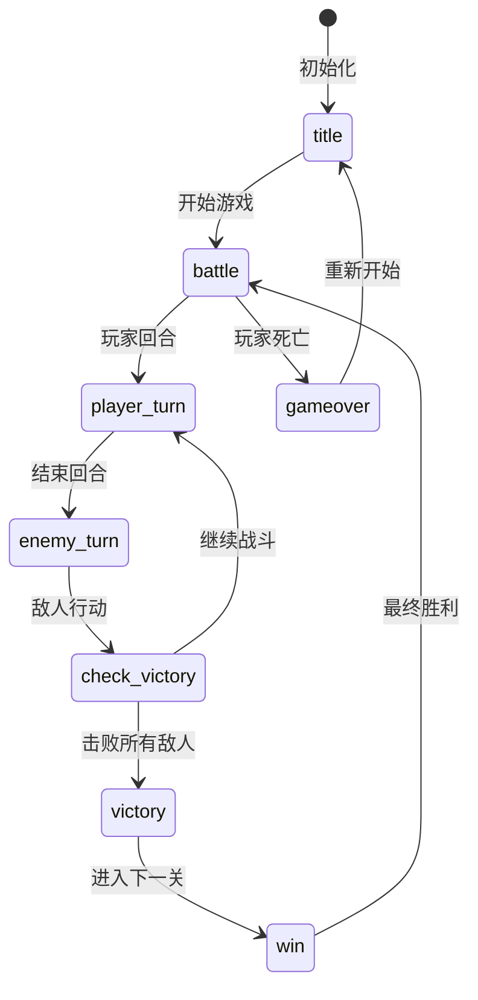

**图表来源**
- [App.jsx:219-250](file://src/App.jsx#L219-L250)
- [App.jsx:1001-1028](file://src/App.jsx#L1001-L1028)

**章节来源**
- [App.jsx:219-250](file://src/App.jsx#L219-L250)
- [App.jsx:864-988](file://src/App.jsx#L864-L988)

## 架构概览

### 战斗系统整体架构

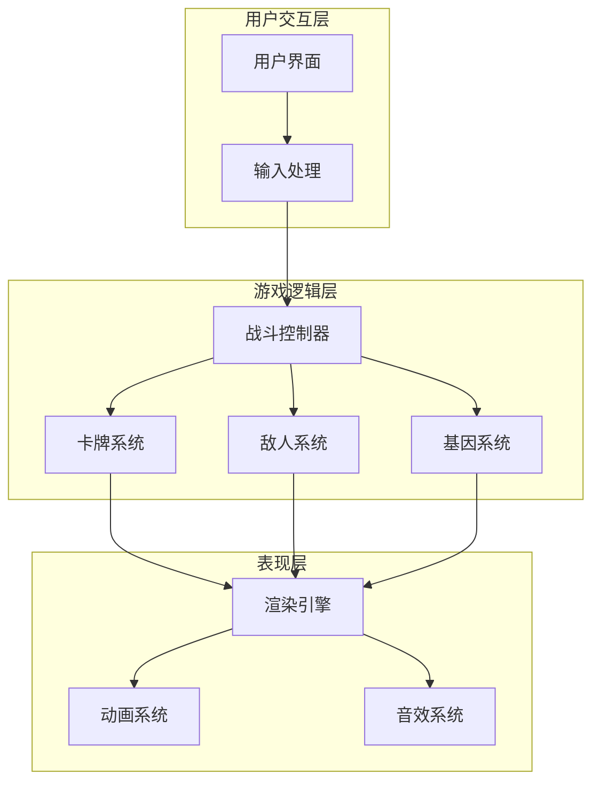

**图表来源**
- [App.jsx:1302-1385](file://src/App.jsx#L1302-L1385)
- [App.jsx:1645-1826](file://src/App.jsx#L1645-L1826)
- [App.jsx:341-720](file://src/App.jsx#L341-L720)

### 数据流架构

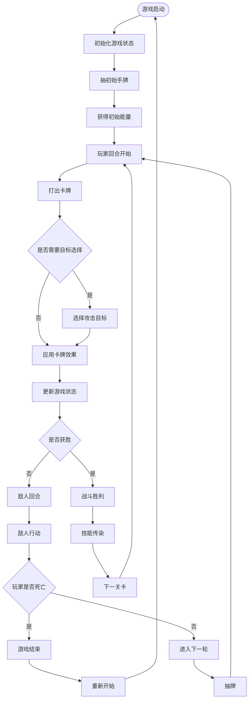

**图表来源**
- [App.jsx:1030-1293](file://src/App.jsx#L1030-L1293)
- [App.jsx:864-988](file://src/App.jsx#L864-L988)
- [App.jsx:787-862](file://src/App.jsx#L787-L862)

## 详细组件分析

### 卡牌系统

#### 卡牌类型与属性

游戏包含五种基础卡牌类型，每种类型都有独特的战斗效果：

| 卡牌类型 | 基础伤害/护甲/治疗 | 示例 | 特殊效果 |
|---------|-------------------|------|----------|
| 攻击类 | 3-6点伤害 | 爪击、扑咬、死亡翻滚 | 直接对敌人造成伤害 |
| 防御类 | 3-7点护甲 | 抱头、匍匐、躲沙发底下 | 为玩家提供护甲保护 |
| 回血类 | 4-7点治疗 | 狗粮、牛皮饼干 | 恢复玩家生命值 |
| 增益类 | 下次攻击+2 | 磨牙棒 | 提供临时攻击力加成 |
| 技能类 | 特殊效果 | 汪汪大叫、摇尾巴、嗅探 | 复杂的战斗效果 |

#### 基因系统实现

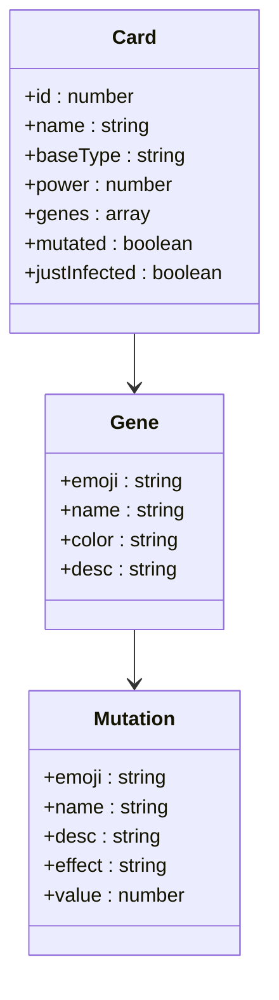

**图表来源**
- [App.jsx:8-32](file://src/App.jsx#L8-L32)
- [App.jsx:169-216](file://src/App.jsx#L169-L216)

#### 卡牌效果计算

卡牌效果通过`calcCardEffect`函数统一计算，考虑基础属性、基因加成、突变效果和玩家增益：

**章节来源**
- [App.jsx:40-59](file://src/App.jsx#L40-L59)
- [App.jsx:8-32](file://src/App.jsx#L8-L32)
- [App.jsx:169-216](file://src/App.jsx#L169-L216)

### 敌人系统

#### 敌人模板设计

游戏设计了七种不同类型的敌人，每个敌人都有独特的属性和技能：

| 敌人类型 | 生命值 | 攻击力 | 护甲 | 技能 | 技能概率 |
|---------|--------|--------|------|------|----------|
| 坏猫咪 | 15 | 3 | 0 | 猫爪三连 | 40% |
| 凶恶泰迪 | 20 | 4 | 2 | 狂吠震慑 | 35% |
| 流浪大橘 | 12×2 | 3 | 0 | 肥猫压顶 | 40% |
| 城管大叔 | 28 | 5 | 3 | 网兜抓捕 | 30% |
| 恶霸犬 | 18 | 5 | 0 | 撕咬流血 | 40% |
| 小混混 | 10 | 2 | 0 | 扔石头 | 35% |
| 捕狗大队队长 | 45 | 7 | 4 | 终极抓捕 | 35% |

#### 敌人AI实现

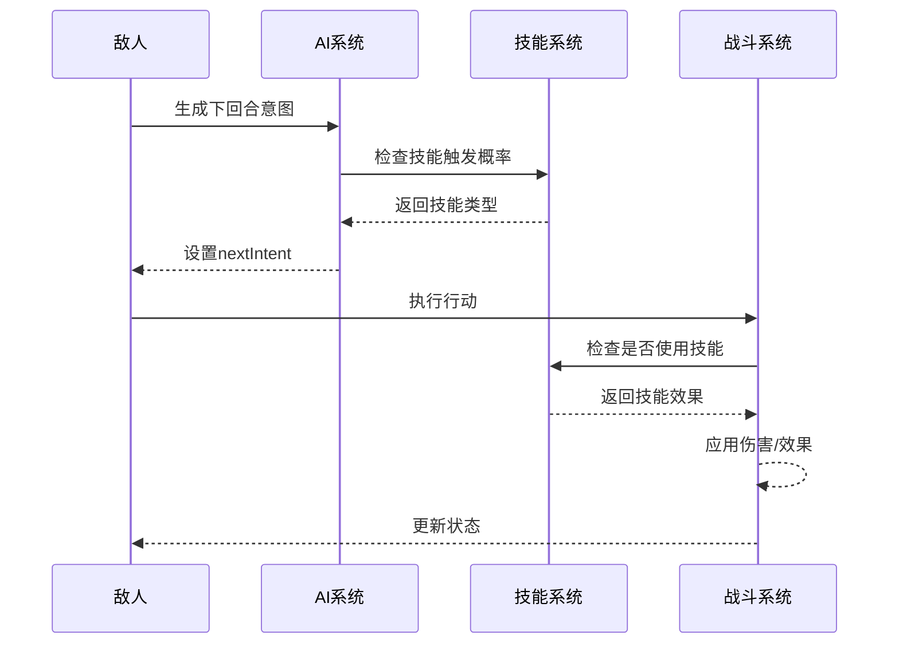

**图表来源**
- [App.jsx:864-988](file://src/App.jsx#L864-L988)
- [App.jsx:92-100](file://src/App.jsx#L92-L100)

**章节来源**
- [App.jsx:103-116](file://src/App.jsx#L103-L116)
- [App.jsx:92-100](file://src/App.jsx#L92-L100)

### 技能传染系统

技能传染是游戏的核心Roguelike机制，允许玩家在战斗胜利后将技能传授给其他卡牌：

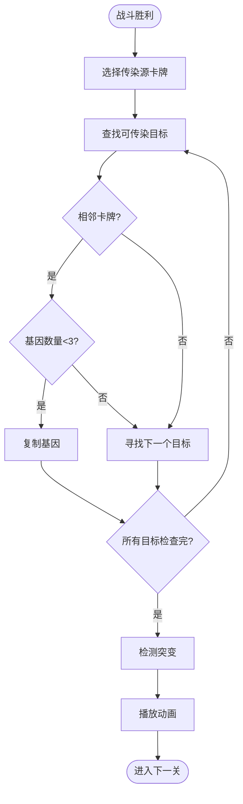

**图表来源**
- [App.jsx:787-862](file://src/App.jsx#L787-L862)

**章节来源**
- [App.jsx:787-862](file://src/App.jsx#L787-L862)

### 音效系统

游戏使用Web Audio API实现了完整的音效系统，为每种卡牌和技能都设计了独特的音效：

#### 音效类型分类

| 音效类型 | 用途 | 示例 |
|---------|------|------|
| 卡牌音效 | 卡牌使用 | 爪击: 8bit爪击声 扑咬: 8bit撕咬声 翻滚: 扫频音效 |
| 技能音效 | 特殊效果 | 吸血: 咀嚼声 冻结: 冰冷音效 弹射: 电流声 |
| 敌人音效 | 敌人行动 | 猫爪三连: 连续打击声 撕咬: 低沉咆哮声 |
| BGM系统 | 背景音乐 | Loading: 可爱主题 Battle: 紧张战斗曲 |

**章节来源**
- [App.jsx:341-720](file://src/App.jsx#L341-L720)

### 动画系统

游戏实现了完整的动画系统，包括卡牌动画、敌人动画和玩家动画：

#### 动画类型与实现

```mermaid
graph TB
subgraph "卡牌动画"
CardHover[悬停动画]
CardSelect[选择动画]
CardDrag[拖拽动画]
CardSlide[插入动画]
CardInfect[传染动画]
end
subgraph "敌人动画"
EnemyFloat[浮动动画]
EnemyAttack[攻击动画]
EnemyHit[受击动画]
EnemySkill[技能动画]
end
subgraph "玩家动画"
PlayerAttack[攻击动画]
PlayerDefend[防御动画]
PlayerHeal[回血动画]
PlayerHit[受击动画]
end
CardHover --> CardSelect
CardSelect --> CardDrag
CardDrag --> CardSlide
CardSlide --> CardInfect
EnemyFloat --> EnemyAttack
EnemyAttack --> EnemyHit
EnemyHit --> EnemySkill
PlayerAttack --> PlayerDefend
PlayerDefend --> PlayerHeal
PlayerHeal --> PlayerHit
```

**图表来源**
- [App.jsx:1829-1842](file://src/App.jsx#L1829-L1842)
- [App.jsx:1645-1826](file://src/App.jsx#L1645-L1826)

#### 动画实现机制

动画系统采用CSS Keyframes和React状态管理相结合的方式：

1. **状态驱动**: 通过`playerAnim`、`enemyAnim`、`animatingCards`等状态控制动画
2. **条件渲染**: 根据游戏状态动态添加CSS类名
3. **硬件加速**: 使用transform和opacity属性实现GPU加速
4. **时间控制**: 通过setTimeout和setInterval精确控制动画时序

**章节来源**
- [App.jsx:1829-1842](file://src/App.jsx#L1829-L1842)
- [App.jsx:1645-1826](file://src/App.jsx#L1645-L1826)

### 事件处理系统

游戏实现了完整的事件处理系统，包括鼠标事件、键盘事件和触摸事件：

#### 事件处理架构

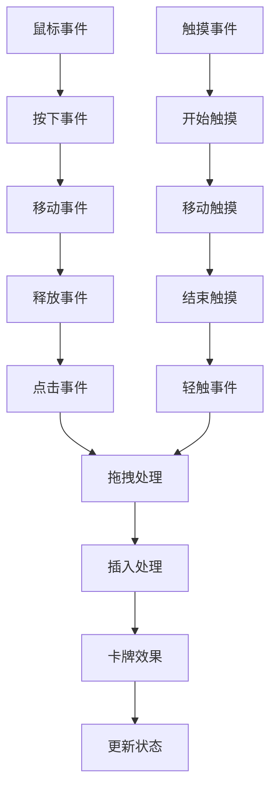

**图表来源**
- [App.jsx:277-335](file://src/App.jsx#L277-L335)
- [App.jsx:1605-1630](file://src/App.jsx#L1605-L1630)

**章节来源**
- [App.jsx:277-335](file://src/App.jsx#L277-L335)
- [App.jsx:1605-1630](file://src/App.jsx#L1605-L1630)

## 依赖关系分析

### 技术栈依赖

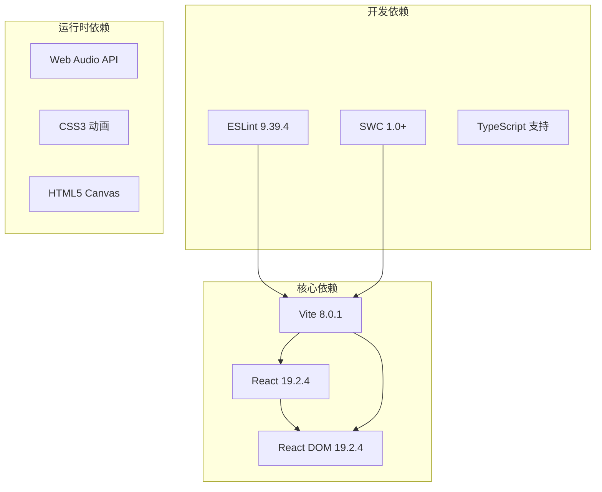

**图表来源**
- [package.json:12-26](file://package.json#L12-L26)

### 组件间依赖关系

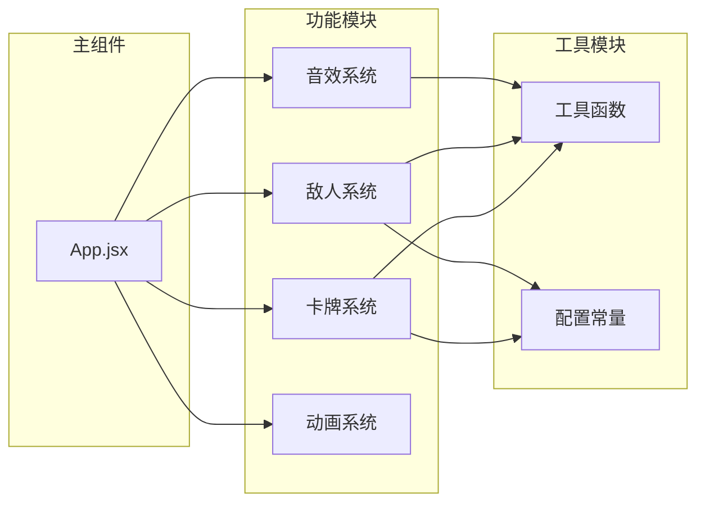

**图表来源**
- [App.jsx:8-32](file://src/App.jsx#L8-L32)
- [App.jsx:91-162](file://src/App.jsx#L91-L162)

**章节来源**
- [package.json:12-26](file://package.json#L12-L26)

## 性能考虑

### React性能优化

游戏采用了多项React性能优化策略：

1. **状态分离**: 将高频更新的状态（如手牌、敌人状态）与低频更新的状态（如设置、日志）分离
2. **useCallback缓存**: 对所有回调函数使用useCallback进行缓存，避免不必要的重渲染
3. **useRef同步**: 使用useRef同步跨渲染周期的状态，避免闭包陷阱
4. **条件渲染**: 根据游戏阶段进行条件渲染，减少DOM节点数量

### 动画性能优化

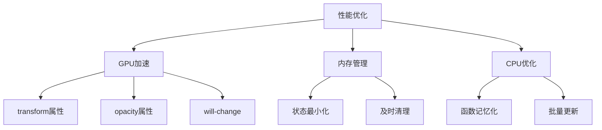

**图表来源**
- [App.jsx:1829-1842](file://src/App.jsx#L1829-L1842)

### 音效性能优化

1. **AudioContext复用**: 单例模式管理AudioContext，避免重复创建
2. **音效延迟**: 使用setTimeout延迟音效播放，避免阻塞主线程
3. **音效池**: 预分配音效资源，减少运行时创建开销

## 故障排除指南

### 常见问题诊断

#### 卡牌拖拽问题

**症状**: 卡牌无法拖拽或拖拽异常
**可能原因**:
1. 鼠标事件监听器未正确绑定
2. 拖拽阈值设置不当
3. DOM节点定位错误

**解决方案**:
1. 检查`handContainerRef`是否正确设置
2. 验证拖拽阈值常量`DRAG_THRESHOLD`
3. 确认`data-card-idx`属性正确设置

#### 敌人AI异常

**症状**: 敌人不按预期使用技能
**可能原因**:
1. 技能触发概率计算错误
2. 敌人状态更新时机不对
3. 意图生成逻辑问题

**解决方案**:
1. 检查`BOSS_SKILLS`配置中的`chance`值
2. 验证`nextIntent`状态更新逻辑
3. 确认技能效果应用顺序

#### 音效播放问题

**症状**: 音效无法播放或播放异常
**可能原因**:
1. AudioContext状态异常
2. Web Audio API兼容性问题
3. 音效参数设置错误

**解决方案**:
1. 检查AudioContext状态并尝试resume
2. 验证浏览器对Web Audio API的支持
3. 确认音效参数范围在有效范围内

#### 动画性能问题

**症状**: 动画卡顿或不流畅
**可能原因**:
1. CSS动画属性使用不当
2. GPU加速未启用
3. 动画帧率过高

**解决方案**:
1. 检查transform和opacity属性的使用
2. 确认will-change属性的正确设置
3. 优化动画时长和缓动函数

**章节来源**
- [App.jsx:277-335](file://src/App.jsx#L277-L335)
- [App.jsx:864-988](file://src/App.jsx#L864-L988)
- [App.jsx:341-720](file://src/App.jsx#L341-L720)

## 结论

《小雪闯上海》的战斗系统展现了现代Web游戏开发的技术实力，通过React Hooks实现了复杂的战斗逻辑，通过Web Audio API提供了沉浸式的音效体验。游戏的核心创新在于"基因传染"机制，为Roguelike游戏增添了Build构筑的乐趣。

系统架构清晰，模块职责明确，性能优化到位，为后续的功能扩展和内容扩充奠定了良好的基础。游戏不仅提供了有趣的游戏体验，也展示了React在复杂交互应用中的强大能力。

最新的实现进一步增强了战斗系统的深度和广度，包括更加精细的动画控制、完善的事件处理机制和高质量的音效系统，为玩家提供了更加流畅和沉浸的游戏体验。