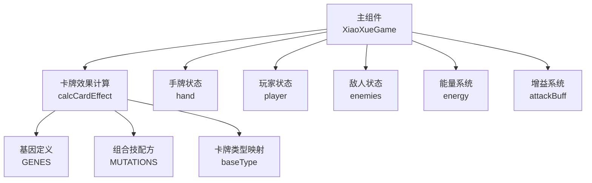
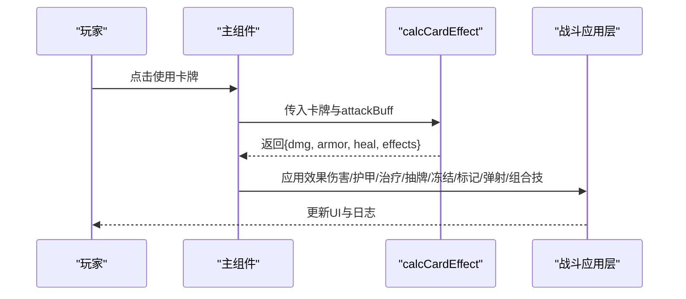
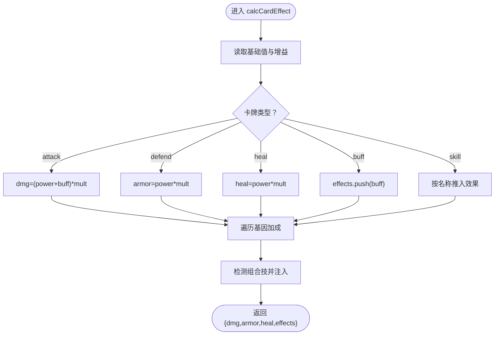

# 卡牌效果计算

<cite>
**本文引用的文件**
- [App.jsx](file://src/App.jsx)
</cite>

## 目录
1. [简介](#简介)
2. [项目结构](#项目结构)
3. [核心组件](#核心组件)
4. [架构总览](#架构总览)
5. [详细组件分析](#详细组件分析)
6. [依赖关系分析](#依赖关系分析)
7. [性能考量](#性能考量)
8. [故障排查指南](#故障排查指南)
9. [结论](#结论)

## 简介
本文件面向《小雪闯上海》的卡牌效果计算系统，重点解析 calcCardEffect 函数的实现原理与调用流程，涵盖：
- 基础伤害、护甲、治疗效果的计算逻辑
- 卡牌类型分类（attack、defend、heal、buff、skill）的效果转换机制
- 基因加成计算，包括忠诚基因的效果翻倍机制与多重基因的叠加计算
- 技能类卡牌的特殊效果实现，如削弱、困惑、暴露、弹射等触发条件
- 实际示例与调试方法，帮助开发者理解卡牌强度平衡与效果实现

## 项目结构
本项目采用 React 单页应用结构，卡牌效果计算集中在主组件文件中，通过统一的状态管理驱动战斗流程。

图表来源
- [App.jsx:170-216](file://src/App.jsx#L170-L216)
- [App.jsx:219-2719](file://src/App.jsx#L219-L2719)

章节来源
- [App.jsx:1-100](file://src/App.jsx#L1-L100)
- [App.jsx:169-216](file://src/App.jsx#L169-L216)

## 核心组件
- calcCardEffect：核心计算函数，接收卡牌对象与当前攻击增益，返回 dmg、armor、heal、effects 的标准化效果结果
- playCard/executeAttack：卡牌使用流程，负责根据效果执行伤害、护甲、治疗、抽牌、冻结、标记、弹射、组合技触发等
- 基因系统：通过基因数组对基础效果进行加成，支持多重基因叠加
- 组合技系统：当卡牌携带多个基因时，自动检测可触发的组合技并将其作为效果注入

章节来源
- [App.jsx:170-216](file://src/App.jsx#L170-L216)
- [App.jsx:1133-1293](file://src/App.jsx#L1133-L1293)
- [App.jsx:1031-1131](file://src/App.jsx#L1031-L1131)

## 架构总览
卡牌效果计算贯穿“出牌→计算→应用→反馈”的闭环，其中 calcCardEffect 是关键枢纽，将卡牌基础属性与基因、组合技、增益整合为统一的效果对象，供后续战斗逻辑消费。

图表来源
- [App.jsx:1133-1293](file://src/App.jsx#L1133-L1293)
- [App.jsx:1031-1131](file://src/App.jsx#L1031-L1131)
- [App.jsx:170-216](file://src/App.jsx#L170-L216)

## 详细组件分析

### calcCardEffect 函数详解
- 输入参数
  - card：卡牌对象，包含 baseType、power、genes 等字段
  - buff：当前攻击增益（来自“磨牙棒”等增益效果）
- 输出结构
  - dmg：最终伤害
  - armor：护甲加成
  - heal：治疗量
  - effects：效果数组，包含字符串效果与组合技对象

- 计算步骤
  1) 基础变量
     - base = card.power 或 0
     - hasLoyal = card.genes 是否包含 "loyal"
     - mult = hasLoyal ? 2 : 1（忠诚基因翻倍）
     - buffBonus = buff 或 0
  2) 类型分支
     - attack：dmg = (base + buffBonus) * mult
     - defend：armor = base * mult
     - heal：heal = base * mult
     - buff：effects.push({ type: "buff", value: base })
     - skill：根据卡牌名称推入 weaken、confuse、expose、draw、aoe_mark 等效果
  3) 基因加成
     - sharp：+2*dmg
     - tough：+3*armor
     - fast：effects.push("freeze")
     - smell：effects.push("mark")
     - cute：effects.push("leech")
     - loud：effects.push("thunder")
     - snack：effects.push("draw")
  4) 组合技检测
     - 遍历基因两两组合，若匹配 MUTATIONS，则 effects.push({ mutation: 配方 })

- 返回值
  - { dmg, armor, heal, effects }

章节来源
- [App.jsx:170-216](file://src/App.jsx#L170-L216)

### 卡牌类型分类与效果转换
- attack
  - 基础伤害 = power + 攻击增益（若有）
  - 若携带忠诚基因则翻倍
- defend
  - 基础护甲 = power
  - 若携带忠诚基因则翻倍
- heal
  - 基础治疗 = power
  - 若携带忠诚基因则翻倍
- buff
  - 推入增益效果，用于下一次攻击加成
- skill
  - 汪汪大叫：推入 weaken（敌人下回合攻击力-2）
  - 摇尾巴：推入 confuse（50%概率使敌人跳过下回合）
  - 嗅探：推入 expose（标记弱点，下回合伤害+3）
  - 撒娇：推入 heal=5 与 draw（抽1张牌）
  - 标记领地：推入 aoe_mark（全体敌人-2并标记）

章节来源
- [App.jsx:170-216](file://src/App.jsx#L170-L216)
- [App.jsx:185-193](file://src/App.jsx#L185-L193)

### 基因加成与忠诚基因翻倍机制
- 忠诚基因（loyal）：将该卡牌的全部基础加成翻倍
- 多基因叠加：基因效果线性叠加，例如同时拥有 sharp 与 tough，分别提供 +2*dmg 与 +3*armor
- 注意：calcCardEffect 仅对基础加成进行翻倍；组合技的倍率由 MUTATIONS 配置决定，不在此处翻倍

章节来源
- [App.jsx:170-216](file://src/App.jsx#L170-L216)

### 组合技触发与多重基因叠加
- 触发条件：卡牌基因数量 ≥ 2，且任意两枚基因能组成 MUTATIONS 中的配方键
- 触发方式：将组合技对象注入 effects 数组，后续在 playCard/executeAttack 中统一处理
- 示例：cute+loyal → 治愈之吻（回血），loud+loyal → 狮吼功（全体伤害）

章节来源
- [App.jsx:210-213](file://src/App.jsx#L210-L213)
- [App.jsx:20-32](file://src/App.jsx#L20-L32)

### 技能类卡牌特殊效果实现
- weaken（震慑）
  - 敌人下回合攻击力 -2
- confuse（迷惑）
  - 50% 概率使敌人跳过下回合
- expose（暴露）
  - 标记弱点，下回合对该敌人伤害+3
- thunder（弹射）
  - 随机对一个存活敌人造成固定伤害
- draw（抽牌）
  - 回合结束额外抽1张牌
- aoe_mark（标记领地）
  - 对所有存活敌人造成固定伤害并标记

章节来源
- [App.jsx:1230-1249](file://src/App.jsx#L1230-L1249)
- [App.jsx:1073-1091](file://src/App.jsx#L1073-L1091)

### 敌人回合与状态管理
- 敌人回合开始时，处理中毒、冻结、困惑等状态
- 根据 Boss 技能配置决定是否使用技能或普通攻击
- 造成伤害时，先扣除护甲再计算真实伤害

章节来源
- [App.jsx:865-988](file://src/App.jsx#L865-L988)

### 实际示例与调试方法
- 示例1：爪击（attack）+ sharp + loyal
  - 基础伤害 = power
  - 加成：sharp 提供 +2，loyal 翻倍
  - 最终伤害 = (power + buffBonus) * 2 + 2*2
- 示例2：撒娇（skill）+ cute + snack
  - heal=5，effects.push("draw")
  - 组合技：cute+snack → 大餐时间（回10HP抽2张）
- 示例3：标记领地（skill）+ loud + loyal
  - 效果：全体敌人-2并标记
  - 组合技：loud+loyal → 狮吼功（全体8伤害）

调试建议：
- 在 calcCardEffect 中打印输入 card 与 buff，确认基础值与加成链路
- 在 playCard/executeAttack 中逐个检查 effects 的执行顺序与目标选择
- 使用日志 addLog 输出关键节点，便于定位问题

章节来源
- [App.jsx:1133-1293](file://src/App.jsx#L1133-L1293)
- [App.jsx:1031-1131](file://src/App.jsx#L1031-L1131)

## 依赖关系分析
- calcCardEffect 依赖
  - GENES：基因描述与加成
  - MUTATIONS：组合技配方
  - card.baseType：类型分支
  - card.genes：基因数组
  - attackBuff：攻击增益
- 调用链
  - playCard/executeAttack → calcCardEffect → effects 分发
  - effects → effects.forEach 分支处理（冻结、标记、弹射、抽牌、组合技、削弱、困惑、暴露、治疗、护甲）

图表来源
- [App.jsx:170-216](file://src/App.jsx#L170-L216)

章节来源
- [App.jsx:170-216](file://src/App.jsx#L170-L216)

## 性能考量
- 计算复杂度
  - calcCardEffect 时间复杂度 O(n)，n 为基因数量；组合技检测为 O(n^2)，但基因数有限，开销可控
- 优化建议
  - 将 MUTATIONS 键缓存为 Map，减少字符串拼接与查找
  - 将 effects 数组去重，避免重复触发同一效果
  - 将 buffBonus 与 mult 预计算，减少重复运算

## 故障排查指南
- 常见问题
  - 伤害未正确翻倍：检查是否包含忠诚基因
  - 组合技未触发：确认基因两两组合是否存在于 MUTATIONS
  - 效果未生效：核对 effects.forEach 的执行顺序与目标选择
- 调试技巧
  - 在 calcCardEffect 入口与出口添加日志，输出 card 与返回值
  - 在 playCard/executeAttack 中分段记录 effects 的处理过程
  - 使用 addLog 输出关键节点，如“触发组合技”、“冻结敌人”、“抽牌”等

章节来源
- [App.jsx:1133-1293](file://src/App.jsx#L1133-L1293)
- [App.jsx:1031-1131](file://src/App.jsx#L1031-L1131)

## 结论
calcCardEffect 将卡牌基础属性、基因加成、组合技与增益系统统一抽象为标准化效果对象，为战斗系统的稳定运行提供了清晰的契约。通过合理设计类型分支、基因叠加与组合技检测，系统在保持可扩展性的同时，实现了灵活而平衡的卡牌强度。建议在后续迭代中引入更细粒度的配置化与可视化调试工具，进一步提升开发效率与可维护性。