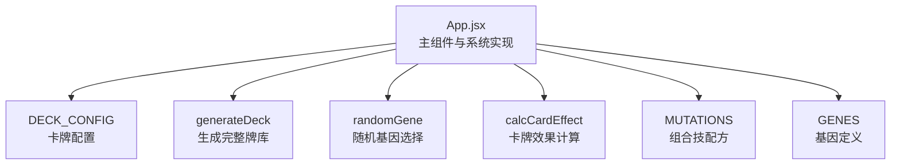
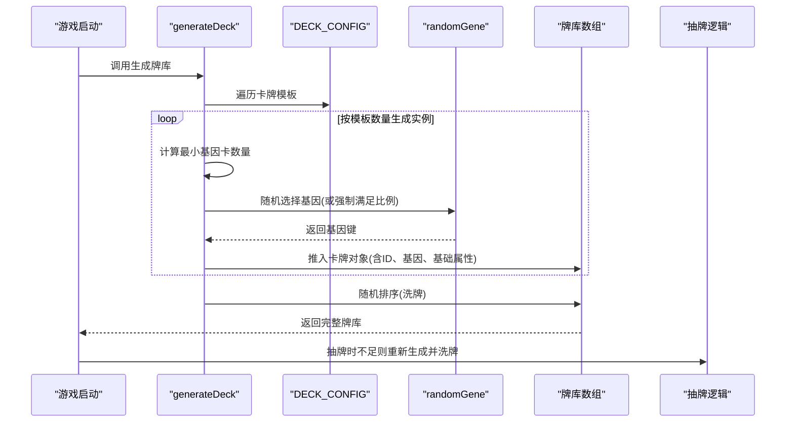
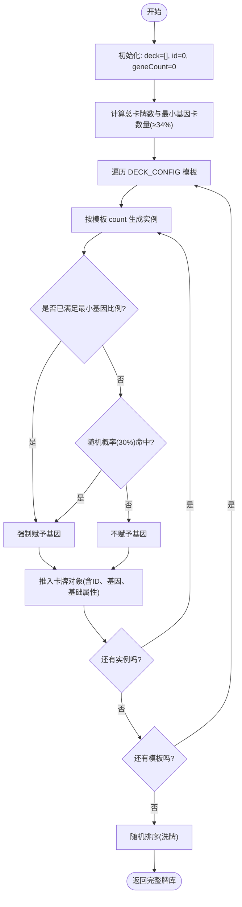
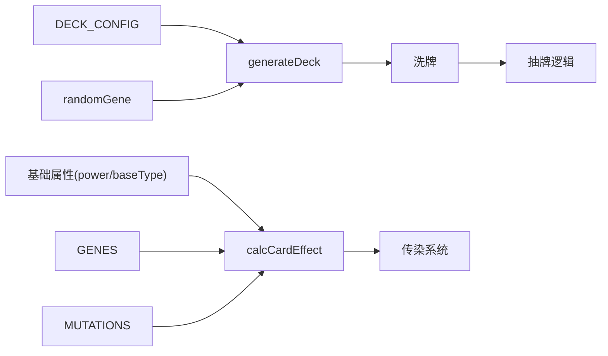

# 卡牌生成机制

<cite>
**本文引用的文件**
- [App.jsx](file://src/App.jsx)
- [游戏设计文档.md](file://游戏设计文档.md)
</cite>

## 目录
1. [简介](#简介)
2. [项目结构](#项目结构)
3. [核心组件](#核心组件)
4. [架构总览](#架构总览)
5. [详细组件分析](#详细组件分析)
6. [依赖关系分析](#依赖关系分析)
7. [性能考量](#性能考量)
8. [故障排查指南](#故障排查指南)
9. [结论](#结论)
10. [附录](#附录)

## 简介
本文面向《小雪闯上海》的卡牌生成机制，围绕 DECK_CONFIG 配置系统与 generateDeck 函数展开，系统性解析卡牌类型定义、基础属性、基因随机分配算法、ID 生成与洗牌过程，并结合游戏设计文档中的平衡性考量，给出可操作的扩展示例与最佳实践，帮助开发者快速理解并扩展现有卡牌系统。

## 项目结构
- 卡牌系统核心位于前端应用文件中，采用单一组件文件集中实现，便于理解与维护。
- 卡牌类型与配置集中在 DECK_CONFIG，基因与组合技定义在同文件内，生成逻辑与效果计算在同一文件中串联。

图表来源
- [App.jsx:40-89](file://src/App.jsx#L40-L89)

章节来源
- [App.jsx:1-2748](file://src/App.jsx#L1-L2748)

## 核心组件
- DECK_CONFIG：定义所有卡牌模板，包含名称、基础类型、基础数值、图像路径、数量与描述等字段。
- generateDeck：负责根据 DECK_CONFIG 生成完整牌库，执行随机基因分配、ID 分配与洗牌。
- randomGene：从基因池中随机选择一个基因。
- calcCardEffect：根据卡牌基础属性、基因加成、组合技与玩家增益，计算实际效果。
- MUTATIONS 与 GENES：分别定义组合技配方与基因属性，用于效果计算与 UI 展示。

章节来源
- [App.jsx:40-89](file://src/App.jsx#L40-L89)
- [App.jsx:164-216](file://src/App.jsx#L164-L216)

## 架构总览
卡牌生成机制由“配置驱动 + 生成器 + 洗牌”构成，配合“效果计算 + 组合技检测”，形成完整的卡牌系统闭环。

图表来源
- [App.jsx:62-89](file://src/App.jsx#L62-L89)
- [App.jsx:164-167](file://src/App.jsx#L164-L167)

## 详细组件分析

### DECK_CONFIG 配置系统
- 卡牌类型定义
  - 攻击类：造成伤害，基础伤害由 power 字段决定。
  - 防御类：提供护甲，基础护甲由 power 字段决定。
  - 回血类：恢复生命值，基础回血由 power 字段决定。
  - 技能类：特殊效果，如震慑、迷惑、标记等，power 通常为 0 或用于描述增益层数。
  - 增益类：提供临时增益，如下次攻击+2。
- 基础属性设置
  - name：卡牌名称
  - baseType：基础类型（attack/defend/heal/skill/buff）
  - power：基础数值（伤害/护甲/回血/增益层数）
  - image：卡牌图片路径
  - count：该模板卡牌的数量
  - desc：描述文本（用于技能类与增益类说明）
- 配置规则
  - count 决定该模板在牌库中的出现次数。
  - image 与 desc 用于 UI 展示与提示。
  - 基础类型与 power 共同决定卡牌的基础效果。

章节来源
- [App.jsx:40-59](file://src/App.jsx#L40-L59)

### generateDeck 函数实现原理
- 随机基因分配算法
  - 首先统计总卡牌数与最小基因卡数量（至少 34% 的卡牌带基因）。
  - 在遍历每个模板的 count 次实例时，若已满足最小基因比例，则强制赋予基因；否则以 30% 概率赋予基因。
  - 基因通过 randomGene 从基因池中随机选择。
- ID 生成机制
  - 使用自增 id 保证每张卡牌唯一标识，便于 UI 动画、状态同步与日志追踪。
- 牌库洗牌过程
  - 生成完成后，使用随机排序对数组进行洗牌，确保抽牌顺序的随机性。
- 生成流程图

图表来源
- [App.jsx:62-89](file://src/App.jsx#L62-L89)

章节来源
- [App.jsx:62-89](file://src/App.jsx#L62-L89)

### 卡牌数量配置策略与平衡性考量
- 数量与稀有度
  - 攻击类卡牌数量较多（如爪击4张、扑咬3张、死亡翻滚2张），保证输出稳定。
  - 防御类卡牌数量适中（抱头3张、匍匐2张、躲沙发1张），平衡生存与资源管理。
  - 回血类卡牌数量极少（各1张），增加生存压力与策略性。
  - 技能类卡牌数量适中（2-1张不等），提供多样战术选择。
- 资源管理与节奏
  - 每回合3点能量限制，手牌上限10张，迫使玩家在输出、防御与回血间做取舍。
  - 回血卡牌稀少，需谨慎使用，避免在关键时刻缺资源。
- 策略深度
  - 基于基因与组合技的 Build 构筑，通过“传染系统”在回合结束时进行技能传递，形成 Build 成型的快感。
  - 组合技提供爆发、控制、回复等多种战术方向，鼓励玩家探索不同 Build。

章节来源
- [游戏设计文档.md:43-96](file://游戏设计文档.md#L43-L96)
- [游戏设计文档.md:198-219](file://游戏设计文档.md#L198-L219)

### 卡牌效果计算与组合技检测
- 基础效果
  - 攻击类：damage = (power + buffBonus) × 是否有忠诚
  - 防御类：armor = power × 是否有忠诚
  - 回血类：heal = power × 是否有忠诚
  - 增益类：提供 buff 层数（如下次攻击+2）
  - 技能类：根据名称映射到具体效果（如震慑、迷惑、标记等）
- 基因加成
  - 利齿：+2伤害
  - 硬毛：+3护甲
  - 疾跑：先攻并冻结敌人1回合
  - 嗅探：标记弱点，下回合伤害翻倍
  - 卖萌：回复造成伤害50%的生命
  - 吠叫：伤害弹射到随机敌人
  - 零食：回合结束额外抽1张牌
  - 忠诚：效果翻倍
- 组合技检测
  - 任意两张基因组合触发对应组合技，通过 getMutationKey 对基因对进行排序后查询 MUTATIONS。
  - 组合技效果在计算时叠加到基础效果上，如范围伤害、无视护甲、回复+抽牌等。

章节来源
- [App.jsx:164-216](file://src/App.jsx#L164-L216)

### 抽牌与补牌机制
- 当抽牌数量不足或手牌空间不足时，系统会检测牌库长度并按需重新生成牌库，然后进行洗牌，确保抽牌的随机性与可持续性。
- 补牌时会记录日志，提示玩家牌库已用尽并重新洗牌。

章节来源
- [App.jsx:750-785](file://src/App.jsx#L750-L785)

### 传染系统与组合技发现
- 传染系统在回合结束时触发，相邻卡牌互相传授基因，最多携带3个基因。
- 一旦卡牌基因组合满足 MUTATIONS 条件，即视为触发组合技，UI 与音效会相应反馈。
- 玩家可在图鉴中查看已发现的组合技，增强成就感与策略记忆。

章节来源
- [App.jsx:787-862](file://src/App.jsx#L787-L862)
- [App.jsx:1418-1473](file://src/App.jsx#L1418-L1473)

## 依赖关系分析
- generateDeck 依赖 DECK_CONFIG、randomGene、Math.random 与数组排序。
- calcCardEffect 依赖 GENES、MUTATIONS、卡牌基础属性与 buff。
- 抽牌逻辑依赖 generateDeck 与牌库状态。
- 传染系统依赖卡牌基因集合与 MUTATIONS。

图表来源
- [App.jsx:40-89](file://src/App.jsx#L40-L89)
- [App.jsx:164-216](file://src/App.jsx#L164-L216)

章节来源
- [App.jsx:40-89](file://src/App.jsx#L40-L89)
- [App.jsx:164-216](file://src/App.jsx#L164-L216)

## 性能考量
- 生成阶段
  - generateDeck 遍历 DECK_CONFIG 并按 count 生成实例，时间复杂度 O(N)，N 为总卡牌数。
  - 洗牌使用随机排序，平均时间复杂度 O(N log N)，在小规模牌库中开销可忽略。
- 计算阶段
  - calcCardEffect 对每张卡牌进行线性扫描，时间复杂度 O(K)，K 为基因数量（≤3）。
  - 组合技检测对每张卡牌的基因对进行查询，最坏 O(K^2)，在 K≤3 时几乎常数时间。
- 内存占用
  - 牌库数组大小与总卡牌数线性相关，基因与描述等字符串存储开销较小。
- 优化建议
  - 若未来模板数量大幅增长，可考虑缓存 DECK_CONFIG 的展开结果或使用更高效的洗牌算法。
  - 对组合技检测可引入哈希索引以减少查询成本。

[本节为通用性能讨论，无需特定文件来源]

## 故障排查指南
- 生成的牌库中基因比例低于预期
  - 检查最小基因卡数量计算逻辑与强制赋基因分支。
  - 确认随机概率与强制条件的边界情况。
- 抽牌时牌库为空
  - 确认补牌逻辑是否正确调用 generateDeck 并进行洗牌。
  - 检查日志输出是否提示“牌库用完了，重新洗牌！”。
- 组合技未触发
  - 确认基因对排序后的键是否与 MUTATIONS 的键一致。
  - 检查卡牌基因数量是否达到2个及以上。
- 效果计算异常
  - 确认基础类型与 power 的映射关系。
  - 检查忠诚等倍率因子是否正确应用。

章节来源
- [App.jsx:62-89](file://src/App.jsx#L62-L89)
- [App.jsx:750-785](file://src/App.jsx#L750-L785)
- [App.jsx:164-216](file://src/App.jsx#L164-L216)

## 结论
《小雪闯上海》的卡牌生成机制以 DECK_CONFIG 为核心，通过 generateDeck 实现“配置驱动 + 随机基因 + 洗牌”的完整流程，并与 calcCardEffect、MUTATIONS、GENES 紧密协作，形成具备策略深度与可扩展性的卡牌系统。该机制在保证随机性的同时，通过比例控制与数量配置维持了游戏平衡，为后续扩展提供了清晰的接口与路径。

[本节为总结性内容，无需特定文件来源]

## 附录

### 扩展示例与自定义卡牌添加方法
- 新增卡牌类型
  - 在 DECK_CONFIG 中新增模板对象，设置 name、baseType、power、image、count、desc。
  - 若为技能类或增益类，确保 desc 描述清晰，以便 UI 提示。
- 新增基因
  - 在 GENES 中添加新的基因键值对，包含 emoji、name、color、desc。
  - 在 calcCardEffect 中为该基因添加加成逻辑。
  - 如需组合技，更新 MUTATIONS，定义触发条件与效果。
- 调整基因比例
  - 修改 generateDeck 中的最小基因比例阈值与随机概率，以改变基因卡出现频率。
- 调整卡牌数量
  - 修改 DECK_CONFIG 中某模板的 count，影响该卡牌在牌库中的出现频率。
- 示例步骤
  - 在 DECK_CONFIG 中添加新模板（如“新技能”）。
  - 在 GENES 中添加新基因（如“新基因”）。
  - 在 MUTATIONS 中添加组合技（如“新基因+现有基因”）。
  - 在 calcCardEffect 中为该基因与组合技添加效果计算。
  - 重新生成牌库并测试抽牌、效果与组合技触发。

章节来源
- [App.jsx:40-59](file://src/App.jsx#L40-L59)
- [App.jsx:9-37](file://src/App.jsx#L9-L37)
- [App.jsx:21-32](file://src/App.jsx#L21-L32)
- [App.jsx:164-216](file://src/App.jsx#L164-L216)