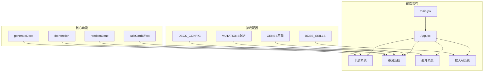
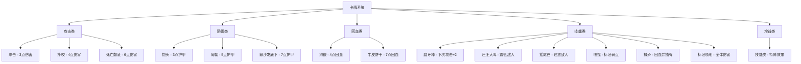
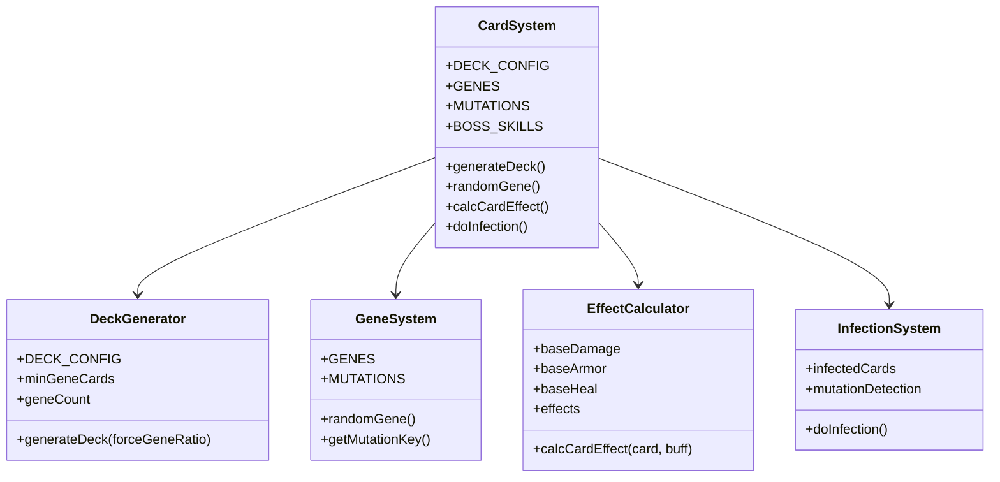
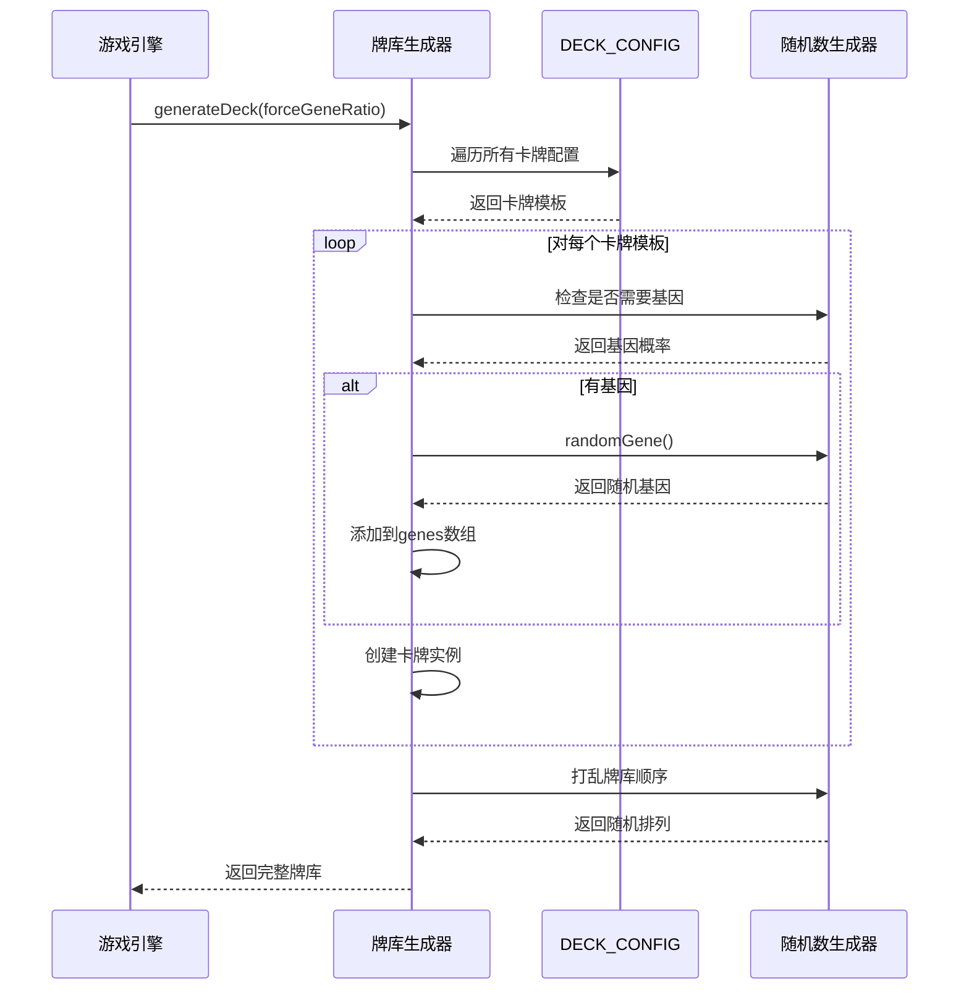
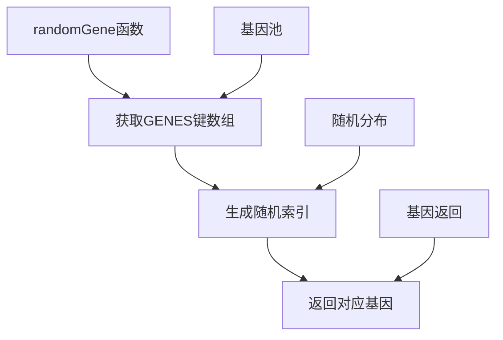
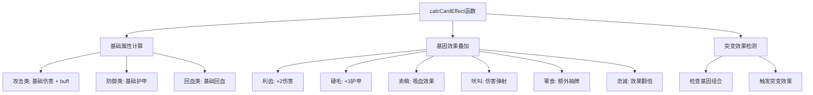
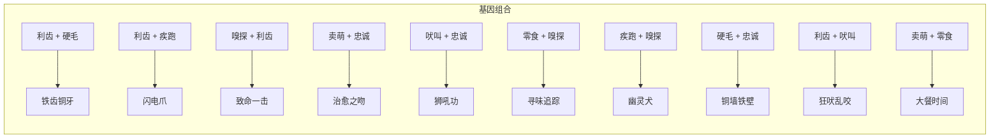
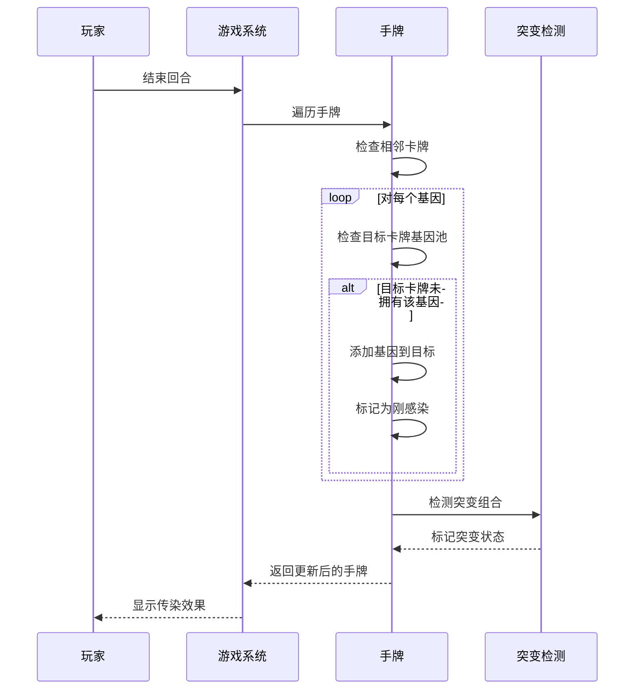
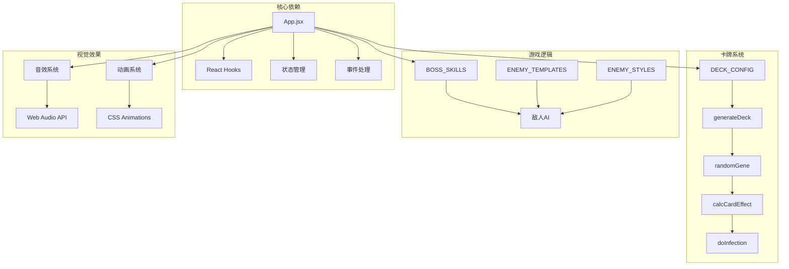

# 卡牌系统

<cite>
**本文档引用的文件**
- [App.jsx](file://src/App.jsx)
- [main.jsx](file://src/main.jsx)
- [游戏设计文档.md](file://游戏设计文档.md)
</cite>

## 目录
1. [简介](#简介)
2. [项目结构](#项目结构)
3. [核心组件](#核心组件)
4. [架构概览](#架构概览)
5. [详细组件分析](#详细组件分析)
6. [依赖关系分析](#依赖关系分析)
7. [性能考虑](#性能考虑)
8. [故障排除指南](#故障排除指南)
9. [结论](#结论)

## 简介

《小雪闯上海》是一款以雪纳瑞犬"小雪"为主角的卡牌Roguelike游戏。卡牌系统是游戏的核心机制之一，包含了完整的基因系统、突变机制和传染系统。本文档深入解析卡牌生成机制、基因随机分配算法、卡牌类型分类以及效果计算逻辑。

## 项目结构

游戏采用React + Vite的技术栈，卡牌系统主要实现在App.jsx文件中：



**图表来源**
- [App.jsx:1-2745](file://src/App.jsx#L1-L2745)

**章节来源**
- [main.jsx:1-8](file://src/main.jsx#L1-L8)
- [App.jsx:1-2745](file://src/App.jsx#L1-L2745)

## 核心组件

### 基因系统常量定义

基因系统是《小雪闯上海》的核心创新点，包含8种不同的基因类型：

| 基因名称 | 符号 | 效果描述 | 颜色 |
|---------|------|----------|------|
| 利齿 | 🦷 | 增加2点伤害 | #ffb199 |
| 硬毛 | 🛡️ | 增加3点护甲 | #b8c5cc |
| 疾跑 | 💨 | 先攻并冻结敌人1回合 | #a5e4fb |
| 嗅探 | 👃 | 标记弱点，下回合伤害翻倍 | #c5e1a5 |
| 卖萌 | 🥺 | 回复造成伤害50%的生命 | #f48fb1 |
| 吠叫 | 📢 | 伤害弹射到随机敌人 | #ffeaa7 |
| 零食 | 🦴 | 回合结束额外抽1张牌 | #d7ccc8 |
| 忠诚 | ❤️ | 卡牌效果翻倍 | #fca5a5 |

### 卡牌类型分类

游戏包含五种基础卡牌类型，每种类型都有独特的属性和效果：



**图表来源**
- [App.jsx:39-59](file://src/App.jsx#L39-L59)

**章节来源**
- [App.jsx:8-32](file://src/App.jsx#L8-L32)
- [App.jsx:39-59](file://src/App.jsx#L39-L59)

## 架构概览

卡牌系统采用模块化设计，各个组件职责明确：



**图表来源**
- [App.jsx:8-32](file://src/App.jsx#L8-L32)
- [App.jsx:62-89](file://src/App.jsx#L62-L89)
- [App.jsx:164-167](file://src/App.jsx#L164-L167)
- [App.jsx:169-216](file://src/App.jsx#L169-L216)
- [App.jsx:787-862](file://src/App.jsx#L787-L862)

## 详细组件分析

### 卡牌生成机制

#### DECK_CONFIG配置系统

DECK_CONFIG定义了所有卡牌的基础配置，包括名称、基础类型、基础数值和出现次数：

```mermaid
erDiagram
DECK_CONFIG {
string name
string baseType
number power
string image
number count
string desc
}
ATTACK_CARD {
string name
"attack" baseType
number power
string image
number count
string desc
}
DEFEND_CARD {
string name
"defend" baseType
number power
string image
number count
string desc
}
HEAL_CARD {
string name
"heal" baseType
number power
string image
number count
string desc
}
SKILL_CARD {
string name
"skill" baseType
number power
string image
number count
string desc
}
BUFF_CARD {
string name
"buff" baseType
number power
string image
number count
string desc
}
DECK_CONFIG ||--|| ATTACK_CARD : "包含"
DECK_CONFIG ||--|| DEFEND_CARD : "包含"
DECK_CONFIG ||--|| HEAL_CARD : "包含"
DECK_CONFIG ||--|| SKILL_CARD : "包含"
DECK_CONFIG ||--|| BUFF_CARD : "包含"
```

**图表来源**
- [App.jsx:39-59](file://src/App.jsx#L39-L59)

#### generateDeck函数实现原理

generateDeck函数负责生成完整的牌库，包含随机基因分配：



**图表来源**
- [App.jsx:62-89](file://src/App.jsx#L62-L89)

**章节来源**
- [App.jsx:62-89](file://src/App.jsx#L62-L89)

### 基因系统实现

#### randomGene函数

randomGene函数实现了基因的随机选择：



**图表来源**
- [App.jsx:164-167](file://src/App.jsx#L164-L167)

#### 基因加成计算逻辑

基因效果通过calcCardEffect函数统一计算：



**图表来源**
- [App.jsx:169-216](file://src/App.jsx#L169-L216)

**章节来源**
- [App.jsx:164-167](file://src/App.jsx#L164-L167)
- [App.jsx:169-216](file://src/App.jsx#L169-L216)

### 卡牌效果计算

#### 基础伤害计算

calcCardEffect函数负责计算卡牌的实际效果：

| 卡牌类型 | 基础计算公式 | 基因加成 | 突变效果 |
|---------|-------------|----------|----------|
| 攻击类 | `(基础伤害 + buff) × 效果倍数` | 利齿(+2)、忠诚(×2) | 致命一击(无视护甲) |
| 防御类 | `基础护甲 × 效果倍数` | 硬毛(+3)、忠诚(×2) | 铜墙铁壁(+15) |
| 回血类 | `基础回血 × 效果倍数` | 卖萌(×1.5)、忠诚(×2) | 治愈之吻(+15) |
| 技能类 | 特殊效果 | 吠叫(弹射)、零食(抽牌) | 狂吠乱咬(随机攻击) |

#### 突变系统

当卡牌携带两个特定基因时，会触发突变效果：



**图表来源**
- [App.jsx:20-32](file://src/App.jsx#L20-L32)

**章节来源**
- [App.jsx:20-32](file://src/App.jsx#L20-L32)

### 传染系统

#### doInfection函数实现

传染系统是Roguelike元素的核心体现：



**图表来源**
- [App.jsx:787-862](file://src/App.jsx#L787-L862)

**章节来源**
- [App.jsx:787-862](file://src/App.jsx#L787-L862)

## 依赖关系分析

卡牌系统各组件之间的依赖关系：



**图表来源**
- [App.jsx:1-2745](file://src/App.jsx#L1-L2745)

**章节来源**
- [App.jsx:1-2745](file://src/App.jsx#L1-L2745)

## 性能考虑

### 优化策略

1. **内存管理**: 使用useState和useRef合理管理状态，避免不必要的重渲染
2. **算法优化**: 基因组合检测使用双重循环，复杂度为O(n²)
3. **渲染优化**: 卡牌组件使用CSS动画，减少JavaScript计算
4. **音频优化**: 使用单例AudioContext，避免重复创建

### 数据结构复杂度

| 操作 | 时间复杂度 | 空间复杂度 |
|------|------------|------------|
| 生成牌库 | O(n) | O(n) |
| 基因随机 | O(1) | O(1) |
| 效果计算 | O(k) | O(1) |
| 突变检测 | O(g²) | O(1) |
| 传染传播 | O(h) | O(h) |

## 故障排除指南

### 常见问题及解决方案

1. **卡牌基因不显示**
   - 检查GENES常量定义是否正确
   - 确认randomGene函数返回有效基因

2. **突变效果不触发**
   - 验证基因组合是否在MUTATIONS中定义
   - 检查getMutationKey函数的排序逻辑

3. **牌库生成异常**
   - 确认DECK_CONFIG配置正确
   - 检查generateDeck函数的概率计算

4. **传染系统失效**
   - 验证doInfection函数的相邻检查逻辑
   - 检查基因池容量限制

**章节来源**
- [App.jsx:8-32](file://src/App.jsx#L8-L32)
- [App.jsx:62-89](file://src/App.jsx#L62-L89)
- [App.jsx:164-167](file://src/App.jsx#L164-L167)
- [App.jsx:787-862](file://src/App.jsx#L787-L862)

## 结论

《小雪闯上海》的卡牌系统通过精心设计的基因系统、突变机制和传染系统，为玩家提供了丰富的Build构筑体验。系统采用模块化设计，各组件职责明确，便于维护和扩展。基因系统的随机性保证了每局游戏的独特性，而突变机制则为策略深度提供了保障。

通过合理的数据结构设计和算法实现，卡牌系统在保持性能的同时，实现了复杂的交互逻辑。开发者可以通过扩展DECK_CONFIG、添加新的基因类型或修改效果计算逻辑来进一步丰富游戏内容。