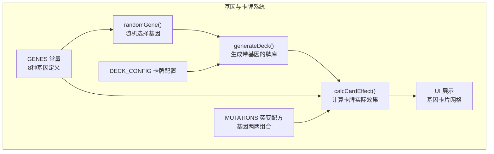
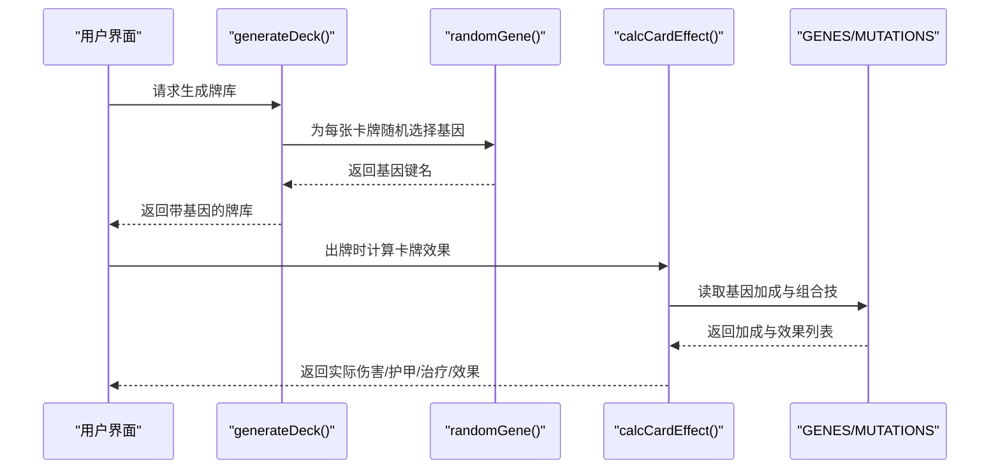
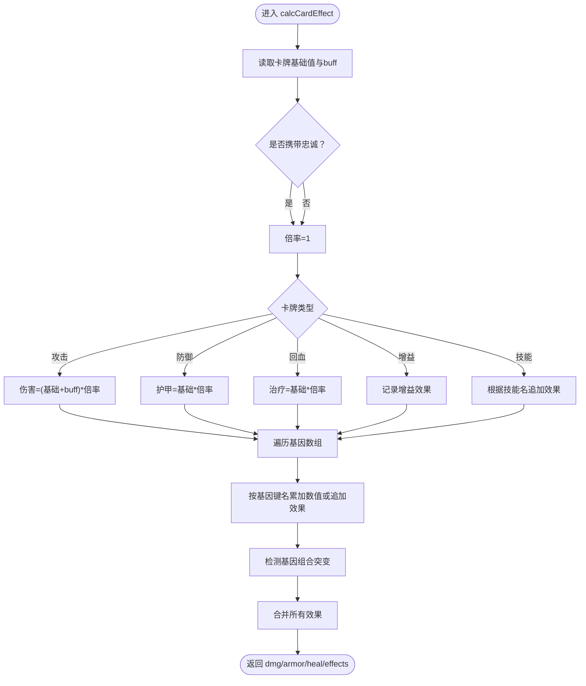
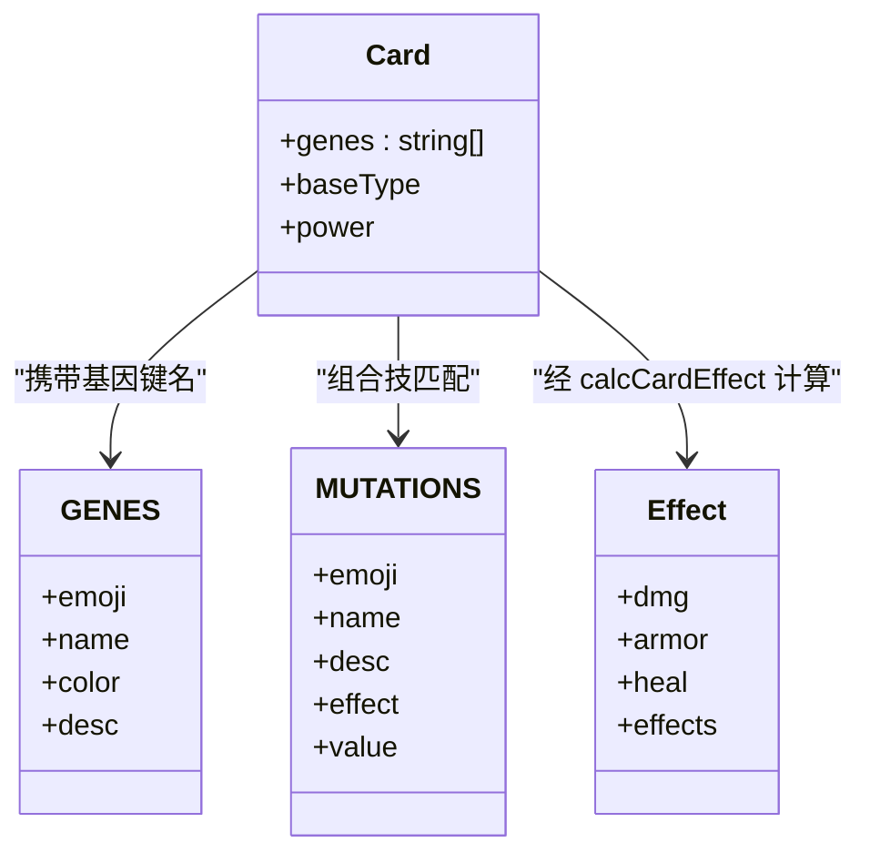
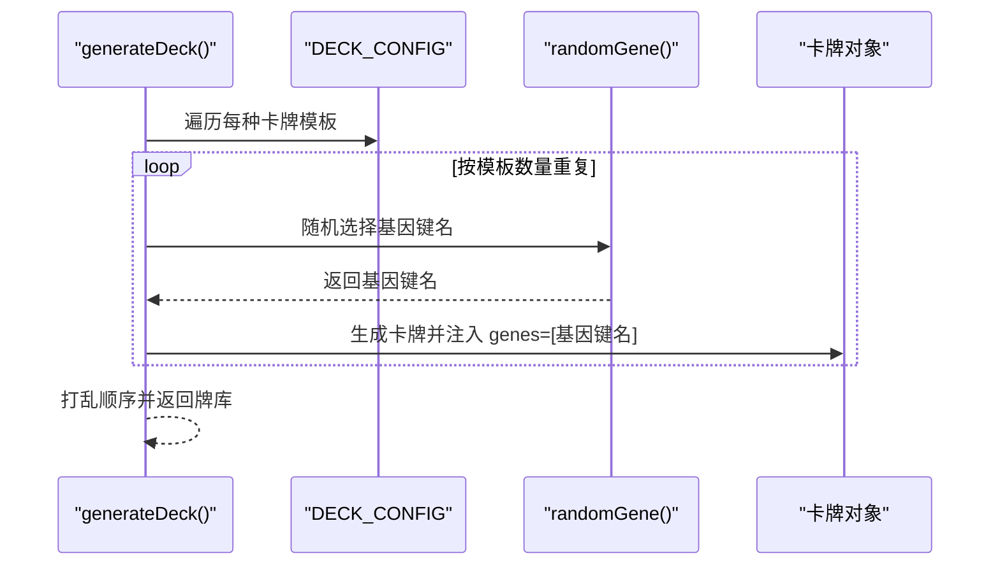
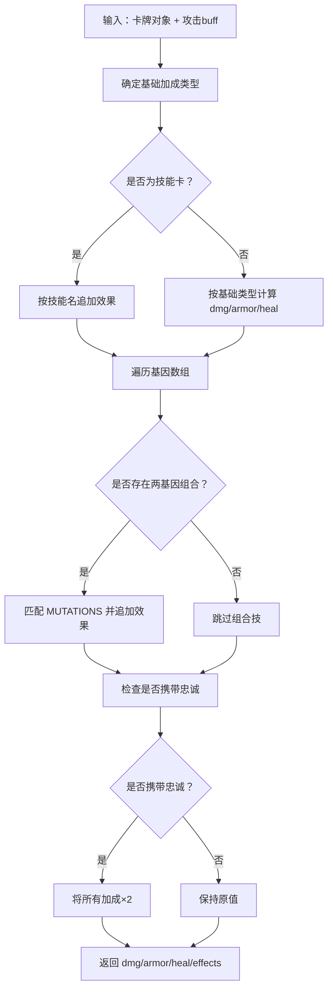
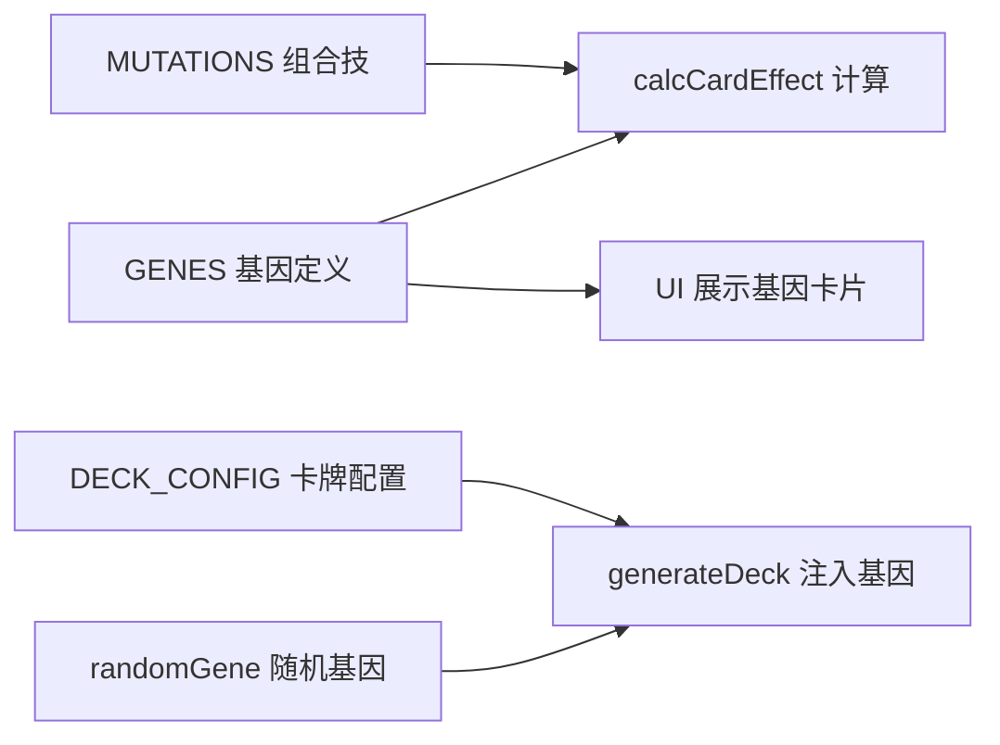

# 基因定义与属性

<cite>
**本文引用的文件**
- [App.jsx](file://src/App.jsx)
</cite>

## 目录
1. [简介](#简介)
2. [项目结构](#项目结构)
3. [核心组件](#核心组件)
4. [架构总览](#架构总览)
5. [详细组件分析](#详细组件分析)
6. [依赖关系分析](#依赖关系分析)
7. [性能考量](#性能考量)
8. [故障排查指南](#故障排查指南)
9. [结论](#结论)
10. [附录](#附录)

## 简介
本文件面向《小雪闯上海》的“基因”系统，系统性梳理并解读 GENES 常量中定义的8种基础基因类型，以及它们在卡牌系统中的加成机制、颜色编码与视觉呈现方式；同时给出基于现有代码的扩展与自定义建议，帮助开发者在不破坏既有平衡的前提下进行二次创作。

## 项目结构
本项目采用单文件 React 组件作为入口，基因与卡牌系统集中于同一文件中，便于理解与维护。关键区域包括：
- 基因常量定义区：包含8种基因的 emoji、中文名称、颜色与描述
- 突变配方区：定义基因两两组合后的组合技
- 卡牌生成与基因注入：为卡牌随机附加一个基因
- 实际效果计算：将基因加成叠加到卡牌基础数值与效果上
- 视觉展示：在 UI 中以网格形式展示基因卡片，使用基因颜色作为边框色

图表来源
- [App.jsx:8-18](file://src/App.jsx#L8-L18)
- [App.jsx:21-32](file://src/App.jsx#L21-L32)
- [App.jsx:62-89](file://src/App.jsx#L62-L89)
- [App.jsx:164-167](file://src/App.jsx#L164-L167)
- [App.jsx:170-216](file://src/App.jsx#L170-L216)
- [App.jsx:2384-2398](file://src/App.jsx#L2384-L2398)

章节来源
- [App.jsx:8-18](file://src/App.jsx#L8-L18)
- [App.jsx:21-32](file://src/App.jsx#L21-L32)
- [App.jsx:62-89](file://src/App.jsx#L62-L89)
- [App.jsx:164-167](file://src/App.jsx#L164-L167)
- [App.jsx:170-216](file://src/App.jsx#L170-L216)
- [App.jsx:2384-2398](file://src/App.jsx#L2384-L2398)

## 核心组件
- 基因常量 GENES：定义8种基础基因，包含 emoji、中文名、颜色与简短描述
- 突变配方 MUTATIONS：定义基因两两组合后产生的组合技效果
- 卡牌生成 generateDeck：为卡牌随机注入一个基因
- 效果计算 calcCardEffect：将基因加成与组合技效果合并到卡牌实际效果
- UI 展示：以网格卡片形式展示基因，使用颜色作为边框强调

章节来源
- [App.jsx:8-18](file://src/App.jsx#L8-L18)
- [App.jsx:21-32](file://src/App.jsx#L21-L32)
- [App.jsx:62-89](file://src/App.jsx#L62-L89)
- [App.jsx:170-216](file://src/App.jsx#L170-L216)
- [App.jsx:2384-2398](file://src/App.jsx#L2384-L2398)

## 架构总览
基因系统围绕“基因定义 → 注入卡牌 → 计算效果 → 视觉呈现”的流程运转。其中：
- 基因定义决定视觉与基础加成
- 卡牌生成阶段随机注入一个基因
- 效果计算阶段将基因加成与组合技叠加
- UI 展示阶段以颜色与图标直观呈现基因特性

图表来源
- [App.jsx:62-89](file://src/App.jsx#L62-L89)
- [App.jsx:164-167](file://src/App.jsx#L164-L167)
- [App.jsx:170-216](file://src/App.jsx#L170-L216)
- [App.jsx:8-18](file://src/App.jsx#L8-L18)
- [App.jsx:21-32](file://src/App.jsx#L21-L32)

## 详细组件分析

### 基因常量 GENES（8种基础基因）
- 利齿（sharp）：emoji、中文名、颜色、描述
- 硬毛（tough）：emoji、中文名、颜色、描述
- 疾跑（fast）：emoji、中文名、颜色、描述
- 嗅探（smell）：emoji、中文名、颜色、描述
- 卖萌（cute）：emoji、中文名、颜色、描述
- 吠叫（loud）：emoji、中文名、颜色、描述
- 零食（snack）：emoji、中文名、颜色、描述
- 忠诚（loyal）：emoji、中文名、颜色、描述

颜色编码与视觉表现
- 每个基因拥有独立颜色，用于 UI 边框与文字强调，提升可读性与辨识度
- 在 UI 展示中，基因卡片使用该颜色作为边框色，标题与描述也采用相同颜色

基础加成机制
- 基础加成由 calcCardEffect 统一汇总，基因键名映射到具体数值或效果
- 通用乘数：若卡牌携带“忠诚”，则所有加成翻倍
- 基础加成示例（来自代码注释与实现）：
  - sharp：+2 伤害
  - tough：+3 护甲
  - fast：先攻并冻结敌人1回合
  - smell：标记弱点，下回合伤害翻倍
  - cute：回复伤害50%的生命
  - loud：弹射到随机敌人
  - snack：回合结束额外抽1张
  - loyal：效果翻倍（通用）

图表来源
- [App.jsx:170-216](file://src/App.jsx#L170-L216)
- [App.jsx:8-18](file://src/App.jsx#L8-L18)
- [App.jsx:21-32](file://src/App.jsx#L21-L32)

章节来源
- [App.jsx:8-18](file://src/App.jsx#L8-L18)
- [App.jsx:170-216](file://src/App.jsx#L170-L216)
- [App.jsx:2384-2398](file://src/App.jsx#L2384-L2398)

### 突变配方 MUTATIONS（基因组合技）
- 通过两基因排序拼接作为键，匹配预设的组合技
- 组合技包含 emoji、名称、描述、效果类型与数值
- 常见组合举例（来自配方）：
  - sharp+tough：10伤害+5护甲
  - sharp+fast：15伤害并冻结
  - smell+sharp：20无视护甲伤害
  - cute+loyal：回复15HP
  - loud+loyal：全体8伤害
  - snack+smell：抽3张牌
  - fast+smell：闪避下回合攻击
  - tough+loyal：+15护甲
  - sharp+loud：随机攻击3次
  - cute+snack：回10HP抽2张

图表来源
- [App.jsx:8-18](file://src/App.jsx#L8-L18)
- [App.jsx:21-32](file://src/App.jsx#L21-L32)
- [App.jsx:170-216](file://src/App.jsx#L170-L216)

章节来源
- [App.jsx:21-32](file://src/App.jsx#L21-L32)
- [App.jsx:170-216](file://src/App.jsx#L170-L216)

### 卡牌生成与基因注入
- generateDeck：遍历 DECK_CONFIG，按比例为每张卡牌注入一个随机基因
- randomGene：从 GENES 键集合中随机选取一个基因键名
- 注入策略：保证至少1/3的卡牌带有基因，并在不足时优先注入

图表来源
- [App.jsx:62-89](file://src/App.jsx#L62-L89)
- [App.jsx:164-167](file://src/App.jsx#L164-L167)

章节来源
- [App.jsx:62-89](file://src/App.jsx#L62-L89)
- [App.jsx:164-167](file://src/App.jsx#L164-L167)

### 效果计算与组合技触发
- calcCardEffect：统一计算卡牌实际效果
  - 基础类型加成：攻击/防御/回血/增益
  - 技能类卡牌：根据名称追加特殊效果
  - 基因加成：按键名累加数值或追加效果
  - 组合技：两两基因组合匹配 MUTATIONS 并追加效果
  - 忠诚翻倍：若存在“忠诚”，则所有加成翻倍

图表来源
- [App.jsx:170-216](file://src/App.jsx#L170-L216)
- [App.jsx:21-32](file://src/App.jsx#L21-L32)
- [App.jsx:8-18](file://src/App.jsx#L8-L18)

章节来源
- [App.jsx:170-216](file://src/App.jsx#L170-L216)

### 视觉呈现与交互
- UI 展示：在“狗狗技能”区域以网格卡片展示全部基因，使用基因颜色作为边框与文字强调
- 交互提示：鼠标悬停或长按可显示基因说明
- 日志记录：出牌时会将基因 emoji 追加到日志中，便于回溯

章节来源
- [App.jsx:2384-2398](file://src/App.jsx#L2384-L2398)

## 依赖关系分析
- GENES 与 MUTATIONS 的键名需一致，否则组合技无法命中
- calcCardEffect 依赖 GENES 与 MUTATIONS 的键名映射
- generateDeck 依赖 randomGene 与 DECK_CONFIG
- UI 展示依赖 GENES 的颜色与 emoji 字段

图表来源
- [App.jsx:8-18](file://src/App.jsx#L8-L18)
- [App.jsx:21-32](file://src/App.jsx#L21-L32)
- [App.jsx:62-89](file://src/App.jsx#L62-L89)
- [App.jsx:164-167](file://src/App.jsx#L164-L167)
- [App.jsx:170-216](file://src/App.jsx#L170-L216)
- [App.jsx:2384-2398](file://src/App.jsx#L2384-L2398)

章节来源
- [App.jsx:8-18](file://src/App.jsx#L8-L18)
- [App.jsx:21-32](file://src/App.jsx#L21-L32)
- [App.jsx:62-89](file://src/App.jsx#L62-L89)
- [App.jsx:164-167](file://src/App.jsx#L164-L167)
- [App.jsx:170-216](file://src/App.jsx#L170-L216)
- [App.jsx:2384-2398](file://src/App.jsx#L2384-L2398)

## 性能考量
- 基因与组合技查询：使用键名映射，查找复杂度为 O(1)，性能开销极低
- 效果计算：线性遍历基因数组与组合匹配，整体复杂度与基因数量线性相关
- UI 渲染：基因卡片为静态展示，渲染压力较小
- 建议：如需扩展至更多基因或组合，建议保持键名映射与排序拼接策略，避免深层嵌套结构

## 故障排查指南
- 基因未生效
  - 检查卡牌是否正确注入基因（查看 generateDeck 输出）
  - 检查 calcCardEffect 是否读取到对应基因键名
- 组合技未触发
  - 确认基因键名大小写与排序一致（getMutationKey 会对键名排序）
  - 确认 MUTATIONS 中是否存在该键
- 忠诚未翻倍
  - 检查卡牌 genes 数组中是否包含 "loyal"
  - 确认 calcCardEffect 的倍率逻辑是否执行
- UI 显示异常
  - 检查 GENES 中颜色字段是否有效
  - 检查 UI 展示逻辑是否使用了正确的颜色与 emoji

章节来源
- [App.jsx:62-89](file://src/App.jsx#L62-L89)
- [App.jsx:164-167](file://src/App.jsx#L164-L167)
- [App.jsx:170-216](file://src/App.jsx#L170-L216)
- [App.jsx:2384-2398](file://src/App.jsx#L2384-L2398)

## 结论
本基因系统以简洁的键名映射与线性计算为核心，实现了“基础基因 + 组合技”的可扩展玩法。通过颜色编码与 emoji 的视觉强化，既提升了可读性，也为后续扩展提供了清晰的边界。遵循现有模式即可安全地增加新基因与组合技，而不影响既有平衡。

## 附录

### 基因与加成对照表
- 利齿（sharp）：+2 伤害
- 硬毛（tough）：+3 护甲
- 疾跑（fast）：先攻并冻结敌人1回合
- 嗅探（smell）：标记弱点，下回合伤害翻倍
- 卖萌（cute）：回复伤害50%的生命
- 吠叫（loud）：弹射到随机敌人
- 零食（snack）：回合结束额外抽1张
- 忠诚（loyal）：效果翻倍（通用）

章节来源
- [App.jsx:8-18](file://src/App.jsx#L8-L18)
- [App.jsx:170-216](file://src/App.jsx#L170-L216)

### 扩展与自定义指南
- 新增基因
  - 在 GENES 中添加新键，定义 emoji、中文名、颜色与描述
  - 在 calcCardEffect 中为新基因键名添加加成或效果分支
- 新增组合技
  - 在 MUTATIONS 中添加新键（格式为“基因A+基因B”，按键名排序）
  - 定义组合技的 emoji、名称、描述、效果类型与数值
- 注意事项
  - 保持键名一致性，避免大小写与空格差异导致匹配失败
  - 若新增效果类型，需同步更新 UI 与日志展示逻辑
  - 如需引入多基因组合，需调整组合检测逻辑（当前仅处理两基因）

章节来源
- [App.jsx:8-18](file://src/App.jsx#L8-L18)
- [App.jsx:21-32](file://src/App.jsx#L21-L32)
- [App.jsx:170-216](file://src/App.jsx#L170-L216)