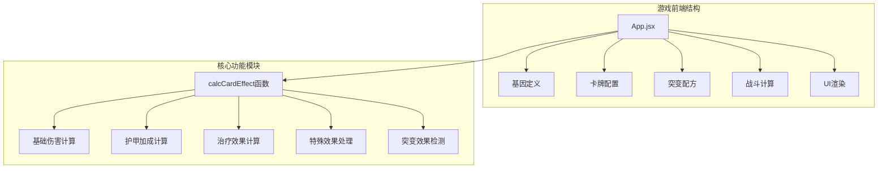
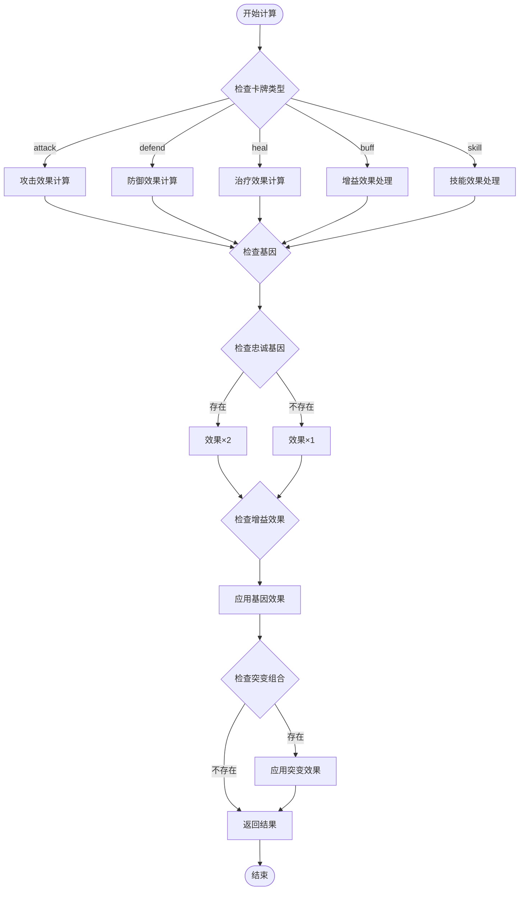
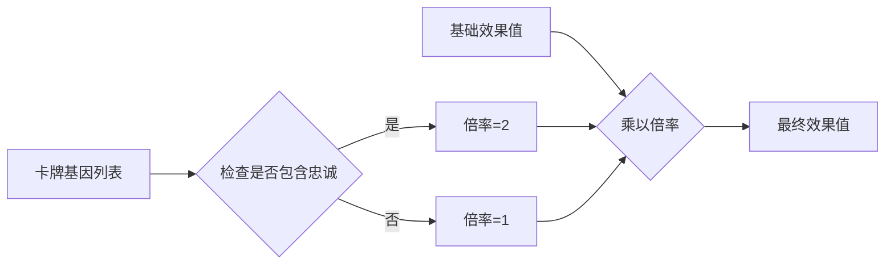
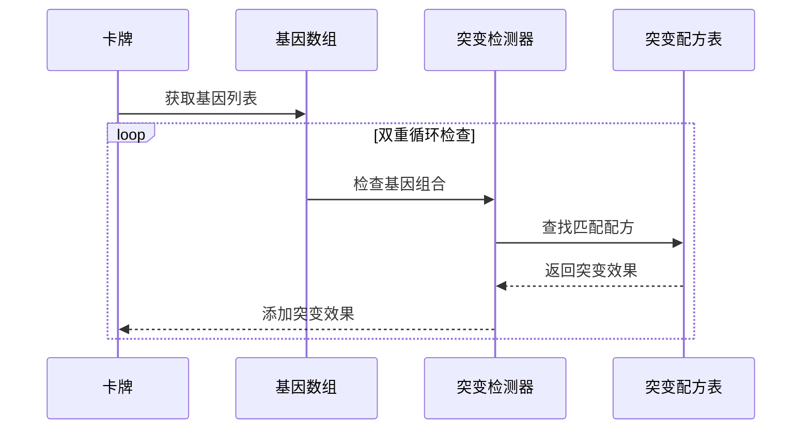
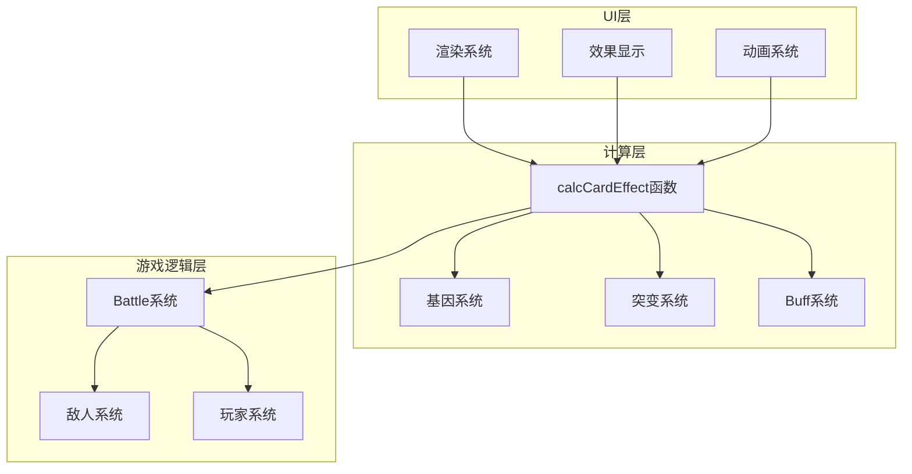

# 基因效果计算机制

<cite>
**本文引用的文件**
- [App.jsx](file://src/App.jsx)
- [游戏设计文档.md](file://游戏设计文档.md)
</cite>

## 目录
1. [简介](#简介)
2. [项目结构](#项目结构)
3. [核心组件](#核心组件)
4. [架构概览](#架构概览)
5. [详细组件分析](#详细组件分析)
6. [依赖关系分析](#依赖关系分析)
7. [性能考量](#性能考量)
8. [故障排除指南](#故障排除指南)
9. [结论](#结论)

## 简介

《小雪闯上海》是一款以雪纳瑞犬"小雪"为主角的卡牌Roguelike游戏。本文档深入解析游戏中的基因效果计算系统，特别是`calcCardEffect`函数的实现逻辑。该系统是游戏的核心机制之一，通过基因、突变和增益效果的复杂组合，为玩家提供了丰富的策略深度和Build构筑乐趣。

游戏采用8种不同的基因（利齿、硬毛、疾跑、嗅探、卖萌、吠叫、零食、忠诚），每种基因都为卡牌效果提供独特的加成。其中，忠诚基因具有特殊的效果翻倍机制，而其他基因则提供基础的伤害、护甲或特殊效果加成。

## 项目结构

游戏采用React + Vite的技术栈，核心逻辑集中在单个组件文件中：

**图表来源**
- [App.jsx:8-37](file://src/App.jsx#L8-L37)
- [App.jsx:169-216](file://src/App.jsx#L169-L216)

**章节来源**
- [App.jsx:1-2719](file://src/App.jsx#L1-L2719)
- [游戏设计文档.md:1-250](file://游戏设计文档.md#L1-L250)

## 核心组件

### 基因系统定义

游戏定义了8种不同的基因，每种基因都有独特的emoji表情、名称、颜色和效果描述：

| 基因 | Emoji | 名称 | 效果描述 |
|------|-------|------|----------|
| sharp | 🦷 | 利齿 | +2伤害 |
| tough | 🛡️ | 硬毛 | +3护甲 |
| fast | 💨 | 疾跑 | 先攻+冻结敌人1回合 |
| smell |👃 | 嗅探 | 标记弱点，下回合伤害翻倍 |
| cute | 🥺 | 卖萌 | 回复伤害50%生命 |
| loud | 📢 | 吠叫 | 弹射到随机敌人 |
| snack | 🦴 | 零食 | 回合结束额外抽1张 |
| loyal | ❤️ | 忠诚 | 效果翻倍 |

### 卡牌类型系统

游戏包含四种基础卡牌类型，每种类型有不同的计算逻辑：

1. **攻击类卡牌** (`attack`): 计算基础伤害，考虑基因加成和增益效果
2. **防御类卡牌** (`defend`): 计算护甲加成，主要用于保护玩家
3. **回血类卡牌** (`heal`): 计算治疗效果，恢复玩家生命值
4. **增益类卡牌** (`buff`): 提供临时增益效果，如下次攻击+2

**章节来源**
- [App.jsx:8-59](file://src/App.jsx#L8-L59)
- [游戏设计文档.md:43-58](file://游戏设计文档.md#L43-L58)

## 架构概览

基因效果计算系统采用函数式编程范式，通过单一的`calcCardEffect`函数处理所有类型的卡牌效果计算：

**图表来源**
- [App.jsx:169-216](file://src/App.jsx#L169-L216)

## 详细组件分析

### calcCardEffect函数详解

`calcCardEffect`函数是基因效果计算系统的核心，负责将卡牌基础属性与基因效果、突变组合和增益效果进行综合计算。

#### 基础计算逻辑

函数接收两个参数：
- `card`: 当前卡牌对象，包含基础属性和基因信息
- `buff`: 可选的增益效果值，默认为0

函数内部首先初始化四个关键变量：
- `dmg`: 伤害值，用于攻击类卡牌
- `armor`: 护甲值，用于防御类卡牌  
- `heal`: 治疗值，用于回血类卡牌
- `effects`: 特殊效果数组，包含各种状态效果

#### 倍率计算机制

忠诚基因（`loyal`）提供特殊的效果翻倍机制：

**图表来源**
- [App.jsx:173-174](file://src/App.jsx#L173-L174)

#### 卡牌类型差异化处理

不同类型的卡牌采用不同的计算方式：

**攻击类卡牌 (`attack`)**
- 基础伤害 = (基础伤害 + 增益效果) × 倍率
- 基础伤害来自卡牌的`power`属性
- 增益效果来自`attackBuff`状态变量

**防御类卡牌 (`defend`)**
- 基础护甲 = 基础护甲 × 倍率
- 护甲值直接加到玩家护甲上

**回血类卡牌 (`heal`)**
- 基础治疗 = 基础治疗 × 倍率
- 治疗值直接恢复玩家生命

**增益类卡牌 (`buff`)**
- 直接添加到`effects`数组中
- 在后续处理中转换为具体的增益效果

#### 基因效果叠加机制

每种基因效果都会按照以下规则进行叠加：

| 基因 | 类型 | 效果 | 计算方式 |
|------|------|------|----------|
| sharp | 普通 | +2伤害 | dmg += 2 × 倍率 |
| tough | 普通 | +3护甲 | armor += 3 × 倍率 |
| fast | 特殊 | 冻结效果 | effects.push("freeze") |
| smell | 特殊 | 标记效果 | effects.push("mark") |
| cute | 特殊 | 吸血效果 | effects.push("leech") |
| loud | 特殊 | 弹射效果 | effects.push("thunder") |
| snack | 特殊 | 抽牌效果 | effects.push("draw") |

#### 突变效果检测

系统会检查卡牌上所有基因的两两组合，寻找匹配的突变配方：

**图表来源**
- [App.jsx:205-213](file://src/App.jsx#L205-L213)

**章节来源**
- [App.jsx:169-216](file://src/App.jsx#L169-L216)

### 特殊效果处理

#### 吸血效果 (`cute` + `loyal`)
当触发吸血效果时，玩家会恢复造成伤害的50%生命值。这个效果在实际战斗中通过以下步骤实现：

1. 计算实际造成的伤害（考虑护甲减免）
2. 计算吸血量：实际伤害 × 50%
3. 恢复玩家生命值，不超过最大生命值

#### 冻结效果 (`fast`)
冻结效果使目标敌人在下回合无法行动。系统会：
1. 选择一个存活的敌人作为目标
2. 将其冻结状态加1
3. 在UI中显示冻结效果

#### 弹射效果 (`loud`)
弹射效果将伤害传递给随机选择的其他敌人：
1. 获取所有存活敌人的列表
2. 随机选择一个目标
3. 对该目标造成固定伤害（通常为3点）

#### 标记效果 (`smell`)
标记效果会在目标敌人身上添加标记状态，通常用于后续的伤害加成或特殊效果。

**章节来源**
- [App.jsx:1064-1131](file://src/App.jsx#L1064-L1131)
- [App.jsx:1200-1287](file://src/App.jsx#L1200-L1287)

### 增益效果对基因效果的影响

游戏中存在两种主要的增益效果：

#### 磨牙棒增益 (`buff`卡牌)
- 每张磨牙棒提供+2攻击力
- 可以叠加使用，效果累加
- 仅影响下一次攻击的伤害计算

#### 攻击增益 (`attackBuff`状态)
- 通过`attackBuff`状态变量跟踪当前增益值
- 在`calcCardEffect`函数中作为第二个参数传入
- 影响所有攻击类卡牌的基础伤害计算

**章节来源**
- [App.jsx:240](file://src/App.jsx#L240)
- [App.jsx:1033](file://src/App.jsx#L1033)
- [App.jsx:1144](file://src/App.jsx#L1144)

## 依赖关系分析

基因效果计算系统与其他游戏组件的依赖关系如下：

**图表来源**
- [App.jsx:169-216](file://src/App.jsx#L169-L216)
- [App.jsx:1030-1293](file://src/App.jsx#L1030-L1293)

### 关键依赖关系

1. **calcCardEffect ↔ 卡牌系统**: 计算函数直接依赖卡牌对象的属性
2. **calcCardEffect ↔ 基因系统**: 检查基因列表并应用相应效果
3. **calcCardEffect ↔ 突变系统**: 检测基因组合并应用突变效果
4. **calcCardEffect ↔ 增益系统**: 接收并应用临时增益效果

**章节来源**
- [App.jsx:169-216](file://src/App.jsx#L169-L216)
- [App.jsx:1030-1293](file://src/App.jsx#L1030-L1293)

## 性能考量

基因效果计算系统在性能方面采用了多项优化措施：

### 时间复杂度分析

- **基础计算**: O(1) - 常数时间操作
- **基因遍历**: O(n) - n为基因数量，通常≤3
- **突变检测**: O(n²) - 双重循环检查所有基因组合
- **总体复杂度**: O(n²)，其中n≤3，因此实际开销很小

### 内存使用优化

- 使用常量空间存储中间结果
- 避免创建不必要的临时对象
- 通过引用传递避免数据拷贝

### 计算优化策略

1. **早期退出**: 当检测到突变时继续检查其他效果
2. **条件计算**: 仅在必要时执行计算（如只有攻击类卡牌才计算伤害）
3. **缓存机制**: 在渲染系统中缓存计算结果，避免重复计算

## 故障排除指南

### 常见问题及解决方案

#### 问题1: 基因效果未生效
**症状**: 使用带有基因的卡牌时，效果没有按预期计算
**排查步骤**:
1. 检查卡牌是否正确包含基因属性
2. 确认`calcCardEffect`函数被正确调用
3. 验证基因效果的计算逻辑

#### 问题2: 忠诚基因效果异常
**症状**: 忠诚基因的效果没有正确翻倍
**排查步骤**:
1. 检查`hasLoyal`标志位的设置
2. 验证倍率计算逻辑
3. 确认倍率应用于所有相关效果

#### 问题3: 突变效果检测失败
**症状**: 基因组合未能触发相应的突变效果
**排查步骤**:
1. 检查`getMutationKey`函数的基因排序逻辑
2. 验证突变配方表中的键值匹配
3. 确认双重循环的检查逻辑

**章节来源**
- [App.jsx:169-216](file://src/App.jsx#L169-L216)
- [App.jsx:205-213](file://src/App.jsx#L205-L213)

## 结论

《小雪闯上海》的基因效果计算系统展现了优秀的游戏机制设计。通过`calcCardEffect`函数，游戏成功地将基础卡牌属性、基因加成、突变组合和增益效果整合为一个统一的计算框架。

系统的主要优势包括：

1. **清晰的计算逻辑**: 每种卡牌类型都有明确的计算规则
2. **灵活的叠加机制**: 基因效果可以自由组合，创造多样化的Build
3. **特殊的倍率机制**: 忠诚基因提供了独特的策略深度
4. **高效的性能表现**: 通过优化的算法确保流畅的游戏体验

该系统为玩家提供了丰富的策略选择，从简单的基础Build到复杂的组合技Build，满足了不同玩家的需求。同时，系统的可扩展性也为未来的功能增强奠定了良好的基础。