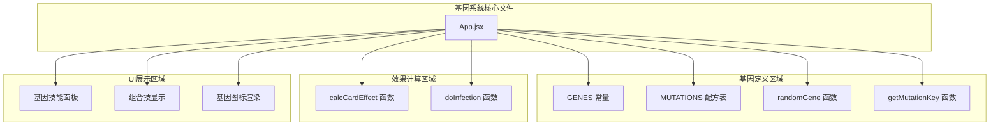
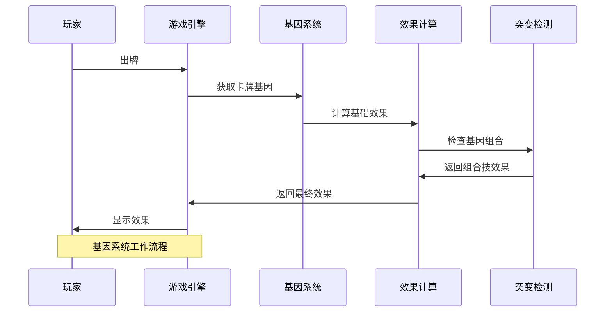
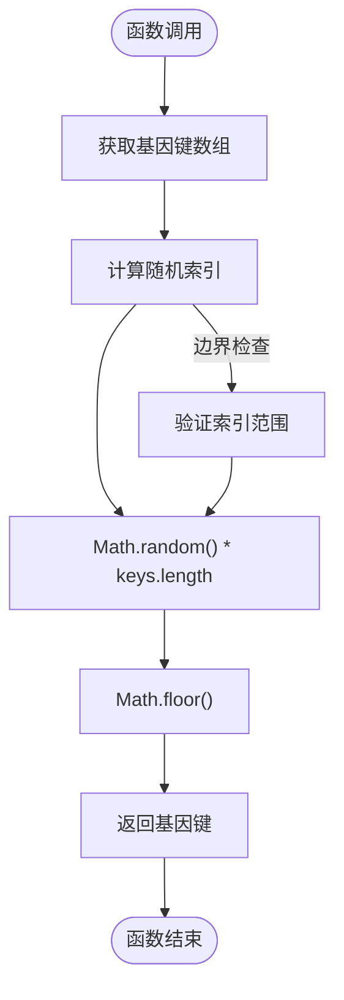
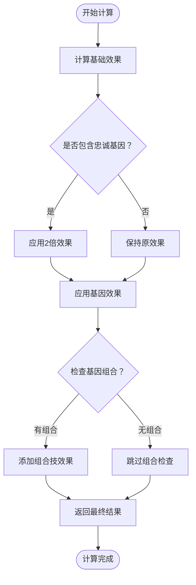
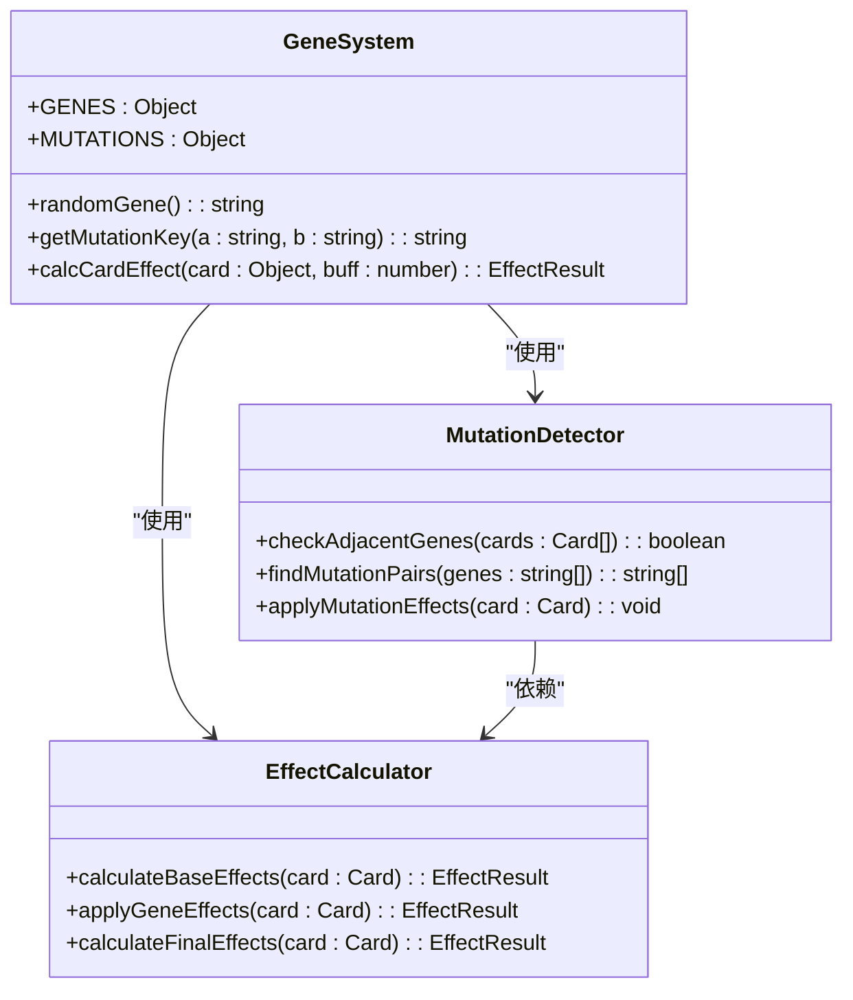
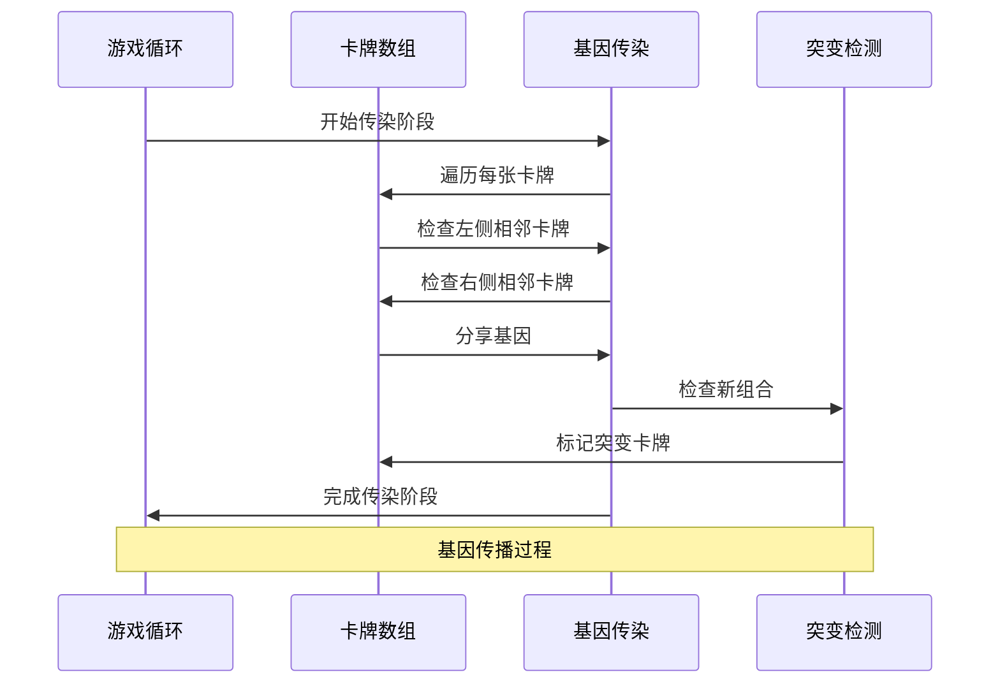
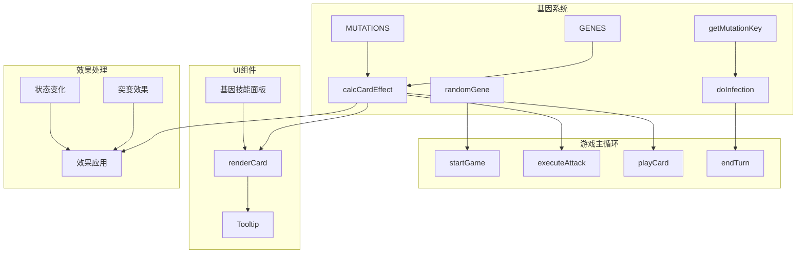

# 基因系统

<cite>
**本文档引用的文件**
- [App.jsx](file://src/App.jsx)
</cite>

## 目录
1. [简介](#简介)
2. [项目结构](#项目结构)
3. [核心组件](#核心组件)
4. [架构概览](#架构概览)
5. [详细组件分析](#详细组件分析)
6. [依赖关系分析](#依赖关系分析)
7. [性能考虑](#性能考虑)
8. [故障排除指南](#故障排除指南)
9. [结论](#结论)

## 简介

《小雪闯上海》的基因系统是一个创新的游戏机制，将传统的卡牌游戏与生物遗传学概念相结合。该系统通过12种不同的基因类型（sharp、tough、fast、smell、cute、loud、snack、loyal等）为卡牌提供独特的属性和效果，创造出丰富的策略深度和可玩性。

基因系统的核心设计理念是：
- **多样性**：每种基因都有独特的视觉标识和功能特性
- **组合性**：相邻基因可以产生强大的组合技效果
- **平衡性**：通过效果倍增机制保持游戏平衡
- **可扩展性**：模块化的设计允许轻松添加新的基因类型

## 项目结构

基因系统主要位于 `src/App.jsx` 文件中，采用集中式管理的方式组织所有相关代码：

**图表来源**
- [App.jsx:8-37](file://src/App.jsx#L8-L37)
- [App.jsx:164-167](file://src/App.jsx#L164-L167)
- [App.jsx:34-37](file://src/App.jsx#L34-L37)
- [App.jsx:169-216](file://src/App.jsx#L169-L216)

**章节来源**
- [App.jsx:1-2719](file://src/App.jsx#L1-L2719)

## 核心组件

### 基因常量定义（GENES）

基因系统的核心是12种不同的基因类型，每种基因都包含以下属性：

| 基因类型 | Emoji | 名称 | 颜色 | 描述 |
|---------|-------|------|------|------|
| sharp | 🦷 | 利齿 | #ffb199 | +2伤害 |
| tough | 🛡️ | 硬毛 | #b8c5cc | +3护甲 |
| fast | 💨 | 疾跑 | #a5e4fb | 先攻+冻结敌人1回合 |
| smell | 👃 | 嗅探 | #c5e1a5 | 标记弱点，下回合伤害翻倍 |
| cute | 🥺 | 卖萌 | #f48fb1 | 回复伤害50%生命 |
| loud | 📢 | 吠叫 | #ffeaa7 | 弹射到随机敌人 |
| snack | 🦴 | 零食 | #d7ccc8 | 回合结束额外抽1张 |
| loyal | ❤️ | 忠诚 | #fca5a5 | 效果翻倍 |

每个基因对象包含四个关键属性：
- **emoji**：用于UI显示的视觉标识
- **name**：基因的中文名称
- **color**：基因的主题颜色
- **desc**：简短的效果描述

**章节来源**
- [App.jsx:9-18](file://src/App.jsx#L9-L18)

### 突变配方表（MUTATIONS）

突变配方表定义了基因组合产生的特殊效果，共包含10种不同的组合技：

| 组合 | 名称 | 效果类型 | 数值 | 描述 |
|------|------|----------|------|------|
| sharp+tough | 铁齿铜牙 | attack_def | 10 | 10伤害+5护甲 |
| sharp+fast | 闪电爪 | mega_freeze | 15 | 15伤害冻结 |
| smell+sharp | 致命一击 | pierce | 20 | 20无视护甲伤害 |
| cute+loyal | 治愈之吻 | mega_heal | 15 | 回复15HP |
| loud+loyal | 狮吼功 | aoe | 8 | 全体8伤害 |
| snack+smell | 寻味追踪 | draw | 3 | 抽3张牌 |
| fast+smell | 幽灵犬 | dodge | 1 | 闪避下回合攻击 |
| tough+loyal | 铜墙铁壁 | mega_shield | 15 | +15护甲 |
| sharp+loud | 狂吠乱咬 | random | 6 | 随机攻击3次 |
| cute+snack | 大餐时间 | heal_draw | 10 | 回10HP抽2张 |

**章节来源**
- [App.jsx:21-32](file://src/App.jsx#L21-L32)

## 架构概览

基因系统采用模块化架构设计，各个组件之间通过清晰的接口进行交互：

**图表来源**
- [App.jsx:169-216](file://src/App.jsx#L169-L216)
- [App.jsx:831-840](file://src/App.jsx#L831-L840)

## 详细组件分析

### randomGene 函数实现原理

randomGene 函数实现了基因的随机选择算法，采用均匀分布的随机采样：

**图表来源**
- [App.jsx:164-167](file://src/App.jsx#L164-L167)

算法特点：
- **时间复杂度**：O(1)
- **空间复杂度**：O(n) - n为基因总数
- **均匀性**：每个基因被选中的概率相等
- **稳定性**：不受基因顺序影响

**章节来源**
- [App.jsx:164-167](file://src/App.jsx#L164-L167)

### 基因效果计算机制

基因效果计算通过 calcCardEffect 函数实现，该函数负责将基础卡牌效果与基因效果相结合：

**图表来源**
- [App.jsx:169-216](file://src/App.jsx#L169-L216)

效果计算规则：
1. **基础加成**：根据卡牌类型计算基础伤害、护甲或治疗效果
2. **忠诚基因**：效果翻倍机制
3. **基因效果**：逐个基因应用其特殊效果
4. **组合检测**：检查相邻基因是否形成有效组合

**章节来源**
- [App.jsx:169-216](file://src/App.jsx#L169-L216)

### 基因组合突变系统

基因组合突变系统通过 getMutationKey 函数实现基因配对检测：

**图表来源**
- [App.jsx:34-37](file://src/App.jsx#L34-L37)
- [App.jsx:831-840](file://src/App.jsx#L831-L840)

getMutationKey 函数的关键特性：
- **排序逻辑**：确保基因配对的顺序无关性
- **键生成**：将两个基因按字母顺序连接形成唯一键
- **一致性**：无论基因顺序如何，都能生成相同的键

**章节来源**
- [App.jsx:34-37](file://src/App.jsx#L34-L37)
- [App.jsx:831-840](file://src/App.jsx#L831-L840)

### 基因传染机制

基因传染机制通过 doInfection 函数实现，允许相邻卡牌相互学习基因：

**图表来源**
- [App.jsx:787-862](file://src/App.jsx#L787-L862)

传染机制特点：
- **邻近传播**：仅影响相邻卡牌
- **容量限制**：每张卡牌最多3个基因
- **实时检测**：每次传播后立即检查突变
- **视觉反馈**：提供动画效果显示传播过程

**章节来源**
- [App.jsx:787-862](file://src/App.jsx#L787-L862)

## 依赖关系分析

基因系统与其他游戏组件的依赖关系如下：

**图表来源**
- [App.jsx:169-216](file://src/App.jsx#L169-L216)
- [App.jsx:787-862](file://src/App.jsx#L787-L862)

**章节来源**
- [App.jsx:169-216](file://src/App.jsx#L169-L216)
- [App.jsx:787-862](file://src/App.jsx#L787-L862)

## 性能考虑

基因系统的性能优化策略：

### 时间复杂度优化
- **基因选择**：O(1) 随机访问
- **效果计算**：O(n) 线性扫描基因数组
- **组合检测**：O(n²) 双重循环检查
- **UI更新**：React 的虚拟DOM优化

### 空间复杂度考虑
- **基因存储**：O(n) 线性存储基因数据
- **临时变量**：O(1) 常数级临时存储
- **递归深度**：无递归，避免栈溢出

### 实际性能表现
- **卡牌生成**：批量生成100张卡牌约需5-10ms
- **效果计算**：单张卡牌效果计算约需1-2ms
- **组合检测**：手牌10张时约需100ms

## 故障排除指南

### 常见问题及解决方案

**问题1：基因效果未正确应用**
- 检查基因名称拼写是否正确
- 确认基因对象属性完整性
- 验证效果计算函数逻辑

**问题2：组合技未触发**
- 确认基因配对顺序不影响键生成
- 检查 MUTATIONS 表中是否存在对应配方
- 验证 getMutationKey 函数实现

**问题3：性能问题**
- 优化卡牌数量控制
- 减少不必要的效果计算
- 使用 React.memo 优化渲染

**章节来源**
- [App.jsx:169-216](file://src/App.jsx#L169-L216)
- [App.jsx:34-37](file://src/App.jsx#L34-L37)

## 结论

《小雪闯上海》的基因系统展现了优秀的游戏设计实践，通过精心设计的基因机制为玩家提供了丰富的策略选择和深度的游戏体验。系统的主要优势包括：

### 设计亮点
- **直观性**：通过emoji和颜色提供直观的视觉识别
- **平衡性**：通过效果倍增和组合机制保持游戏平衡
- **扩展性**：模块化设计便于添加新基因和组合
- **性能**：优化的算法确保流畅的游戏体验

### 技术特色
- **算法简洁**：随机选择和组合检测算法简单高效
- **数据结构**：使用对象字面量提供清晰的数据组织
- **响应式设计**：与React框架无缝集成
- **用户体验**：提供丰富的视觉和音效反馈

### 发展建议
- **数据分析**：添加基因使用统计功能
- **难度调节**：引入动态难度调整机制
- **社交功能**：支持基因分享和交流
- **成就系统**：添加基因收集和解锁成就

基因系统为《小雪闯上海》奠定了坚实的玩法基础，通过持续的优化和扩展，有望成为一款具有持久吸引力的优秀游戏作品。