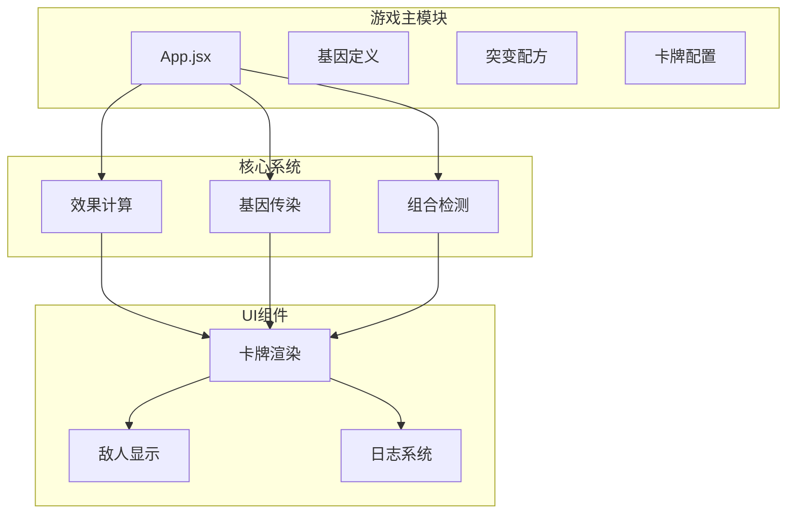
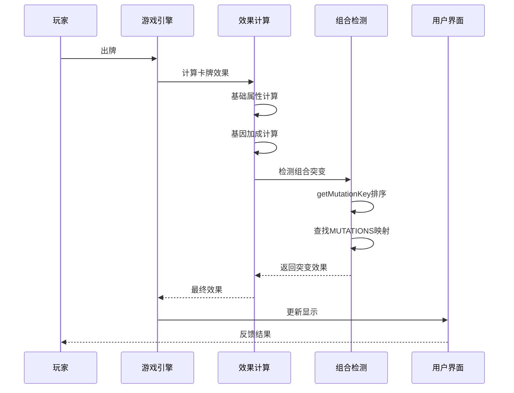
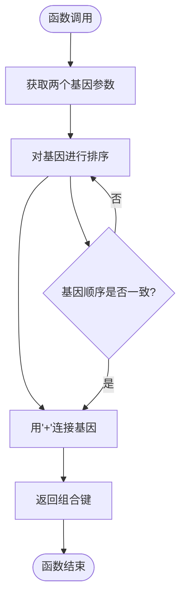
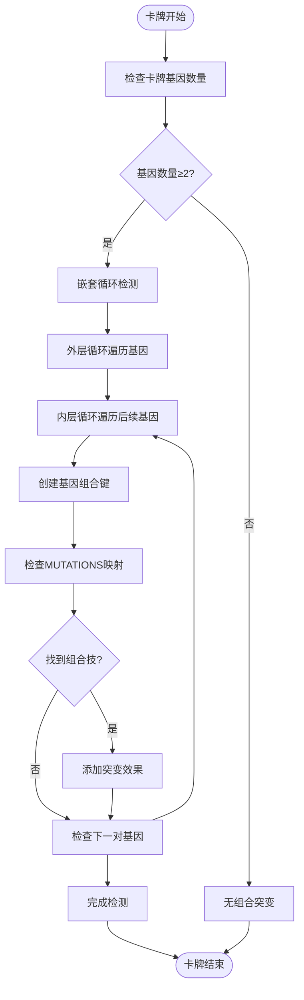
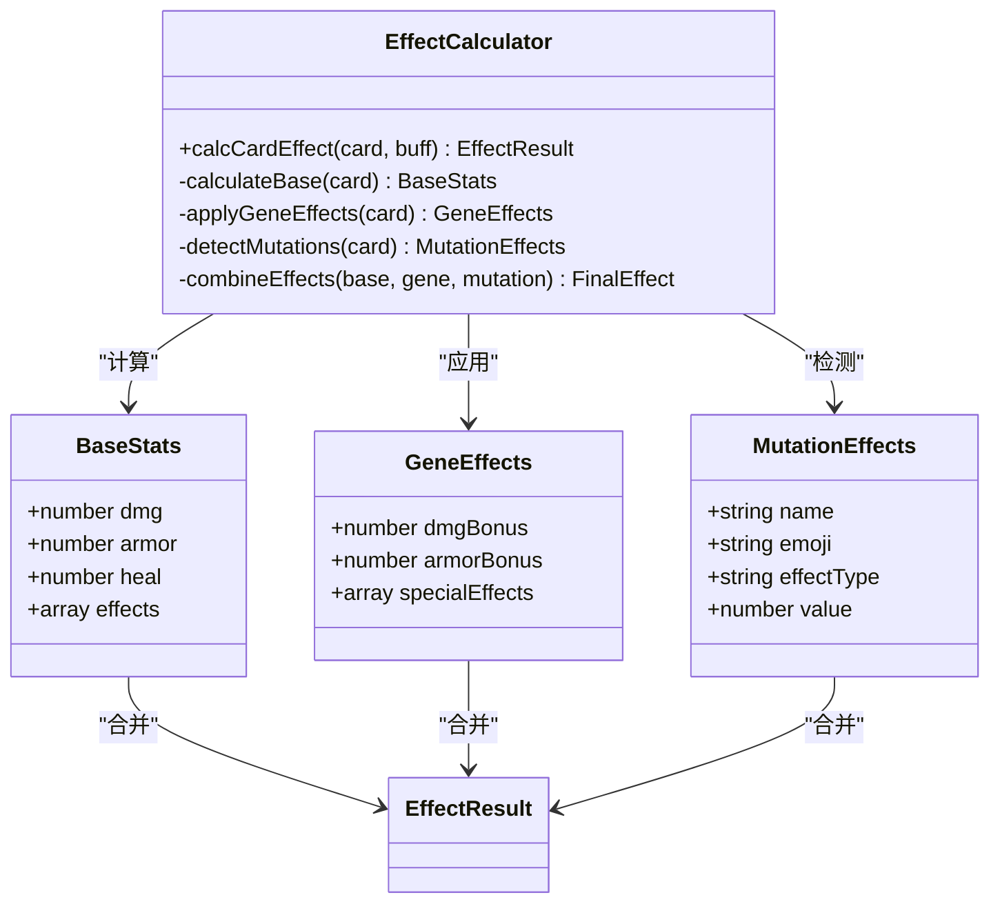
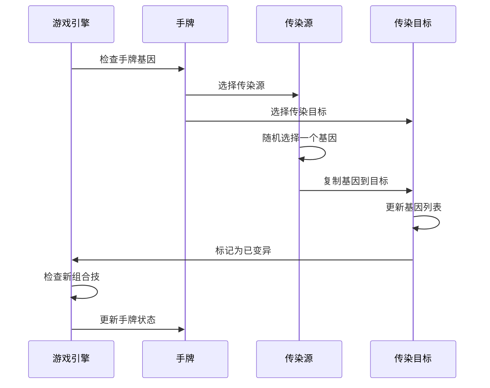
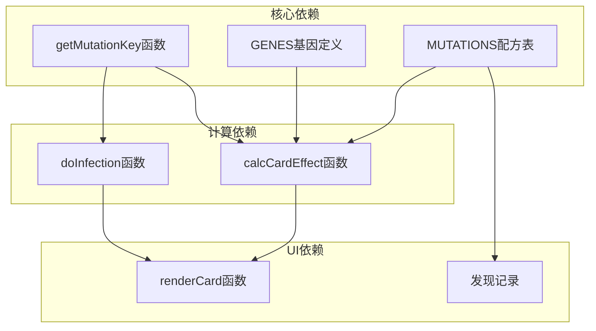

# 基因组合突变系统

<cite>
**本文档引用的文件**
- [App.jsx](file://src/App.jsx)
- [游戏设计文档.md](file://游戏设计文档.md)
</cite>

## 目录
1. [简介](#简介)
2. [项目结构](#项目结构)
3. [核心组件](#核心组件)
4. [架构概览](#架构概览)
5. [详细组件分析](#详细组件分析)
6. [依赖关系分析](#依赖关系分析)
7. [性能考量](#性能考量)
8. [故障排除指南](#故障排除指南)
9. [结论](#结论)
10. [附录](#附录)

## 简介

《小雪闯上海》的基因组合突变系统是游戏的核心策略机制，为传统的卡牌Roguelike游戏增添了深度的Build构筑乐趣。该系统通过8种基础基因的随机组合，创造出10种独特的组合技效果，为玩家提供了丰富的战术选择和策略深度。

系统的核心设计理念是"基因传染 + 组合突变"的双重机制：基因通过传染系统在手牌间传播，当同一张卡牌携带两个特定基因时，就会触发相应的突变效果。这种设计既保证了游戏的可玩性，又为玩家提供了明确的成长路径。

## 项目结构

游戏采用React函数组件架构，所有核心逻辑集中在单一的App.jsx文件中。项目结构简洁明了，便于维护和扩展：

**图表来源**
- [App.jsx:1-200](file://src/App.jsx#L1-L200)

**章节来源**
- [App.jsx:1-200](file://src/App.jsx#L1-L200)
- [游戏设计文档.md:1-50](file://游戏设计文档.md#L1-L50)

## 核心组件

### 基因系统（GENES）

基因系统定义了8种基础基因及其效果，每种基因都有对应的emoji标识、颜色和描述文本：

| 基因名称 | Emoji | 颜色 | 描述 | 效果 |
|---------|-------|------|------|------|
| 利齿 | 🦷 | #ffb199 | +2伤害 | 增加2点伤害 |
| 硬毛 | 🛡️ | #b8c5cc | +3护甲 | 增加3点护甲 |
| 疾跑 | 💨 | #a5e4fb | 先攻+冻结敌人1回合 | 先攻并冻结敌人 |
| 嗅探 | 👃 | #c5e1a5 | 标记弱点，下回合伤害翻倍 | 标记敌人弱点 |
| 卖萌 | 🥺 | #f48fb1 | 回复伤害50%生命 | 吸血效果 |
| 吠叫 | 📢 | #ffeaa7 | 弹射到随机敌人 | 伤害弹射 |
| 零食 | 🦴 | #d7ccc8 | 回合结束额外抽1张 | 额外抽牌 |
| 忠诚 | ❤️ | #fca5a5 | 效果翻倍 | 基础效果翻倍 |

**章节来源**
- [App.jsx:8-18](file://src/App.jsx#L8-L18)

### 突变配方系统（MUTATIONS）

突变配方系统定义了10种组合技效果，每种组合技都有独特的emoji标识、名称和描述：

| 组合技名称 | 基因组合 | Emoji | 效果类型 | 参数值 | 描述 |
|-----------|----------|-------|----------|--------|------|
| 铁齿铜牙 | 利齿+硬毛 | 🐕 | attack_def | 10 | 10伤害+5护甲 |
| 闪电爪 | 利齿+疾跑 | ⚡ | mega_freeze | 15 | 15伤害冻结 |
| 致命一击 | 嗅探+利齿 | 🎯 | pierce | 20 | 20无视护甲伤害 |
| 治愈之吻 | 卖萌+忠诚 | 💖 | mega_heal | 15 | 回复15HP |
| 狮吼功 | 吠叫+忠诚 | 🔊 | aoe | 8 | 全体8伤害 |
| 寻味追踪 | 零食+嗅探 | 🍖 | draw | 3 | 抽3张牌 |
| 幽灵犬 | 疾跑+嗅探 | 👻 | dodge | 1 | 闪避下回合攻击 |
| 铜墙铁壁 | 硬毛+忠诚 | 🏰 | mega_shield | 15 | +15护甲 |
| 狂吠乱咬 | 利齿+吠叫 | 🌪️ | random | 6 | 随机攻击3次 |
| 大餐时间 | 卖萌+零食 | 🍼 | heal_draw | 10 | 回10HP抽2张 |

**章节来源**
- [App.jsx:20-32](file://src/App.jsx#L20-L32)

## 架构概览

基因组合突变系统采用分层架构设计，各组件职责清晰，耦合度低：

**图表来源**
- [App.jsx:169-216](file://src/App.jsx#L169-L216)
- [App.jsx:205-213](file://src/App.jsx#L205-L213)

## 详细组件分析

### getMutationKey函数分析

getMutationKey函数是组合突变系统的核心算法，负责确保基因组合的唯一性和稳定性：

**算法特点：**
- **稳定性**：无论输入顺序如何，始终返回相同的键值
- **唯一性**：确保相同基因组合产生相同的组合技效果
- **可预测性**：开发者可以准确预测任何基因组合的结果

**实现细节：**
- 使用数组的sort()方法进行字母序排序
- 通过"+"连接符创建标准化的键格式
- 时间复杂度：O(n log n)，其中n为基因数量（固定为2）

**章节来源**
- [App.jsx:34-37](file://src/App.jsx#L34-L37)

### 组合检测算法

组合检测算法在卡牌效果计算过程中执行，确保所有可能的基因组合都被正确识别：

**算法复杂度：**
- 时间复杂度：O(n²)，其中n为卡牌上基因数量
- 空间复杂度：O(1)，不考虑结果存储
- 对于标准卡牌（最多3个基因），最坏情况为3²=9次比较

**章节来源**
- [App.jsx:205-213](file://src/App.jsx#L205-L213)

### 效果计算系统

效果计算系统是组合突变系统的核心处理单元，负责将基础属性、基因加成和组合技效果整合：

**图表来源**
- [App.jsx:169-216](file://src/App.jsx#L169-L216)

**章节来源**
- [App.jsx:169-216](file://src/App.jsx#L169-L216)

### 基因传染系统

基因传染系统是组合突变系统的重要组成部分，负责在战斗结束后传播基因：

**章节来源**
- [App.jsx:787-862](file://src/App.jsx#L787-L862)

## 依赖关系分析

基因组合突变系统与其他游戏组件存在紧密的依赖关系：

**图表来源**
- [App.jsx:20-32](file://src/App.jsx#L20-L32)
- [App.jsx:169-216](file://src/App.jsx#L169-L216)

**章节来源**
- [App.jsx:169-216](file://src/App.jsx#L169-L216)
- [App.jsx:787-862](file://src/App.jsx#L787-L862)

## 性能考量

### 算法优化策略

1. **组合检测优化**
   - 使用嵌套循环而非递归，减少函数调用开销
   - 在基因数量较少的情况下（通常≤3），O(n²)复杂度可接受
   - 提前终止条件：当基因数量不足2时立即返回

2. **内存使用优化**
   - 所有操作都在函数内部完成，避免全局状态污染
   - 使用不可变数据结构，确保函数式编程特性
   - 及时清理临时变量，避免内存泄漏

3. **渲染性能优化**
   - 使用React的key属性优化列表渲染
   - 条件渲染减少不必要的DOM更新
   - 动画使用CSS而非JavaScript，提高性能

### 扩展性考虑

系统设计充分考虑了未来的功能扩展需求：

1. **基因扩展**
   - 新增基因只需修改GENES对象
   - 自动继承现有组合检测逻辑
   - 无需修改核心算法

2. **组合技扩展**
   - 新增组合技只需修改MUTATIONS对象
   - 系统自动处理排序和查找逻辑
   - 无需修改计算函数

3. **效果类型扩展**
   - 新的效果类型需要在effect处理逻辑中添加
   - 保持向后兼容性
   - 提供默认处理机制

## 故障排除指南

### 常见问题及解决方案

1. **组合技未触发**
   - 检查基因顺序是否正确：getMutationKey会自动排序
   - 确认卡牌上确实携带了两个相关基因
   - 验证MUTATIONS配置是否正确

2. **效果计算错误**
   - 检查calcCardEffect函数中的效果累加逻辑
   - 确认基因效果的乘数计算（忠诚基因效果翻倍）
   - 验证组合技效果的优先级

3. **性能问题**
   - 监控组合检测的执行次数
   - 检查是否有过多的基因组合
   - 优化渲染逻辑，避免不必要的重渲染

**章节来源**
- [App.jsx:169-216](file://src/App.jsx#L169-L216)
- [App.jsx:34-37](file://src/App.jsx#L34-L37)

## 结论

《小雪闯上海》的基因组合突变系统是一个设计精良的策略机制，成功地将简单的基因系统与复杂的组合技效果相结合。系统的核心优势在于：

1. **算法稳定性**：getMutationKey函数确保了基因组合的唯一性和可预测性
2. **扩展性强**：模块化的架构设计便于未来功能扩展
3. **用户体验**：直观的UI反馈和渐进式的策略深度
4. **性能优化**：合理的算法选择和渲染优化

该系统为卡牌Roguelike游戏提供了深度的Build构筑乐趣，玩家可以通过精心策划的基因组合来创造独特的战斗风格。随着游戏内容的丰富，这个系统将继续发挥重要作用，为玩家提供持续的新鲜感和挑战性。

## 附录

### 组合技效果详解

#### 铁齿铜牙（利齿+硬毛）
- **效果类型**：attack_def
- **参数值**：10
- **描述**：10伤害+5护甲
- **触发条件**：利齿基因 + 硬毛基因
- **计算逻辑**：基础伤害+10，护甲+5

#### 闪电爪（利齿+疾跑）
- **效果类型**：mega_freeze
- **参数值**：15
- **描述**：15伤害冻结
- **触发条件**：利齿基因 + 疾跑基因
- **计算逻辑**：造成15点伤害并冻结目标1回合

#### 致命一击（嗅探+利齿）
- **效果类型**：pierce
- **参数值**：20
- **描述**：20无视护甲伤害
- **触发条件**：嗅探基因 + 利齿基因
- **计算逻辑**：造成20点无视护甲的伤害

#### 治愈之吻（卖萌+忠诚）
- **效果类型**：mega_heal
- **参数值**：15
- **描述**：回复15HP
- **触发条件**：卖萌基因 + 忠诚基因
- **计算逻辑**：恢复15点生命值

#### 其他组合技效果
- **狮吼功**：全体8伤害
- **寻味追踪**：抽3张牌
- **幽灵犬**：闪避下回合攻击
- **铜墙铁壁**：+15护甲
- **狂吠乱咬**：随机攻击3次
- **大餐时间**：回10HP抽2张

### 扩展指南

#### 添加新基因
1. 在GENES对象中添加新的基因定义
2. 确保提供唯一的键名、emoji、颜色和描述
3. 在游戏设计文档中更新基因说明

#### 添加新组合技
1. 在MUTATIONS对象中添加新的组合技定义
2. 选择合适的effect类型和参数值
3. 更新游戏设计文档中的组合技列表

#### 自定义组合技
1. 设计独特的效果类型和参数
2. 在calcCardEffect函数中添加相应的处理逻辑
3. 更新UI渲染逻辑以显示新效果
4. 添加适当的音效和动画效果

**章节来源**
- [App.jsx:20-32](file://src/App.jsx#L20-L32)
- [游戏设计文档.md:74-88](file://游戏设计文档.md#L74-L88)