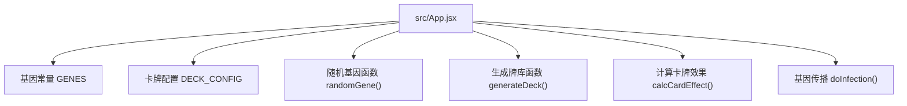
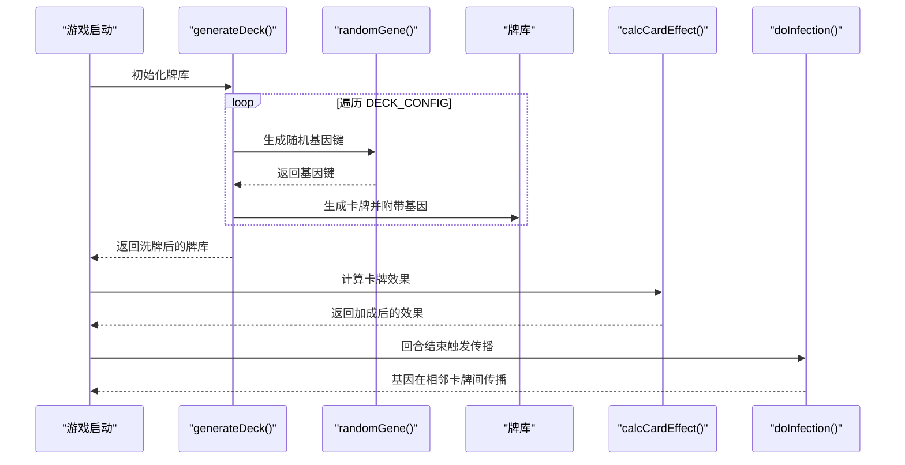
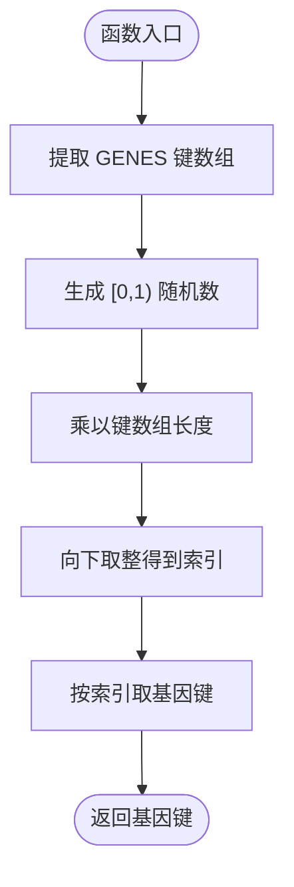
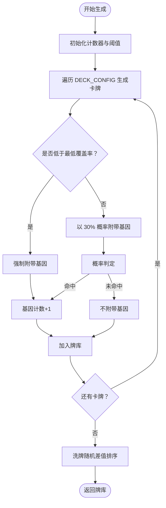
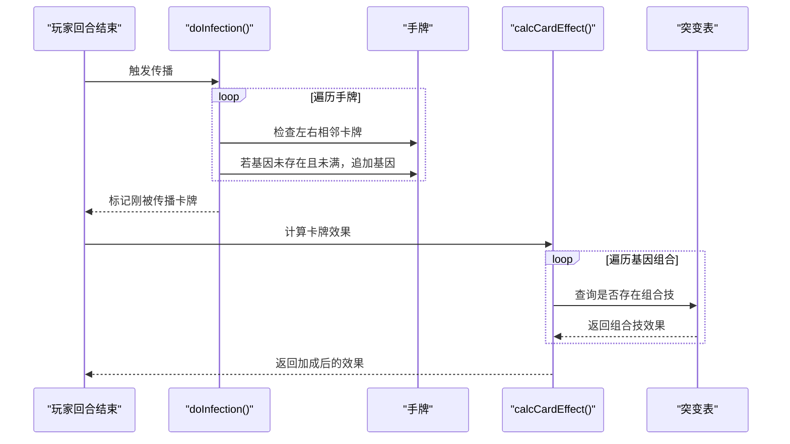
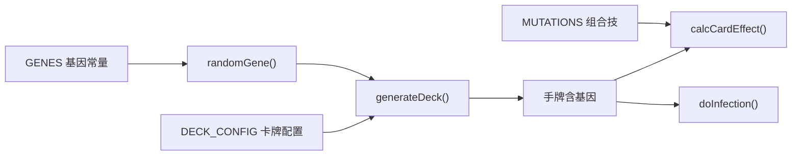

# 基因随机生成算法

<cite>
**本文引用的文件**
- [App.jsx](file://src/App.jsx)
</cite>

## 目录
1. [简介](#简介)
2. [项目结构](#项目结构)
3. [核心组件](#核心组件)
4. [架构总览](#架构总览)
5. [详细组件分析](#详细组件分析)
6. [依赖关系分析](#依赖关系分析)
7. [性能考量](#性能考量)
8. [故障排除指南](#故障排除指南)
9. [结论](#结论)

## 简介
本文面向《小雪闯上海》的基因随机生成系统，聚焦于两个关键函数：randomGene 与 generateDeck。我们将深入解析它们的实现原理、统计学依据与平衡性设计，并给出性能分析与优化建议，帮助开发者理解并维护该系统的随机性与可玩性。

## 项目结构
本项目采用 React + Vite 的前端架构，核心逻辑集中在单文件组件中，基因系统位于主组件文件内，便于集中维护与测试。

图表来源
- [App.jsx:8-59](file://src/App.jsx#L8-L59)
- [App.jsx:164-167](file://src/App.jsx#L164-L167)
- [App.jsx:61-89](file://src/App.jsx#L61-L89)
- [App.jsx:169-216](file://src/App.jsx#L169-L216)
- [App.jsx:787-862](file://src/App.jsx#L787-L862)

章节来源
- [App.jsx:1-20](file://src/App.jsx#L1-L20)

## 核心组件
- 基因常量 GENES：定义8种基因及其属性（表情、名称、颜色、描述），作为随机选择的候选集合。
- 随机基因函数 randomGene()：从 GENES 键数组中等概率随机选取一个基因键名。
- 生成牌库函数 generateDeck()：按 DECK_CONFIG 生成完整牌库，对每张卡牌以30%概率附带随机基因，并强制保证至少34%的卡牌带有基因。
- 计算卡牌效果 calcCardEffect()：将基因加成与组合技（突变）整合到卡牌实际效果中。
- 基因传播 doInfection()：回合结束时，相邻卡牌互相传播基因，形成 Build 成长。

章节来源
- [App.jsx:8-18](file://src/App.jsx#L8-L18)
- [App.jsx:164-167](file://src/App.jsx#L164-L167)
- [App.jsx:61-89](file://src/App.jsx#L61-L89)
- [App.jsx:169-216](file://src/App.jsx#L169-L216)
- [App.jsx:787-862](file://src/App.jsx#L787-L862)

## 架构总览
基因随机生成系统贯穿“生成—传播—计算”三条主线：
- 生成阶段：在构建初始牌库时，为每张卡牌注入随机基因，确保基因覆盖率与多样性。
- 传播阶段：回合结束时，相邻卡牌互相传播基因，形成 Build 进化。
- 计算阶段：在战斗中，将基因加成与组合技效果整合到卡牌实际伤害/护甲/回血等数值。

图表来源
- [App.jsx:61-89](file://src/App.jsx#L61-L89)
- [App.jsx:164-167](file://src/App.jsx#L164-L167)
- [App.jsx:169-216](file://src/App.jsx#L169-L216)
- [App.jsx:787-862](file://src/App.jsx#L787-L862)

## 详细组件分析

### randomGene 函数
- 实现原理
  - 从 GENES 对象中提取键数组（即基因名集合）。
  - 使用 Math.random() 生成 [0,1) 的均匀分布随机数，乘以键数组长度并向下取整，得到一个合法索引。
  - 通过该索引返回对应的基因键名。
- 时间复杂度
  - 键数组提取 O(k)，随机索引访问 O(1)，整体 O(k)。
- 空间复杂度
  - 键数组长度为 k（基因种类数），O(k)。
- 统计学特性
  - 由于 Math.random() 在大多数实现中近似均匀分布，且未引入偏置，因此每个基因被选中的概率理论上相等。
- 优化建议
  - 若基因数量增长，可考虑缓存键数组以减少重复提取开销。
  - 若需非均匀分布，可在外部传入权重映射并使用累积分布采样。

图表来源
- [App.jsx:164-167](file://src/App.jsx#L164-L167)

章节来源
- [App.jsx:164-167](file://src/App.jsx#L164-L167)

### generateDeck 函数
- 实现原理
  - 遍历 DECK_CONFIG，按每种卡牌的数量重复生成。
  - 对每张卡牌：
    - 计算最小基因卡牌数量：总卡牌数 × 34%，向下取整。
    - 若已生成的基因卡牌数量小于该阈值，则强制赋予基因。
    - 否则以 30% 概率赋予基因。
  - 最终对整副牌进行洗牌（Fisher-Yates 洗牌思想，使用 Math.random() 差值排序）。
- 统计学与平衡性设计
  - 强制基因覆盖率：确保至少 34% 的卡牌带有基因，避免基因稀疏导致 Build 无法形成。
  - 随机概率：在满足最低覆盖率的前提下，额外 30% 的卡牌随机附带基因，提升多样性与不可预测性。
  - 洗牌：通过随机差值排序实现近似均匀分布的洗牌，保证每局牌序的随机性。
- 复杂度分析
  - 生成阶段：遍历 DECK_CONFIG 与每张卡牌，O(n)（n 为总卡牌数）。
  - 洗牌阶段：O(n)。
  - 总体 O(n)。
- 优化建议
  - 预计算总卡牌数与最小基因卡牌数，避免重复计算。
  - 若 DECK_CONFIG 中卡牌数量巨大，可考虑分批生成与惰性洗牌策略。

图表来源
- [App.jsx:61-89](file://src/App.jsx#L61-L89)

章节来源
- [App.jsx:61-89](file://src/App.jsx#L61-L89)

### 基因传播（doInfection）与组合技（calcCardEffect）
- 基因传播
  - 回合结束时，遍历手牌，对相邻两张卡牌尝试传播基因。
  - 传播条件：目标卡牌尚未拥有该基因且基因槽未满（最多3个）。
  - 传播结果：目标卡牌基因列表追加该基因，并标记“刚被传播”。
- 组合技检测
  - 在计算卡牌效果时，遍历基因两两组合，查询突变表，若存在则标记为“已突变”，并应用相应效果。
- 平衡性意义
  - 传播机制鼓励 Build 成型，同时避免过度集中于少数卡牌。
  - 组合技提供策略深度，促使玩家围绕特定基因组合进行 Build 规划。

图表来源
- [App.jsx:787-862](file://src/App.jsx#L787-L862)
- [App.jsx:169-216](file://src/App.jsx#L169-L216)

章节来源
- [App.jsx:787-862](file://src/App.jsx#L787-L862)
- [App.jsx:169-216](file://src/App.jsx#L169-L216)

## 依赖关系分析
- randomGene 依赖 GENES 的键集合，确保随机选择的合法性与一致性。
- generateDeck 依赖 DECK_CONFIG 与 randomGene，负责生成初始牌库并施加基因覆盖率与概率约束。
- calcCardEffect 依赖 GENES 与 MUTATIONS，负责将基因与组合技整合到卡牌效果中。
- doInfection 依赖手牌结构与基因传播规则，负责 Build 的演化。

图表来源
- [App.jsx:8-18](file://src/App.jsx#L8-L18)
- [App.jsx:40-59](file://src/App.jsx#L40-L59)
- [App.jsx:164-167](file://src/App.jsx#L164-L167)
- [App.jsx:61-89](file://src/App.jsx#L61-L89)
- [App.jsx:169-216](file://src/App.jsx#L169-L216)
- [App.jsx:787-862](file://src/App.jsx#L787-L862)

章节来源
- [App.jsx:8-18](file://src/App.jsx#L8-L18)
- [App.jsx:40-59](file://src/App.jsx#L40-L59)
- [App.jsx:164-167](file://src/App.jsx#L164-L167)
- [App.jsx:61-89](file://src/App.jsx#L61-L89)
- [App.jsx:169-216](file://src/App.jsx#L169-L216)
- [App.jsx:787-862](file://src/App.jsx#L787-L862)

## 性能考量
- 时间复杂度
  - generateDeck：O(n)（n 为总卡牌数），主要由遍历与洗牌组成。
  - randomGene：O(k)（k 为基因种类数），通常很小，可视为常数。
  - calcCardEffect：O(g^2 + g)（g 为单卡基因数），在最多3个基因时仍为常数级。
  - doInfection：O(h)（h 为手牌数），每次传播检查相邻卡牌。
- 空间复杂度
  - 生成阶段：O(n) 存储牌库。
  - 计算阶段：O(g) 存储基因与组合检测中间结果。
- 优化建议
  - 缓存 GENES 键数组，避免重复提取。
  - 预计算最小基因卡牌阈值，减少重复计算。
  - 若卡牌数量增长，可考虑分批生成与惰性洗牌，降低峰值内存占用。
  - 对组合技检测使用哈希表（基因键拼接）以降低查找成本。

## 故障排除指南
- 基因覆盖率不足
  - 现象：某局出现大量无基因卡牌。
  - 排查：确认 generateDeck 是否正确计算最小阈值与强制逻辑。
  - 参考路径：[App.jsx:61-89](file://src/App.jsx#L61-L89)
- 基因分布不均衡
  - 现象：某些基因出现频率明显高于其他基因。
  - 排查：检查 Math.random() 分布是否被外部环境影响；确认未对随机数做额外变换。
  - 参考路径：[App.jsx:164-167](file://src/App.jsx#L164-L167)
- 组合技未触发
  - 现象：两个基因组合应触发突变却未生效。
  - 排查：确认基因顺序是否一致（已通过排序键确保），检查突变表键拼接格式。
  - 参考路径：[App.jsx:34-37](file://src/App.jsx#L34-L37), [App.jsx:169-216](file://src/App.jsx#L169-L216)
- 传播异常
  - 现象：相邻卡牌未传播或传播过多。
  - 排查：确认 doInfection 的边界条件与基因槽限制（最多3个）。
  - 参考路径：[App.jsx:787-862](file://src/App.jsx#L787-L862)

章节来源
- [App.jsx:61-89](file://src/App.jsx#L61-L89)
- [App.jsx:164-167](file://src/App.jsx#L164-L167)
- [App.jsx:34-37](file://src/App.jsx#L34-L37)
- [App.jsx:169-216](file://src/App.jsx#L169-L216)
- [App.jsx:787-862](file://src/App.jsx#L787-L862)

## 结论
《小雪闯上海》的基因随机生成系统通过 generateDeck 的强制覆盖率与随机概率相结合，确保了基因系统的随机性与可玩性；randomGene 提供了等概率的基因选择；calcCardEffect 与 doInfection 则将基因转化为 Build 与组合技，形成策略深度。整体算法简洁高效，时间复杂度线性，易于维护与扩展。建议在后续迭代中关注缓存与哈希优化，以进一步提升性能与稳定性。