# 事件处理

<cite>
**本文档引用的文件**
- [App.jsx](file://src/App.jsx)
</cite>

## 目录
1. [简介](#简介)
2. [项目结构](#项目结构)
3. [核心组件](#核心组件)
4. [架构概览](#架构概览)
5. [详细组件分析](#详细组件分析)
6. [依赖关系分析](#依赖关系分析)
7. [性能考虑](#性能考虑)
8. [故障排除指南](#故障排除指南)
9. [结论](#结论)

## 简介

《小雪闯上海》是一款基于React的卡牌战斗游戏，采用"小雪"为主角的雪纳瑞角色，在上海街头与各种坏人和坏狗狗进行战斗。游戏的核心在于其独特的战斗事件处理系统，该系统负责管理卡牌出牌、敌人行动、状态效果、组合技触发等各类战斗事件的生命周期。

本系统实现了完整的事件驱动架构，包括事件触发、事件排队、事件执行的完整流程，并提供了丰富的事件类型处理机制，如卡牌出牌事件、敌人行动事件、状态效果事件、组合技触发事件等。

## 项目结构

游戏采用React函数式组件架构，主要逻辑集中在单一的App.jsx文件中，该文件包含了完整的战斗系统实现：

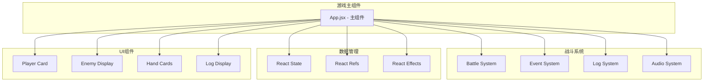

**图表来源**
- [App.jsx:219-2719](file://src/App.jsx#L219-L2719)

**章节来源**
- [App.jsx:1-100](file://src/App.jsx#L1-L100)

## 核心组件

### 战斗事件处理器

游戏的核心是基于React的状态管理系统，通过useState、useEffect、useCallback等Hook实现事件驱动的战斗逻辑：

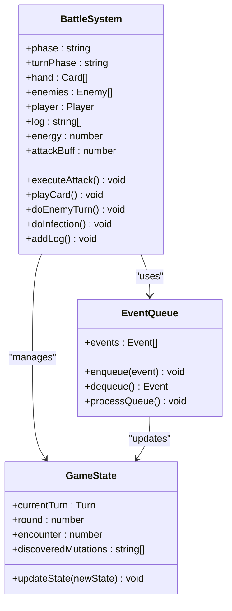

**图表来源**
- [App.jsx:219-2719](file://src/App.jsx#L219-L2719)

### 事件类型定义

系统支持多种事件类型，每种都有特定的处理逻辑：

| 事件类型 | 描述 | 触发条件 | 处理逻辑 |
|---------|------|----------|----------|
| 卡牌出牌事件 | 玩家使用卡牌攻击敌人 | 点击攻击卡牌并选择目标 | 计算伤害、应用状态效果、更新日志 |
| 敌人行动事件 | 敌人回合执行攻击或技能 | 敌人回合开始 | 随机选择攻击或技能，计算伤害 |
| 状态效果事件 | 吸血、冻结、中毒等状态 | 卡牌效果触发 | 应用状态到目标，更新UI |
| 组合技触发事件 | 基因组合产生特殊效果 | 相邻卡牌基因匹配 | 触发组合技效果，更新发现列表 |

**章节来源**
- [App.jsx:169-216](file://src/App.jsx#L169-L216)
- [App.jsx:1031-1293](file://src/App.jsx#L1031-L1293)

## 架构概览

游戏采用事件驱动的架构模式，所有战斗交互都通过事件系统处理：

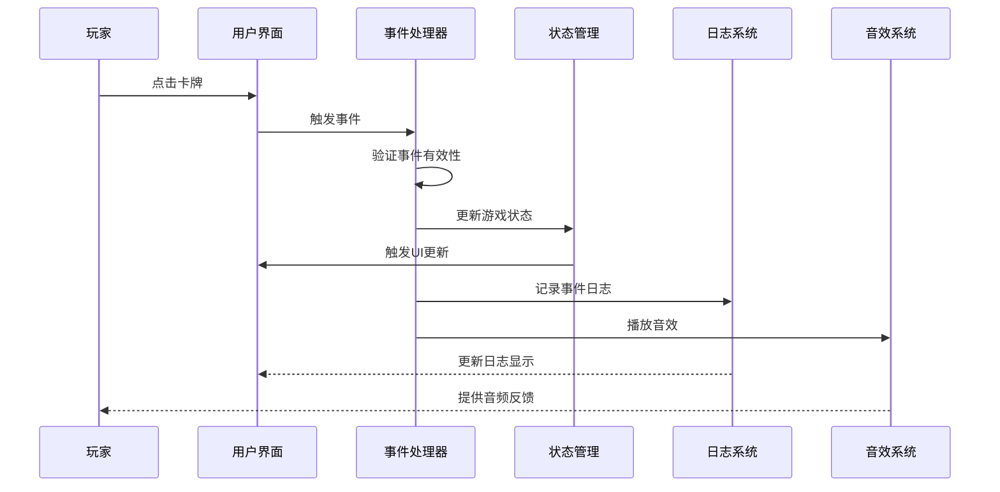

**图表来源**
- [App.jsx:1031-1293](file://src/App.jsx#L1031-L1293)
- [App.jsx:337-339](file://src/App.jsx#L337-L339)

### 事件生命周期

每个战斗事件都遵循统一的生命周期：

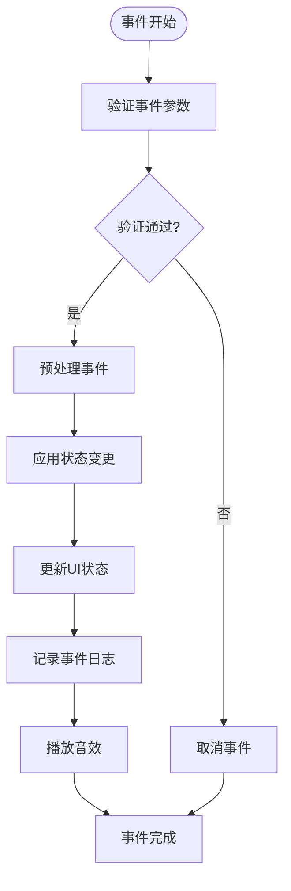

**图表来源**
- [App.jsx:1031-1293](file://src/App.jsx#L1031-L1293)
- [App.jsx:337-339](file://src/App.jsx#L337-L339)

**章节来源**
- [App.jsx:864-988](file://src/App.jsx#L864-L988)

## 详细组件分析

### 卡牌出牌事件处理

卡牌出牌是最复杂的事件类型，涉及多种效果和状态变化：

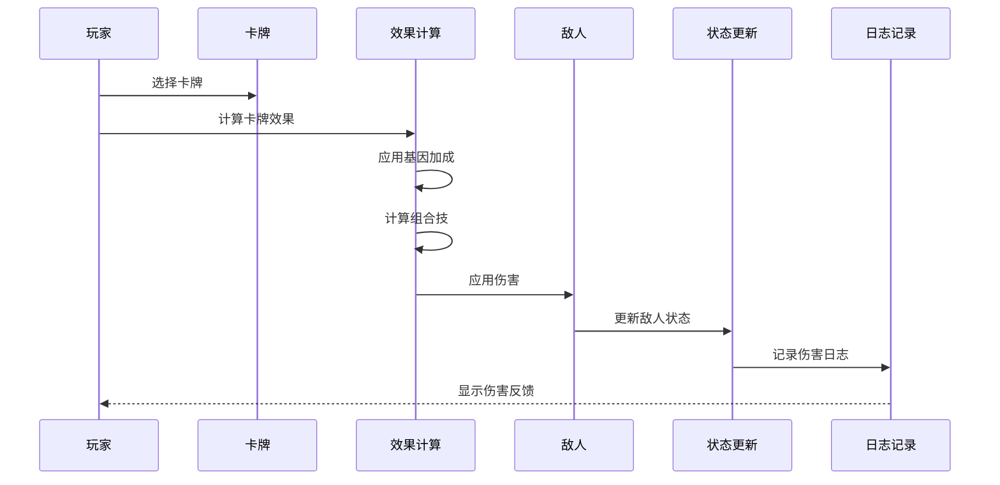

**图表来源**
- [App.jsx:1031-1131](file://src/App.jsx#L1031-L1131)
- [App.jsx:169-216](file://src/App.jsx#L169-L216)

#### 卡牌效果计算

系统通过`calcCardEffect`函数计算卡牌的实际效果，支持多种效果类型：

| 效果类型 | 计算方式 | 示例 |
|---------|----------|------|
| 攻击伤害 | 基础伤害 + 基因加成 | `dmg = (base + buff) * mult` |
| 防御护甲 | 基础护甲 + 基因加成 | `armor = base * mult` |
| 回复生命 | 基础回复 + 基因加成 | `heal = base * mult` |
| 状态效果 | 基因触发的状态 | `effects.push("freeze")` |

**章节来源**
- [App.jsx:169-216](file://src/App.jsx#L169-L216)
- [App.jsx:1031-1293](file://src/App.jsx#L1031-L1293)

### 敌人行动事件处理

敌人回合由`doEnemyTurn`函数统一处理，包含多种AI决策逻辑：

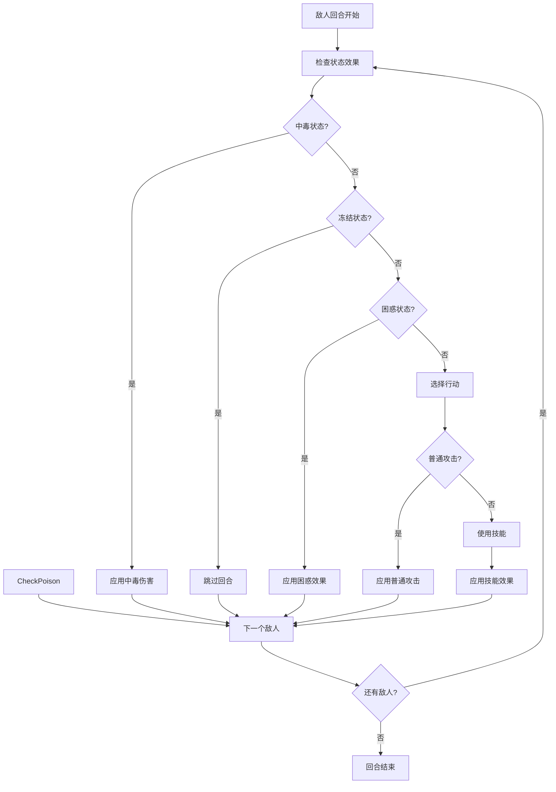

**图表来源**
- [App.jsx:865-988](file://src/App.jsx#L865-L988)

#### Boss技能系统

游戏包含多种Boss技能，每种都有独特的触发条件和效果：

| Boss类型 | 技能名称 | 触发概率 | 效果描述 |
|---------|----------|----------|----------|
| 坏猫咪 | 猫爪三连 | 40% | 连续攻击3次 |
| 凶恶泰迪 | 狂吠震慑 | 35% | 降低玩家攻击力2点 |
| 流浪大橘 | 肥猫压顶 | 40% | 高伤害单体攻击 |
| 城管大叔 | 网兜抓捕 | 30% | 下回合玩家无法出牌 |
| 恶霸犬 | 撕咬 | 40% | 造成伤害并流血2层 |
| 小混混 | 扔石头 | 35% | 远程攻击3点伤害 |
| 捕狗大队队长 | 终极抓捕 | 35% | 超高伤害10点并眩晕 |

**章节来源**
- [App.jsx:92-100](file://src/App.jsx#L92-L100)
- [App.jsx:865-988](file://src/App.jsx#L865-L988)

### 状态效果事件处理

状态效果系统支持多种持续性效果，通过独立的处理逻辑实现：

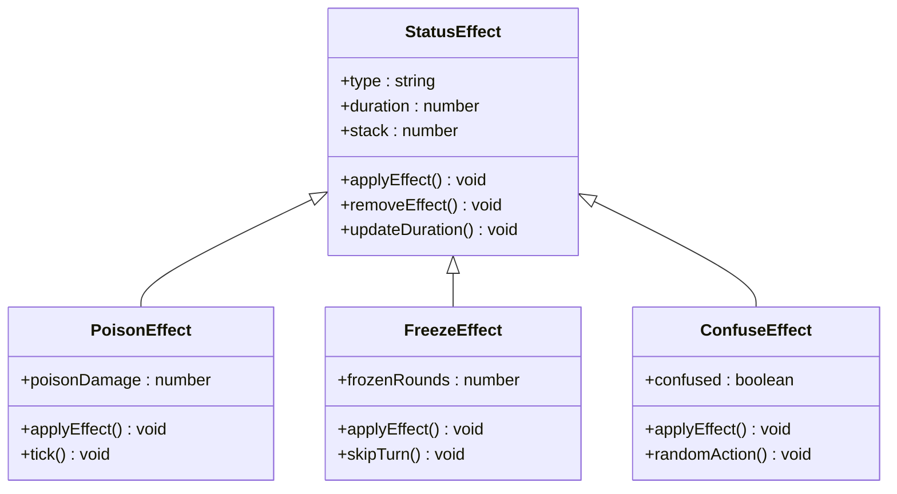

**图表来源**
- [App.jsx:873-889](file://src/App.jsx#L873-L889)
- [App.jsx:1200-1249](file://src/App.jsx#L1200-L1249)

#### 状态效果应用逻辑

状态效果通过以下步骤应用：

1. **状态检查**：检查目标是否已有相同状态
2. **效果计算**：根据状态类型计算效果强度
3. **状态叠加**：处理多层状态的叠加逻辑
4. **UI更新**：更新状态显示和动画效果
5. **日志记录**：记录状态效果的触发和移除

**章节来源**
- [App.jsx:873-889](file://src/App.jsx#L873-L889)
- [App.jsx:1200-1249](file://src/App.jsx#L1200-L1249)

### 组合技触发事件处理

组合技系统是游戏的核心特色，通过相邻卡牌的基因组合产生特殊效果：

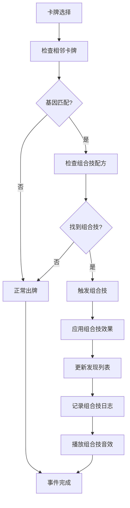

**图表来源**
- [App.jsx:802-862](file://src/App.jsx#L802-L862)
- [App.jsx:1092-1116](file://src/App.jsx#L1092-L1116)

#### 组合技配方系统

系统内置多种组合技配方，通过基因组合触发：

| 基因组合 | 组合技名称 | 效果类型 | 效果值 |
|---------|------------|----------|--------|
| sharp + tough | 铁齿铜牙 | 攻击防御 | 10伤害+5护甲 |
| sharp + fast | 闪电爪 | 冻结 | 15伤害冻结 |
| smell + sharp | 致命一击 | 穿刺 | 20无视护甲伤害 |
| cute + loyal | 治愈之吻 | 治疗 | 回复15HP |
| loud + loyal | 狮吼功 | 全体伤害 | 全体8伤害 |
| snack + smell | 寻味追踪 | 抽牌 | 抽3张牌 |
| fast + smell | 幽灵犬 | 闪避 | 下回合免伤 |
| tough + loyal | 铜墙铁壁 | 护盾 | +15护甲 |
| sharp + loud | 狂吠乱咬 | 随机攻击 | 随机攻击3次 |

**章节来源**
- [App.jsx:21-32](file://src/App.jsx#L21-L32)
- [App.jsx:802-862](file://src/App.jsx#L802-L862)

### 事件优先级和冲突解决

游戏实现了基于回合制的事件处理机制，通过以下原则解决冲突：

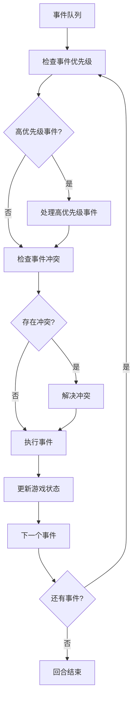

**图表来源**
- [App.jsx:864-988](file://src/App.jsx#L864-L988)
- [App.jsx:1031-1293](file://src/App.jsx#L1031-L1293)

#### 事件冲突解决策略

系统采用以下策略处理事件冲突：

1. **回合制限制**：同一回合内事件按顺序执行
2. **状态优先**：状态效果优先于普通攻击
3. **目标选择**：攻击事件需要明确的目标选择
4. **能量限制**：事件执行需要足够的能量点数
5. **冷却时间**：某些技能有冷却时间限制

**章节来源**
- [App.jsx:1296-1300](file://src/App.jsx#L1296-L1300)
- [App.jsx:1133-1293](file://src/App.jsx#L1133-L1293)

## 依赖关系分析

### 核心依赖关系

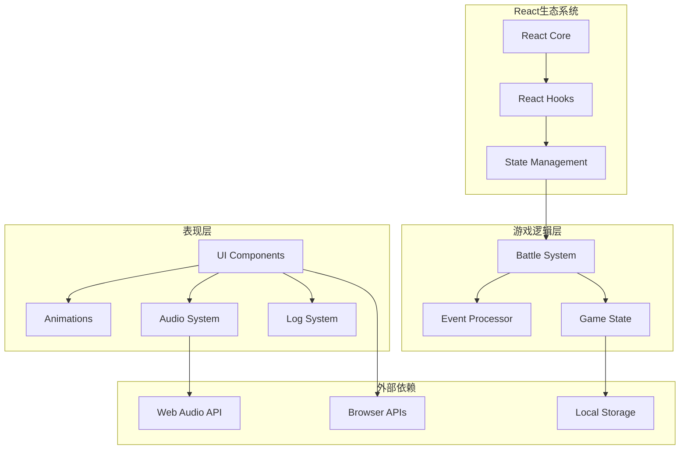

**图表来源**
- [App.jsx:1-100](file://src/App.jsx#L1-L100)
- [App.jsx:219-2719](file://src/App.jsx#L219-L2719)

### 数据流分析

游戏采用单向数据流架构，确保状态的一致性和可预测性：

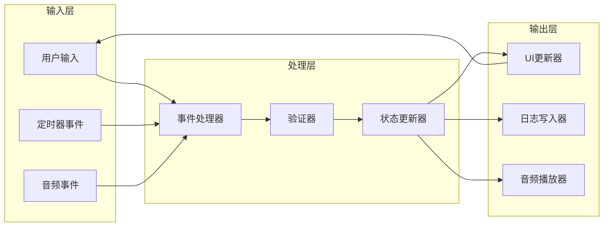

**图表来源**
- [App.jsx:337-339](file://src/App.jsx#L337-L339)
- [App.jsx:354-617](file://src/App.jsx#L354-L617)

**章节来源**
- [App.jsx:1-100](file://src/App.jsx#L1-L100)
- [App.jsx:219-2719](file://src/App.jsx#L219-L2719)

## 性能考虑

### 事件处理优化

游戏在事件处理方面采用了多项优化策略：

1. **状态更新优化**：使用不可变更新模式，避免不必要的重渲染
2. **事件批处理**：将相关事件合并处理，减少状态更新次数
3. **动画节流**：控制动画帧率，确保流畅的游戏体验
4. **内存管理**：及时清理定时器和事件监听器

### 内存使用分析

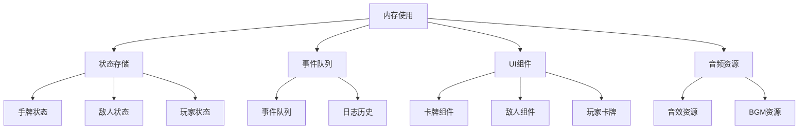

**图表来源**
- [App.jsx:221-255](file://src/App.jsx#L221-L255)
- [App.jsx:337-339](file://src/App.jsx#L337-L339)

## 故障排除指南

### 常见问题诊断

#### 事件未触发问题

**症状**：点击卡牌无反应
**可能原因**：
1. 能量不足（energy <= 0）
2. 非玩家回合（turnPhase !== "player"）
3. 手牌索引错误
4. 事件锁机制阻止

**解决方案**：
1. 检查当前回合状态
2. 验证手牌数组长度
3. 确认事件锁状态
4. 查看控制台错误信息

#### 状态更新异常

**症状**：状态显示与实际不符
**可能原因**：
1. 状态更新顺序错误
2. 异步状态更新冲突
3. 事件处理逻辑错误

**解决方案**：
1. 检查事件处理顺序
2. 确认状态更新原子性
3. 验证事件处理逻辑

#### 性能问题

**症状**：游戏运行缓慢或卡顿
**可能原因**：
1. 频繁的状态更新
2. 大量的DOM操作
3. 音效播放阻塞

**解决方案**：
1. 实施状态更新节流
2. 优化UI渲染
3. 管理音效播放时机

**章节来源**
- [App.jsx:1133-1293](file://src/App.jsx#L1133-L1293)
- [App.jsx:864-988](file://src/App.jsx#L864-L988)

## 结论

《小雪闯上海》的战斗事件处理系统展现了现代React应用中事件驱动架构的最佳实践。系统通过清晰的事件分类、严格的生命周期管理和完善的日志系统，为玩家提供了流畅而富有策略性的战斗体验。

### 系统优势

1. **模块化设计**：事件处理逻辑清晰分离，便于维护和扩展
2. **状态管理**：采用不可变更新模式，确保状态一致性
3. **用户体验**：丰富的视觉和听觉反馈，增强沉浸感
4. **性能优化**：合理的事件批处理和状态更新策略

### 扩展建议

1. **事件系统重构**：考虑引入专门的事件调度器
2. **状态持久化**：添加游戏进度保存功能
3. **网络同步**：支持多人在线对战
4. **AI增强**：改进敌人AI决策逻辑

该系统为类似卡牌游戏的开发提供了优秀的参考模板，其事件驱动的设计理念和React生态系统的结合，为构建复杂的游戏逻辑奠定了坚实基础。