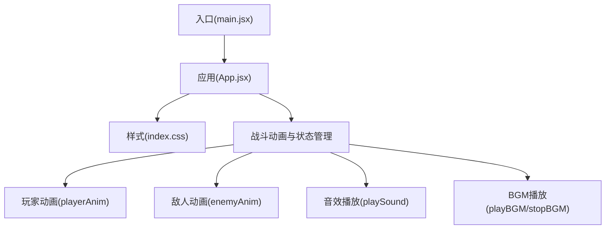
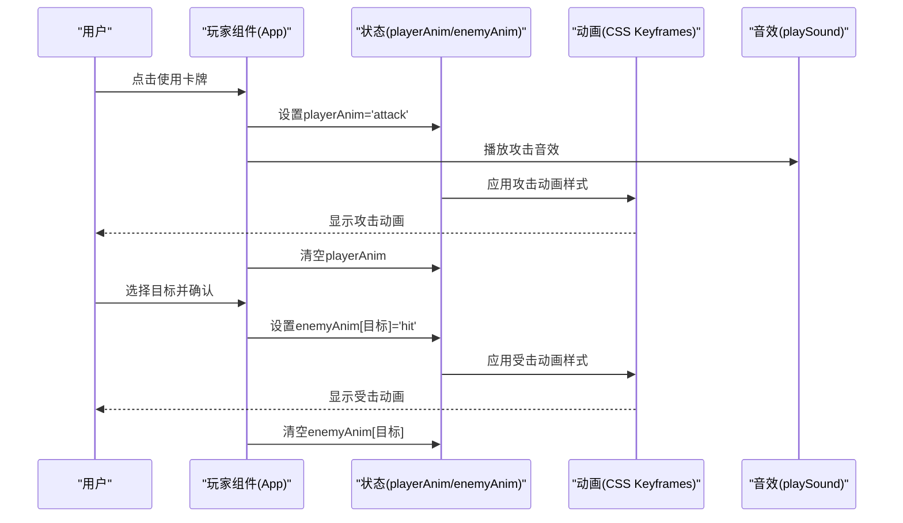
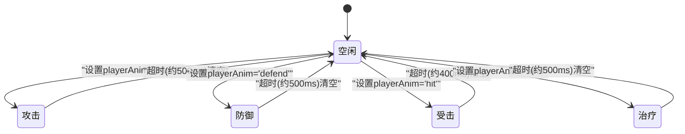
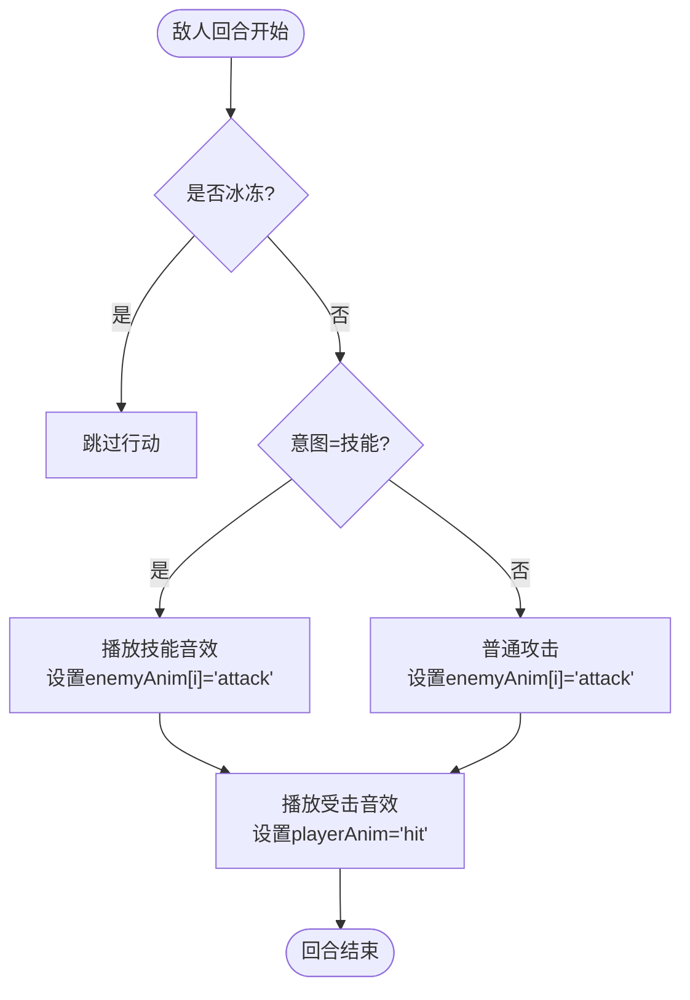
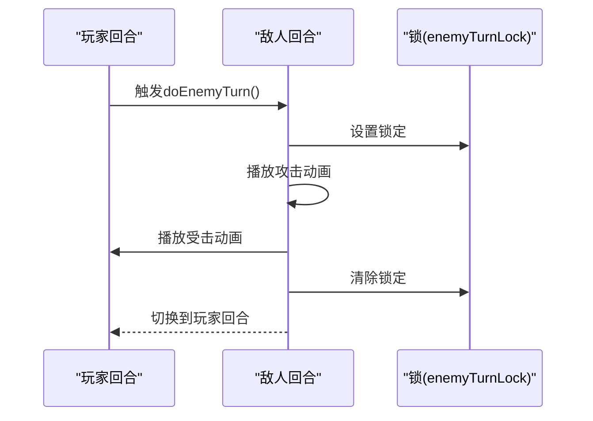
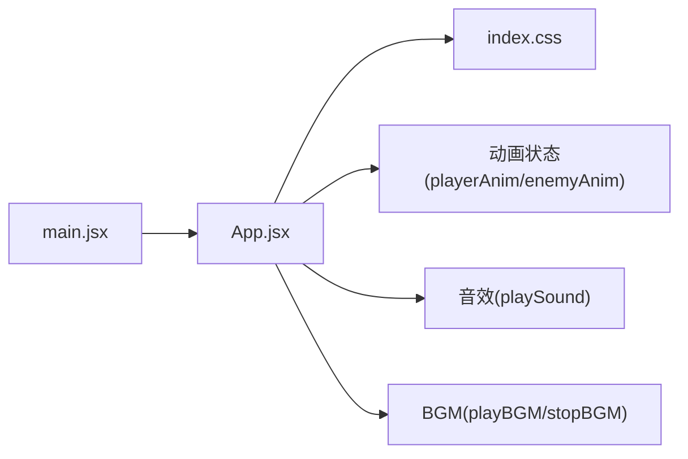

# 动画系统

<cite>
**本文档引用的文件**
- [App.jsx](file://src/App.jsx)
- [main.jsx](file://src/main.jsx)
- [index.css](file://src/index.css)
</cite>

## 目录
1. [简介](#简介)
2. [项目结构](#项目结构)
3. [核心组件](#核心组件)
4. [架构概览](#架构概览)
5. [详细组件分析](#详细组件分析)
6. [依赖关系分析](#依赖关系分析)
7. [性能考量](#性能考量)
8. [故障排除指南](#故障排除指南)
9. [结论](#结论)

## 简介
本文件针对《小雪闯上海》的战斗动画系统进行全面技术文档化，重点覆盖以下方面：
- 玩家动画状态管理：攻击、防御、受击、治疗等状态的触发条件与持续时间
- 敌人动画控制：攻击动画、受击动画、特殊技能动画的实现机制
- 动画状态同步：玩家动画与敌人动画的协调、动画队列管理、冲突解决策略
- 动画性能优化：动画状态缓存、DOM 操作优化、GPU 加速利用
- 动画状态转换图与代码示例路径，便于开发者理解与扩展

## 项目结构
该动画系统位于前端 React 应用中，核心逻辑集中在主组件文件内，配合全局样式与入口文件运行。整体结构如下：

图表来源
- [main.jsx:1-8](file://src/main.jsx#L1-L8)
- [App.jsx:219-2719](file://src/App.jsx#L219-L2719)
- [index.css:1-9](file://src/index.css#L1-L9)

章节来源
- [main.jsx:1-8](file://src/main.jsx#L1-L8)
- [App.jsx:219-2719](file://src/App.jsx#L219-L2719)
- [index.css:1-9](file://src/index.css#L1-L9)

## 核心组件
本系统围绕以下核心组件展开：
- 玩家动画状态管理：通过 playerAnim 状态驱动小雪的攻击、防御、受击、治疗动画
- 敌人动画状态管理：通过 enemyAnim 状态映射到每个敌人的攻击与受击动画
- 卡牌与战斗执行：playCard 与 executeAttack 控制动画触发与效果结算
- 音效与 BGM：playSound 与 playBGM/stopBGM 提供听觉反馈与氛围营造
- 动画队列与冲突处理：通过 setTimeout 与状态切换实现动画时序与互斥

章节来源
- [App.jsx:236-244](file://src/App.jsx#L236-L244)
- [App.jsx:1030-1131](file://src/App.jsx#L1030-L1131)
- [App.jsx:1133-1293](file://src/App.jsx#L1133-L1293)
- [App.jsx:864-988](file://src/App.jsx#L864-L988)
- [App.jsx:341-617](file://src/App.jsx#L341-L617)
- [App.jsx:619-720](file://src/App.jsx#L619-L720)

## 架构概览
战斗动画系统采用“状态驱动 + 时间轴”的架构：
- 状态驱动：playerAnim 与 enemyAnim 作为动画状态源，驱动 DOM 样式与 CSS Keyframes
- 时间轴：setTimeout 用于控制动画持续时间与顺序，避免并发冲突
- 音效联动：动画触发时播放对应音效，增强沉浸感
- BGM 切换：场景切换时自动播放/停止 BGM

图表来源
- [App.jsx:1030-1131](file://src/App.jsx#L1030-L1131)
- [App.jsx:1058-1062](file://src/App.jsx#L1058-L1062)
- [App.jsx:1036-1043](file://src/App.jsx#L1036-L1043)
- [App.jsx:2568-2571](file://src/App.jsx#L2568-L2571)

## 详细组件分析

### 玩家动画状态管理
- 攻击动画：executeAttack 中设置 playerAnim='attack'，持续约 500ms，期间显示爪印/攻击特效
- 防御动画：playCard 中对防御类卡牌设置 playerAnim='defend'，持续约 500ms，显示护盾脉冲特效
- 受击动画：doEnemyTurn 中对玩家设置 playerAnim='hit'，持续约 400ms，显示受击色调变化
- 治疗动画：playCard 中对回血类卡牌设置 playerAnim='heal'，持续约 500ms，显示爱心上升特效

图表来源
- [App.jsx:1036-1043](file://src/App.jsx#L1036-L1043)
- [App.jsx:1171-1177](file://src/App.jsx#L1171-L1177)
- [App.jsx:959-963](file://src/App.jsx#L959-L963)
- [App.jsx:1174-1176](file://src/App.jsx#L1174-L1176)
- [App.jsx:1829-1842](file://src/App.jsx#L1829-L1842)

章节来源
- [App.jsx:1030-1131](file://src/App.jsx#L1030-L1131)
- [App.jsx:1133-1293](file://src/App.jsx#L1133-L1293)
- [App.jsx:1829-1842](file://src/App.jsx#L1829-L1842)

### 敌人动画控制
- 攻击动画：doEnemyTurn 中为每个可行动敌人设置 enemyAnim[i]='attack'，持续约 400ms，显示剑气特效
- 受击动画：executeAttack 中为被攻击敌人设置 enemyAnim[目标]='hit'，持续约 300ms
- 特殊技能动画：根据 Boss 技能类型播放不同音效与视觉反馈（如扫频音效、弹射效果）

图表来源
- [App.jsx:864-988](file://src/App.jsx#L864-L988)
- [App.jsx:938-963](file://src/App.jsx#L938-L963)
- [App.jsx:1058-1062](file://src/App.jsx#L1058-L1062)

章节来源
- [App.jsx:864-988](file://src/App.jsx#L864-L988)
- [App.jsx:1646-1826](file://src/App.jsx#L1646-L1826)

### 动画状态同步与队列管理
- 同步策略：通过 turnPhase 控制阶段，避免玩家动画与敌人动画交叉
- 队列管理：使用 setTimeout 串行化动画时序，确保同一时刻只有一个动画处于活跃状态
- 冲突解决：在 doEnemyTurn 中锁定 enemyTurnLock，防止并发触发；在 executeAttack 中清空目标选择状态

图表来源
- [App.jsx:990-999](file://src/App.jsx#L990-L999)
- [App.jsx:1295-1300](file://src/App.jsx#L1295-L1300)

章节来源
- [App.jsx:990-999](file://src/App.jsx#L990-L999)
- [App.jsx:1295-1300](file://src/App.jsx#L1295-L1300)

### 动画性能优化
- GPU 加速：使用 transform 与 opacity 实现动画，避免触发布局重排
- 状态缓存：通过 useRef 缓存 hand 与 draggingIdx，减少闭包读取开销
- DOM 操作优化：使用 CSS Keyframes 替代频繁的 JS 样式修改；滚动容器启用硬件加速
- 动画节流：通过 setTimeout 控制动画频率，避免高频状态切换导致的重绘抖动

章节来源
- [App.jsx:2577-2676](file://src/App.jsx#L2577-L2676)
- [App.jsx:2256-2261](file://src/App.jsx#L2256-L2261)

## 依赖关系分析
动画系统依赖关系如下：
- App.jsx 为核心控制器，依赖自身状态与回调函数
- main.jsx 负责挂载根组件
- index.css 提供全局基础样式

图表来源
- [main.jsx:1-8](file://src/main.jsx#L1-L8)
- [App.jsx:219-2719](file://src/App.jsx#L219-L2719)
- [index.css:1-9](file://src/index.css#L1-L9)

章节来源
- [main.jsx:1-8](file://src/main.jsx#L1-L8)
- [App.jsx:219-2719](file://src/App.jsx#L219-L2719)
- [index.css:1-9](file://src/index.css#L1-L9)

## 性能考量
- 使用 transform/opacity 实现动画，避免布局与绘制阻塞
- 通过 useRef 缓存关键状态，减少闭包与重渲染
- CSS Keyframes 与 will-change 提升动画流畅度
- 滚动容器开启硬件加速，保证手牌区域滑动顺滑

## 故障排除指南
- 动画不触发：检查 playerAnim/enemyAnim 是否被正确设置与清空
- 动画卡顿：确认未在动画期间进行大量 DOM 查询或样式计算
- 音效异常：检查 AudioContext 状态与 playSound 的调用时机
- BGM 不切换：确认 playBGM/stopBGM 在场景切换时被正确调用

章节来源
- [App.jsx:341-617](file://src/App.jsx#L341-L617)
- [App.jsx:619-720](file://src/App.jsx#L619-L720)

## 结论
《小雪闯上海》的动画系统以状态驱动为核心，结合 CSS Keyframes 与 Web Audio API，实现了流畅且富有表现力的战斗动画。通过严格的时序控制与性能优化策略，系统在保证视觉效果的同时兼顾了运行效率。开发者可基于现有状态机与动画队列模型，进一步扩展新的动画类型与交互细节。