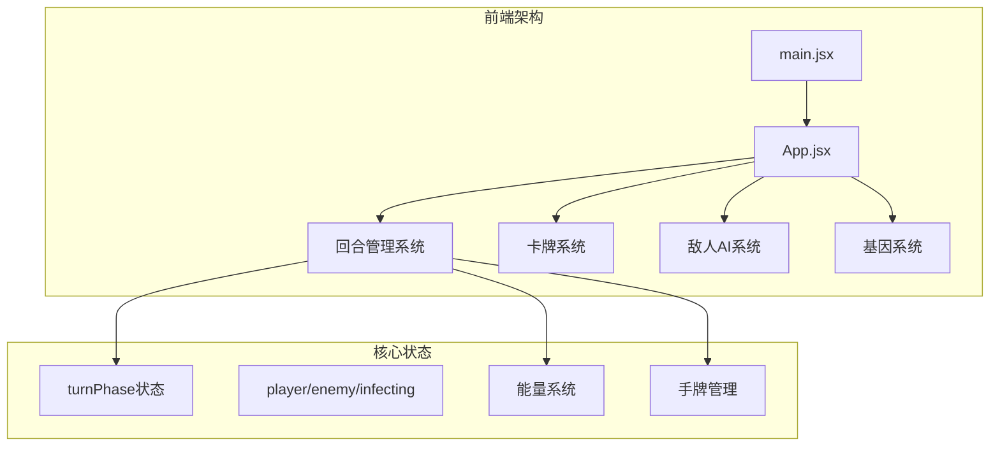
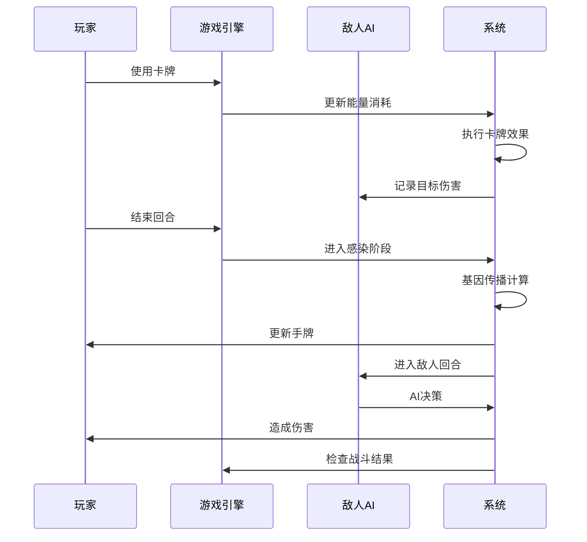
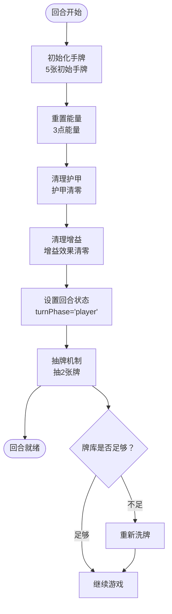
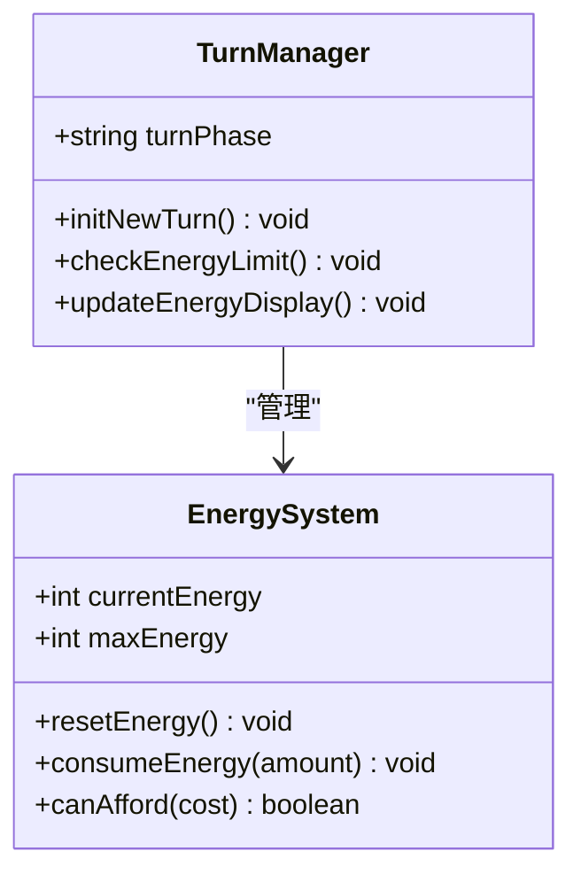
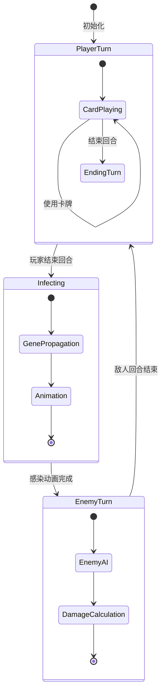
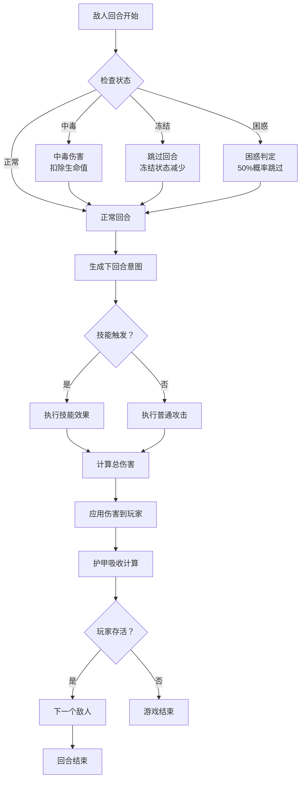
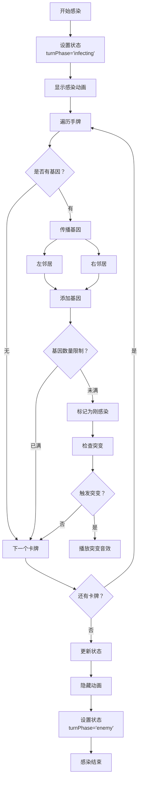
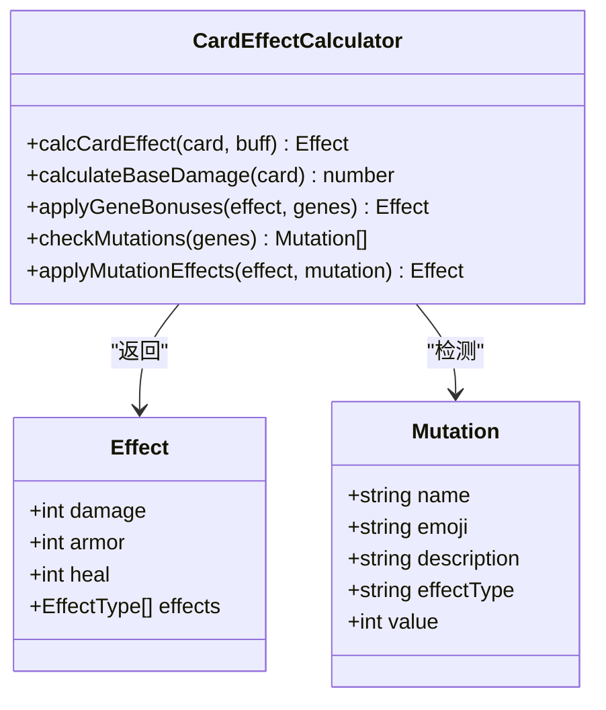
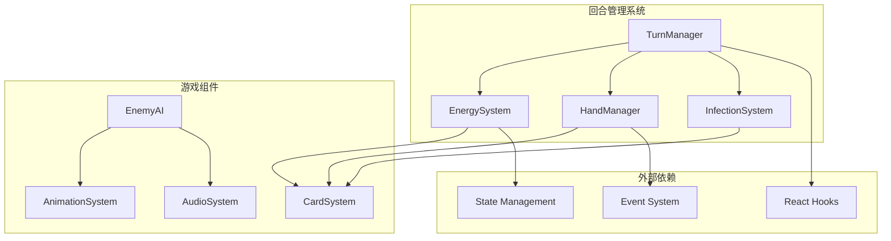

# 回合管理

<cite>
**本文引用的文件**
- [App.jsx](file://src/App.jsx)
- [main.jsx](file://src/main.jsx)
- [游戏设计文档.md](file://游戏设计文档.md)
</cite>

## 目录
1. [简介](#简介)
2. [项目结构](#项目结构)
3. [核心组件](#核心组件)
4. [架构概览](#架构概览)
5. [详细组件分析](#详细组件分析)
6. [依赖关系分析](#依赖关系分析)
7. [性能考量](#性能考量)
8. [故障排除指南](#故障排除指南)
9. [结论](#结论)

## 简介

《小雪闯上海》是一款以雪纳瑞犬"小雪"为主角的卡牌Roguelike游戏。本文档深入解析回合制战斗的核心机制，包括玩家回合和敌人回合的切换逻辑，turnPhase状态管理，回合初始化过程，以及回合结束条件的完整实现。

游戏采用经典的回合制战斗系统，玩家每回合拥有固定的能量点数，通过使用卡牌进行攻击、防御或回血，然后进入敌人回合。战斗系统的核心在于基因系统和传染机制，为传统卡牌战斗增添了Build构筑的乐趣。

## 项目结构

项目采用React + Vite的技术栈，核心逻辑集中在单一的App.jsx文件中，实现了完整的回合管理系统：

**图表来源**
- [main.jsx:1-8](file://src/main.jsx#L1-L8)
- [App.jsx:219-2719](file://src/App.jsx#L219-L2719)

**章节来源**
- [main.jsx:1-8](file://src/main.jsx#L1-L8)
- [App.jsx:1-800](file://src/App.jsx#L1-L800)

## 核心组件

### 回合状态管理

游戏的核心状态管理围绕turnPhase展开，包含三种主要状态：

- **player**: 玩家回合，允许玩家使用卡牌
- **enemy**: 敌人回合，敌人执行AI逻辑
- **infecting**: 感染阶段，进行基因传播

### 能量系统

每回合玩家获得固定数量的能量点数，用于支付卡牌使用成本：

- 基础能量：3点/回合
- 卡牌消耗：每张卡牌消耗1点能量
- 能量上限：3点

### 手牌管理

- 初始手牌：5张
- 手牌上限：10张
- 抽牌机制：回合结束时抽2张牌

**章节来源**
- [App.jsx:220-250](file://src/App.jsx#L220-L250)
- [App.jsx:748-785](file://src/App.jsx#L748-L785)

## 架构概览

回合管理系统采用事件驱动的设计模式，通过状态变更触发相应的处理逻辑：

**图表来源**
- [App.jsx:1295-1300](file://src/App.jsx#L1295-L1300)
- [App.jsx:864-988](file://src/App.jsx#L864-L988)
- [App.jsx:787-862](file://src/App.jsx#L787-L862)

## 详细组件分析

### 回合初始化流程

回合初始化是整个回合管理系统的基础，负责设置新回合的各种参数：

**图表来源**
- [App.jsx:722-746](file://src/App.jsx#L722-L746)
- [App.jsx:980-987](file://src/App.jsx#L980-L987)

#### 能量重置机制

每回合开始时，系统会自动重置玩家的能量值：

**图表来源**
- [App.jsx:233-234](file://src/App.jsx#L233-L234)
- [App.jsx:982](file://src/App.jsx#L982)

#### 手牌上限检查

系统实现了智能的手牌上限管理，防止手牌溢出：

**章节来源**
- [App.jsx:750-785](file://src/App.jsx#L750-L785)
- [App.jsx:748](file://src/App.jsx#L748)

### 回合切换逻辑

回合切换是系统的核心功能，涉及多个状态的协调：

**图表来源**
- [App.jsx:1295-1300](file://src/App.jsx#L1295-L1300)
- [App.jsx:864-988](file://src/App.jsx#L864-L988)
- [App.jsx:787-862](file://src/App.jsx#L787-L862)

#### 玩家回合处理

玩家回合允许玩家执行以下操作：

1. **卡牌使用**：消耗能量使用攻击、防御或回血卡牌
2. **目标选择**：对于攻击类卡牌，需要选择攻击目标
3. **效果执行**：根据卡牌类型执行相应效果

**章节来源**
- [App.jsx:1030-1131](file://src/App.jsx#L1030-L1131)
- [App.jsx:1133-1293](file://src/App.jsx#L1133-L1293)

#### 敌人回合处理

敌人回合包含复杂的AI逻辑和伤害计算：

**图表来源**
- [App.jsx:864-988](file://src/App.jsx#L864-L988)

**章节来源**
- [App.jsx:864-988](file://src/App.jsx#L864-L988)

### 感染阶段机制

感染阶段是《小雪闯上海》的独特机制，实现了基因的传播和组合：

**图表来源**
- [App.jsx:787-862](file://src/App.jsx#L787-L862)

#### 基因传播算法

感染系统实现了智能的基因传播机制：

**章节来源**
- [App.jsx:787-862](file://src/App.jsx#L787-L862)

### 卡牌效果计算系统

系统实现了复杂的卡牌效果计算，支持基因加成和突变组合：

**图表来源**
- [App.jsx:169-216](file://src/App.jsx#L169-L216)

**章节来源**
- [App.jsx:169-216](file://src/App.jsx#L169-L216)

## 依赖关系分析

回合管理系统与其他游戏组件存在紧密的依赖关系：

**图表来源**
- [App.jsx:1-800](file://src/App.jsx#L1-L800)
- [App.jsx:219-2719](file://src/App.jsx#L219-L2719)

### 状态耦合分析

回合管理系统与游戏其他组件的状态耦合程度较高，主要体现在：

- **能量系统**：与卡牌使用直接相关
- **手牌管理**：影响玩家可执行的操作
- **敌人状态**：影响敌人回合的AI决策
- **基因系统**：影响卡牌效果和突变触发

**章节来源**
- [App.jsx:219-2719](file://src/App.jsx#L219-L2719)

## 性能考量

### 内存管理

系统采用了高效的内存管理模式：

- **状态引用**：使用useRef存储手牌状态，避免不必要的重渲染
- **动画状态**：使用Set数据结构管理动画状态，支持快速查找
- **事件锁**：使用useRef防止敌人回合的重复触发

### 渲染优化

- **虚拟滚动**：手牌容器使用虚拟滚动，支持大量卡牌的高效渲染
- **CSS动画**：使用GPU加速的CSS动画，减少JavaScript计算开销
- **条件渲染**：根据状态动态渲染不同的UI元素

## 故障排除指南

### 常见问题及解决方案

#### 回合状态异常

**问题描述**：玩家无法进入敌人回合或状态卡死

**解决方案**：
1. 检查turnPhase状态是否正确设置
2. 确认enemyTurnLock是否被正确清除
3. 验证回调函数的执行顺序

#### 能量系统错误

**问题描述**：能量显示不正确或卡牌无法使用

**解决方案**：
1. 检查能量重置逻辑
2. 验证卡牌使用后的能量扣除
3. 确认能量上限检查

#### 感染机制失效

**问题描述**：基因无法传播或突变不触发

**解决方案**：
1. 检查基因数组的边界条件
2. 验证突变检测算法
3. 确认状态更新的时机

**章节来源**
- [App.jsx:990-999](file://src/App.jsx#L990-L999)
- [App.jsx:1001-1028](file://src/App.jsx#L1001-L1028)

## 结论

《小雪闯上海》的回合管理系统展现了优秀的架构设计和实现细节。系统通过清晰的状态分离、完善的事件驱动机制和智能的AI逻辑，为玩家提供了流畅的回合制战斗体验。

### 设计亮点

1. **状态管理清晰**：通过turnPhase明确区分不同阶段
2. **机制创新**：独特的基因传播和突变系统
3. **用户体验**：流畅的动画和音效配合
4. **扩展性好**：模块化的组件设计便于功能扩展

### 技术优势

- 采用React Hooks实现状态管理
- 使用函数式编程思想处理游戏逻辑
- 实现了完整的事件驱动架构
- 提供了良好的性能优化策略

该回合管理系统为类似卡牌游戏的开发提供了优秀的参考模板，其设计理念和实现技巧值得深入学习和借鉴。