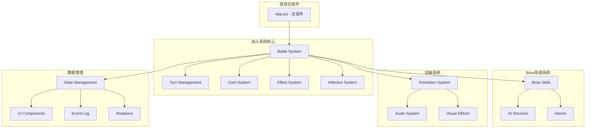
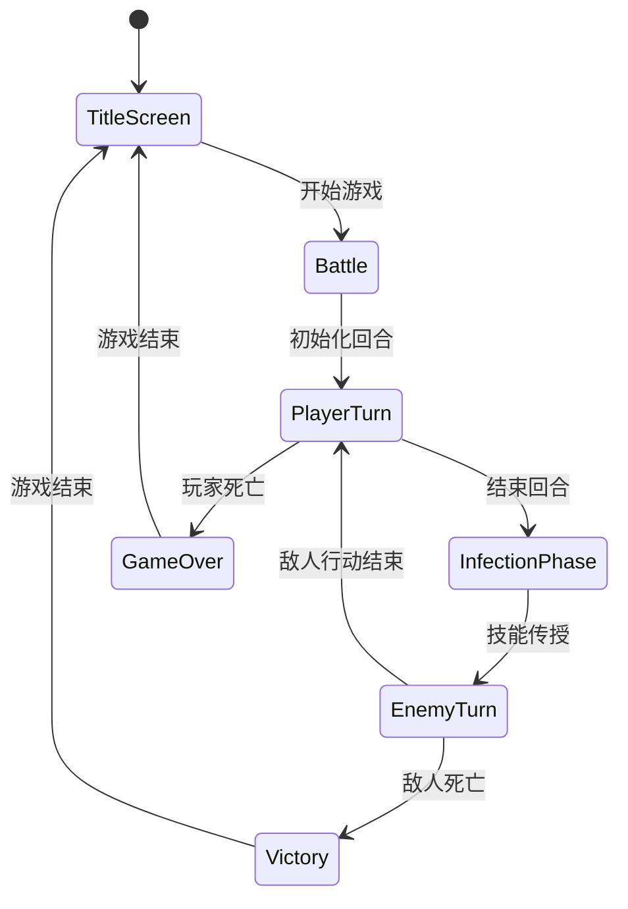
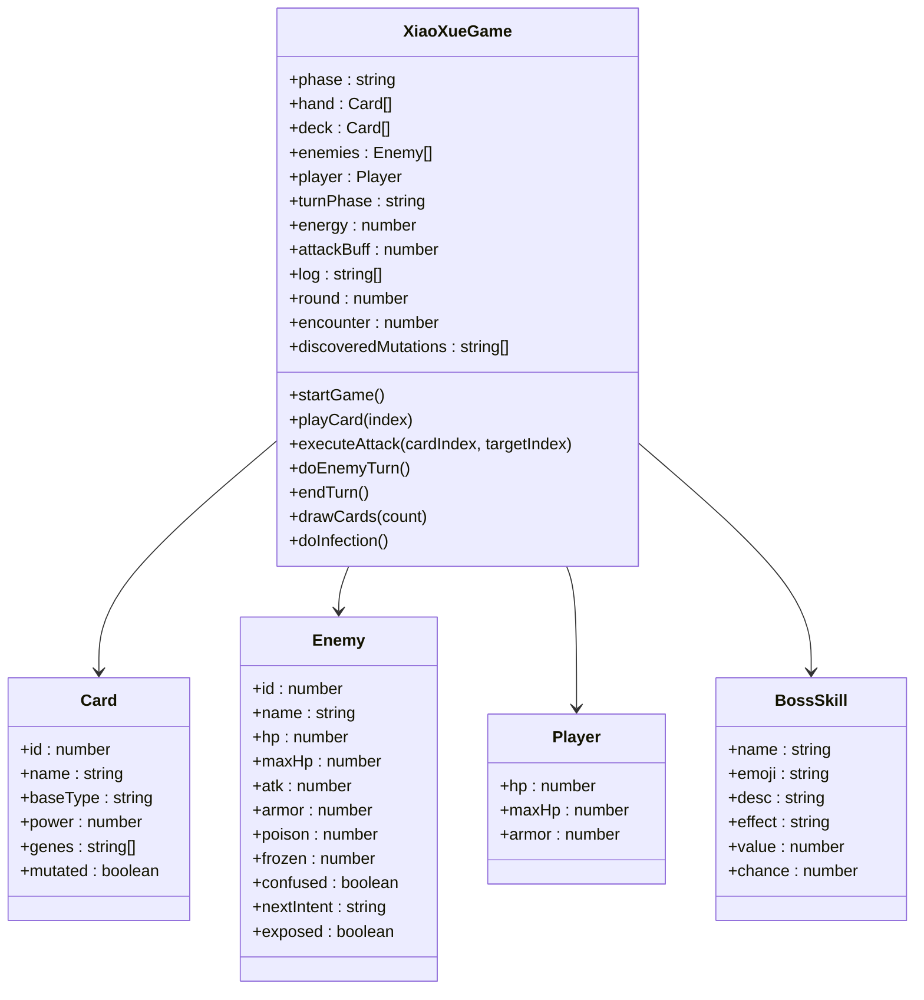
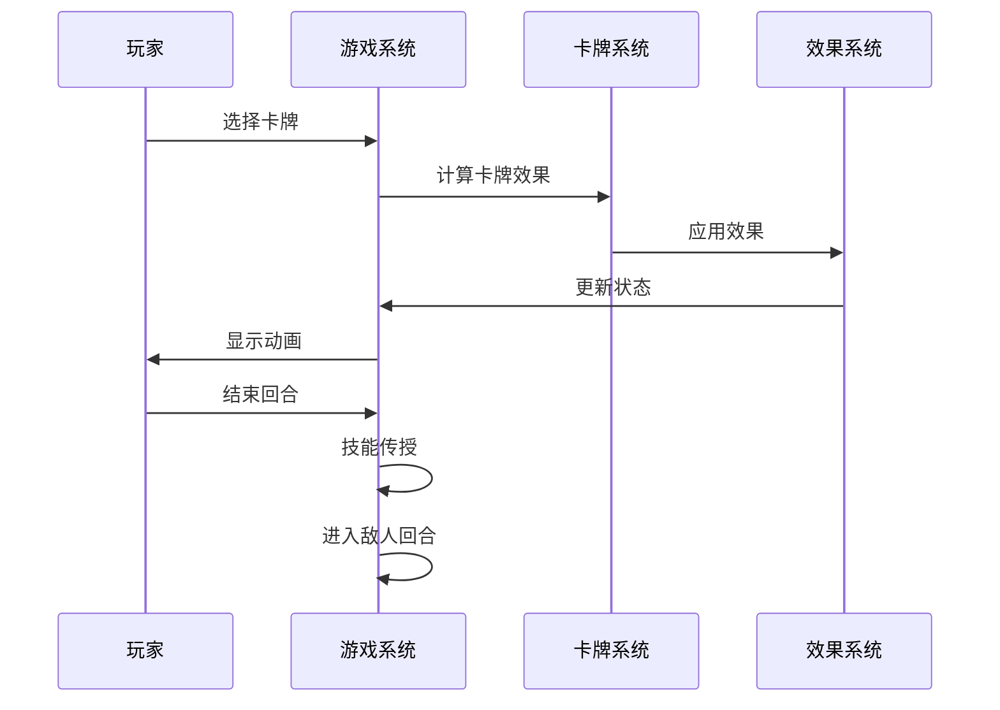
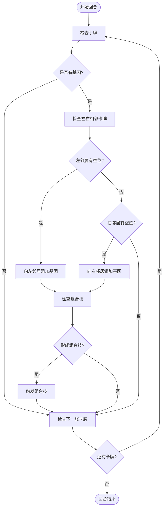
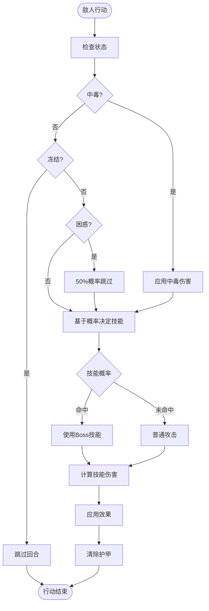
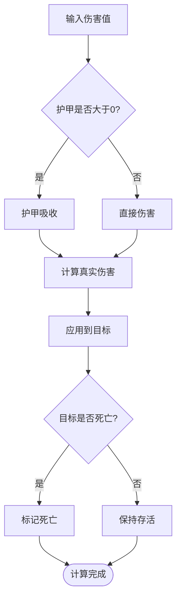
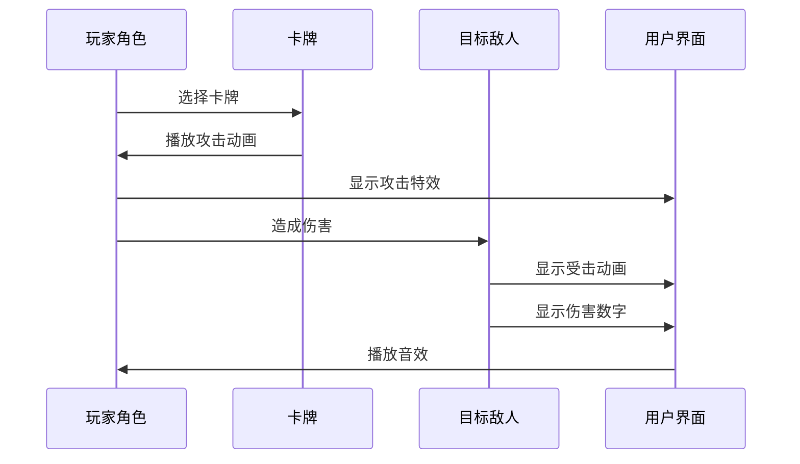
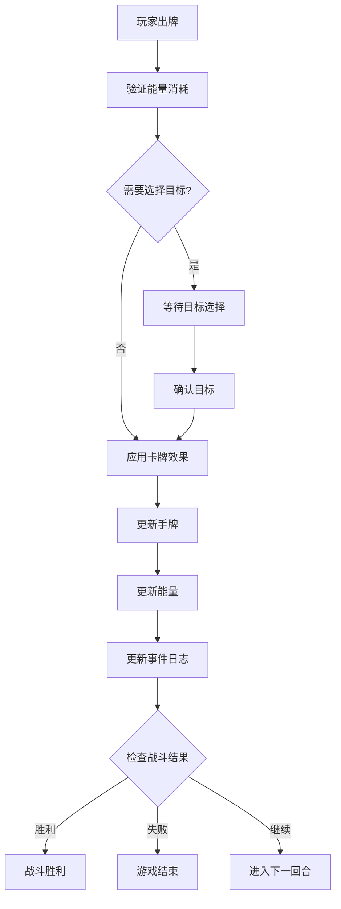
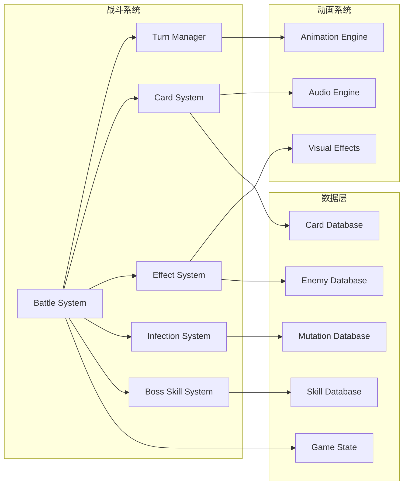

# 战斗系统

<cite>
**本文档引用的文件**
- [App.jsx](file://src/App.jsx)
</cite>

## 更新摘要
**变更内容**
- 新增完整的回合制战斗机制详解
- 添加Boss技能系统和AI决策算法分析
- 更新基因系统和组合技触发机制
- 完善动画系统和音效设计说明
- 增强战斗计算逻辑和状态管理分析

## 目录
1. [简介](#简介)
2. [项目结构](#项目结构)
3. [核心组件](#核心组件)
4. [架构概览](#架构概览)
5. [详细组件分析](#详细组件分析)
6. [依赖关系分析](#依赖关系分析)
7. [性能考虑](#性能考虑)
8. [故障排除指南](#故障排除指南)
9. [结论](#结论)

## 简介

《小雪闯上海》是一款基于React的回合制卡牌战斗游戏。玩家扮演雪纳瑞小雪，在上海街头与各种坏人和坏狗狗进行战斗。游戏采用完整的回合制战斗系统，结合卡牌策略、基因突变和Boss技能机制，为玩家提供丰富的战术选择和沉浸式的视觉体验。

本游戏的核心特色包括：
- **完整的回合制战斗系统**：严格的玩家回合、传染阶段、敌人回合切换机制
- **Boss技能系统**：每个敌人都有独特的技能和行为模式，包含概率驱动的AI决策
- **基因突变系统**：卡牌间的技能传染和组合技触发，创造多样化的战术组合
- **丰富的动画效果**：攻击、受击、技能释放的多层次视觉反馈
- **沉浸式音效系统**：8bit风格的音效设计和BGM系统

## 项目结构

游戏采用单一组件架构，所有战斗逻辑都集中在App.jsx文件中。这种设计使得战斗系统的各个部分能够紧密协作，便于维护和扩展。

**图表来源**
- [App.jsx:219-2710](file://src/App.jsx#L219-L2710)

**章节来源**
- [App.jsx:1-50](file://src/App.jsx#L1-L50)

## 核心组件

### 战斗状态管理系统

游戏使用React的useState钩子管理所有战斗状态，包括玩家属性、敌人状态、手牌状态等。系统采用分层状态管理，确保状态变更的原子性和一致性。

**图表来源**
- [App.jsx:220-238](file://src/App.jsx#L220-L238)

### 玩家属性系统

玩家拥有以下核心属性：
- **生命值 (HP)**：当前生命值和最大生命值，支持治疗和伤害计算
- **护甲 (Armor)**：减少受到的伤害，采用优先吸收机制
- **能量 (Energy)**：每回合可用的行动点数，限制卡牌使用
- **攻击增益 (Attack Buff)**：临时增加的攻击力，通过特定卡牌获得
- **状态效果**：中毒、冻结、困惑等临时状态

**章节来源**
- [App.jsx:227-240](file://src/App.jsx#L227-L240)

## 架构概览

游戏采用函数式组件和自定义Hook的设计模式，将复杂的战斗逻辑封装在可复用的函数中。整体架构体现了现代React开发的最佳实践。

**图表来源**
- [App.jsx:219-2710](file://src/App.jsx#L219-L2710)

## 详细组件分析

### 完整回合制战斗流程

#### 玩家回合机制

玩家回合是战斗的核心阶段，包含以下完整流程：

1. **卡牌出牌阶段**：玩家可以使用手牌中的卡牌，消耗相应能量
2. **目标选择**：对于攻击类卡牌，需要选择目标敌人
3. **效果应用**：根据卡牌类型应用相应的战斗效果
4. **回合结束**：进入技能传授阶段

**图表来源**
- [App.jsx:1031-1131](file://src/App.jsx#L1031-L1131)
- [App.jsx:1296-1300](file://src/App.jsx#L1296-L1300)

#### 技能传授阶段

技能传授是游戏的独特机制，通过以下流程实现：

**图表来源**
- [App.jsx:788-862](file://src/App.jsx#L788-L862)

#### 敌人回合机制

敌人回合包含复杂的AI决策和状态管理：

1. **状态检查**：处理中毒、冻结、困惑等状态
2. **技能决策**：根据概率决定使用普通攻击或Boss技能
3. **伤害计算**：计算总伤害并应用到玩家
4. **回合结束**：清理状态并准备下一回合

**章节来源**
- [App.jsx:865-988](file://src/App.jsx#L865-L988)

### Boss技能系统

#### Boss技能定义

游戏包含多种Boss技能，每种技能都有独特的效果和概率：

| Boss类型 | 技能名称 | 效果类型 | 值 | 概率 | 描述 |
|----------|----------|----------|----|------|------|
| 坏猫咪 | 猫爪三连 | multi | 3次攻击 | 0.4 | 连续攻击3次 |
| 凶恶泰迪 | 狂吠震慑 | weaken | -2攻击力 | 0.35 | 降低小雪攻击 |
| 流浪大橘 | 肥猫压顶 | heavy | 6伤害 | 0.4 | 高伤害单体攻击 |
| 城管大叔 | 网兜抓捕 | stun | 1回合禁用 | 0.3 | 下回合无法出牌 |
| 恶霸犬 | 撕咬 | bleed | 2层流血 | 0.4 | 造成伤害并流血 |
| 小混混 | 扔石头 | ranged | 3伤害 | 0.35 | 远程攻击 |
| 捕狗大队队长 | 终极抓捕 | ultimate | 10伤害 | 0.35 | 超高伤害+眩晕 |

#### AI决策算法

Boss的AI决策基于概率驱动的模型：

**图表来源**
- [App.jsx:891-928](file://src/App.jsx#L891-L928)

**章节来源**
- [App.jsx:91-100](file://src/App.jsx#L91-L100)
- [App.jsx:102-116](file://src/App.jsx#L102-L116)

### 卡牌系统

#### 卡牌类型和效果

游戏包含五种基础卡牌类型，每种类型都有独特的战斗效果：

| 类型 | 作用 | 示例 | 基础伤害/护甲/回复 |
|------|------|------|-------------------|
| 攻击牌 | 造成伤害 | 爪击、扑咬、死亡翻滚 | 3-6 |
| 防御牌 | 获得护甲 | 抱头、匍匐、躲沙发 | 3-7 |
| 回血牌 | 恢复生命值 | 狗粮、牛皮饼干 | 4-7 |
| 增益牌 | 提供临时增益 | 磨牙棒、蓄势 | +2攻击力 |
| 技能牌 | 特殊效果 | 汪汪大叫、摇尾巴、嗅探 | 技能效果 |

#### 基因系统

每张卡牌可以携带0-3个基因，基因通过相邻卡牌间的"技能传染"机制传播。基因系统包含以下特性：

- **基因类型**：利齿、硬毛、疾跑、嗅探、卖萌、吠叫、零食、忠诚
- **效果倍增**：忠诚基因使效果翻倍
- **组合技**：特定基因组合形成强大的组合技

**章节来源**
- [App.jsx:40-59](file://src/App.jsx#L40-L59)
- [App.jsx:8-37](file://src/App.jsx#L8-L37)

### 战斗计算逻辑

#### 伤害计算流程

伤害计算遵循严格的优先级顺序：

#### 护甲吸收机制

护甲系统采用"优先吸收"原则：
- 护甲值优先抵消伤害
- 当护甲不足以完全吸收时，剩余伤害按比例分配
- 护甲值在伤害结算后按实际吸收量减少

**章节来源**
- [App.jsx:965-974](file://src/App.jsx#L965-L974)

### 动画系统

#### 攻击动画

攻击动画分为多个层次，提供丰富的视觉反馈：

#### 受击动画

受击动画系统包含多种效果：
- **伤害受击**：角色轻微震动
- **护甲保护**：护盾特效
- **治疗效果**：绿色光效
- **特殊状态**：中毒、冻结等状态特效

**章节来源**
- [App.jsx:1878-1903](file://src/App.jsx#L1878-L1903)

### 音效系统

游戏包含丰富的音效设计，采用8bit风格：

#### 卡牌音效
- 爪击：尖锐的抓挠声
- 扑咬：凶猛的撕咬声
- 翻滚攻击：旋转的呼啸声
- 防御：沉闷的防御声
- 回血：开心的咀嚼声
- Buff：上升的激励音

#### Boss技能音效
- 坏猫咪：连续的8bit音效
- 凶恶泰迪：低沉的咆哮声
- 流浪大橘：扫频音效
- 城管大叔：网兜声
- 恶霸犬：撕咬声
- 小混混：石块投掷声
- 捕狗队长：强力扫频

#### 通用音效
- 出牌：狗叫声
- 攻击：8bit风格冲击音
- 技能传授：渐进音效
- 组合技触发：扫频音效
- 敌人攻击：低吼声
- 受伤：呜咽声

**章节来源**
- [App.jsx:341-617](file://src/App.jsx#L341-L617)

### 战斗事件处理

#### 卡牌出牌事件

卡牌出牌包含完整的事件处理流程：

#### 敌人行动事件

敌人行动遵循概率驱动的决策模型，包含状态检查、技能决策、伤害计算等多个步骤。

**章节来源**
- [App.jsx:1133-1293](file://src/App.jsx#L1133-L1293)

## 依赖关系分析

### 核心依赖关系

**图表来源**
- [App.jsx:1-2710](file://src/App.jsx#L1-L2710)

### 状态管理依赖

游戏的状态管理采用集中式设计，所有状态变更都通过React的useState钩子进行管理。系统实现了完整的状态同步机制，确保UI与游戏逻辑的一致性。

**章节来源**
- [App.jsx:219-2710](file://src/App.jsx#L219-L2710)

## 性能考虑

### 优化策略

1. **状态更新优化**：使用不可变数据结构避免不必要的重渲染
2. **动画性能**：使用CSS3硬件加速和合理的动画时长
3. **内存管理**：及时清理定时器和事件监听器
4. **渲染优化**：使用React.memo和useMemo优化复杂计算
5. **音频优化**：合理管理AudioContext实例，避免内存泄漏

### 性能监控

建议在开发过程中监控以下指标：
- 组件重渲染次数
- DOM节点数量
- JavaScript执行时间
- 内存使用情况
- 音频资源占用

## 故障排除指南

### 常见问题

#### 卡牌无法出牌

**症状**：点击卡牌无反应
**可能原因**：
- 能量不足
- 非玩家回合
- 卡牌已被使用
- 手牌已满

**解决方法**：
1. 检查当前回合状态
2. 确认能量值是否足够
3. 验证卡牌是否仍在手牌中
4. 检查手牌上限

#### 敌人不行动

**症状**：敌人回合持续不结束
**可能原因**：
- 敌人被冻结
- 敌人被迷惑
- 敌人中毒
- AI决策逻辑错误

**解决方法**：
1. 检查敌人的状态标志
2. 等待状态效果自然消失
3. 查看事件日志了解具体原因
4. 检查Boss技能概率设置

#### 动画异常

**症状**：动画效果不显示或显示异常
**可能原因**：
- CSS动画未正确加载
- 动画状态未正确更新
- 浏览器兼容性问题
- React状态更新时机问题

**解决方法**：
1. 检查CSS样式是否正确
2. 验证动画状态更新逻辑
3. 测试不同浏览器的兼容性
4. 检查React状态同步机制

#### 音效问题

**症状**：音效不播放或播放异常
**可能原因**：
- AudioContext未正确初始化
- 浏览器音频权限问题
- 音频资源加载失败
- 音效播放冲突

**解决方法**：
1. 检查AudioContext初始化状态
2. 验证用户手势激活要求
3. 确认音频资源路径正确
4. 实现音效播放队列管理

**章节来源**
- [App.jsx:1302-1413](file://src/App.jsx#L1302-L1413)

## 结论

《小雪闯上海》的战斗系统展现了现代Web游戏开发的最佳实践。通过精心设计的架构和丰富的交互元素，游戏为玩家提供了沉浸式的回合制战斗体验。

### 系统优势

1. **完整的回合制机制**：从玩家回合到技能传授再到敌人回合的完整流程
2. **智能的AI系统**：基于概率的Boss技能决策和状态管理
3. **丰富的游戏机制**：卡牌系统、基因突变、Boss技能等多重策略
4. **优秀的用户体验**：流畅的动画效果和音效设计
5. **良好的性能表现**：优化的状态管理和渲染策略
6. **可扩展的架构**：模块化的组件设计便于功能扩展

### 技术亮点

1. **创新的技能传授机制**：通过相邻卡牌实现技能传播
2. **概率驱动的AI决策**：真实的Boss行为模式
3. **完整的状态管理系统**：多种状态效果的协调处理
4. **沉浸式音效系统**：8bit风格的音效设计
5. **响应式动画系统**：多层次的视觉反馈

### 扩展建议

1. **模块化重构**：将大型组件拆分为更小的功能模块
2. **测试覆盖**：添加单元测试和集成测试
3. **性能监控**：集成性能监控工具
4. **多平台支持**：考虑移动端和桌面端的适配
5. **网络功能**：添加多人对战和排行榜功能

该战斗系统为类似的游戏开发提供了优秀的参考模板，其设计理念和实现方式值得深入学习和借鉴。系统的完整性和创新性使其成为Web游戏开发的典范之作。