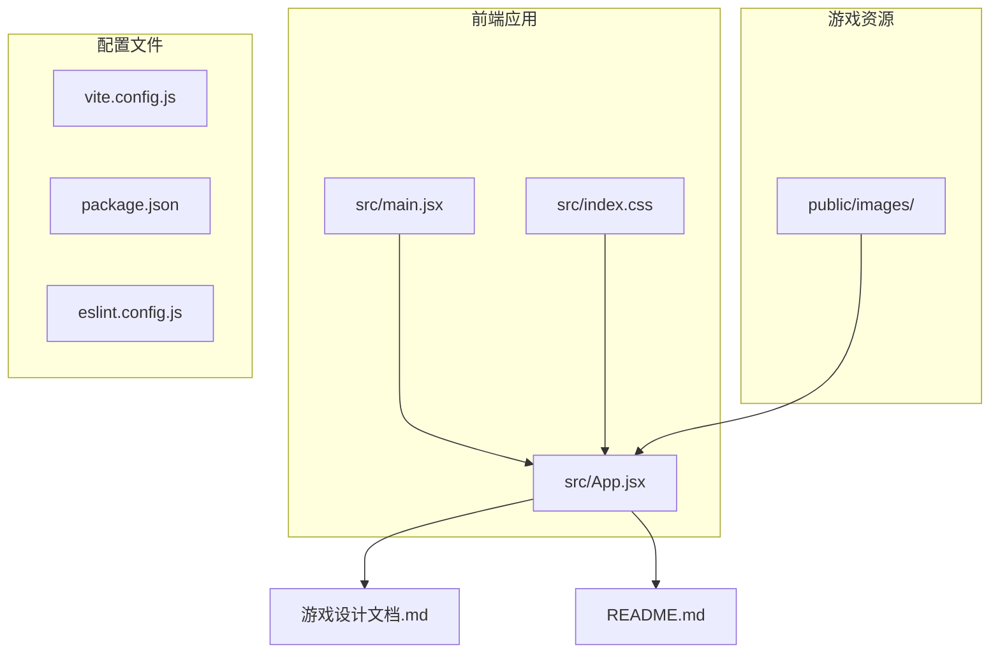
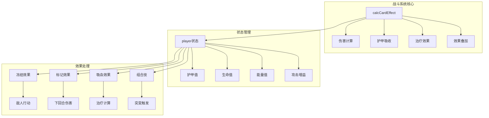
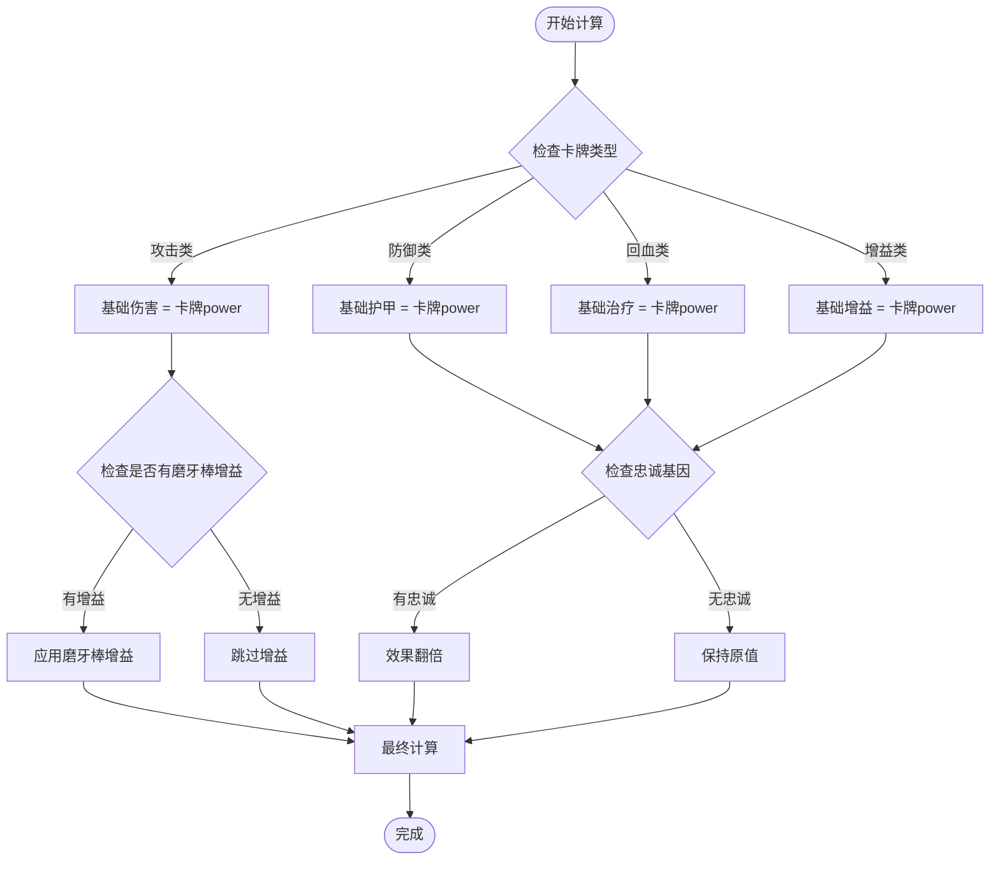
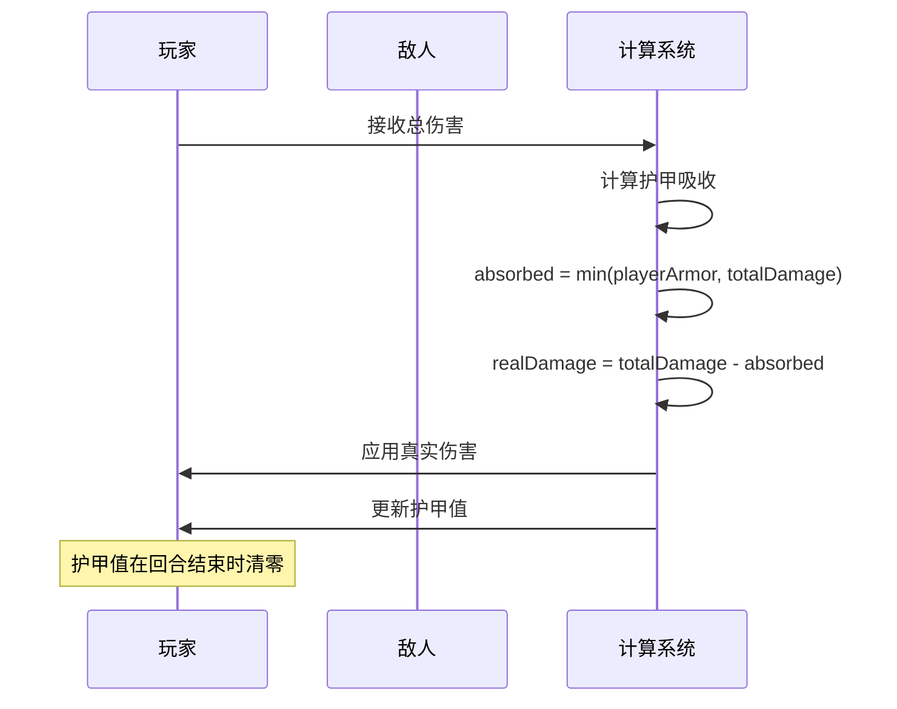
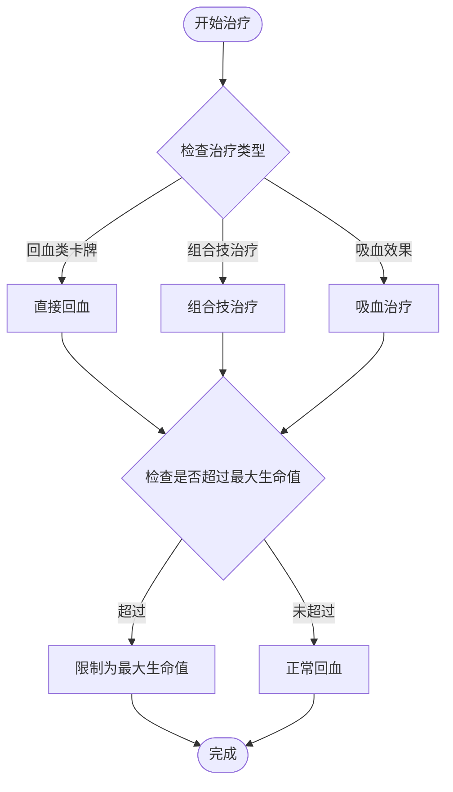
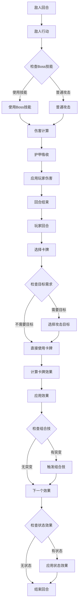
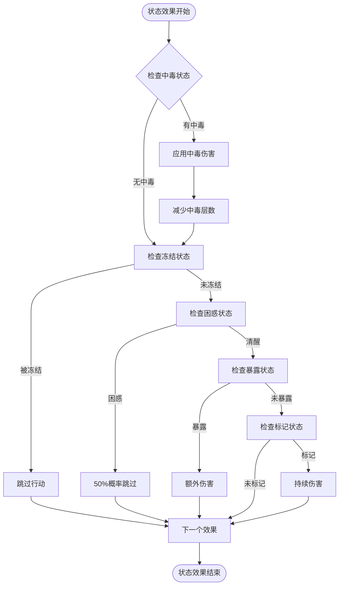
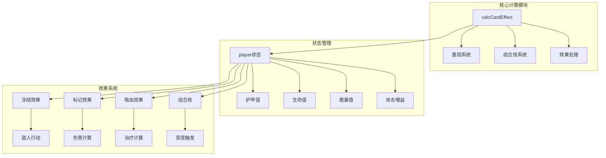

# 战斗计算

<cite>
**本文引用的文件**
- [App.jsx](file://src/App.jsx)
- [main.jsx](file://src/main.jsx)
- [README.md](file://README.md)
- [游戏设计文档.md](file://游戏设计文档.md)
</cite>

## 目录
1. [简介](#简介)
2. [项目结构](#项目结构)
3. [核心组件](#核心组件)
4. [架构概览](#架构概览)
5. [详细组件分析](#详细组件分析)
6. [依赖关系分析](#依赖关系分析)
7. [性能考量](#性能考量)
8. [故障排除指南](#故障排除指南)
9. [结论](#结论)

## 简介

《小雪闯上海》是一款以雪纳瑞犬"小雪"为主角的卡牌Roguelike游戏。本文档专注于游戏的战斗计算系统，详细解析伤害计算公式、护甲吸收逻辑、治疗效果计算以及战斗效果的执行顺序。

游戏采用React + Vite技术栈，实现了完整的战斗系统，包括卡牌效果计算、基因系统、组合技触发和敌人AI等核心功能。

## 项目结构

项目采用标准的React + Vite结构：

**图表来源**
- [main.jsx:1-8](file://src/main.jsx#L1-L8)
- [App.jsx:1-800](file://src/App.jsx#L1-L800)

**章节来源**
- [main.jsx:1-8](file://src/main.jsx#L1-L8)
- [README.md:1-17](file://README.md#L1-L17)

## 核心组件

### 基因系统与组合技

游戏的核心机制是基因系统，每张卡牌可能携带0-1个基因，约30%的卡牌会自带基因。基因共有8种：

| 基因类型 | 名称 | 效果描述 |
|---------|------|----------|
| sharp | 利齿 | 增加2点伤害 |
| tough | 硬毛 | 增加3点护甲 |
| fast | 疾跑 | 先攻并冻结敌人1回合 |
| smell | 嗅探 | 标记弱点，下回合伤害翻倍 |
| cute | 卖萌 | 回复造成伤害50%的生命 |
| loud | 吠叫 | 伤害弹射到随机敌人 |
| snack | 零食 | 回合结束额外抽1张牌 |
| loyal | 忠诚 | 卡牌效果翻倍 |

### 突变系统（组合技）

当一张卡牌携带两个特定基因组合时，会触发突变效果：

| 基因组合 | 突变名称 | 效果描述 |
|---------|----------|----------|
| sharp+tough | 铁齿铜牙 | 10点伤害+5点护甲 |
| sharp+fast | 闪电爪 | 15点伤害并冻结敌人 |
| smell+sharp | 致命一击 | 20点无视护甲伤害 |
| cute+loyal | 治愈之吻 | 回复15点生命 |
| loud+loyal | 狮吼功 | 全体8点伤害 |
| snack+smell | 寻味追踪 | 抽3张牌 |
| fast+smell | 幽灵犬 | 闪避下回合攻击 |
| tough+loyal | 铜墙铁壁 | 15点护甲 |
| sharp+loud | 狂吠乱咬 | 随机攻击3次 |
| cute+snack | 大餐时间 | 回10点生命抽2张牌 |

**章节来源**
- [App.jsx:8-37](file://src/App.jsx#L8-L37)
- [App.jsx:20-32](file://src/App.jsx#L20-L32)

## 架构概览

**图表来源**
- [App.jsx:169-216](file://src/App.jsx#L169-L216)
- [App.jsx:864-988](file://src/App.jsx#L864-L988)

## 详细组件分析

### 伤害计算系统

伤害计算采用函数式计算方法，综合考虑基础伤害、基因加成、突变效果和玩家增益：

#### 基础伤害计算

**图表来源**
- [App.jsx:169-216](file://src/App.jsx#L169-L216)

#### 基因加成机制

基因系统提供多种伤害加成：

- **利齿 (sharp)**: 每张卡牌增加2点伤害
- **忠诚 (loyal)**: 卡牌效果翻倍（可与利齿叠加）
- **其他基因效果**: 冻结敌人、标记弱点、吸血、弹射等

#### 组合技效果

组合技提供强大的突变效果，包括：
- 直接伤害提升
- 全体伤害
- 护甲增加
- 治疗效果
- 特殊状态效果

**章节来源**
- [App.jsx:169-216](file://src/App.jsx#L169-L216)

### 护甲吸收计算逻辑

护甲系统采用线性吸收机制：

**图表来源**
- [App.jsx:965-974](file://src/App.jsx#L965-L974)

护甲吸收的关键特性：
- **线性吸收**: 护甲值与伤害成比例吸收
- **上限保护**: 护甲吸收不超过玩家当前护甲值
- **回合清零**: 每回合结束时护甲值重置为0
- **伤害减免**: 护甲值越高，受到的真实伤害越少

**章节来源**
- [App.jsx:965-974](file://src/App.jsx#L965-L974)

### 治疗效果计算

治疗系统支持多种治疗方式：

#### 直接治疗

**图表来源**
- [App.jsx:1194-1196](file://src/App.jsx#L1194-L1196)

#### 吸血效果机制

吸血效果提供伤害转化为治疗的能力：
- **触发条件**: 卡牌效果包含"leech"标志
- **计算方式**: 回复伤害的50%
- **上限保护**: 不能超过最大生命值

**章节来源**
- [App.jsx:1194-1196](file://src/App.jsx#L1194-L1196)
- [App.jsx:1064-1069](file://src/App.jsx#L1064-L1069)

### 战斗效果执行顺序

战斗系统遵循严格的执行顺序：

**图表来源**
- [App.jsx:1030-1131](file://src/App.jsx#L1030-L1131)
- [App.jsx:864-988](file://src/App.jsx#L864-L988)

#### 先攻判定机制

游戏中存在先攻判定机制，主要体现在"疾跑"基因的效果：
- **先攻效果**: 使用带有"疾跑"基因的卡牌时，玩家获得先攻优势
- **冻结效果**: 对随机敌人施加1回合冻结状态
- **时机控制**: 先攻允许玩家在敌人行动前完成操作

#### 技能触发机制

Boss技能触发采用概率系统：
- **触发概率**: 每个Boss技能都有独立的触发概率（30%-40%）
- **意图生成**: 每回合结束时生成下回合行动意图
- **技能类型**: 包括多重攻击、重击、流血、终极技能等

**章节来源**
- [App.jsx:864-988](file://src/App.jsx#L864-L988)
- [App.jsx:1030-1131](file://src/App.jsx#L1030-L1131)

### 状态效果叠加机制

游戏支持多种状态效果的叠加：

#### 常见状态效果

| 状态效果 | 持续时间 | 影响机制 |
|---------|----------|----------|
| 冰冻 (frozen) | 1回合 | 本回合无法行动 |
| 迷惑 (confuse) | 1回合 | 50%概率跳过回合 |
| 虚弱 (weak) | 持久 | 攻击力永久降低2点 |
| 暴露 (exposed) | 下回合 | 受到额外3点伤害 |
| 标记 (marked) | 持久 | 被标记的敌人受到持续伤害 |

#### 状态效果处理

**图表来源**
- [App.jsx:873-877](file://src/App.jsx#L873-L877)
- [App.jsx:878-889](file://src/App.jsx#L878-L889)

**章节来源**
- [App.jsx:873-889](file://src/App.jsx#L873-L889)

## 依赖关系分析

**图表来源**
- [App.jsx:169-216](file://src/App.jsx#L169-L216)
- [App.jsx:864-988](file://src/App.jsx#L864-L988)

**章节来源**
- [App.jsx:169-216](file://src/App.jsx#L169-L216)
- [App.jsx:864-988](file://src/App.jsx#L864-L988)

## 性能考量

### 计算复杂度分析

1. **卡牌效果计算**: O(n) - n为卡牌数量
2. **组合技检测**: O(n²) - 需要检查所有基因组合
3. **状态效果处理**: O(m) - m为状态效果数量
4. **护甲吸收计算**: O(1) - 常数时间复杂度

### 优化策略

1. **函数式编程**: 使用不可变数据结构避免副作用
2. **状态分离**: 将计算逻辑与UI状态分离
3. **批量更新**: 使用React的批量更新机制
4. **内存管理**: 合理清理定时器和事件监听器

## 故障排除指南

### 常见问题及解决方案

#### 伤害计算异常

**问题**: 伤害值不符合预期
**排查步骤**:
1. 检查卡牌基础伤害值
2. 验证基因加成是否正确应用
3. 确认组合技效果是否触发
4. 核对护甲吸收计算

#### 护甲吸收问题

**问题**: 护甲值未正确减少
**排查步骤**:
1. 检查护甲吸收计算逻辑
2. 验证回合结束时的护甲重置
3. 确认护甲值的上限保护

#### 状态效果失效

**问题**: 状态效果未按预期生效
**排查步骤**:
1. 检查状态效果的触发条件
2. 验证状态效果的持续时间
3. 确认状态效果的叠加机制

**章节来源**
- [App.jsx:965-974](file://src/App.jsx#L965-L974)
- [App.jsx:873-889](file://src/App.jsx#L873-L889)

## 结论

《小雪闯上海》的战斗计算系统展现了优秀的数值设计和用户体验平衡。系统通过基因系统和组合技提供了深度的策略选择，通过清晰的计算逻辑确保了公平性和可预测性。

### 设计亮点

1. **层次化的数值系统**: 从基础伤害到基因加成再到组合技，形成了完整的数值体系
2. **直观的状态管理**: 清晰的护甲吸收和治疗机制
3. **灵活的效果处理**: 支持多种状态效果的叠加和交互
4. **优秀的扩展性**: 模块化的架构便于添加新的卡牌类型和效果

### 技术优势

1. **函数式计算**: 简洁的计算逻辑易于维护和调试
2. **React集成**: 现代前端技术栈提供了良好的开发体验
3. **性能优化**: 合理的状态管理和计算优化确保了流畅的游戏体验

该系统为Roguelike卡牌游戏的战斗数值设计提供了优秀的参考范例，既保证了策略深度，又确保了游戏的可玩性和平衡性。