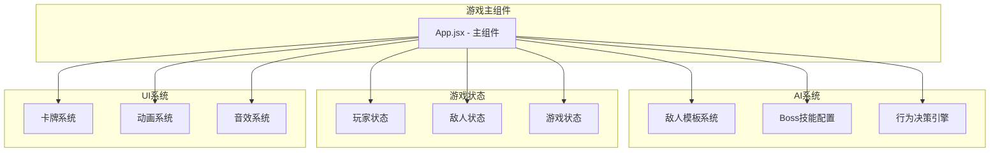
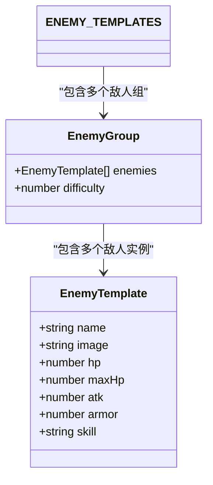
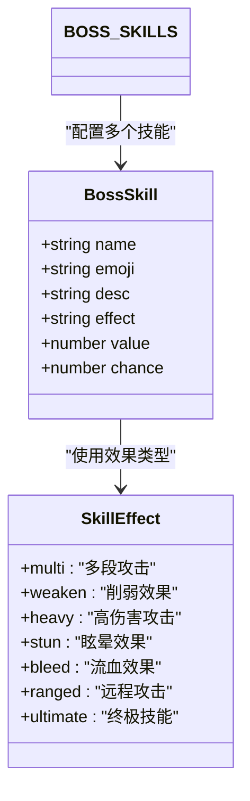
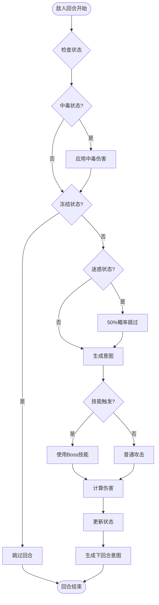
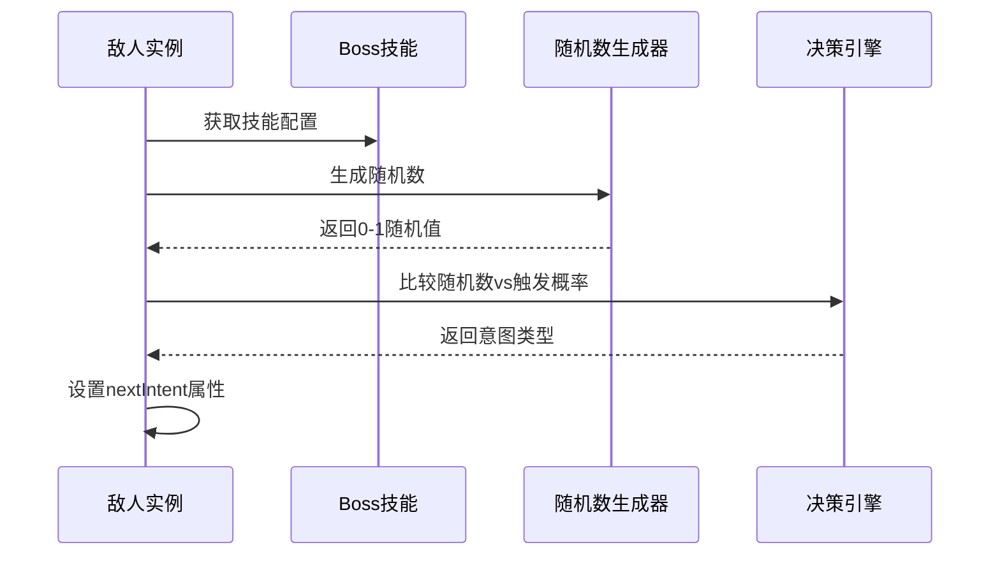
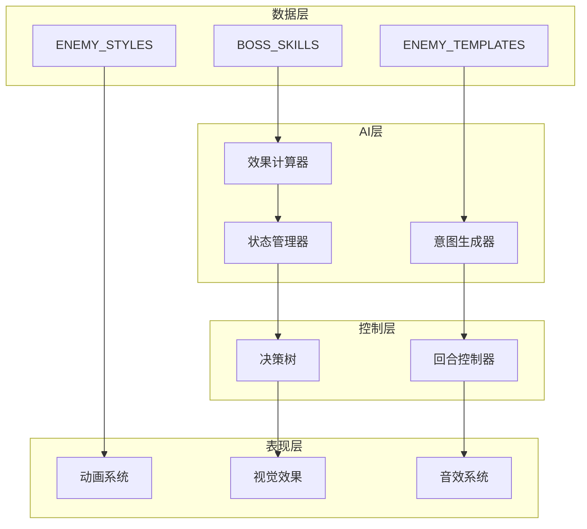
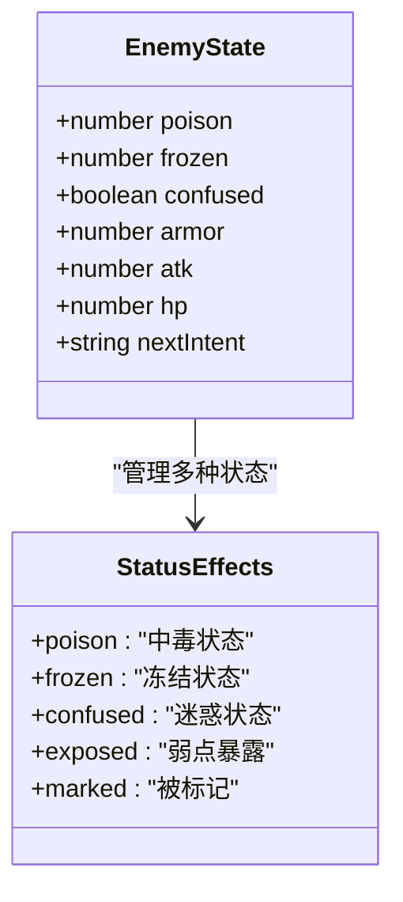
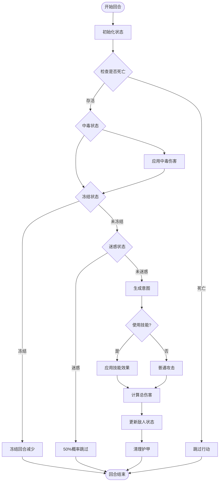
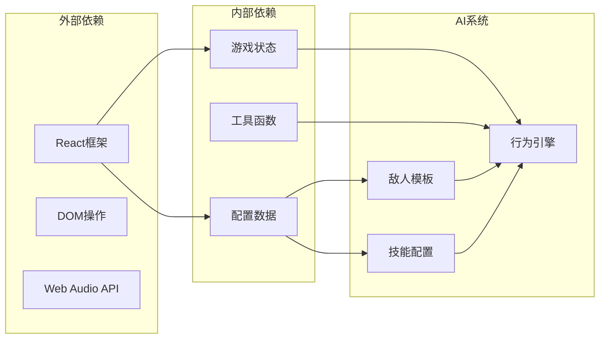

# 敌人AI系统

<cite>
**本文档引用的文件**
- [App.jsx](file://src/App.jsx)
</cite>

## 目录
1. [简介](#简介)
2. [项目结构](#项目结构)
3. [核心组件](#核心组件)
4. [架构概览](#架构概览)
5. [详细组件分析](#详细组件分析)
6. [依赖关系分析](#依赖关系分析)
7. [性能考虑](#性能考虑)
8. [故障排除指南](#故障排除指南)
9. [结论](#结论)

## 简介

《小雪闯上海》是一款基于React和Vite开发的卡牌肉鸽游戏。游戏的核心玩法围绕着小雪与上海街头各种坏人和坏狗狗的战斗展开。敌人AI系统是游戏的重要组成部分，负责控制敌人的行为模式、技能释放和状态管理。

本系统采用简洁而高效的架构设计，通过配置驱动的方式实现了灵活的敌人行为控制。系统包含三个主要组件：敌人模板系统、Boss技能配置和敌人行为决策引擎。

## 项目结构

游戏的整体架构采用单一组件模式，所有功能都集中在App.jsx文件中。这种设计使得游戏逻辑高度集中，便于维护和调试。

**图表来源**
- [App.jsx:1-2748](file://src/App.jsx#L1-L2748)

**章节来源**
- [App.jsx:1-2748](file://src/App.jsx#L1-L2748)

## 核心组件

### 敌人模板系统

敌人模板系统是整个AI系统的基础，它定义了游戏中所有敌人的基本属性和行为特征。

#### ENEMY_TEMPLATES 数组结构

ENEMY_TEMPLATES是一个二维数组，按照难度递增的顺序组织敌人：

**图表来源**
- [App.jsx:103-116](file://src/App.jsx#L103-L116)

每个敌人模板包含以下核心属性：
- `name`: 敌人名称，用于关联Boss技能
- `image`: 敌人图像路径
- `hp/maxHp`: 当前生命值和最大生命值
- `atk`: 攻击力
- `armor`: 护甲值
- `skill`: 关联的Boss技能名称

#### 难度分级机制

游戏采用渐进式难度设计，通过ENEMY_TEMPLATES的嵌套结构实现：

| 难度等级 | 敌人组 | 敌人数量 | 特征 |
|---------|--------|----------|------|
| 1 | 坏猫咪 | 1个 | 低生命值，基础攻击 |
| 2 | 凶恶泰迪 | 1个 | 中等生命值，带护甲 |
| 3 | 流浪大橘 × 2 | 2个 | 双敌人，高攻击力 |
| 4 | 城管大叔 | 1个 | 高生命值，特殊技能 |
| 5 | 恶霸犬 + 小混混 | 2个 | 混合敌人类型 |
| 6 | 捕狗大队队长 | 1个 | Boss级敌人 |

**章节来源**
- [App.jsx:103-116](file://src/App.jsx#L103-L116)

### Boss技能配置

Boss技能系统是敌人AI的核心，定义了每个敌人的特殊能力和触发机制。

#### BOSS_SKILLS 配置结构

**图表来源**
- [App.jsx:92-100](file://src/App.jsx#L92-L100)

每个Boss技能包含以下属性：

| 属性名 | 类型 | 描述 | 示例值 |
|-------|------|------|--------|
| name | string | 技能名称 | "猫爪三连" |
| emoji | string | 技能表情符号 | "🐾" |
| desc | string | 技能描述 | "连续攻击3次" |
| effect | string | 效果类型 | "multi" |
| value | number | 效果数值 | 3 |
| chance | number | 触发概率 | 0.4 |

#### 技能效果类型详解

| 效果类型 | 名称 | 描述 | 实现方式 |
|---------|------|------|----------|
| multi | 多段攻击 | 连续多次攻击 | 攻击倍数计算 |
| weaken | 削弱效果 | 降低玩家攻击力 | 攻击力临时减益 |
| heavy | 高伤害攻击 | 单次高伤害攻击 | 直接伤害值 |
| stun | 眩晕效果 | 下回合无法行动 | 冻结回合计数 |
| bleed | 流血效果 | 持续伤害效果 | 中毒层数叠加 |
| ranged | 远程攻击 | 远程伤害 | 特殊伤害计算 |
| ultimate | 终极技能 | 超高伤害技能 | 大额伤害值 |

**章节来源**
- [App.jsx:92-100](file://src/App.jsx#L92-L100)

### 敌人行为决策引擎

敌人行为决策引擎是AI系统的大脑，负责控制敌人的每一步行动。

#### 行为决策流程

**图表来源**
- [App.jsx:865-988](file://src/App.jsx#L865-L988)

#### 意图生成算法

意图生成是AI系统的关键机制，决定了敌人在下回合的行为选择。

**图表来源**
- [App.jsx:926-927](file://src/App.jsx#L926-L927)

**章节来源**
- [App.jsx:865-988](file://src/App.jsx#L865-L988)

## 架构概览

游戏的AI系统采用模块化设计，各个组件职责明确，耦合度低。

**图表来源**
- [App.jsx:1-2748](file://src/App.jsx#L1-L2748)

## 详细组件分析

### 敌人状态管理系统

状态管理系统负责跟踪和管理敌人的各种负面效果状态。

#### 状态类型定义

**图表来源**
- [App.jsx:871-932](file://src/App.jsx#L871-L932)

#### 状态处理流程

每个回合开始时，系统按特定顺序处理各种状态效果：

1. **中毒状态处理**：每回合造成固定伤害并减少层数
2. **冻结状态处理**：冻结回合数减少，期间无法行动
3. **迷惑状态处理**：随机概率跳过回合
4. **普通攻击阶段**：根据意图执行相应动作

**章节来源**
- [App.jsx:871-932](file://src/App.jsx#L871-L932)

### 技能效果实现机制

技能效果系统实现了复杂的游戏机制，为战斗增加策略深度。

#### 技能效果分类

| 效果类型 | 实现细节 | 触发条件 |
|---------|----------|----------|
| 多段攻击 | 攻击次数乘以技能倍数 | 意图为技能且命中 |
| 削弱效果 | 降低玩家攻击力2点 | 技能命中时触发 |
| 高伤害攻击 | 直接造成固定伤害值 | 意图为技能且命中 |
| 眩晕效果 | 下回合冻结1回合 | 技能命中时触发 |
| 流血效果 | 造成伤害并附加2层中毒 | 技能命中时触发 |
| 远程攻击 | 特殊伤害计算方式 | 意图为技能且命中 |
| 终极技能 | 超高伤害值直接生效 | 意图为技能且命中 |

**章节来源**
- [App.jsx:896-922](file://src/App.jsx#L896-L922)

### 敌人行为决策过程

敌人的行为决策过程体现了智能的AI设计，结合了概率计算和状态评估。

#### 决策流程分析

**图表来源**
- [App.jsx:865-988](file://src/App.jsx#L865-L988)

**章节来源**
- [App.jsx:865-988](file://src/App.jsx#L865-L988)

## 依赖关系分析

AI系统的依赖关系相对简单，主要依赖于游戏的全局状态和配置。

**图表来源**
- [App.jsx:1-2748](file://src/App.jsx#L1-L2748)

### 组件耦合度分析

- **低耦合设计**：各组件职责明确，相互独立
- **配置驱动**：通过配置文件控制AI行为，便于扩展
- **状态集中**：游戏状态统一管理，避免状态同步问题

**章节来源**
- [App.jsx:1-2748](file://src/App.jsx#L1-L2748)

## 性能考虑

### 时间复杂度分析

- **意图生成**：O(n) - n为敌人数量
- **状态处理**：O(n) - 每个敌人检查状态
- **技能计算**：O(n) - 根据意图类型计算
- **整体复杂度**：O(n) - 线性时间复杂度

### 空间复杂度分析

- **状态存储**：O(n) - 每个敌人保存状态
- **配置存储**：O(k) - k为技能数量
- **内存占用**：主要来自敌人状态和技能配置

### 优化建议

1. **状态缓存**：可以考虑缓存频繁访问的状态
2. **批量更新**：使用批量更新减少重渲染
3. **延迟计算**：对非关键计算进行延迟处理

## 故障排除指南

### 常见问题及解决方案

#### 敌人状态异常

**问题**：敌人中毒层数不正确
**原因**：状态更新逻辑错误
**解决**：检查状态更新和回合结束清理逻辑

#### 技能触发失败

**问题**：Boss技能不按概率触发
**原因**：随机数生成或比较逻辑错误
**解决**：验证随机数生成和概率比较逻辑

#### 意图生成异常

**问题**：敌人总是选择相同意图
**原因**：随机种子或概率设置问题
**解决**：检查随机数生成和概率配置

**章节来源**
- [App.jsx:871-932](file://src/App.jsx#L871-L932)

## 结论

《小雪闯上海》的敌人AI系统展现了优秀的架构设计和实现质量。系统通过配置驱动的方式实现了高度可扩展的敌人行为控制，同时保持了简洁的代码结构。

### 系统优势

1. **模块化设计**：清晰的组件分离，便于维护和扩展
2. **配置驱动**：通过配置文件控制AI行为，灵活性强
3. **状态管理**：完善的负面效果系统，增加游戏策略性
4. **性能优化**：线性时间复杂度，运行效率高

### 扩展建议

1. **难度曲线优化**：可以引入更精细的难度调节机制
2. **AI学习能力**：可以添加基于历史行为的学习机制
3. **环境交互**：可以增加环境因素对AI行为的影响
4. **多人协作**：可以扩展为支持多人协作的AI系统

该AI系统为类似卡牌游戏提供了优秀的参考实现，其设计理念和代码结构值得其他开发者借鉴和学习。