# 核心游戏系统

<cite>
**本文档引用的文件**
- [README.md](file://README.md)
- [游戏设计文档.md](file://游戏设计文档.md)
- [src/App.jsx](file://src/App.jsx)
- [src/main.jsx](file://src/main.jsx)
- [src/index.css](file://src/index.css)
</cite>

## 目录
1. [简介](#简介)
2. [项目结构](#项目结构)
3. [核心组件](#核心组件)
4. [架构概览](#架构概览)
5. [详细组件分析](#详细组件分析)
6. [依赖关系分析](#依赖关系分析)
7. [性能考虑](#性能考虑)
8. [故障排除指南](#故障排除指南)
9. [结论](#结论)

## 简介

《小雪闯上海》是一款以雪纳瑞犬"小雪"为主角的卡牌Roguelike游戏。玩家扮演一只偷偷溜出家门的可爱雪纳瑞，在上海街头冒险，遭遇各种坏猫咪、恶霸犬和不法分子，通过卡牌战斗系统击败敌人，最终安全回家。

游戏采用轻松幽默的叙事风格，所有战斗都以狗狗的行为方式呈现，如爪击、扑咬、汪汪大叫、摇尾巴等，避免了暴力元素，保持了适合全年龄段的游戏体验。

## 项目结构

该项目采用React + Vite的现代前端技术栈，整体结构简洁明了：

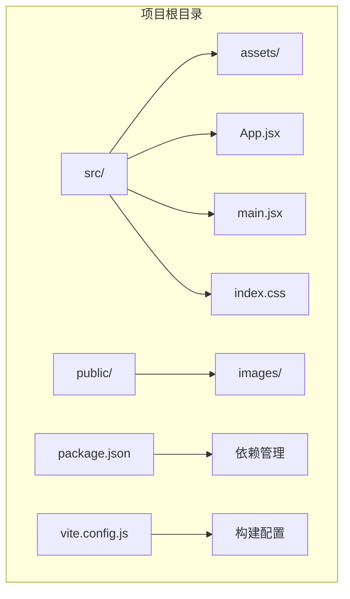

**图表来源**
- [src/main.jsx:1-8](file://src/main.jsx#L1-L8)
- [src/App.jsx:1-10](file://src/App.jsx#L1-L10)

**章节来源**
- [README.md:1-17](file://README.md#L1-L17)
- [src/main.jsx:1-8](file://src/main.jsx#L1-L8)

## 核心组件

### 游戏主控制器

游戏的核心逻辑集中在单一的`XiaoXueGame`组件中，该组件负责管理整个游戏的状态和流程：

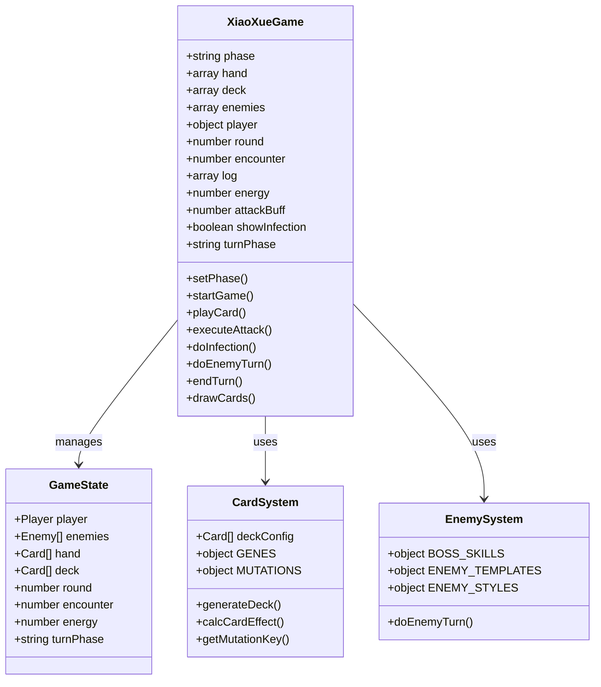

**图表来源**
- [src/App.jsx:219-2739](file://src/App.jsx#L219-L2739)

### 卡牌系统架构

卡牌系统是游戏的核心机制，包含完整的基因系统、突变机制和效果计算：

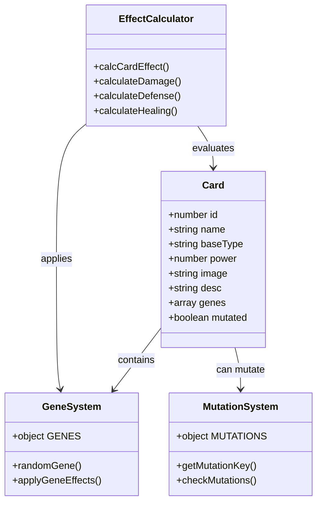

**图表来源**
- [src/App.jsx:8-37](file://src/App.jsx#L8-L37)
- [src/App.jsx:62-89](file://src/App.jsx#L62-L89)
- [src/App.jsx:169-216](file://src/App.jsx#L169-L216)

**章节来源**
- [src/App.jsx:8-37](file://src/App.jsx#L8-L37)
- [src/App.jsx:62-89](file://src/App.jsx#L62-L89)
- [src/App.jsx:169-216](file://src/App.jsx#L169-L216)

## 架构概览

游戏采用单文件组件架构，所有核心逻辑集中在一个文件中，便于维护和理解：

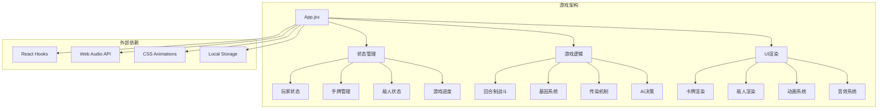

**图表来源**
- [src/App.jsx:1-2739](file://src/App.jsx#L1-L2739)

### 数据流架构

游戏的数据流遵循单向数据流原则，确保状态的一致性和可预测性：

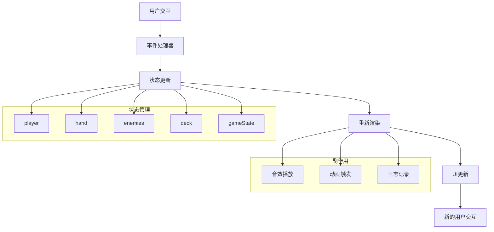

**图表来源**
- [src/App.jsx:220-250](file://src/App.jsx#L220-L250)

## 详细组件分析

### 卡牌战斗系统

#### 回合制战斗流程

游戏采用经典的回合制战斗系统，每回合包含以下步骤：

1. **抽牌阶段**：玩家抽5张初始手牌
2. **行动阶段**：玩家使用卡牌进行攻击、防御或回血
3. **回合结束**：执行传染阶段和抽牌
4. **敌人回合**：敌人根据意图进行攻击

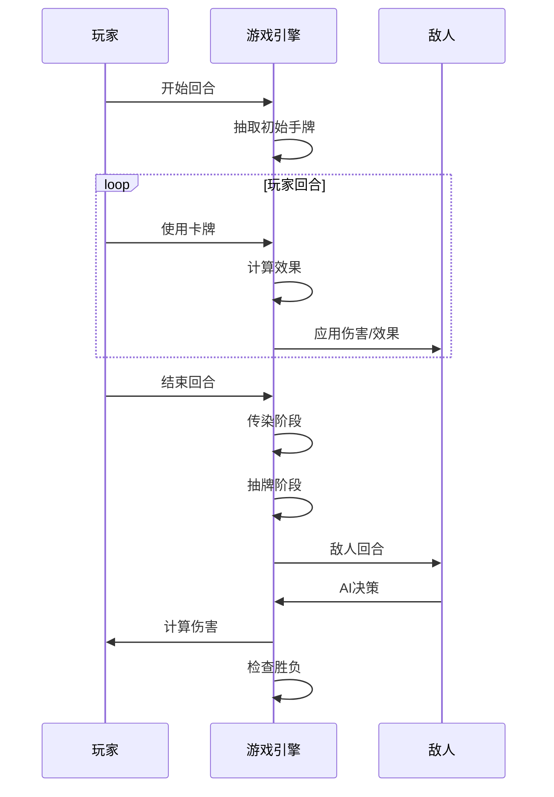

**图表来源**
- [src/App.jsx:722-746](file://src/App.jsx#L722-L746)
- [src/App.jsx:1295-1300](file://src/App.jsx#L1295-L1300)
- [src/App.jsx:864-988](file://src/App.jsx#L864-L988)

#### 卡牌效果计算系统

卡牌效果计算是游戏的核心算法，负责根据卡牌类型、基因加成和突变效果计算最终结果：

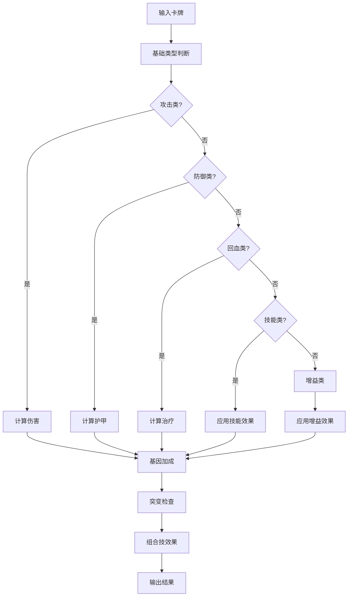

**图表来源**
- [src/App.jsx:169-216](file://src/App.jsx#L169-L216)

**章节来源**
- [src/App.jsx:169-216](file://src/App.jsx#L169-L216)

### 基因系统

#### 基因随机生成机制

基因系统是游戏的核心创新点，每张卡牌可能携带0-1个基因，约30%的卡牌会自带基因：

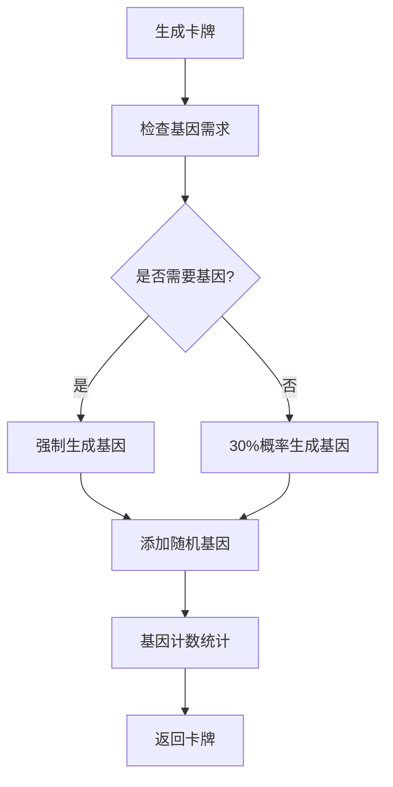

**图表来源**
- [src/App.jsx:62-89](file://src/App.jsx#L62-L89)

#### 基因加成计算

基因系统提供8种不同的基因效果，每种基因都有独特的加成机制：

| 基因类型 | 效果描述 | 加成方式 |
|---------|----------|----------|
| 利齿 | 增加2点伤害 | 基础伤害+2 |
| 硬毛 | 增加3点护甲 | 基础护甲+3 |
| 疾跑 | 先攻并冻结敌人1回合 | 先攻+冻结效果 |
| 嗅探 | 标记弱点，下回合伤害翻倍 | 标记+倍率效果 |
| 卖萌 | 回复造成伤害50%的生命 | 吸血效果 |
| 吠叫 | 伤害弹射到随机敌人 | 弹射效果 |
| 零食 | 回合结束额外抽1张牌 | 抽牌效果 |
| 忠诚 | 卡牌效果翻倍 | 倍率效果 |

**章节来源**
- [src/App.jsx:8-18](file://src/App.jsx#L8-L18)
- [src/App.jsx:164-167](file://src/App.jsx#L164-L167)

### 突变系统（组合技）

#### 组合技触发条件

当一张卡牌携带两个特定基因组合时，会触发突变效果（组合技）：

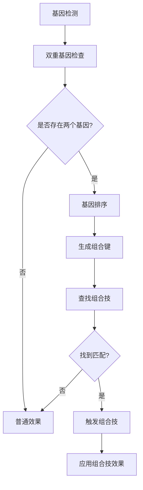

**图表来源**
- [src/App.jsx:34-37](file://src/App.jsx#L34-L37)
- [src/App.jsx:205-213](file://src/App.jsx#L205-L213)

#### 组合技效果列表

| 组合技 | 基因组合 | 效果描述 |
|--------|----------|----------|
| 铁齿铜牙 | 利齿+硬毛 | 10点伤害+5点护甲 |
| 闪电爪 | 利齿+疾跑 | 15点伤害冻结敌人 |
| 致命一击 | 嗅探+利齿 | 20点无视护甲伤害 |
| 治愈之吻 | 卖萌+忠诚 | 回复15点生命 |
| 狮吼功 | 吠叫+忠诚 | 全体8点伤害 |
| 寻味追踪 | 零食+嗅探 | 抽3张牌 |
| 幽灵犬 | 疾跑+嗅探 | 闪避下回合攻击 |
| 铜墙铁壁 | 硬毛+忠诚 | 15点护甲 |
| 狂吠乱咬 | 利齿+吠叫 | 随机攻击3次 |
| 大餐时间 | 卖萌+零食 | 回10点生命抽2张牌 |

**章节来源**
- [src/App.jsx:20-32](file://src/App.jsx#L20-L32)
- [src/App.jsx:34-37](file://src/App.jsx#L34-L37)

### 传染系统

#### 传染机制实现

传染系统在每击败一个敌人后触发，随机选择一张手牌作为"传染源"，将传染源的一个随机基因复制给相邻的手牌：

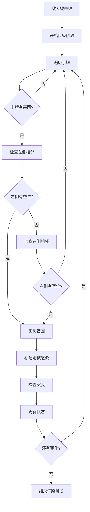

**图表来源**
- [src/App.jsx:787-862](file://src/App.jsx#L787-L862)

#### 传染效果可视化

传染过程通过视觉效果增强玩家体验：

- **绿色光晕**：显示被传染的卡牌
- **动画效果**：基因复制的视觉反馈
- **音效提示**：传染完成的确认音效

**章节来源**
- [src/App.jsx:787-862](file://src/App.jsx#L787-L862)

### 敌人AI系统

#### AI决策算法

每个Boss都有概率使用特殊技能而非普通攻击，技能触发概率通过`BOSS_SKILLS`配置控制：

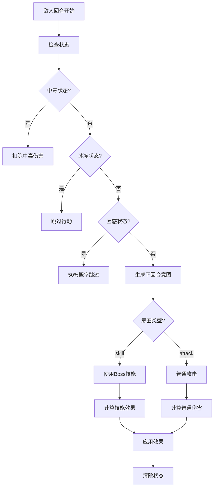

**图表来源**
- [src/App.jsx:864-988](file://src/App.jsx#L864-L988)

#### Boss技能设计

Boss技能分为多种类型，每种技能都有独特的视觉效果和音效：

| 技能类型 | 名称 | 效果描述 | 触发概率 |
|----------|------|----------|----------|
| 多重攻击 | 猫爪三连 | 连续攻击3次 | 40% |
| 重击 | 肥猫压顶 | 单次高伤害攻击 | 40% |
| 流血 | 撕咬 | 造成伤害并附加流血 | 40% |
| 终极技能 | 终极抓捕 | 超高伤害+眩晕 | 35% |

**章节来源**
- [src/App.jsx:91-100](file://src/App.jsx#L91-L100)
- [src/App.jsx:864-988](file://src/App.jsx#L864-L988)

### 游戏状态管理系统

#### 核心数据结构

游戏使用React Hooks管理复杂的状态系统：

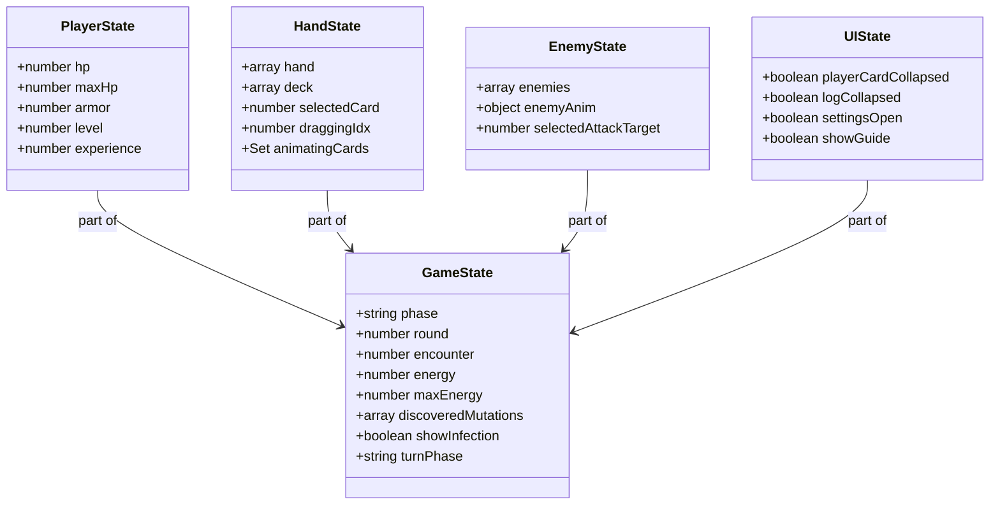

**图表来源**
- [src/App.jsx:219-250](file://src/App.jsx#L219-L250)

#### 状态更新机制

游戏采用函数式更新确保状态的一致性：

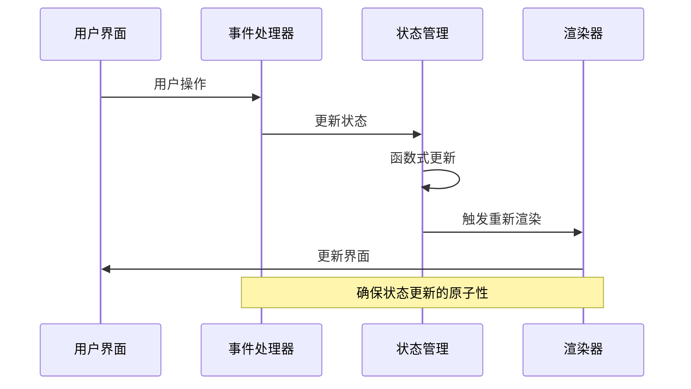

**图表来源**
- [src/App.jsx:265-275](file://src/App.jsx#L265-L275)

**章节来源**
- [src/App.jsx:219-250](file://src/App.jsx#L219-L250)

## 依赖关系分析

### 核心依赖关系

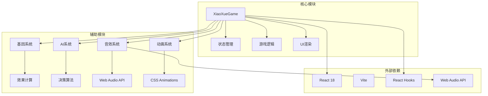

**图表来源**
- [src/App.jsx:1-2739](file://src/App.jsx#L1-L2739)

### 组件耦合分析

游戏采用松耦合设计，各模块职责明确：

- **高内聚**：每个功能模块专注于特定领域
- **低耦合**：模块间通过清晰的接口通信
- **可测试性**：函数式设计便于单元测试
- **可维护性**：单一职责原则便于维护

**章节来源**
- [src/App.jsx:1-2739](file://src/App.jsx#L1-L2739)

## 性能考虑

### React性能优化

游戏采用了多项React性能优化技术：

1. **useCallback优化**：缓存事件处理器避免不必要的重渲染
2. **useRef优化**：同步访问最新状态避免闭包陷阱
3. **函数式更新**：确保状态更新的原子性
4. **虚拟DOM优化**：正确使用key属性避免重渲染

### 动画性能优化

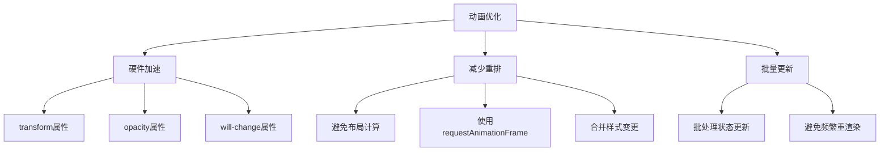

**图表来源**
- [src/App.jsx:257-263](file://src/App.jsx#L257-L263)

### 音效性能优化

音效系统使用Web Audio API实现高性能音频处理：

- **AudioContext复用**：避免重复创建音频上下文
- **振荡器复用**：减少音频对象创建开销
- **低延迟播放**：使用直接振荡器合成
- **音效池管理**：避免音效重复加载

**章节来源**
- [src/App.jsx:341-617](file://src/App.jsx#L341-L617)

## 故障排除指南

### 常见问题及解决方案

#### 卡牌拖拽问题

**问题**：卡牌拖拽不灵敏或卡顿
**解决方案**：
1. 检查拖拽阈值设置
2. 确认鼠标事件监听器正确绑定
3. 验证CSS transform属性

#### 音效播放问题

**问题**：音效无法播放或延迟
**解决方案**：
1. 检查AudioContext状态
2. 确认浏览器手势要求
3. 验证音频权限

#### 性能问题

**问题**：游戏运行缓慢或卡顿
**解决方案**：
1. 检查动画帧率
2. 优化重渲染频率
3. 减少DOM节点数量

### 调试技巧

1. **使用React DevTools**：监控组件渲染和状态变化
2. **启用严格模式**：发现潜在的副作用
3. **使用性能面板**：分析渲染性能瓶颈
4. **日志记录**：跟踪状态变化和事件流程

**章节来源**
- [src/App.jsx:277-335](file://src/App.jsx#L277-L335)
- [src/App.jsx:341-617](file://src/App.jsx#L341-L617)

## 结论

《小雪闯上海》展现了优秀的游戏架构设计，通过单一文件组件实现了复杂的Roguelike游戏机制。游戏的核心优势包括：

1. **清晰的架构设计**：单一组件集中管理所有游戏逻辑
2. **创新的游戏机制**：基因系统和组合技提供深度策略性
3. **优秀的用户体验**：流畅的动画和音效增强沉浸感
4. **良好的性能表现**：多项优化技术确保流畅运行

游戏系统的核心价值在于将复杂的Roguelike机制封装在简洁的架构中，为玩家提供了既有趣又具有挑战性的游戏体验。基因系统的引入为传统卡牌游戏注入了新的活力，而传染机制则提供了独特的Build构筑乐趣。

通过深入分析这些核心系统，开发者可以更好地理解游戏的设计理念，并在此基础上进行扩展和改进。无论是添加新的卡牌类型、扩展基因系统，还是优化AI算法，这套架构都为后续开发提供了坚实的基础。