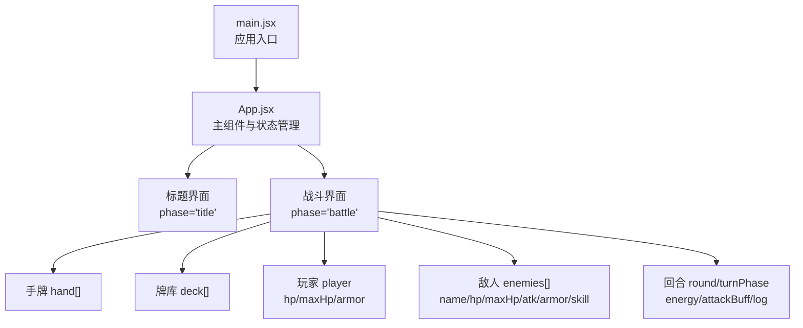
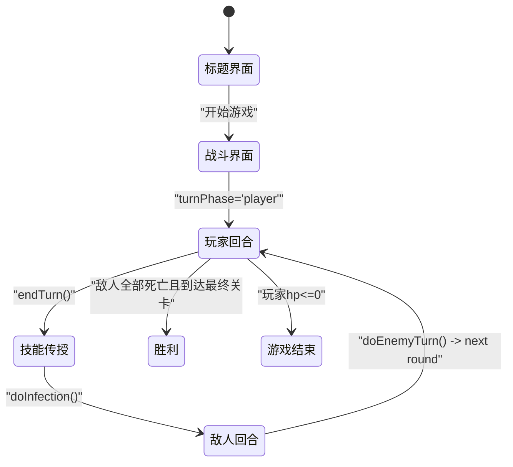
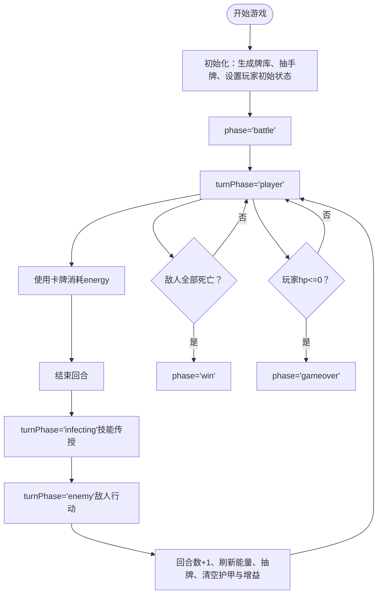

# 核心游戏状态

<cite>
**本文引用的文件**
- [src/App.jsx](file://src/App.jsx)
- [src/main.jsx](file://src/main.jsx)
- [游戏设计文档.md](file://游戏设计文档.md)
</cite>

## 目录
1. [简介](#简介)
2. [项目结构](#项目结构)
3. [核心组件](#核心组件)
4. [架构总览](#架构总览)
5. [详细组件分析](#详细组件分析)
6. [依赖分析](#依赖分析)
7. [性能考量](#性能考量)
8. [故障排查指南](#故障排查指南)
9. [结论](#结论)
10. [附录](#附录)

## 简介
本文件聚焦于《小雪闯上海》的核心游戏状态，系统梳理并解释以下关键状态及其管理方式：
- 游戏阶段状态（phase：title/battle）
- 玩家状态（hp、maxHp、armor）
- 敌人状态（name、hp、maxHp、atk、armor、skill）
- 手牌状态（hand数组）
- 牌库状态（deck数组）
- 回合状态（round、turnPhase）
- 其他辅助状态（energy、attackBuff、log、enemies等）

我们将从数据结构、初始值、更新机制、状态间依赖与流转等方面进行深入分析，并给出最佳实践建议与常见问题排查方法。

## 项目结构
- 项目采用 React + Vite 架构，入口为 main.jsx，主组件为 App.jsx。
- 游戏逻辑集中在 App.jsx 的函数组件内，通过 useState/useEffect/useCallback/useRef 管理状态与副作用。
- 游戏设计文档提供了玩法与数值平衡的背景知识，有助于理解状态设计的动机与边界。

图表来源
- [src/main.jsx:1-8](file://src/main.jsx#L1-L8)
- [src/App.jsx:219-2719](file://src/App.jsx#L219-L2719)

章节来源
- [src/main.jsx:1-8](file://src/main.jsx#L1-L8)
- [src/App.jsx:219-2719](file://src/App.jsx#L219-L2719)

## 核心组件
- 主组件：XiaoXueGame（App.jsx）
  - 负责统一管理所有游戏状态，包括阶段、玩家、敌人、手牌、牌库、回合、日志、动画等。
  - 提供状态初始化、更新、查询与渲染逻辑。

章节来源
- [src/App.jsx:219-2719](file://src/App.jsx#L219-L2719)

## 架构总览
游戏状态围绕“阶段-回合-行动”循环组织：
- 阶段切换：title → battle（开始游戏时）
- 回合循环：玩家回合 → 技能传授（infecting）→ 敌人回合 → 下一回合
- 每回合资源：能量（energy）限制使用次数
- 每回合结束：刷新能量、抽牌、清空护甲、重置增益

图表来源
- [src/App.jsx:722-746](file://src/App.jsx#L722-L746)
- [src/App.jsx:1295-1300](file://src/App.jsx#L1295-L1300)
- [src/App.jsx:864-988](file://src/App.jsx#L864-L988)
- [src/App.jsx:1001-1028](file://src/App.jsx#L1001-L1028)
- [src/App.jsx:970-975](file://src/App.jsx#L970-L975)

## 详细组件分析

### 游戏阶段状态（phase）
- 数据结构：字符串，可选值："title"、"battle"、"gameover"、"win"
- 初始值：默认 "title"
- 更新机制：
  - 标题界面点击“出发冒险”后，调用 startGame 初始化牌库、手牌、玩家、回合、敌人等，随后设置 phase="battle"
  - 敌人全部死亡且到达最终关卡时，设置 phase="win"
  - 玩家生命值归零时，设置 phase="gameover"
- 依赖关系：phase 控制渲染分支（标题/战斗/胜负/失败），并影响BGM播放与UI布局

章节来源
- [src/App.jsx:220](file://src/App.jsx#L220)
- [src/App.jsx:722-746](file://src/App.jsx#L722-L746)
- [src/App.jsx:1004-1008](file://src/App.jsx#L1004-L1008)
- [src/App.jsx:970-972](file://src/App.jsx#L970-L972)

### 玩家状态（player）
- 数据结构：对象，包含 hp、maxHp、armor
- 初始值：hp=40，maxHp=40，armor=0
- 更新机制：
  - 使用防御类卡牌增加护甲（回合结束清零）
  - 使用回血类卡牌恢复生命值（不超过最大值）
  - 敌人回合造成伤害时，先扣护甲，再扣生命值；若生命值≤0，切换至 gameover
  - 胜利时恢复一定生命值
- 依赖关系：护甲影响伤害减免；生命值决定胜负；增益（attackBuff）影响攻击伤害

章节来源
- [src/App.jsx:227](file://src/App.jsx#L227)
- [src/App.jsx:1190-1196](file://src/App.jsx#L1190-L1196)
- [src/App.jsx:965-974](file://src/App.jsx#L965-L974)
- [src/App.jsx:1023](file://src/App.jsx#L1023)

### 敌人状态（enemies）
- 数据结构：数组，元素为对象，包含 name、hp、maxHp、atk、armor、skill、poison、frozen、confused、exposed、marked、nextIntent 等
- 初始值：由 ENEMY_TEMPLATES 与 BOSS_SKILLS 生成，随关卡推进替换
- 更新机制：
  - 每回合开始检查状态：中毒、冰冻、困惑
  - 根据 nextIntent 决定使用普通攻击或Boss技能
  - 技能类型包括多重攻击、重击、流血、终极技能等
  - 敌人回合结束清空护甲
- 依赖关系：状态（poison/frozen/confused/exposed/marked）影响行为与伤害；nextIntent 决定行动类型

章节来源
- [src/App.jsx:103-116](file://src/App.jsx#L103-L116)
- [src/App.jsx:92-100](file://src/App.jsx#L92-L100)
- [src/App.jsx:864-988](file://src/App.jsx#L864-L988)

### 手牌状态（hand）
- 数据结构：数组，元素为卡牌对象，包含 id、name、baseType、power、image、desc、genes、mutated 等
- 初始值：startGame 时从生成的牌库抽取前5张
- 更新机制：
  - 使用卡牌后从手牌移除
  - 技能传授阶段将基因复制到相邻卡牌，可能触发组合技（mutated）
  - 拖拽排序通过 insertCard 实现
- 依赖关系：手牌数量受上限约束；基因与组合技影响卡牌效果

章节来源
- [src/App.jsx:221](file://src/App.jsx#L221)
- [src/App.jsx:724-728](file://src/App.jsx#L724-L728)
- [src/App.jsx:265-275](file://src/App.jsx#L265-L275)
- [src/App.jsx:788-862](file://src/App.jsx#L788-L862)

### 牌库状态（deck）
- 数据结构：数组，元素为卡牌对象
- 初始值：startGame 时生成完整牌库并抽取前5张作为手牌
- 更新机制：
  - 抽牌时从牌库头部取牌，不足时重新洗牌
  - 技能传授后可能补充新牌库
- 依赖关系：牌库为空时触发重新洗牌逻辑

章节来源
- [src/App.jsx:225](file://src/App.jsx#L225)
- [src/App.jsx:723-725](file://src/App.jsx#L723-L725)
- [src/App.jsx:750-785](file://src/App.jsx#L750-L785)

### 回合状态（round、turnPhase）
- 数据结构：round 为整数；turnPhase 为字符串，可选值："player"、"infecting"、"enemy"
- 初始值：round=1，turnPhase="player"
- 更新机制：
  - 玩家回合结束：设置 turnPhase="infecting"，执行技能传授
  - 技能传授完成后：设置 turnPhase="enemy"，执行敌人行动
  - 敌人行动完成后：回合数+1，刷新能量、抽牌、清空护甲与增益，回到玩家回合
- 依赖关系：回合数影响抽牌数量与增益持续；回合阶段控制UI与交互

章节来源
- [src/App.jsx:228](file://src/App.jsx#L228)
- [src/App.jsx:238](file://src/App.jsx#L238)
- [src/App.jsx:1295-1300](file://src/App.jsx#L1295-L1300)
- [src/App.jsx:864-988](file://src/App.jsx#L864-L988)

### 资源与辅助状态（energy、attackBuff、log、enemies等）
- energy：每回合固定3点，使用卡牌消耗1点
- attackBuff：增益类卡牌提供的临时伤害加成，回合结束清零
- log：战斗日志，记录关键事件
- discoveredMutations：本局已发现的组合技名称集合
- animatingCards/enemyAnim/playerAnim：用于动画反馈的状态集合
- showInfection/showGuide/settingsOpen：UI控制状态

章节来源
- [src/App.jsx:233](file://src/App.jsx#L233)
- [src/App.jsx:240](file://src/App.jsx#L240)
- [src/App.jsx:230](file://src/App.jsx#L230)
- [src/App.jsx:235](file://src/App.jsx#L235)
- [src/App.jsx:236](file://src/App.jsx#L236)
- [src/App.jsx:243](file://src/App.jsx#L243)
- [src/App.jsx:244](file://src/App.jsx#L244)
- [src/App.jsx:239](file://src/App.jsx#L239)

### 状态流转与依赖关系图

图表来源
- [src/App.jsx:722-746](file://src/App.jsx#L722-L746)
- [src/App.jsx:1295-1300](file://src/App.jsx#L1295-L1300)
- [src/App.jsx:788-862](file://src/App.jsx#L788-L862)
- [src/App.jsx:864-988](file://src/App.jsx#L864-L988)
- [src/App.jsx:1001-1028](file://src/App.jsx#L1001-L1028)
- [src/App.jsx:970-975](file://src/App.jsx#L970-L975)

## 依赖分析
- 组件耦合：
  - App.jsx 是唯一状态中心，各功能模块（抽牌、使用卡牌、敌人行动、技能传授）均通过状态更新函数相互协作
  - 通过回调函数（useCallback）封装业务逻辑，减少重渲染
- 外部依赖：
  - Web Audio API：音效与BGM
  - CSS 动画：视觉反馈
- 潜在风险：
  - 闭包陷阱：使用 handRef 同步手牌状态，避免 playCard/useCard 等回调读取旧手牌
  - 状态竞争：函数式更新（如 setHand(prev => ...)）保证原子性

章节来源
- [src/App.jsx:257-259](file://src/App.jsx#L257-L259)
- [src/App.jsx:1133-1293](file://src/App.jsx#L1133-L1293)
- [src/App.jsx:1030-1131](file://src/App.jsx#L1030-L1131)

## 性能考量
- 状态更新原子性：
  - 使用函数式 setState（如 setHand(prev => ...)）避免竞态
  - 通过 useRef 同步 hand/energy 等易变状态，防止回调读取陈旧值
- 渲染优化：
  - 使用 React.memo 化（通过 key 与不可变更新）减少重渲染
  - 动画使用 transform/opacity，尽量避免布局抖动
- 资源管理：
  - 单例 AudioContext，避免频繁创建
  - 抽牌与洗牌逻辑合并，减少多次状态更新

章节来源
- [src/App.jsx:257-259](file://src/App.jsx#L257-L259)
- [src/App.jsx:750-785](file://src/App.jsx#L750-L785)
- [src/App.jsx:342-352](file://src/App.jsx#L342-L352)

## 故障排查指南
- 症状：点击卡牌无效或使用错误卡牌
  - 排查：确认 turnPhase 是否为 "player"，energy 是否大于0
  - 排查：检查 handRef 是否同步最新 hand
- 症状：技能传授后未触发组合技
  - 排查：确认基因组合是否满足 MUTATIONS 键值（如 sharp+tough）
- 症状：敌人回合后护甲未清零
  - 排查：doEnemyTurn 是否在回合结束时清空护甲
- 症状：牌库抽完后未重新洗牌
  - 排查：drawCards 是否在牌库不足时触发重新洗牌逻辑
- 症状：动画或音效异常
  - 排查：AudioContext 状态（暂停/恢复），BGM 播放与停止逻辑

章节来源
- [src/App.jsx:1133-1293](file://src/App.jsx#L1133-L1293)
- [src/App.jsx:788-862](file://src/App.jsx#L788-L862)
- [src/App.jsx:864-988](file://src/App.jsx#L864-L988)
- [src/App.jsx:750-785](file://src/App.jsx#L750-L785)
- [src/App.jsx:342-352](file://src/App.jsx#L342-L352)

## 结论
《小雪闯上海》通过集中式状态管理与清晰的回合流程，实现了紧凑而富有策略深度的卡牌Roguelike体验。核心状态覆盖了阶段、玩家、敌人、手牌、牌库与回合等关键维度，配合基因与组合技系统，为玩家提供了多样化的Build与战术选择。建议在后续迭代中进一步完善状态持久化、日志可视化与性能监控，以提升可维护性与用户体验。

## 附录
- 状态初始化示例路径
  - [startGame 初始化牌库与手牌:722-746](file://src/App.jsx#L722-L746)
- 状态更新示例路径
  - [抽牌与补牌逻辑:750-785](file://src/App.jsx#L750-L785)
  - [技能传授与组合技检测:788-862](file://src/App.jsx#L788-L862)
  - [敌人回合与伤害结算:864-988](file://src/App.jsx#L864-L988)
  - [使用卡牌与效果处理:1030-1293](file://src/App.jsx#L1030-L1293)
- 状态查询示例路径
  - [根据手牌索引读取卡牌与效果:1133-1293](file://src/App.jsx#L1133-L1293)
  - [根据敌人索引读取状态与技能:1646-1826](file://src/App.jsx#L1646-L1826)