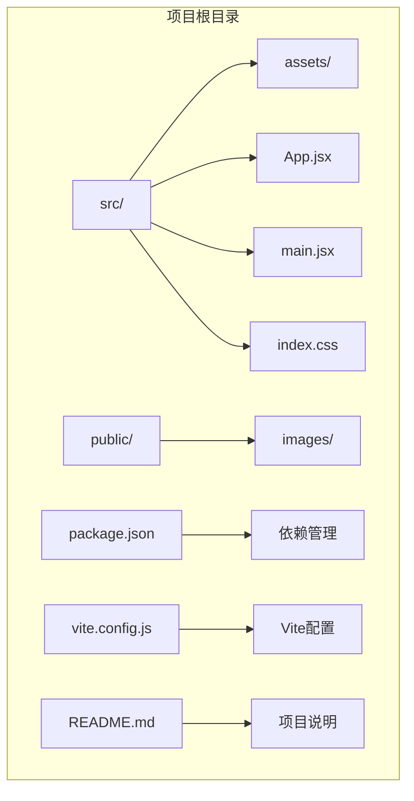
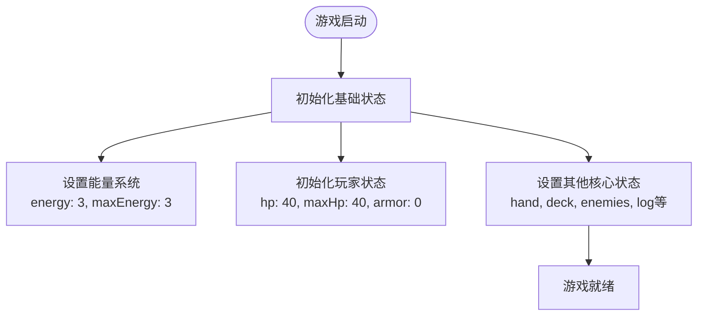
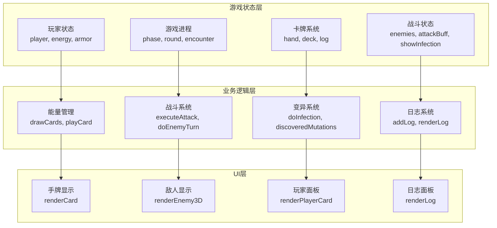
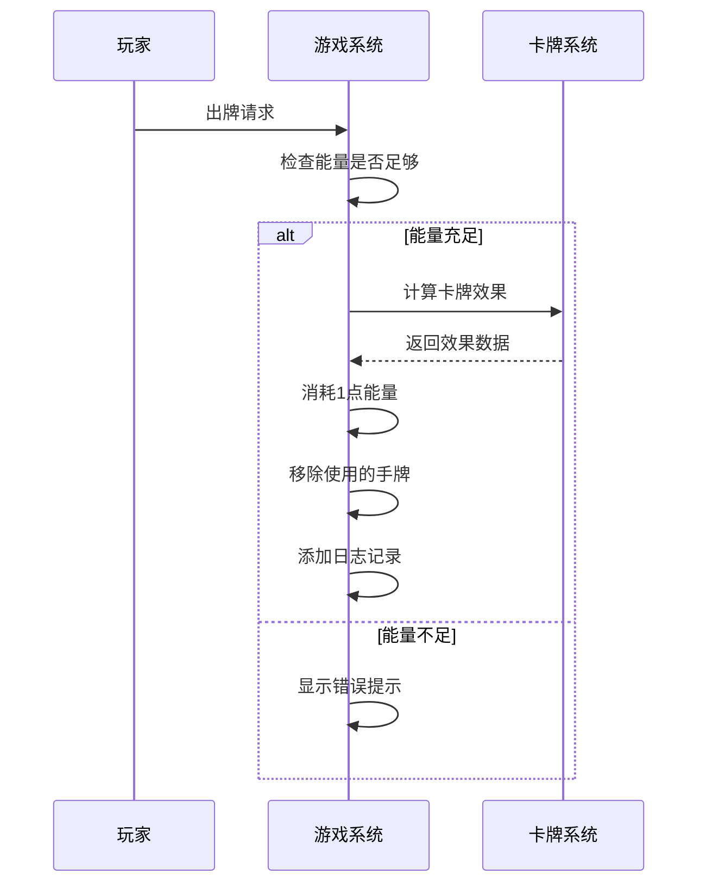
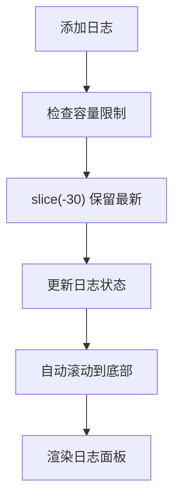
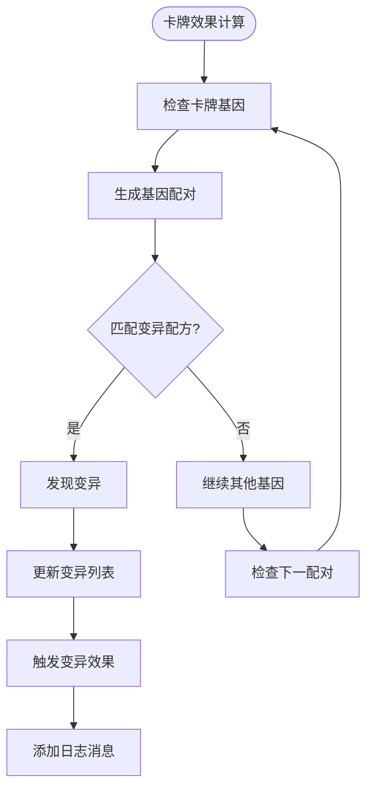
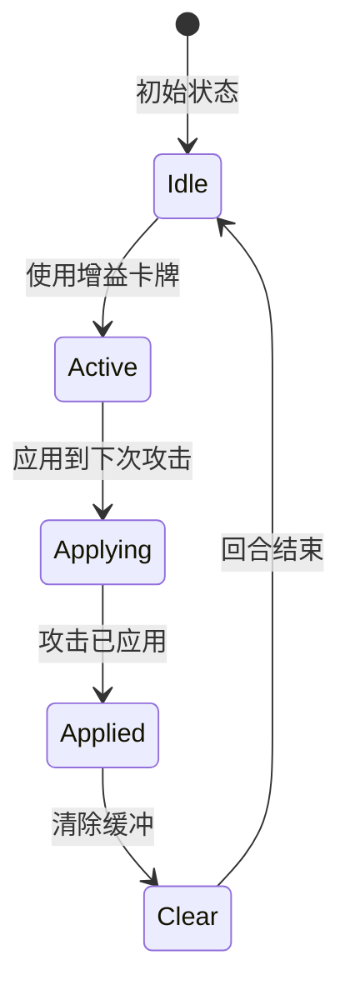
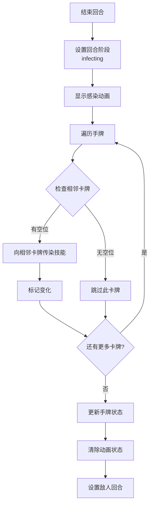
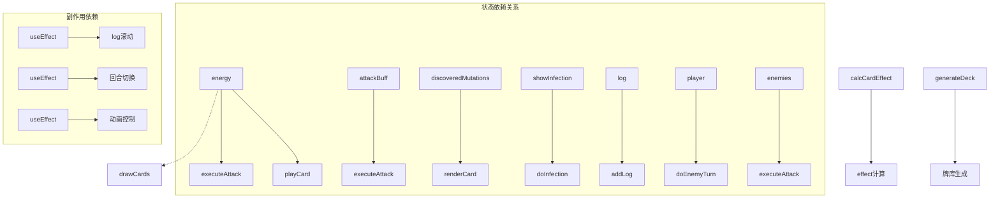

# 游戏机制状态

<cite>
**本文档引用的文件**
- [src/App.jsx](file://src/App.jsx)
- [src/main.jsx](file://src/main.jsx)
- [README.md](file://README.md)
</cite>

## 目录
1. [简介](#简介)
2. [项目结构](#项目结构)
3. [核心组件](#核心组件)
4. [架构概览](#架构概览)
5. [详细组件分析](#详细组件分析)
6. [依赖关系分析](#依赖关系分析)
7. [性能考虑](#性能考虑)
8. [故障排除指南](#故障排除指南)
9. [结论](#结论)

## 简介

《小雪闯上海》是一款基于React的雪纳瑞卡牌肉鸽游戏。游戏围绕主角小雪在上海街头的冒险展开，玩家需要通过策略性地使用卡牌来对抗各种坏人和坏狗狗。本游戏的核心机制包括能量系统、日志系统、变异发现状态、攻击缓冲状态和感染系统等。

游戏采用React Hooks进行状态管理，实现了完整的回合制战斗系统，包括卡牌效果计算、技能组合、敌人AI和视觉反馈等核心功能。

## 项目结构

项目采用标准的Vite + React结构，主要文件组织如下：

**图表来源**
- [src/App.jsx:1-50](file://src/App.jsx#L1-L50)
- [src/main.jsx:1-8](file://src/main.jsx#L1-L8)

**章节来源**
- [src/App.jsx:1-800](file://src/App.jsx#L1-L800)
- [src/main.jsx:1-8](file://src/main.jsx#L1-L8)
- [README.md:1-17](file://README.md#L1-L17)

## 核心组件

游戏的核心状态管理集中在主组件XiaoXueGame中，通过useState Hook管理多个游戏状态：

### 主要游戏状态

| 状态名称 | 类型 | 默认值 | 描述 |
|---------|------|--------|------|
| phase | string | "title" | 游戏阶段（标题/战斗/胜利/失败） |
| hand | Array | [] | 玩家手牌数组 |
| deck | Array | [] | 牌库数组 |
| enemies | Array | [] | 当前敌人数组 |
| player | Object | {hp: 40, maxHp: 40, armor: 0} | 玩家状态对象 |
| round | number | 1 | 当前回合数 |
| encounter | number | 0 | 当前遭遇战索引 |
| log | Array | [] | 游戏日志数组 |
| energy | number | 3 | 当前能量值 |
| maxEnergy | number | 3 | 最大能量值 |
| discoveredMutations | Array | [] | 已发现的变异列表 |
| attackBuff | number | 0 | 攻击缓冲值 |
| showInfection | boolean | false | 感染动画显示状态 |

### 状态初始化代码示例

**图表来源**
- [src/App.jsx:219-256](file://src/App.jsx#L219-L256)

**章节来源**
- [src/App.jsx:219-256](file://src/App.jsx#L219-L256)

## 架构概览

游戏采用函数式组件 + Hooks的状态管理模式，实现了清晰的职责分离：

**图表来源**
- [src/App.jsx:722-746](file://src/App.jsx#L722-L746)
- [src/App.jsx:1030-1131](file://src/App.jsx#L1030-L1131)

## 详细组件分析

### 能量系统（Energy System）

能量系统是游戏的核心机制之一，控制着玩家的行动能力。

#### 能量获取机制

能量在每个回合开始时重置为最大值：
- 回合开始：`setEnergy(3)`
- 每打出一张卡牌消耗1点能量：`setEnergy(e => e - 1)`
- 胜利后重置：`setEnergy(3)`

#### 能量消耗机制

**图表来源**
- [src/App.jsx:1133-1293](file://src/App.jsx#L1133-L1293)
- [src/App.jsx:1295-1300](file://src/App.jsx#L1295-L1300)

#### 能量系统实现细节

能量系统的关键实现包括：

1. **初始设置**：`const [energy, setEnergy] = useState(3)`
2. **回合重置**：在敌人回合结束后重置为3
3. **卡牌消耗**：每使用一张卡牌消耗1点能量
4. **边界检查**：防止负能量值

**章节来源**
- [src/App.jsx:233-234](file://src/App.jsx#L233-L234)
- [src/App.jsx:982-983](file://src/App.jsx#L982-L983)
- [src/App.jsx:1127](file://src/App.jsx#L1127)

### 日志系统（Log System）

日志系统负责记录游戏中的重要事件和操作结果。

#### 日志设计特点

| 特性 | 实现方式 | 限制 |
|------|----------|------|
| 消息格式 | 字符串数组 | 自动格式化 |
| 滚动控制 | 自动滚动到底部 | useEffect监听 |
| 容量限制 | 仅保留最近30条 | slice(-30) |
| 用户交互 | 点击展开/收起 | 状态切换 |

#### 日志系统实现

**图表来源**
- [src/App.jsx:337-339](file://src/App.jsx#L337-L339)
- [src/App.jsx:260-262](file://src/App.jsx#L260-L262)

#### 日志消息格式

日志消息采用统一的格式规范：
- **普通消息**：`"📝 消息内容"`
- **战斗消息**：`"🩸 小雪受到 5 点伤害"`
- **技能消息**：`"💥 触发【闪电爪】！"`
- **系统消息**：`"— 回合1结束，技能传授中… —"`

**章节来源**
- [src/App.jsx:337-339](file://src/App.jsx#L337-L339)
- [src/App.jsx:2022-2025](file://src/App.jsx#L2022-L2025)

### 变异发现状态（Discovered Mutations）

变异系统是游戏的核心创新机制，允许玩家通过技能组合获得强大的组合技。

#### 变异识别机制

变异检测通过以下步骤实现：

1. **基因配对**：遍历卡牌上的所有基因组合
2. **配方匹配**：检查是否符合预定义的变异配方
3. **状态更新**：记录已发现的变异并触发UI提示

**图表来源**
- [src/App.jsx:205-216](file://src/App.jsx#L205-L216)
- [src/App.jsx:1092-1116](file://src/App.jsx#L1092-L1116)

#### 变异管理系统

变异状态的管理包括：

1. **状态存储**：`const [discoveredMutations, setDiscoveredMutations] = useState([])`
2. **去重机制**：防止重复记录相同的变异
3. **UI反馈**：通过颜色和动画突出显示变异卡牌
4. **统计显示**：在游戏结束时显示已学会的变异列表

**章节来源**
- [src/App.jsx:235](file://src/App.jsx#L235)
- [src/App.jsx:1095-1099](file://src/App.jsx#L1095-L1099)

### 攻击缓冲状态（Attack Buff）

攻击缓冲系统为"磨牙棒"等增益卡牌提供临时伤害加成。

#### 缓冲机制设计

**图表来源**
- [src/App.jsx:240](file://src/App.jsx#L240)
- [src/App.jsx:1184-1187](file://src/App.jsx#L1184-L1187)

#### 缓冲系统实现

攻击缓冲的关键实现：

1. **状态管理**：`const [attackBuff, setAttackBuff] = useState(0)`
2. **累积机制**：增益卡牌效果叠加
3. **应用时机**：仅在攻击时应用，然后清空
4. **回合清理**：敌人回合结束时自动清空

**章节来源**
- [src/App.jsx:240](file://src/App.jsx#L240)
- [src/App.jsx:1184-1187](file://src/App.jsx#L1184-L1187)
- [src/App.jsx:1121-1124](file://src/App.jsx#L1121-L1124)

### 感染系统（Infection System）

感染系统是游戏的独特机制，允许相邻卡牌之间相互"传染"技能。

#### 感染触发条件

**图表来源**
- [src/App.jsx:1295-1300](file://src/App.jsx#L1295-L1300)
- [src/App.jsx:788-862](file://src/App.jsx#L788-L862)

#### 感染系统特性

1. **传播范围**：仅影响相邻卡牌（左右各一张）
2. **基因限制**：每张卡牌最多3个基因槽
3. **随机性**：仅当相邻卡牌缺少该基因时才传播
4. **视觉反馈**：通过特殊动画效果提示技能传授

**章节来源**
- [src/App.jsx:788-862](file://src/App.jsx#L788-L862)

## 依赖关系分析

游戏的状态管理遵循清晰的依赖关系：

**图表来源**
- [src/App.jsx:260-262](file://src/App.jsx#L260-L262)
- [src/App.jsx:990-999](file://src/App.jsx#L990-L999)

### 状态耦合分析

游戏状态之间的耦合关系相对清晰：

1. **低耦合**：大部分状态独立管理
2. **条件耦合**：某些状态变化触发特定副作用
3. **循环依赖**：通过回调函数避免直接循环引用

**章节来源**
- [src/App.jsx:170-216](file://src/App.jsx#L170-L216)

## 性能考虑

### 状态更新优化

1. **批量更新**：使用单个setState调用更新相关状态
2. **状态分离**：将频繁变化的状态与稳定状态分离
3. **引用优化**：使用useRef避免不必要的重渲染

### 渲染优化

1. **条件渲染**：根据状态动态显示不同UI元素
2. **虚拟滚动**：手牌容器使用CSS滚动优化
3. **动画控制**：通过状态精确控制动画播放

## 故障排除指南

### 常见问题及解决方案

#### 能量显示异常
**症状**：能量值显示不正确
**原因**：状态同步问题
**解决**：检查能量状态的更新逻辑

#### 卡牌效果不生效
**症状**：使用卡牌后无效果
**原因**：effect计算错误或状态未更新
**解决**：验证calcCardEffect函数和状态更新

#### 日志不显示
**症状**：游戏日志为空
**原因**：日志状态未正确更新
**解决**：检查addLog函数的实现

**章节来源**
- [src/App.jsx:337-339](file://src/App.jsx#L337-L339)
- [src/App.jsx:170-216](file://src/App.jsx#L170-L216)

## 结论

《小雪闯上海》的游戏机制状态管理系统展现了现代React应用的最佳实践：

### 设计优势

1. **模块化设计**：清晰的状态分离和职责划分
2. **响应式更新**：基于Hooks的状态管理提供了良好的用户体验
3. **可扩展性**：模块化的状态管理便于功能扩展
4. **性能优化**：合理的状态更新策略避免了性能问题

### 状态管理原则

1. **状态隔离**：不同类型的状态独立管理
2. **副作用控制**：通过useEffect精确控制副作用
3. **状态持久化**：游戏状态在组件生命周期内保持一致
4. **错误处理**：完善的边界检查和错误处理机制

### 技术亮点

1. **创新机制**：变异系统和感染系统提供了独特的游戏体验
2. **视觉反馈**：丰富的动画和音效增强了游戏沉浸感
3. **移动端适配**：响应式设计确保了跨平台兼容性
4. **性能优化**：合理的状态管理和渲染优化保证了流畅体验

这个项目为React状态管理提供了优秀的实践案例，特别是在复杂游戏逻辑的状态管理方面具有重要的参考价值。