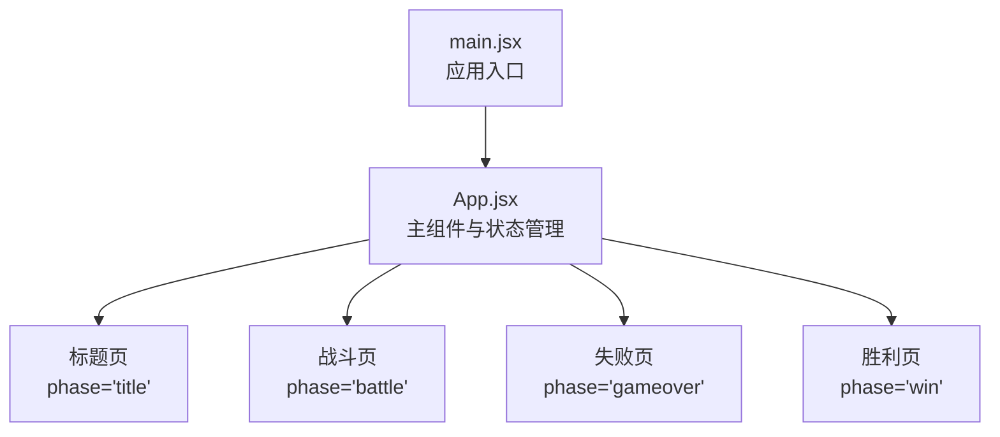
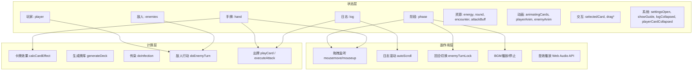
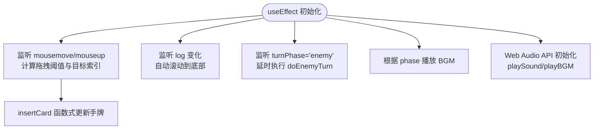
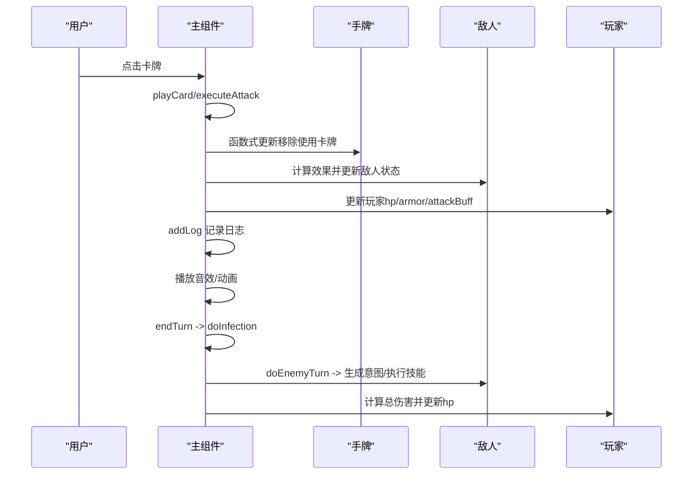
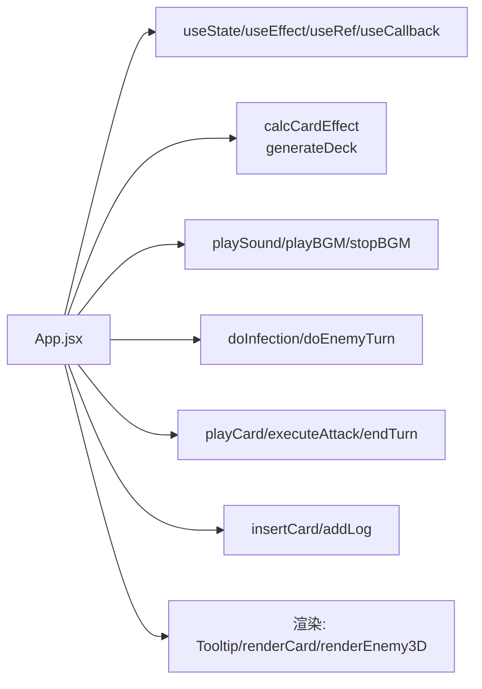

# 游戏状态管理

<cite>
**本文引用的文件**
- [src/App.jsx](file://src/App.jsx)
- [src/main.jsx](file://src/main.jsx)
- [README.md](file://README.md)
- [游戏设计文档.md](file://游戏设计文档.md)
</cite>

## 目录
1. [简介](#简介)
2. [项目结构](#项目结构)
3. [核心组件](#核心组件)
4. [架构总览](#架构总览)
5. [详细组件分析](#详细组件分析)
6. [依赖关系分析](#依赖关系分析)
7. [性能考量](#性能考量)
8. [故障排查指南](#故障排查指南)
9. [结论](#结论)
10. [附录](#附录)

## 简介
本文件面向《小雪闯上海》的React状态管理，系统性梳理其状态结构、更新模式、副作用与性能优化，并给出可操作的最佳实践与扩展建议。文档重点覆盖：
- React Hooks使用模式：useState、useEffect、useRef、useCallback
- 状态同步与闭包陷阱规避
- 核心状态结构：游戏阶段、玩家、敌人、手牌、日志、能量、动画、设置等
- 状态更新模式：函数式更新、ref同步、副作用处理
- 数据流转：父子/兄弟组件通信、全局状态共享
- 持久化与序列化：存档/读档思路与实现建议
- 音效与BGM系统：Web Audio API集成与优化

## 项目结构
项目采用最小化Vite模板，核心入口为App.jsx，主应用挂载于main.jsx。游戏逻辑集中在单一组件内，通过状态驱动UI与战斗流程。

图表来源
- [src/main.jsx:1-8](file://src/main.jsx#L1-L8)
- [src/App.jsx:2040-2086](file://src/App.jsx#L2040-L2086)
- [src/App.jsx:2088-2115](file://src/App.jsx#L2088-L2115)
- [src/App.jsx:2117-2263](file://src/App.jsx#L2117-L2263)
- [src/App.jsx:2265-2747](file://src/App.jsx#L2265-L2747)

章节来源
- [src/main.jsx:1-8](file://src/main.jsx#L1-L8)
- [src/App.jsx:2040-2086](file://src/App.jsx#L2040-L2086)
- [src/App.jsx:2088-2115](file://src/App.jsx#L2088-L2115)
- [src/App.jsx:2117-2263](file://src/App.jsx#L2117-L2263)
- [src/App.jsx:2265-2747](file://src/App.jsx#L2265-L2747)

## 核心组件
主组件XiaoXueGame集中管理全部游戏状态与流程，包含：
- 游戏阶段：title、battle、gameover、win
- 玩家状态：hp、maxHp、armor
- 敌人状态：数组，含hp、maxHp、atk、armor、poison、frozen、nextIntent等
- 手牌状态：数组，含id、name、baseType、power、image、genes、mutated等
- 日志系统：数组，记录战斗与系统事件
- 资源与回合：round、encounter、energy、maxEnergy、attackBuff
- 交互与动画：selectedCard、draggingIdx、dragFrom、animatingCards、playerAnim、enemyAnim
- 系统设置：showInfection、turnPhase、logCollapsed、playerCardCollapsed、settingsOpen、showGuide
- 音效与BGM：AudioContext、BGM播放控制

章节来源
- [src/App.jsx:219-256](file://src/App.jsx#L219-L256)
- [src/App.jsx:220-256](file://src/App.jsx#L220-L256)

## 架构总览
整体采用“单组件集中状态”的函数式架构，通过useState驱动UI，useEffect处理副作用（拖拽、滚动、BGM、回合切换），useRef同步易变状态，useCallback稳定回调以减少重渲染。

图表来源
- [src/App.jsx:219-256](file://src/App.jsx#L219-L256)
- [src/App.jsx:264-335](file://src/App.jsx#L264-L335)
- [src/App.jsx:260-262](file://src/App.jsx#L260-L262)
- [src/App.jsx:990-999](file://src/App.jsx#L990-L999)
- [src/App.jsx:619-720](file://src/App.jsx#L619-L720)
- [src/App.jsx:342-617](file://src/App.jsx#L342-L617)
- [src/App.jsx:169-216](file://src/App.jsx#L169-L216)
- [src/App.jsx:62-89](file://src/App.jsx#L62-L89)
- [src/App.jsx:787-862](file://src/App.jsx#L787-L862)
- [src/App.jsx:864-988](file://src/App.jsx#L864-L988)
- [src/App.jsx:1030-1131](file://src/App.jsx#L1030-L1131)

## 详细组件分析

### 状态结构与初始化
- 阶段与UI：phase控制title/battle/gameover/win四屏
- 玩家：hp/maxHp/armor，回合结束清零护甲
- 敌人：数组，含hp/maxHp/atk/armor/poison/frozen/nextIntent
- 手牌：数组，含id/name/baseType/power/image/genes/mutated
- 资源：round、encounter、energy/maxEnergy、attackBuff
- 动画：animatingCards(Set)、playerAnim/enemyAnim
- 交互：selectedCard/draggingIdx/dragFrom
- 日志：log数组，限制长度并自动滚动

章节来源
- [src/App.jsx:219-256](file://src/App.jsx#L219-L256)
- [src/App.jsx:220-256](file://src/App.jsx#L220-L256)

### Hooks使用模式与状态同步

- useState：用于声明可变状态，如phase、hand、deck、enemies、player、log、energy、turnPhase等
- useEffect：
  - 拖拽：监听window.mousemove/mouseup，计算拖拽阈值与目标索引，插入手牌
  - 日志：监听log变化，自动滚动到底部
  - 敌人回合：监听turnPhase为enemy且未锁定时，延时执行doEnemyTurn
  - BGM：在title/win屏播放loading BGM，在battle屏播放battle BGM
- useRef：
  - 同步易变状态：handRef、draggingIdxRef、mouseDownIdxRef、mouseDownPosRef、hasDraggedRef、enemyTurnLock、logRef、audioContextRef、bgmOscRef、bgmGainRef、bgmIntervalRef
  - 避免闭包陷阱：在回调中读取最新hand状态
- useCallback：
  - 包裹高频回调：insertCard、playSound、playBGM、stopBGM、startGame、drawCards、doInfection、doEnemyTurn、executeAttack、playCard、endTurn、addLog等
  - 通过依赖数组稳定回调，减少子组件重渲染

图表来源
- [src/App.jsx:264-335](file://src/App.jsx#L264-L335)
- [src/App.jsx:260-262](file://src/App.jsx#L260-L262)
- [src/App.jsx:990-999](file://src/App.jsx#L990-L999)
- [src/App.jsx:619-720](file://src/App.jsx#L619-L720)
- [src/App.jsx:342-617](file://src/App.jsx#L342-L617)

章节来源
- [src/App.jsx:264-335](file://src/App.jsx#L264-L335)
- [src/App.jsx:260-262](file://src/App.jsx#L260-L262)
- [src/App.jsx:990-999](file://src/App.jsx#L990-L999)
- [src/App.jsx:619-720](file://src/App.jsx#L619-L720)
- [src/App.jsx:342-617](file://src/App.jsx#L342-L617)

### 状态更新模式与副作用处理

- 函数式更新：drawCards、playCard、executeAttack、doEnemyTurn等均使用函数式setState，避免竞态与丢失更新
- 副作用处理：
  - 拖拽：阈值判断、容器内目标检测、插入动画、全局mouseup收尾
  - 日志：自动滚动、长度限制
  - 敌人回合：状态清理（护甲清零）、意图生成、技能触发、伤害计算、动画与音效
  - BGM：单例控制、播放队列、停止清理
  - 音效：8bit合成、扫频、包络、异常捕获

图表来源
- [src/App.jsx:1133-1293](file://src/App.jsx#L1133-L1293)
- [src/App.jsx:1030-1131](file://src/App.jsx#L1030-L1131)
- [src/App.jsx:787-862](file://src/App.jsx#L787-L862)
- [src/App.jsx:864-988](file://src/App.jsx#L864-L988)
- [src/App.jsx:337-339](file://src/App.jsx#L337-L339)
- [src/App.jsx:342-617](file://src/App.jsx#L342-L617)

章节来源
- [src/App.jsx:1133-1293](file://src/App.jsx#L1133-L1293)
- [src/App.jsx:1030-1131](file://src/App.jsx#L1030-L1131)
- [src/App.jsx:787-862](file://src/App.jsx#L787-L862)
- [src/App.jsx:864-988](file://src/App.jsx#L864-L988)
- [src/App.jsx:337-339](file://src/App.jsx#L337-L339)
- [src/App.jsx:342-617](file://src/App.jsx#L342-L617)

### 数据流转与组件通信
- 父子组件通信：主组件通过props向Tooltip、卡牌、敌人渲染函数传递数据与回调
- 兄弟组件协作：手牌容器与Tooltip共享数据；敌人区域与日志区域通过状态联动
- 全局状态共享：主组件集中持有所有状态，通过回调向下传递，避免跨层级复杂上下文

章节来源
- [src/App.jsx:1302-1416](file://src/App.jsx#L1302-L1416)
- [src/App.jsx:1418-1652](file://src/App.jsx#L1418-L1652)
- [src/App.jsx:1654-1835](file://src/App.jsx#L1654-L1835)

### 状态持久化与序列化机制
当前实现未见本地存储或序列化逻辑。建议扩展方案：
- 存储字段：phase、player、enemies、hand、log、round、encounter、energy、attackBuff、discoveredMutations、settingsOpen、showGuide
- 序列化策略：JSON.stringify/parse，注意日期、Set、函数等不可序列化对象需转换
- 触发时机：endTurn、战斗胜利/失败、退出游戏
- 加载策略：init时检查localStorage，存在则合并到初始状态

章节来源
- [src/App.jsx:219-256](file://src/App.jsx#L219-L256)
- [src/App.jsx:721-746](file://src/App.jsx#L721-L746)

### 音效与BGM系统
- Web Audio API：单例AudioContext，8bit风格合成（方波、锯齿波、三角波、正弦波），扫频与包络控制
- BGM：两套乐谱（loading/battle），定时器播放，支持停止与重播
- 音效：按卡牌与Boss技能分类，统一映射与播放

章节来源
- [src/App.jsx:342-617](file://src/App.jsx#L342-L617)
- [src/App.jsx:619-720](file://src/App.jsx#L619-L720)

## 依赖关系分析

图表来源
- [src/App.jsx:169-216](file://src/App.jsx#L169-L216)
- [src/App.jsx:62-89](file://src/App.jsx#L62-L89)
- [src/App.jsx:342-617](file://src/App.jsx#L342-L617)
- [src/App.jsx:787-862](file://src/App.jsx#L787-L862)
- [src/App.jsx:864-988](file://src/App.jsx#L864-L988)
- [src/App.jsx:1133-1293](file://src/App.jsx#L1133-L1293)
- [src/App.jsx:264-335](file://src/App.jsx#L264-L335)
- [src/App.jsx:1302-1416](file://src/App.jsx#L1302-L1416)

章节来源
- [src/App.jsx:169-216](file://src/App.jsx#L169-L216)
- [src/App.jsx:62-89](file://src/App.jsx#L62-L89)
- [src/App.jsx:342-617](file://src/App.jsx#L342-L617)
- [src/App.jsx:787-862](file://src/App.jsx#L787-L862)
- [src/App.jsx:864-988](file://src/App.jsx#L864-L988)
- [src/App.jsx:1133-1293](file://src/App.jsx#L1133-L1293)
- [src/App.jsx:264-335](file://src/App.jsx#L264-L335)
- [src/App.jsx:1302-1416](file://src/App.jsx#L1302-L1416)

## 性能考量
- 虚拟DOM优化：使用useCallback稳定回调，减少子组件重渲染
- 状态管理优化：useRef同步易变状态，避免闭包陷阱；函数式更新避免竞态
- 动画性能：CSS Keyframes与transform/opacity硬件加速，避免布局重排
- 音效优化：单例AudioContext，低延迟振荡器合成，异常捕获避免阻塞
- 响应式设计：clamp()与vw单位，移动端适配

章节来源
- [src/App.jsx:264-335](file://src/App.jsx#L264-L335)
- [src/App.jsx:260-262](file://src/App.jsx#L260-L262)
- [src/App.jsx:990-999](file://src/App.jsx#L990-L999)
- [src/App.jsx:619-720](file://src/App.jsx#L619-L720)
- [src/App.jsx:342-617](file://src/App.jsx#L342-L617)
- [游戏设计文档.md:188-197](file://游戏设计文档.md#L188-L197)

## 故障排查指南
- 拖拽无效或误触发
  - 检查拖拽阈值与容器目标检测逻辑
  - 确认全局mouseup事件绑定与清理
- 日志不滚动
  - 确认logRef存在且effect已执行
- 敌人回合卡住
  - 检查enemyTurnLock与turnPhase条件
- 音效不播放
  - 检查AudioContext状态与异常捕获
- 卡牌效果异常
  - 检查calcCardEffect参数与mutated标志

章节来源
- [src/App.jsx:264-335](file://src/App.jsx#L264-L335)
- [src/App.jsx:260-262](file://src/App.jsx#L260-L262)
- [src/App.jsx:990-999](file://src/App.jsx#L990-L999)
- [src/App.jsx:342-617](file://src/App.jsx#L342-L617)
- [src/App.jsx:169-216](file://src/App.jsx#L169-L216)

## 结论
该系统以单一组件集中状态为核心，结合useState/useEffect/useRef/useCallback实现高效的状态管理与交互。通过函数式更新、ref同步与useCallback稳定回调，有效规避了常见问题。建议在现有基础上引入持久化与序列化能力，完善存档/读档体验，并进一步细化错误边界与性能监控。

## 附录

### 最佳实践清单
- 使用函数式setState处理依赖前一状态的更新
- 通过useCallback稳定高频回调，减少子组件重渲染
- 使用useRef同步易变状态，避免闭包陷阱
- 在useEffect中统一注册/清理事件与定时器
- 严格区分UI状态与业务状态，避免混用
- 为关键状态添加类型注释与默认值，便于维护

### 扩展指南
- 存档/读档：新增save/load函数，序列化必要字段
- 多语言：引入i18n，将文案集中管理
- 数据统计：记录回合数、伤害、存活率等指标
- 难度系统：新增难度选择与种子管理
- 成就系统：基于状态变化触发成就解锁