# 状态同步机制

<cite>
**本文档引用的文件**
- [src/App.jsx](file://src/App.jsx)
- [src/main.jsx](file://src/main.jsx)
- [package.json](file://package.json)
- [README.md](file://README.md)
</cite>

## 目录
1. [简介](#简介)
2. [项目结构](#项目结构)
3. [核心组件](#核心组件)
4. [架构概览](#架构概览)
5. [详细组件分析](#详细组件分析)
6. [依赖关系分析](#依赖关系分析)
7. [性能考虑](#性能考虑)
8. [故障排除指南](#故障排除指南)
9. [结论](#结论)

## 简介

《小雪闯上海》是一个基于React的卡牌肉鸽游戏，采用先进的状态同步机制来管理复杂的战斗逻辑和用户交互。该项目展示了现代React应用中状态管理的最佳实践，包括useState、useEffect、useRef钩子的协同工作机制，以及如何实现高性能的状态同步和响应式UI更新。

本项目的核心特色包括：
- 实时状态同步与副作用处理
- 高性能的ref容器模式
- 复杂的异步状态处理
- 完整的音频系统集成
- 流畅的动画和视觉反馈

## 项目结构

项目采用简洁而高效的文件组织方式，主要包含以下核心文件：

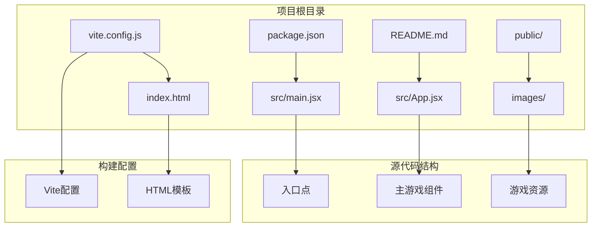

**图表来源**
- [src/main.jsx:1-8](file://src/main.jsx#L1-L8)
- [src/App.jsx:1-2719](file://src/App.jsx#L1-L2719)

**章节来源**
- [package.json:1-28](file://package.json#L1-L28)
- [README.md:1-17](file://README.md#L1-L17)

## 核心组件

### 状态管理架构

项目采用集中式状态管理模式，通过多个useState钩子管理不同类型的游戏状态：

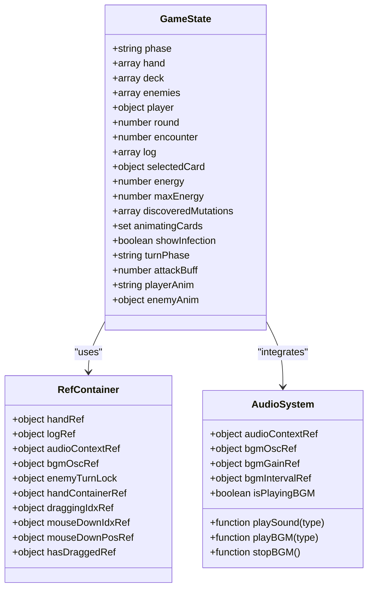

**图表来源**
- [src/App.jsx:219-256](file://src/App.jsx#L219-L256)
- [src/App.jsx:342-352](file://src/App.jsx#L342-L352)
- [src/App.jsx:620-624](file://src/App.jsx#L620-L624)

### 状态同步机制

项目实现了多层次的状态同步机制，确保状态更新的原子性和一致性：

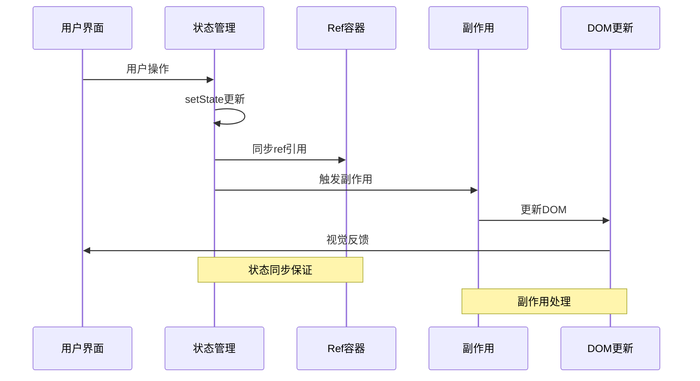

**图表来源**
- [src/App.jsx:222-223](file://src/App.jsx#L222-L223)
- [src/App.jsx:257-262](file://src/App.jsx#L257-L262)

**章节来源**
- [src/App.jsx:219-256](file://src/App.jsx#L219-L256)

## 架构概览

### 状态同步架构

项目采用"状态驱动"的设计模式，通过精确的状态管理实现复杂的交互逻辑：

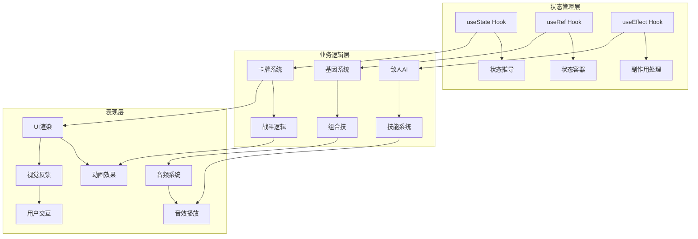

**图表来源**
- [src/App.jsx:1-2719](file://src/App.jsx#L1-L2719)

### 数据流架构

项目实现了清晰的数据流向，确保状态更新的可预测性和可追踪性：

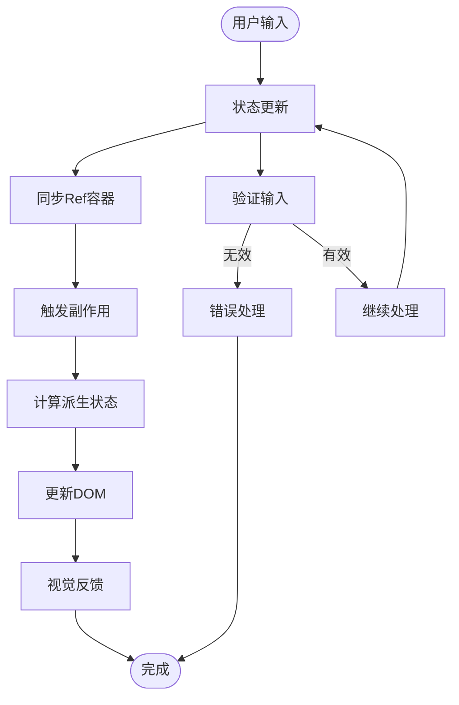

**图表来源**
- [src/App.jsx:265-275](file://src/App.jsx#L265-L275)
- [src/App.jsx:337-339](file://src/App.jsx#L337-L339)

**章节来源**
- [src/App.jsx:1-2719](file://src/App.jsx#L1-L2719)

## 详细组件分析

### 状态容器组件

#### useState状态管理

项目使用useState钩子管理所有游戏状态，实现了细粒度的状态控制：

| 状态类型 | 状态名称 | 数据类型 | 用途 |
|---------|----------|----------|------|
| 游戏阶段 | phase | string | 控制游戏状态切换 |
| 手牌 | hand | array | 玩家手牌列表 |
| 牌库 | deck | array | 剩余牌堆 |
| 敌人 | enemies | array | 当前战斗敌人 |
| 玩家属性 | player | object | HP、护甲等属性 |
| 回合数 | round | number | 当前回合 |
| 关卡进度 | encounter | number | 已击败敌人数量 |
| 日志 | log | array | 战斗日志记录 |
| 能量 | energy | number | 卡牌使用能量 |

#### useRef状态容器

项目巧妙地使用useRef创建状态容器，解决函数组件中的状态访问问题：

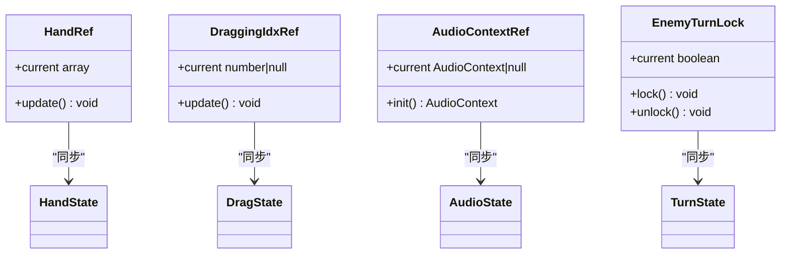

**图表来源**
- [src/App.jsx:222-223](file://src/App.jsx#L222-L223)
- [src/App.jsx:250-255](file://src/App.jsx#L250-L255)
- [src/App.jsx:342-352](file://src/App.jsx#L342-L352)

#### useEffect副作用处理

项目使用useEffect处理各种副作用，包括DOM更新、事件监听和定时器管理：

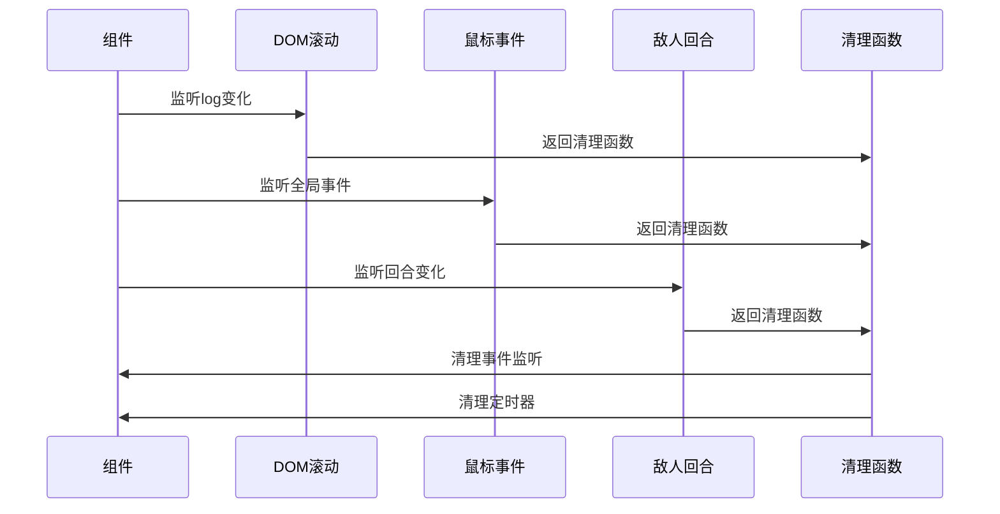

**图表来源**
- [src/App.jsx:260-262](file://src/App.jsx#L260-L262)
- [src/App.jsx:277-335](file://src/App.jsx#L277-L335)
- [src/App.jsx:990-999](file://src/App.jsx#L990-L999)

**章节来源**
- [src/App.jsx:219-256](file://src/App.jsx#L219-L256)
- [src/App.jsx:260-335](file://src/App.jsx#L260-L335)
- [src/App.jsx:990-999](file://src/App.jsx#L990-L999)

### 音频系统组件

#### 音效播放系统

项目实现了复杂的音频系统，包括8bit风格音效和BGM播放：

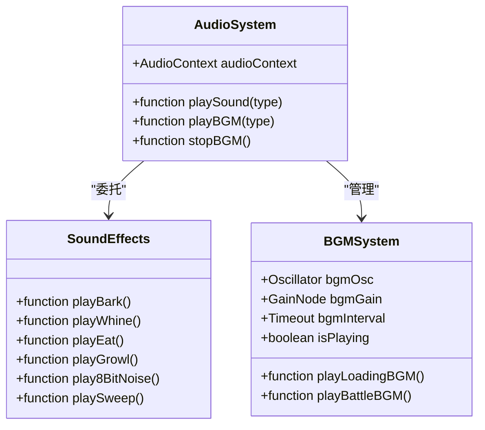

**图表来源**
- [src/App.jsx:342-617](file://src/App.jsx#L342-L617)
- [src/App.jsx:620-719](file://src/App.jsx#L620-L719)

#### 音频上下文管理

音频系统使用useRef管理AudioContext，确保音频资源的有效管理和释放：

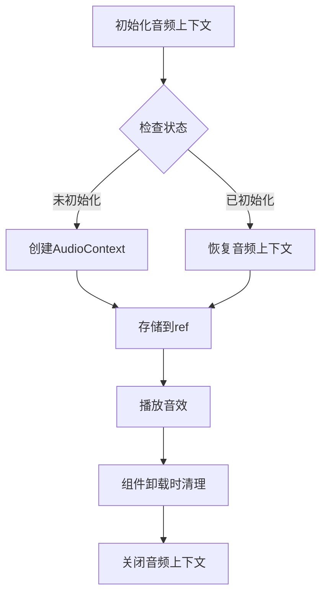

**图表来源**
- [src/App.jsx:344-352](file://src/App.jsx#L344-L352)
- [src/App.jsx:663-675](file://src/App.jsx#L663-L675)

**章节来源**
- [src/App.jsx:342-719](file://src/App.jsx#L342-L719)

### 战斗系统组件

#### 卡牌系统

项目实现了复杂的卡牌系统，包括基因系统、组合技和技能效果：

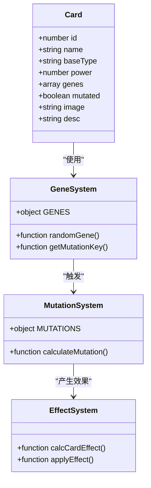

**图表来源**
- [src/App.jsx:9-32](file://src/App.jsx#L9-L32)
- [src/App.jsx:164-216](file://src/App.jsx#L164-L216)

#### 敌人AI系统

项目实现了智能的敌人AI，包括技能决策和状态管理：

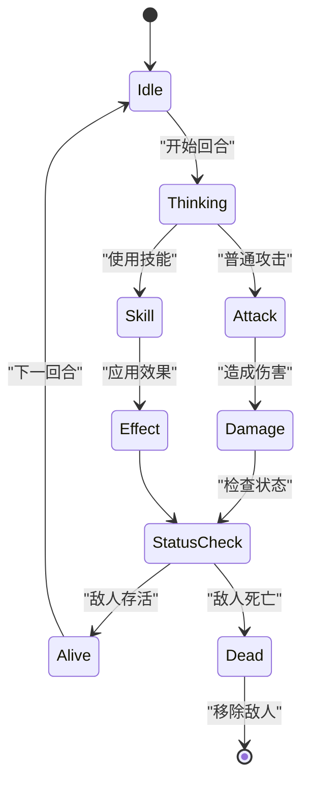

**图表来源**
- [src/App.jsx:865-988](file://src/App.jsx#L865-L988)
- [src/App.jsx:990-1028](file://src/App.jsx#L990-L1028)

**章节来源**
- [src/App.jsx:9-32](file://src/App.jsx#L9-L32)
- [src/App.jsx:164-216](file://src/App.jsx#L164-L216)
- [src/App.jsx:865-1028](file://src/App.jsx#L865-L1028)

### 用户交互组件

#### 拖拽系统

项目实现了流畅的拖拽交互，使用useRef和useEffect结合实现：

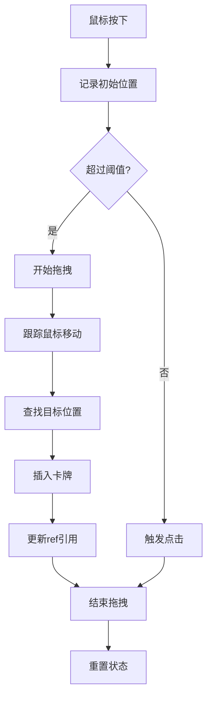

**图表来源**
- [src/App.jsx:277-335](file://src/App.jsx#L277-L335)
- [src/App.jsx:1133-1293](file://src/App.jsx#L1133-L1293)

#### 提示系统

项目实现了响应式的提示系统，支持鼠标和触摸设备：

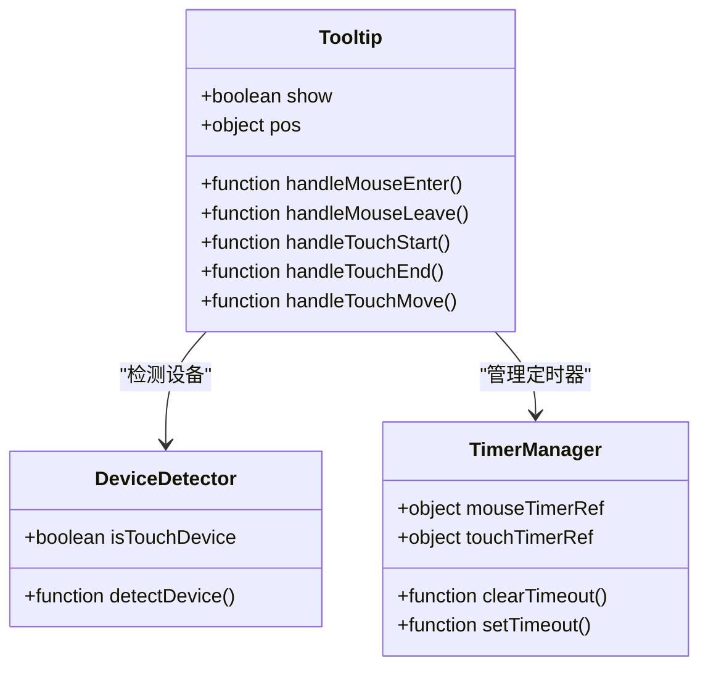

**图表来源**
- [src/App.jsx:1302-1407](file://src/App.jsx#L1302-L1407)
- [src/App.jsx:1314-1373](file://src/App.jsx#L1314-L1373)

**章节来源**
- [src/App.jsx:277-335](file://src/App.jsx#L277-L335)
- [src/App.jsx:1302-1407](file://src/App.jsx#L1302-L1407)

## 依赖关系分析

### React生态系统

项目依赖于现代React生态系统，使用最新的React特性：

```mermaid
graph TB
subgraph "React生态"
A[React 19.2.4] --> B[React DOM 19.2.4]
C[React Compiler] --> D[开发体验]
E[Vite 8.0.1] --> F[构建工具]
G[ESLint 9.39.4] --> H[代码质量]
end
subgraph "开发工具"
I[@vitejs/plugin-react] --> J[React插件]
K[React Hooks] --> L[状态管理]
M[React Refresh] --> N[热重载]
end
A --> C
F --> I
L --> K
```

**图表来源**
- [package.json:12-15](file://package.json#L12-L15)
- [package.json:20-25](file://package.json#L20-L25)

### 核心依赖关系

项目的关键依赖关系确保了状态同步的可靠性和性能：

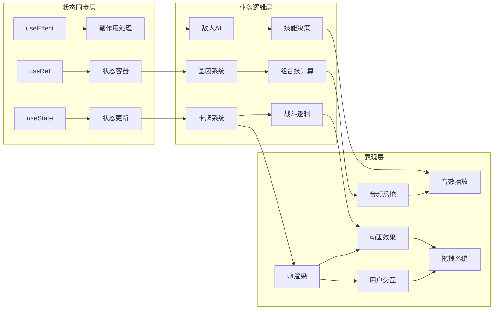

**图表来源**
- [src/App.jsx:1-2719](file://src/App.jsx#L1-L2719)

**章节来源**
- [package.json:1-28](file://package.json#L1-L28)

## 性能考虑

### 状态更新优化

项目采用了多种性能优化策略来确保状态同步的高效性：

#### 原子性状态更新

```javascript
// 使用函数式更新确保状态原子性
setHand(prev => {
  const card = prev[fromIdx];
  const withoutCard = prev.filter((_, i) => i !== fromIdx);
  const insertPos = toIdx > fromIdx ? toIdx - 1 : toIdx;
  const next = [...withoutCard.slice(0, insertPos), card, ...withoutCard.slice(insertPos)];
  return next;
});
```

#### 引用稳定性优化

```javascript
// 使用useRef保持引用稳定
useEffect(() => { handRef.current = hand; }, [hand]);
useEffect(() => { draggingIdxRef.current = draggingIdx; }, [draggingIdx]);
```

#### 副作用清理

```javascript
// 正确清理副作用防止内存泄漏
return () => {
  window.removeEventListener('mousemove', handleMouseMove);
  window.removeEventListener('mouseup', handleGlobalMouseUp);
  clearTimeout(timer);
};
```

### 内存管理策略

项目实现了完善的内存管理策略：

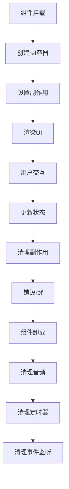

**图表来源**
- [src/App.jsx:277-335](file://src/App.jsx#L277-L335)
- [src/App.jsx:663-675](file://src/App.jsx#L663-L675)

## 故障排除指南

### 常见问题诊断

#### 状态不同步问题

**症状**: UI显示与预期不符，状态更新后未反映到界面

**解决方案**:
1. 检查状态更新是否使用函数式更新
2. 确认useRef引用是否正确同步
3. 验证副作用是否正确清理

#### 内存泄漏问题

**症状**: 组件卸载后仍占用内存，CPU使用率异常

**解决方案**:
1. 确保所有事件监听器都有对应的清理函数
2. 检查定时器是否正确清理
3. 验证AudioContext是否正确关闭

#### 性能问题

**症状**: 页面卡顿，状态更新响应缓慢

**解决方案**:
1. 使用useCallback缓存回调函数
2. 优化状态更新的复杂度
3. 检查不必要的重渲染

### 调试技巧

#### 状态追踪

```javascript
// 在关键状态更新处添加日志
const addLog = useCallback((msg) => {
  console.log(`[状态更新] ${msg}`);
  setLog(prev => [...prev.slice(-30), msg]);
}, []);
```

#### 性能监控

```javascript
// 监控状态更新性能
const startTime = performance.now();
setHand(prev => [...prev, card]);
const endTime = performance.now();
console.log(`手牌更新耗时: ${endTime - startTime}ms`);
```

#### 问题排查方法

1. **使用React DevTools**观察组件渲染次数
2. **启用严格模式**检测意外副作用
3. **使用Profiler**分析性能瓶颈
4. **检查控制台错误**定位具体问题

**章节来源**
- [src/App.jsx:337-339](file://src/App.jsx#L337-L339)

## 结论

《小雪闯上海》项目展示了现代React应用中状态同步机制的最高实践。通过精心设计的状态管理架构、高效的ref容器模式和完善的副作用处理，项目实现了复杂游戏逻辑的流畅运行。

### 主要成就

1. **状态同步架构**: 实现了多层级状态同步，确保状态更新的原子性和一致性
2. **性能优化**: 通过useRef容器和函数式更新实现了高性能的状态管理
3. **用户体验**: 提供了流畅的拖拽交互、丰富的音效系统和视觉反馈
4. **代码质量**: 采用了最佳实践，包括正确的副作用清理和内存管理

### 技术亮点

- **useState + useRef + useEffect**的完美结合
- **函数式状态更新**确保状态原子性
- **useRef容器**解决状态访问问题
- **完善的副作用清理**防止内存泄漏
- **高性能的音频系统**集成

这个项目为React状态管理提供了优秀的参考案例，展示了如何在复杂应用场景中实现可靠的、高性能的状态同步机制。