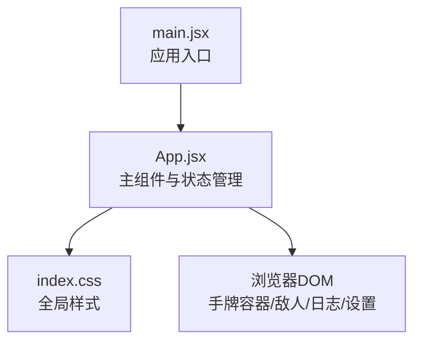
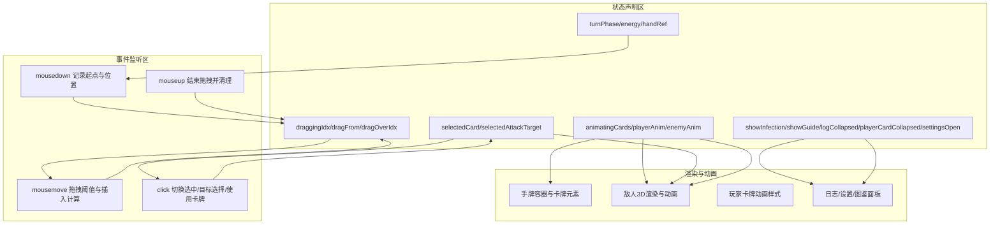
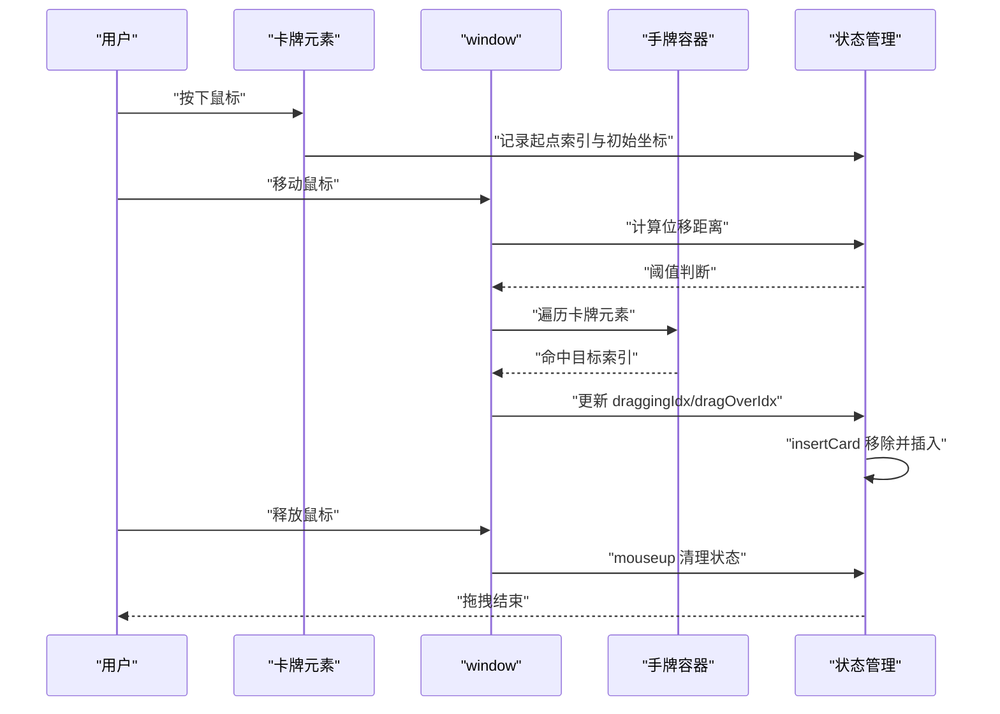
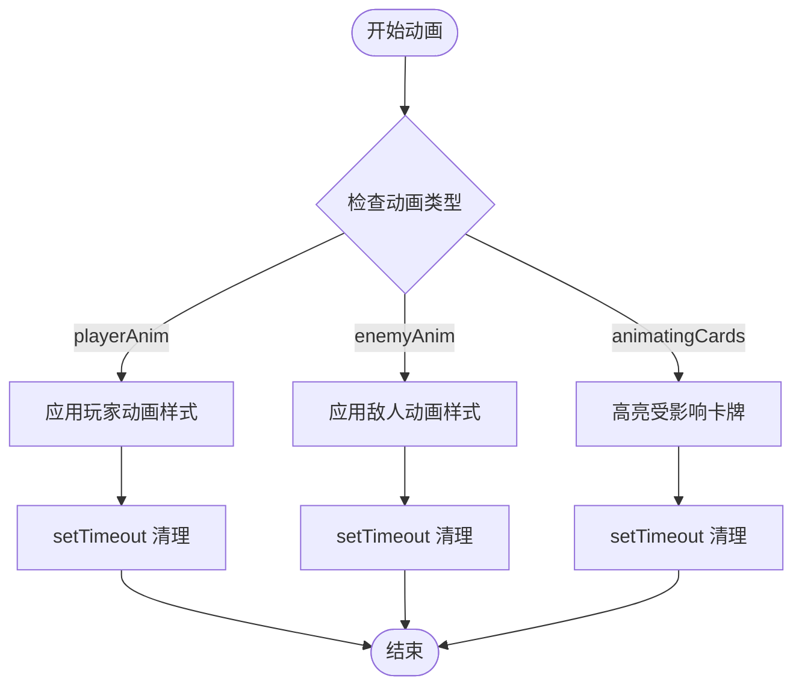
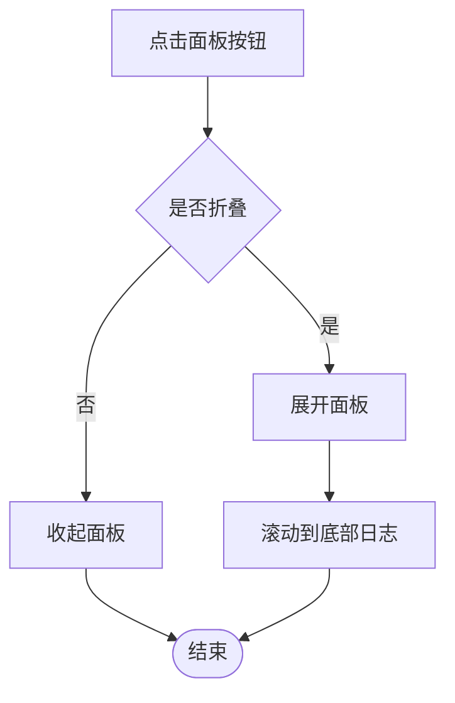
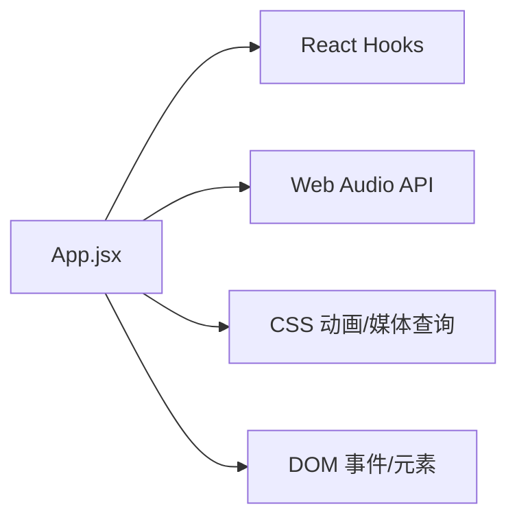

# 界面交互状态

<cite>
**本文引用的文件**
- [src/App.jsx](file://src/App.jsx)
- [src/main.jsx](file://src/main.jsx)
- [src/index.css](file://src/index.css)
- [README.md](file://README.md)
</cite>

## 目录
1. [简介](#简介)
2. [项目结构](#项目结构)
3. [核心组件与状态总览](#核心组件与状态总览)
4. [架构概览](#架构概览)
5. [详细组件分析](#详细组件分析)
6. [依赖关系分析](#依赖关系分析)
7. [性能考量](#性能考量)
8. [故障排查指南](#故障排查指南)
9. [结论](#结论)
10. [附录](#附录)

## 简介
本文件聚焦于《小雪闯上海》的界面交互状态管理，系统性梳理拖拽状态（draggingIdx、dragFrom、dragOverIdx）、选中状态（selectedCard、selectedAttackTarget）、动画状态（animatingCards、playerAnim、enemyAnim）、界面显示状态（showInfection、showGuide、logCollapsed、playerCardCollapsed、settingsOpen）等。文档深入解析拖拽系统的实现机制（鼠标事件监听、拖拽阈值判断、插入位置计算与状态同步），解释动画状态管理（CSS动画触发、动画状态清理与性能优化），说明界面显示控制（折叠面板切换、模态框显示与响应式布局适配），并总结交互状态管理的最佳实践（状态一致性、事件处理优化与用户体验提升策略）。文末提供可定位到源码的路径示例，帮助读者快速定位实现细节。

## 项目结构
- 项目采用 React + Vite 的前端工程，入口为 main.jsx，主组件为 App.jsx，全局样式在 index.css。
- 游戏核心逻辑集中在 App.jsx 中，包含状态声明、事件处理、渲染与动画控制。

图表来源
- [src/main.jsx:1-8](file://src/main.jsx#L1-L8)
- [src/App.jsx:219-2719](file://src/App.jsx#L219-L2719)
- [src/index.css:1-9](file://src/index.css#L1-L9)

章节来源
- [src/main.jsx:1-8](file://src/main.jsx#L1-L8)
- [src/index.css:1-9](file://src/index.css#L1-L9)
- [README.md:1-17](file://README.md#L1-L17)

## 核心组件与状态总览
本节对界面交互相关的关键状态进行分类与说明，并给出其职责与典型更新路径。

- 拖拽状态
  - draggingIdx：当前被拖拽的卡牌索引；用于视觉反馈与插入计算。
  - dragFrom：拖拽起点索引；用于记录初始位置。
  - dragOverIdx：当前悬停目标索引；用于插入位置计算。
  - 相关实现：鼠标按下记录起点与初始位置；mousemove检测阈值后进入拖拽；遍历手牌容器中的卡牌元素，命中即更新插入位置；mouseup统一结束拖拽并清理状态。
  - 示例路径
    - [拖拽阈值与容器检测:277-335](file://src/App.jsx#L277-L335)
    - [插入位置计算与状态同步:264-275](file://src/App.jsx#L264-L275)

- 选中状态
  - selectedCard：当前选中的手牌索引；用于目标选择模式与使用按钮启用。
  - selectedAttackTarget：当前攻击目标索引；用于攻击型卡牌的目标选择。
  - 相关实现：点击卡牌在非拖拽情况下切换选中；攻击型卡牌未触发组合技时进入目标选择模式；点击敌人完成执行。
  - 示例路径
    - [点击卡牌切换选中:1479-1484](file://src/App.jsx#L1479-L1484)
    - [目标选择模式与执行攻击:1683-1687](file://src/App.jsx#L1683-L1687)

- 动画状态
  - animatingCards：Set，记录正在“技能传染”期间需要动画的卡牌ID；用于视觉强调与后续清理。
  - playerAnim：字符串，玩家动画类型（attack/defend/heal/hit）；用于玩家卡牌与UI的动画样式。
  - enemyAnim：对象映射，键为敌人索引，值为动画类型（attack/hit）；用于敌人受击与攻击动画。
  - 相关实现：使用 setTimeout 清理 playerAnim/enemyAnim；在“技能传染”阶段设置 animatingCards 并延时清理；根据动画类型动态计算样式。
  - 示例路径
    - [设置与清理玩家动画:1031-1043](file://src/App.jsx#L1031-L1043)
    - [设置与清理敌人动画:939-963](file://src/App.jsx#L939-L963)
    - [技能传染动画状态:853-861](file://src/App.jsx#L853-L861)

- 界面显示状态
  - showInfection：布尔，控制“技能传授”遮罩层显示。
  - showGuide：布尔，控制图鉴弹窗显示。
  - logCollapsed：布尔，控制日志面板折叠/展开。
  - playerCardCollapsed：布尔，控制玩家信息面板折叠/展开。
  - settingsOpen：布尔，控制设置菜单展开。
  - 相关实现：通过点击切换；日志面板点击空白区域展开；玩家信息面板折叠按钮切换；设置菜单展开/收起。
  - 示例路径
    - [技能传染遮罩显示:2270-2275](file://src/App.jsx#L2270-L2275)
    - [日志面板折叠/展开:1990-2029](file://src/App.jsx#L1990-L2029)
    - [玩家信息面板折叠/展开:1857-1973](file://src/App.jsx#L1857-L1973)
    - [设置菜单展开/收起:2312-2362](file://src/App.jsx#L2312-L2362)

- 其他交互相关状态
  - turnPhase：回合阶段（player/enemy/infecting）；影响UI可用性与行为。
  - energy/maxEnergy：能量值与上限；影响卡牌使用与回合结束。
  - handRef/deck/round/enemies/player/log/discoveredMutations/attackBuff 等：支撑交互与战斗流程的状态。

章节来源
- [src/App.jsx:219-2719](file://src/App.jsx#L219-L2719)

## 架构概览
下图展示界面交互状态在组件内的组织方式与关键事件流。

图表来源
- [src/App.jsx:219-2719](file://src/App.jsx#L219-L2719)

## 详细组件分析

### 拖拽系统实现机制
- 鼠标事件监听
  - 在卡牌元素上绑定 mousedown 记录起点索引与初始坐标；在 window 上绑定 mousemove 检测拖拽阈值；在 window 上绑定 mouseup 结束拖拽。
  - 示例路径
    - [记录起点与初始坐标:1471-1478](file://src/App.jsx#L1471-L1478)
    - [全局 mousemove 拖拽阈值与插入计算:277-335](file://src/App.jsx#L277-L335)
    - [全局 mouseup 结束拖拽:322-335](file://src/App.jsx#L322-L335)

- 拖拽阈值判断
  - 计算鼠标位移距离，小于阈值（像素级）不视为拖拽，避免误触。
  - 示例路径
    - [阈值判断与首次拖拽触发:283-310](file://src/App.jsx#L283-L310)

- 插入位置计算
  - 遍历手牌容器中的卡牌元素，命中即更新插入位置；使用 insertCard 将卡牌从原位置移除并在目标位置插入，保持顺序一致。
  - 示例路径
    - [插入位置计算与状态同步:264-275](file://src/App.jsx#L264-L275)
    - [容器内卡牌命中检测:294-315](file://src/App.jsx#L294-L315)

- 状态同步与清理
  - draggingIdx/dragFrom/dragOverIdx 在拖拽过程中持续更新；mouseup 后统一清理，同时延迟重置 hasDraggedRef，确保 click 不误判。
  - 示例路径
    - [mouseup 清理与延迟重置:322-335](file://src/App.jsx#L322-L335)

图表来源
- [src/App.jsx:1471-1478](file://src/App.jsx#L1471-L1478)
- [src/App.jsx:277-335](file://src/App.jsx#L277-L335)
- [src/App.jsx:264-275](file://src/App.jsx#L264-L275)

章节来源
- [src/App.jsx:1471-1478](file://src/App.jsx#L1471-L1478)
- [src/App.jsx:277-335](file://src/App.jsx#L277-L335)
- [src/App.jsx:264-275](file://src/App.jsx#L264-L275)

### 动画状态管理
- CSS 动画触发
  - playerAnim：根据类型（attack/defend/heal/hit）动态计算样式，配合 CSS keyframes 实现攻击、防御、回血、受击等动画。
  - enemyAnim：按敌人索引映射动画类型，触发攻击/受击特效与位移动画。
  - animatingCards：在“技能传染”阶段将受影响卡牌ID加入集合，渲染时应用强调样式，随后延时清理。
  - 示例路径
    - [玩家动画样式计算:1829-1842](file://src/App.jsx#L1829-L1842)
    - [敌人动画设置与清理:939-963](file://src/App.jsx#L939-L963)
    - [技能传染动画状态设置与清理:853-861](file://src/App.jsx#L853-L861)

- 动画状态清理与性能优化
  - 使用 setTimeout 清理 playerAnim/enemyAnim，避免内存泄漏与持续重绘。
  - animatingCards 在传染完成后清空，减少不必要的渲染开销。
  - 示例路径
    - [setTimeout 清理动画状态:953-962](file://src/App.jsx#L953-L962)
    - [传染后清理 animatingCards:857-861](file://src/App.jsx#L857-L861)

图表来源
- [src/App.jsx:1829-1842](file://src/App.jsx#L1829-L1842)
- [src/App.jsx:939-963](file://src/App.jsx#L939-L963)
- [src/App.jsx:853-861](file://src/App.jsx#L853-L861)

章节来源
- [src/App.jsx:1829-1842](file://src/App.jsx#L1829-L1842)
- [src/App.jsx:939-963](file://src/App.jsx#L939-L963)
- [src/App.jsx:853-861](file://src/App.jsx#L853-L861)

### 界面显示控制
- 折叠面板切换
  - 日志面板：点击展开/收起；滚动到底部自动跟随最新日志。
  - 玩家信息面板：点击折叠按钮切换；折叠状态下仅显示关键状态。
  - 示例路径
    - [日志面板展开/收起与滚动:1990-2029](file://src/App.jsx#L1990-L2029)
    - [玩家信息面板折叠/展开:1857-1973](file://src/App.jsx#L1857-L1973)

- 模态框显示
  - 图鉴弹窗：设置菜单中打开；点击外部或关闭按钮关闭。
  - 技能传授遮罩：在传染阶段显示，带动画。
  - 示例路径
    - [图鉴弹窗开关:2364-2491](file://src/App.jsx#L2364-L2491)
    - [技能传授遮罩显示:2270-2275](file://src/App.jsx#L2270-L2275)

- 响应式布局适配
  - 手牌容器与卡牌尺寸随视口变化；敌人状态条在小屏时调整位置与方向。
  - 示例路径
    - [手牌容器与卡牌样式:2600-2676](file://src/App.jsx#L2600-L2676)
    - [小屏适配规则:2627-2675](file://src/App.jsx#L2627-L2675)

图表来源
- [src/App.jsx:1990-2029](file://src/App.jsx#L1990-L2029)
- [src/App.jsx:1857-1973](file://src/App.jsx#L1857-L1973)

章节来源
- [src/App.jsx:1990-2029](file://src/App.jsx#L1990-L2029)
- [src/App.jsx:1857-1973](file://src/App.jsx#L1857-L1973)
- [src/App.jsx:2270-2275](file://src/App.jsx#L2270-L2275)
- [src/App.jsx:2600-2676](file://src/App.jsx#L2600-L2676)

### 交互状态最佳实践
- 状态一致性保证
  - 使用 useRef 同步 draggingIdx 等易变状态，避免闭包陷阱导致的竞态。
  - 使用 useCallback 包裹事件处理函数，减少重渲染。
  - 示例路径
    - [draggingIdxRef 同步:258-258](file://src/App.jsx#L258-L258)
    - [insertCard useCallback:264-275](file://src/App.jsx#L264-L275)

- 事件处理优化
  - 在全局 window 上注册 mousemove/mouseup，避免事件丢失。
  - 使用 hasDraggedRef 防止拖拽后误触发 click。
  - 示例路径
    - [全局 mousemove 注册与清理:318-320](file://src/App.jsx#L318-L320)
    - [全局 mouseup 注册与清理:333-335](file://src/App.jsx#L333-L335)
    - [拖拽后延迟重置 hasDraggedRef:331-332](file://src/App.jsx#L331-L332)

- 用户体验提升策略
  - 拖拽阈值避免误触；选中态与目标选择态明确区分；动画反馈及时且可控。
  - 日志自动滚动、玩家信息折叠、设置菜单快捷入口。
  - 示例路径
    - [拖拽阈值:287-290](file://src/App.jsx#L287-L290)
    - [日志自动滚动:260-262](file://src/App.jsx#L260-L262)
    - [玩家信息折叠按钮:1857-1870](file://src/App.jsx#L1857-L1870)

章节来源
- [src/App.jsx:258-258](file://src/App.jsx#L258-L258)
- [src/App.jsx:264-275](file://src/App.jsx#L264-L275)
- [src/App.jsx:318-335](file://src/App.jsx#L318-L335)
- [src/App.jsx#L331-L332:331-332](file://src/App.jsx#L331-L332)
- [src/App.jsx#L287-L290:287-290](file://src/App.jsx#L287-L290)
- [src/App.jsx#L260-L262:260-262](file://src/App.jsx#L260-L262)
- [src/App.jsx#L1857-L1870:1857-1870](file://src/App.jsx#L1857-L1870)

## 依赖关系分析
- 组件耦合
  - App.jsx 是唯一主组件，内部集中管理所有交互状态与事件处理，耦合度较高但职责清晰。
  - 通过 props 传递索引与数据，如 renderCard/renderEnemy3D 接收索引参数，便于事件回调定位。
- 外部依赖
  - React Hooks（useState/useCallback/useEffect/useRef）用于状态与副作用管理。
  - Web Audio API 用于音效与BGM播放。
  - CSS 动画与媒体查询用于响应式与视觉反馈。

图表来源
- [src/App.jsx:1-20](file://src/App.jsx#L1-L20)
- [src/App.jsx:341-720](file://src/App.jsx#L341-L720)
- [src/App.jsx:2558-2676](file://src/App.jsx#L2558-L2676)

章节来源
- [src/App.jsx:1-20](file://src/App.jsx#L1-L20)
- [src/App.jsx:341-720](file://src/App.jsx#L341-L720)
- [src/App.jsx:2558-2676](file://src/App.jsx#L2558-L2676)

## 性能考量
- 渲染优化
  - 使用 useCallback 包裹事件处理函数，减少子组件重渲染。
  - 使用 useRef 缓存 hand 与 draggingIdx，避免闭包陷阱引发的无效更新。
  - 示例路径
    - [handRef 同步:223-223](file://src/App.jsx#L223-L223)
    - [draggingIdxRef 同步:258-258](file://src/App.jsx#L258-L258)

- 动画性能
  - 使用 will-change/transform-origin 等属性优化拖拽卡牌的渲染性能。
  - CSS 动画与 setTimeout 控制动画生命周期，避免长时间运行的动画。
  - 示例路径
    - [卡牌拖拽优化样式:2577-2589](file://src/App.jsx#L2577-L2589)
    - [卡牌插入动画:2591-2598](file://src/App.jsx#L2591-L2598)

- 事件处理
  - 在全局 window 上注册与清理事件，避免频繁挂载/卸载带来的性能损耗。
  - 示例路径
    - [全局 mousemove 注册与清理:318-320](file://src/App.jsx#L318-L320)
    - [全局 mouseup 注册与清理:333-335](file://src/App.jsx#L333-L335)

章节来源
- [src/App.jsx:223-223](file://src/App.jsx#L223-L223)
- [src/App.jsx:258-258](file://src/App.jsx#L258-L258)
- [src/App.jsx:2577-2598](file://src/App.jsx#L2577-L2598)
- [src/App.jsx:318-335](file://src/App.jsx#L318-L335)

## 故障排查指南
- 拖拽无效或误触发
  - 检查鼠标按下事件是否正确记录起点与初始坐标。
  - 确认拖拽阈值是否合理，避免误触。
  - 检查 mousemove 是否在 window 上注册，mouseup 是否清理。
  - 示例路径
    - [记录起点与初始坐标:1471-1478](file://src/App.jsx#L1471-L1478)
    - [阈值判断:287-290](file://src/App.jsx#L287-L290)
    - [全局 mousemove 注册与清理:318-320](file://src/App.jsx#L318-L320)
    - [全局 mouseup 注册与清理:333-335](file://src/App.jsx#L333-L335)

- 插入位置异常
  - 检查 insertCard 的插入位置计算逻辑与边界条件。
  - 确认 dragOverIdx 是否正确更新。
  - 示例路径
    - [插入位置计算:264-275](file://src/App.jsx#L264-L275)
    - [dragOverIdx 更新:309-312](file://src/App.jsx#L309-L312)

- 动画不消失或闪烁
  - 检查 setTimeout 是否正确清理 playerAnim/enemyAnim。
  - 确认 animatingCards 在传染后是否清空。
  - 示例路径
    - [清理 playerAnim:1042-1043](file://src/App.jsx#L1042-L1043)
    - [清理 enemyAnim:953-957](file://src/App.jsx#L953-L957)
    - [清理 animatingCards:857-861](file://src/App.jsx#L857-L861)

- 界面显示异常
  - 检查 logCollapsed/playerCardCollapsed/settingsOpen 的切换逻辑。
  - 确认媒体查询与容器样式是否正确。
  - 示例路径
    - [日志面板切换:1990-2029](file://src/App.jsx#L1990-L2029)
    - [玩家信息面板切换:1857-1973](file://src/App.jsx#L1857-L1973)
    - [小屏适配样式:2627-2675](file://src/App.jsx#L2627-L2675)

章节来源
- [src/App.jsx:1471-1478](file://src/App.jsx#L1471-L1478)
- [src/App.jsx#L287-L290:287-290](file://src/App.jsx#L287-L290)
- [src/App.jsx#L318-L335:318-335](file://src/App.jsx#L318-L335)
- [src/App.jsx#L264-L275:264-275](file://src/App.jsx#L264-L275)
- [src/App.jsx#L1042-L1043:1042-1043](file://src/App.jsx#L1042-L1043)
- [src/App.jsx#L953-L957:953-957](file://src/App.jsx#L953-L957)
- [src/App.jsx#L857-L861:857-861](file://src/App.jsx#L857-L861)
- [src/App.jsx#L1990-L2029:1990-2029](file://src/App.jsx#L1990-L2029)
- [src/App.jsx#L1857-L1973:1857-1973](file://src/App.jsx#L1857-L1973)
- [src/App.jsx#L2627-L2675:2627-2675](file://src/App.jsx#L2627-L2675)

## 结论
《小雪闯上海》的界面交互状态管理以 App.jsx 为核心，围绕拖拽、选中、动画与显示四大维度构建。通过阈值判断、插入位置计算与状态同步，实现了流畅的卡牌拖拽体验；通过 CSS 动画与 setTimeout 清理，保障了动画的可控与性能；通过折叠面板与模态框，提升了信息密度与可访问性。建议在后续迭代中进一步拆分功能模块、引入更细粒度的状态切分与事件封装，以增强可维护性与可测试性。

## 附录
- 代码示例路径（不含具体代码内容，仅提供定位）
  - [拖拽阈值与容器检测:277-335](file://src/App.jsx#L277-L335)
  - [插入位置计算与状态同步:264-275](file://src/App.jsx#L264-L275)
  - [点击卡牌切换选中:1479-1484](file://src/App.jsx#L1479-L1484)
  - [目标选择模式与执行攻击:1683-1687](file://src/App.jsx#L1683-L1687)
  - [玩家动画样式计算:1829-1842](file://src/App.jsx#L1829-L1842)
  - [敌人动画设置与清理:939-963](file://src/App.jsx#L939-L963)
  - [技能传染动画状态设置与清理:853-861](file://src/App.jsx#L853-L861)
  - [日志面板展开/收起与滚动:1990-2029](file://src/App.jsx#L1990-L2029)
  - [玩家信息面板折叠/展开:1857-1973](file://src/App.jsx#L1857-L1973)
  - [图鉴弹窗开关:2364-2491](file://src/App.jsx#L2364-L2491)
  - [技能传授遮罩显示:2270-2275](file://src/App.jsx#L2270-L2275)
  - [手牌容器与卡牌样式:2600-2676](file://src/App.jsx#L2600-L2676)
  - [小屏适配规则:2627-2675](file://src/App.jsx#L2627-L2675)