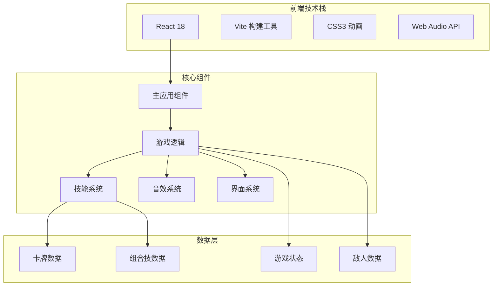
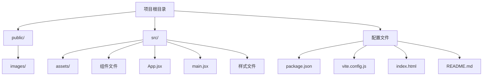
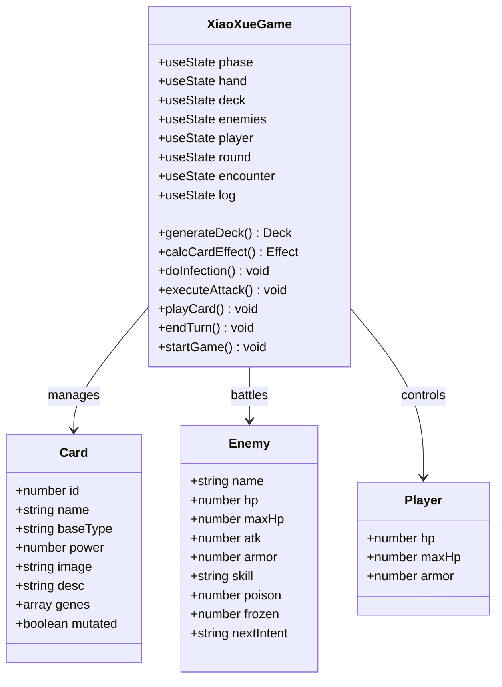
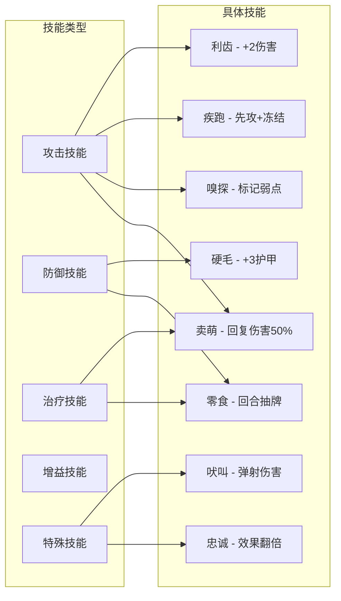
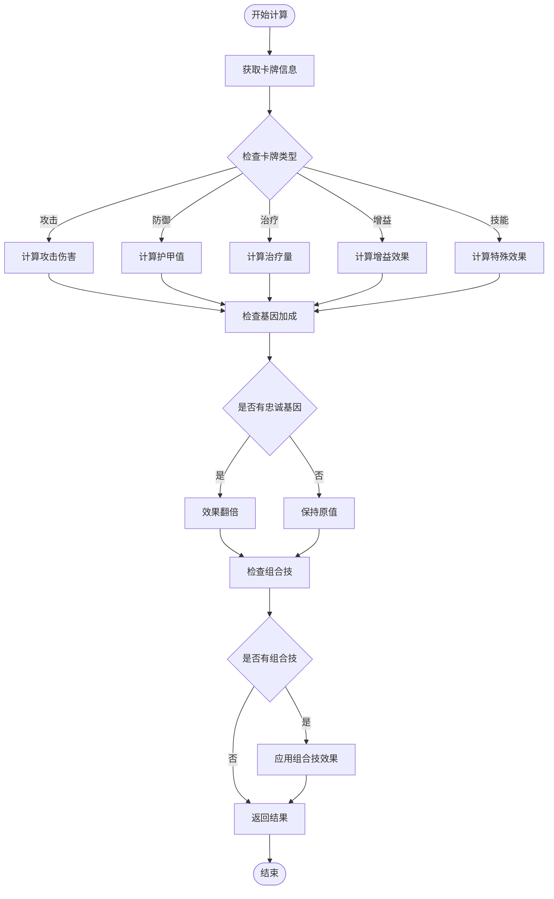
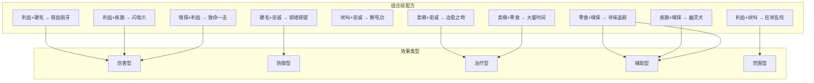
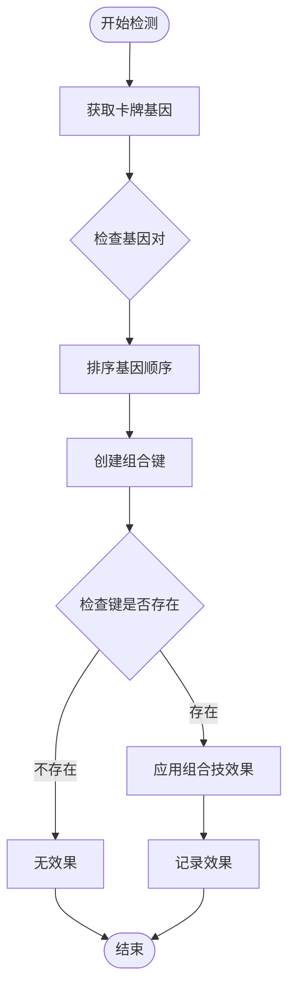
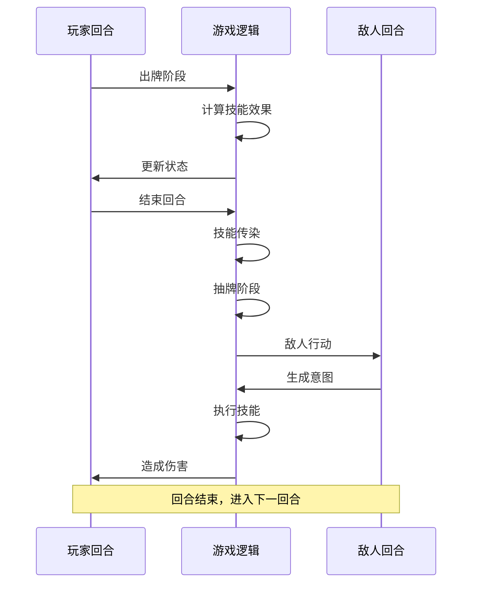
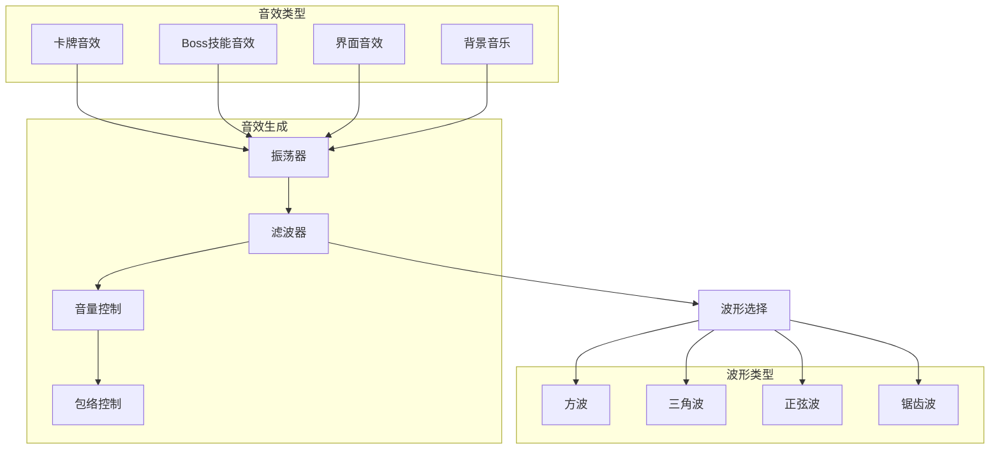

# 狗狗技能系统

<cite>
**本文档引用的文件**
- [README.md](file://README.md)
- [游戏设计文档.md](file://游戏设计文档.md)
- [src/App.jsx](file://src/App.jsx)
- [src/main.jsx](file://src/main.jsx)
- [src/index.css](file://src/index.css)
- [index.html](file://index.html)
- [vite.config.js](file://vite.config.js)
- [package.json](file://package.json)
</cite>

## 目录
1. [项目概述](#项目概述)
2. [系统架构](#系统架构)
3. [核心组件](#核心组件)
4. [技能系统详解](#技能系统详解)
5. [基因系统](#基因系统)
6. [组合技系统](#组合技系统)
7. [战斗机制](#战斗机制)
8. [音效系统](#音效系统)
9. [用户界面](#用户界面)
10. [性能优化](#性能优化)
11. [总结](#总结)

## 项目概述

《小雪闯上海》是一款以雪纳瑞犬"小雪"为主角的卡牌Roguelike游戏。游戏采用React 18 + Vite技术栈，结合Web Audio API实现了独特的8bit风格音效系统。玩家扮演一只可爱的雪纳瑞犬，在上海街头冒险，通过卡牌战斗系统击败各种敌人，最终安全回家。

游戏的核心创新在于将传统的卡牌Roguelike与"狗狗技能"概念相结合，每张卡牌都带有独特的狗狗技能效果，形成了丰富多样的Build构筑体验。

## 系统架构

### 技术栈架构



**架构图来源**
- [src/App.jsx:1-50](file://src/App.jsx#L1-L50)
- [src/main.jsx:1-8](file://src/main.jsx#L1-L8)

### 项目结构



**架构图来源**
- [package.json:1-28](file://package.json#L1-L28)
- [vite.config.js:1-8](file://vite.config.js#L1-L8)

**章节来源**
- [README.md:1-17](file://README.md#L1-L17)
- [游戏设计文档.md:1-250](file://游戏设计文档.md#L1-L250)

## 核心组件

### 主应用组件架构



**类图来源**
- [src/App.jsx:219-2710](file://src/App.jsx#L219-L2710)

### 状态管理系统

游戏采用React Hooks实现状态管理，主要状态包括：

- **游戏阶段状态**：title、battle、gameover、win
- **玩家状态**：生命值、护甲、能量
- **卡牌状态**：手牌、牌库、基因、组合技
- **敌人状态**：血量、护甲、状态效果
- **系统状态**：回合数、关卡数、日志

**章节来源**
- [src/App.jsx:219-2710](file://src/App.jsx#L219-L2710)

## 技能系统详解

### 狗狗技能类型

游戏中的"狗狗技能"系统是整个游戏的核心创新，每种技能都有独特的视觉表现和效果：



**技能图来源**
- [src/App.jsx:8-18](file://src/App.jsx#L8-L18)

### 技能效果计算

技能效果通过`calcCardEffect`函数统一计算：



**计算流程图来源**
- [src/App.jsx:169-216](file://src/App.jsx#L169-L216)

**章节来源**
- [src/App.jsx:8-18](file://src/App.jsx#L8-L18)
- [src/App.jsx:169-216](file://src/App.jsx#L169-L216)

## 基因系统

### 基因池设计

基因系统是游戏策略深度的核心，每张卡牌可能携带0-3个基因，形成无限可能的Build组合：

| 基因名称 | 符号 | 效果描述 | 颜色代码 |
|---------|------|----------|----------|
| 利齿 | 🦷 | +2伤害 | #ffb199 |
| 硬毛 | 🛡️ | +3护甲 | #b8c5cc |
| 疾跑 | 💨 | 先攻+冻结敌人1回合 | #a5e4fb |
| 嗅探 | 👃 | 标记弱点，下回合伤害翻倍 | #c5e1a5 |
| 卖萌 | 🥺 | 回复造成伤害50%生命 | #f48fb1 |
| 吠叫 | 📢 | 伤害弹射到随机敌人 | #ffeaa7 |
| 零食 | 🦴 | 回合结束额外抽1张牌 | #d7ccc8 |
| 忠诚 | ❤️ | 卡牌效果翻倍 | #fca5a5 |

### 基因随机生成

基因生成遵循以下规则：

1. **最低保证**：至少30%的卡牌带有基因
2. **随机分布**：剩余卡牌按30%概率随机生成
3. **基因上限**：每张卡牌最多3个基因

**章节来源**
- [src/App.jsx:62-89](file://src/App.jsx#L62-L89)
- [src/App.jsx:164-167](file://src/App.jsx#L164-L167)

## 组合技系统

### 组合技配方

当卡牌携带两个特定基因时，会触发强大的组合技效果：



**组合技图来源**
- [src/App.jsx:20-32](file://src/App.jsx#L20-L32)

### 组合技检测算法

组合技检测通过`getMutationKey`函数实现：



**检测流程图来源**
- [src/App.jsx:34-37](file://src/App.jsx#L34-L37)
- [src/App.jsx:205-213](file://src/App.jsx#L205-L213)

**章节来源**
- [src/App.jsx:20-32](file://src/App.jsx#L20-L32)
- [src/App.jsx:34-37](file://src/App.jsx#L34-L37)

## 战斗机制

### 回合系统

游戏采用经典的回合制战斗系统，每回合包含以下阶段：



**回合流程图来源**
- [src/App.jsx:1295-1300](file://src/App.jsx#L1295-L1300)
- [src/App.jsx:864-988](file://src/App.jsx#L864-L988)

### 战斗计算

战斗伤害计算考虑多个因素：

1. **基础伤害**：卡牌power值
2. **基因加成**：利齿、嗅探等基因效果
3. **组合技**：触发的组合技效果
4. **护甲减免**：敌人护甲值
5. **状态效果**：中毒、冻结等状态

**章节来源**
- [src/App.jsx:1030-1131](file://src/App.jsx#L1030-L1131)
- [src/App.jsx:965-975](file://src/App.jsx#L965-L975)

## 音效系统

### Web Audio API集成

游戏使用Web Audio API实现了完整的8bit风格音效系统：



**音效架构图来源**
- [src/App.jsx:341-720](file://src/App.jsx#L341-L720)

### 音效设计

每个技能都有独特的音效设计：

| 技能类型 | 音效示例 | 波形类型 | 频率范围 |
|---------|----------|----------|----------|
| 爪击 | 短促的尖锐声 | Sawtooth | 600-800Hz |
| 扑咬 | 深沉的撕裂声 | Square | 300-400Hz |
| 翻滚 | 旋转的扫频声 | Sawtooth | 200-600Hz |
| 防御 | 沉闷的保护声 | Square | 100-150Hz |
| 回血 | 开心的咀嚼声 | Sine | 600-800Hz |
| Boss技能 | 特定的威胁音效 | 多种 | 变化 |

**章节来源**
- [src/App.jsx:341-720](file://src/App.jsx#L341-L720)

## 用户界面

### 响应式设计

游戏采用完全响应式设计，适配各种设备：

```mermaid
graph TB
subgraph "桌面端"
Desktop[宽屏显示]
LargeCards[大尺寸卡牌]
FullUI[完整界面]
end
subgraph "移动端"
Mobile[触摸优化]
SmallCards[小尺寸卡牌]
CompactUI[紧凑界面]
end
subgraph "适配策略"
Clamp[clamp()函数]
VW[vw单位]
Flex[弹性布局]
Grid[网格系统]
end
Desktop --> Clamp
Desktop --> VW
Desktop --> Flex
Mobile --> Clamp
Mobile --> VW
Mobile --> Grid
```

**界面架构图来源**
- [src/App.jsx:1470-1505](file://src/App.jsx#L1470-L1505)
- [src/App.jsx:2618-2666](file://src/App.jsx#L2618-L2666)

### 卡牌渲染系统

卡牌采用立体渲染和动画效果：

- **3D变换**：透视效果和旋转动画
- **渐变背景**：根据卡牌类型使用不同颜色
- **基因徽章**：显示基因图标和颜色
- **组合技标识**：特殊效果的视觉提示

**章节来源**
- [src/App.jsx:1392-1633](file://src/App.jsx#L1392-L1633)

## 性能优化

### React性能优化

游戏采用了多项React性能优化技术：

1. **状态分离**：将频繁更新的状态与稳定状态分离
2. **useCallback缓存**：缓存函数引用避免不必要的重渲染
3. **useRef优化**：使用ref存储函数避免闭包陷阱
4. **条件渲染**：根据状态变化进行选择性渲染

### 动画性能

- **GPU加速**：使用transform和opacity实现硬件加速
- **CSS动画**：大量使用CSS keyframe动画
- **动画节流**：限制动画帧率避免过度消耗CPU

**章节来源**
- [src/App.jsx:257-263](file://src/App.jsx#L257-L263)
- [src/App.jsx:2550-2667](file://src/App.jsx#L2550-L2667)

## 总结

《小雪闯上海》的狗狗技能系统是一个精心设计的Roguelike卡牌游戏，成功地将传统Roguelike的随机性和策略深度与独特的"狗狗技能"概念相结合。系统的主要特点包括：

### 核心优势

1. **创新的技能系统**：每张卡牌都带有独特的狗狗技能，形成丰富的Build可能性
2. **深度的策略性**：基因系统和组合技系统提供了多层次的策略选择
3. **优秀的用户体验**：流畅的动画效果和直观的操作界面
4. **技术实现优秀**：React + Web Audio API的现代化技术栈

### 技术亮点

- **完整的Web Audio API实现**：8bit风格音效系统
- **响应式设计**：完美适配各种设备
- **性能优化**：多项React性能优化技术
- **模块化架构**：清晰的组件分离和职责划分

### 发展前景

游戏为未来的扩展奠定了良好的基础，可以进一步添加：
- 更多卡牌类型和技能效果
- 更复杂的敌人AI系统
- 成就系统和收集要素
- 多语言支持和本地化

这个项目展示了如何将创意概念转化为高质量的可玩游戏，为Roguelike游戏的发展提供了新的思路和方向。