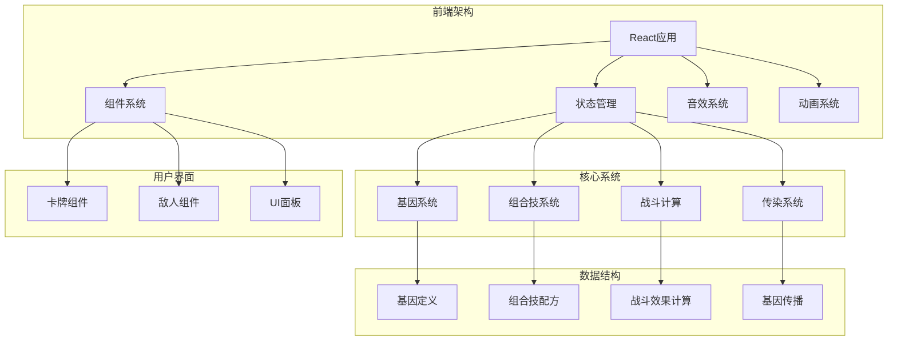
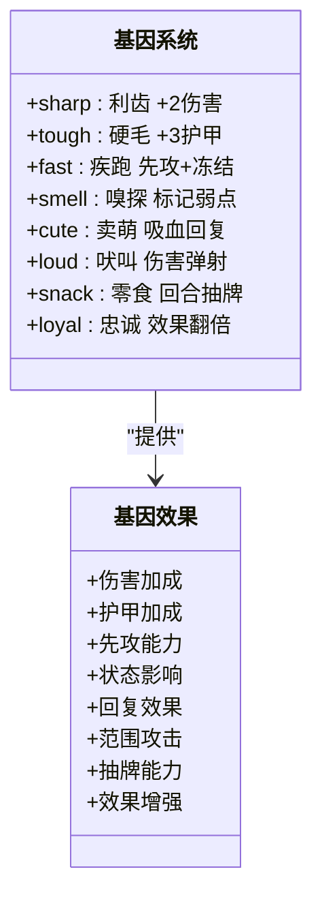
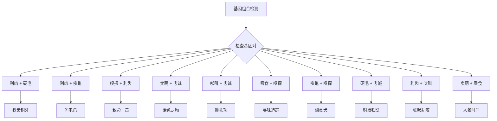
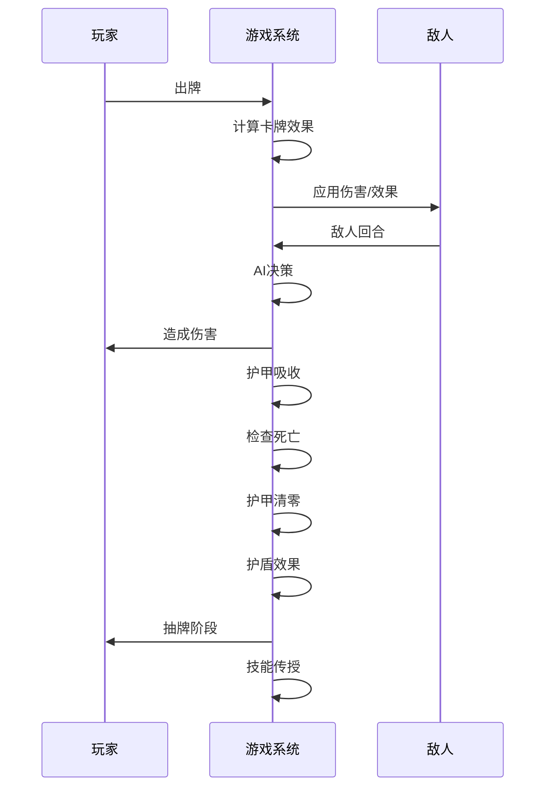
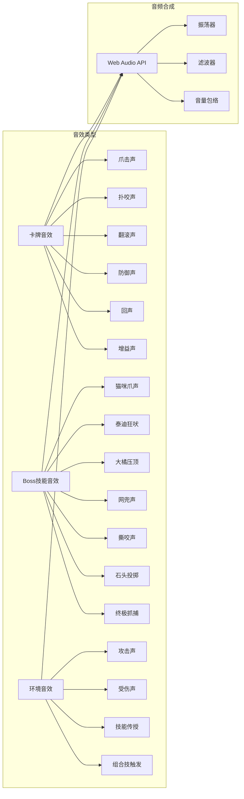
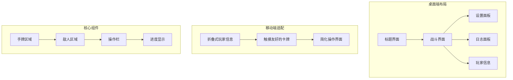
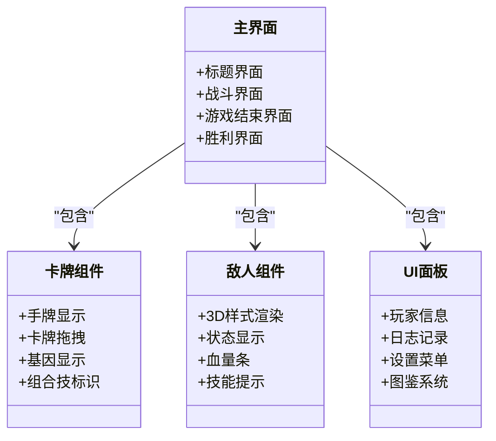
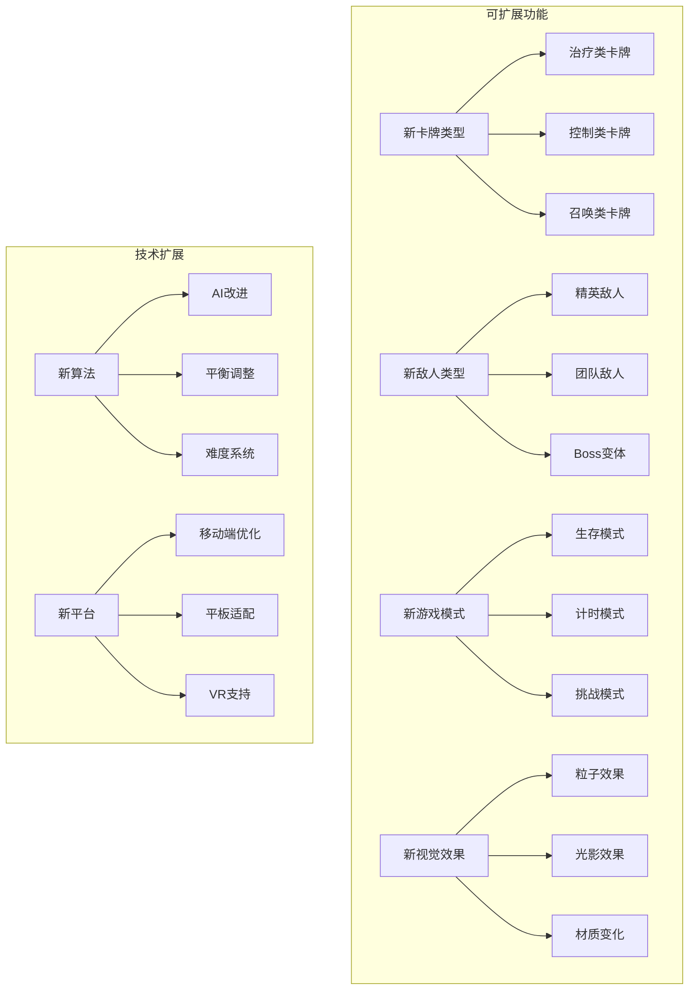

# 狗狗组合技系统

<cite>
**本文档引用的文件**
- [README.md](file://README.md)
- [游戏设计文档.md](file://游戏设计文档.md)
- [src/App.jsx](file://src/App.jsx)
- [src/main.jsx](file://src/main.jsx)
- [src/index.css](file://src/index.css)
- [package.json](file://package.json)
</cite>

## 目录
1. [项目概述](#项目概述)
2. [核心系统架构](#核心系统架构)
3. [基因系统详解](#基因系统详解)
4. [组合技系统分析](#组合技系统分析)
5. [战斗系统实现](#战斗系统实现)
6. [音效与动画系统](#音效与动画系统)
7. [用户界面设计](#用户界面设计)
8. [性能优化策略](#性能优化策略)
9. [扩展性设计](#扩展性设计)
10. [总结](#总结)

## 项目概述

《小雪闯上海》是一款以雪纳瑞犬"小雪"为主角的卡牌Roguelike游戏。游戏采用React 18 + Vite技术栈构建，融合了Roguelike元素与卡牌策略玩法，通过基因系统和组合技机制为玩家提供深度的Build构筑体验。

### 游戏核心特色

- **Roguelike机制**：每局游戏包含6个关卡，难度逐步提升，支持永久死亡机制
- **基因系统**：卡牌携带随机基因，提供丰富的Build可能性
- **组合技系统**：特定基因组合触发突变效果，增加策略深度
- **实时战斗**：基于回合制的卡牌战斗系统，支持拖拽交互
- **音效动画**：完整的8bit风格音效系统和CSS3动画效果

**章节来源**
- [游戏设计文档.md:1-250](file://游戏设计文档.md#L1-L250)

## 核心系统架构

### 整体架构设计

**图表来源**
- [src/App.jsx:1-2710](file://src/App.jsx#L1-L2710)

### 状态管理系统

游戏采用React Hooks进行状态管理，核心状态包括：

- **游戏阶段**：title、battle、gameover、win
- **玩家状态**：生命值、护甲、能量、等级
- **卡牌状态**：手牌、牌库、已学组合技
- **战斗状态**：回合数、敌人状态、日志记录

**章节来源**
- [src/App.jsx:219-2710](file://src/App.jsx#L219-L2710)

## 基因系统详解

### 基因类型与效果

游戏设计了8种不同的狗狗技能基因，每种基因都有独特的视觉标识和效果：

**图表来源**
- [src/App.jsx:8-32](file://src/App.jsx#L8-L32)

### 基因生成算法

基因系统采用概率生成机制：

1. **基础概率**：每张卡牌30%概率携带基因
2. **保证机制**：确保至少34%的卡牌带有基因
3. **随机分布**：8种基因均匀分布
4. **基因上限**：单张卡牌最多携带3个基因

**章节来源**
- [src/App.jsx:62-89](file://src/App.jsx#L62-L89)

## 组合技系统分析

### 组合技配方设计

游戏实现了10种独特的组合技，每种组合技都有明确的触发条件和效果：

**图表来源**
- [src/App.jsx:20-32](file://src/App.jsx#L20-L32)

### 组合技触发机制

组合技触发采用双重检测机制：

1. **实时检测**：每次卡牌效果计算时检查
2. **动画反馈**：首次触发时播放特殊动画效果
3. **学习记录**：记录玩家已发现的组合技

**章节来源**
- [src/App.jsx:169-216](file://src/App.jsx#L169-L216)
- [src/App.jsx:831-855](file://src/App.jsx#L831-L855)

## 战斗系统实现

### 战斗流程设计

**图表来源**
- [src/App.jsx:1030-1293](file://src/App.jsx#L1030-L1293)

### 战斗计算逻辑

战斗系统采用函数式计算模型：

1. **基础伤害**：卡牌基础数值 + 基因加成
2. **护甲减免**：敌人护甲值减少实际伤害
3. **状态效果**：中毒、冻结、困惑等状态影响
4. **组合技效果**：多重组合技叠加计算

**章节来源**
- [src/App.jsx:169-216](file://src/App.jsx#L169-L216)

### 敌人AI系统

每个Boss都有独特的技能和行为模式：

| 敌人类型 | 技能名称 | 技能效果 | 触发概率 |
|---------|---------|---------|---------|
| 坏猫咪 | 猫爪三连 | 连续攻击3次 | 40% |
| 凶恶泰迪 | 狂吠震慑 | 降低攻击力 | 35% |
| 流浪大橘 | 肥猫压顶 | 高伤害单体 | 40% |
| 城管大叔 | 网兜抓捕 | 下回合无法出牌 | 30% |
| 恶霸犬 | 撕咬 | 造成流血 | 40% |
| 小混混 | 扔石头 | 远程攻击 | 35% |
| 捕狗大队队长 | 终极抓捕 | 超高伤害+眩晕 | 35% |

**章节来源**
- [src/App.jsx:91-100](file://src/App.jsx#L91-L100)

## 音效与动画系统

### 音效系统架构

游戏实现了完整的8bit风格音效系统：

**图表来源**
- [src/App.jsx:341-720](file://src/App.jsx#L341-L720)

### 动画系统设计

游戏采用CSS3动画实现流畅的视觉效果：

1. **卡牌动画**：拖拽、选中、感染等状态变化
2. **角色动画**：小雪的攻击、防御、受击动画
3. **敌人动画**：浮动、受击、攻击特效
4. **UI动画**：界面切换、提示框出现消失

**章节来源**
- [src/App.jsx:1818-1832](file://src/App.jsx#L1818-L1832)
- [src/App.jsx:2550-2667](file://src/App.jsx#L2550-L2667)

## 用户界面设计

### 响应式布局架构

**图表来源**
- [src/App.jsx:2246-2707](file://src/App.jsx#L2246-L2707)

### 卡牌交互设计

游戏实现了完整的卡牌拖拽交互系统：

1. **拖拽检测**：鼠标按下5像素阈值判断
2. **目标定位**：实时计算拖拽目标位置
3. **插入动画**：卡牌位置变化的平滑过渡
4. **备用交互**：点击选择+目标选择模式

**章节来源**
- [src/App.jsx:264-335](file://src/App.jsx#L264-L335)

### UI组件系统

**图表来源**
- [src/App.jsx:1392-1816](file://src/App.jsx#L1392-L1816)

**章节来源**
- [src/App.jsx:1834-2019](file://src/App.jsx#L1834-L2019)

## 性能优化策略

### React性能优化

1. **状态分离**：将频繁更新的状态与稳定状态分离
2. **useCallback缓存**：缓存回调函数避免不必要的重渲染
3. **useRef优化**：使用ref存储函数避免闭包陷阱
4. **条件渲染**：根据游戏阶段选择性渲染组件

### 动画性能优化

1. **GPU加速**：使用transform和opacity实现硬件加速
2. **动画节流**：限制动画帧率避免过度消耗
3. **CSS动画**：优先使用CSS动画而非JavaScript动画
4. **内存管理**：及时清理动画定时器和事件监听器

### 音效性能优化

1. **AudioContext复用**：单例模式管理音频上下文
2. **音效池**：重用音效对象避免频繁创建销毁
3. **延迟加载**：按需加载音效资源
4. **音量控制**：统一管理音量避免重复计算

**章节来源**
- [src/App.jsx:341-352](file://src/App.jsx#L341-L352)

## 扩展性设计

### 系统扩展点

### 数据结构扩展

系统采用模块化设计，便于添加新的内容：

1. **基因系统扩展**：新增基因类型和效果
2. **组合技扩展**：添加新的组合技配方
3. **敌人系统扩展**：增加新的敌人类型和技能
4. **卡牌系统扩展**：支持更多卡牌类型和效果

**章节来源**
- [游戏设计文档.md:220-242](file://游戏设计文档.md#L220-L242)

## 总结

《小雪闯上海》的狗狗组合技系统展现了优秀的游戏设计思维和技术实现：

### 核心优势

1. **深度策略性**：基因系统和组合技提供了丰富的Build可能性
2. **流畅用户体验**：完整的拖拽交互和动画系统
3. **技术架构优秀**：React Hooks + Vite的现代化开发栈
4. **扩展性强**：模块化设计便于后续功能扩展

### 技术亮点

- **实时组合技检测**：高效的基因组合识别算法
- **完整的音效系统**：基于Web Audio API的8bit音效合成
- **响应式动画**：CSS3动画实现流畅的视觉效果
- **性能优化完善**：多层面的性能优化策略

### 发展前景

该系统为后续的功能扩展奠定了良好的基础，包括新卡牌类型、新敌人、新模式等，都可通过现有的架构体系轻松实现。游戏的核心循环简洁明了，既适合休闲玩家，也为深度策略玩家提供了足够的挑战性。