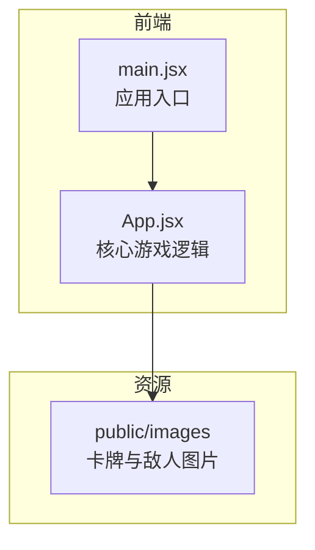
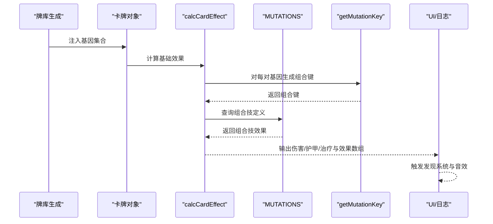
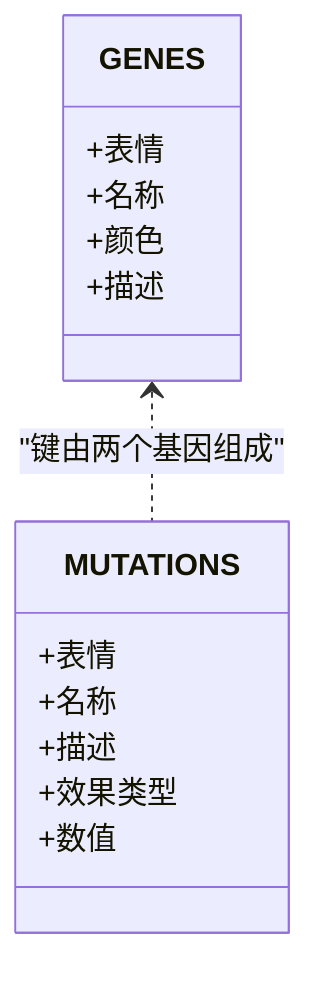
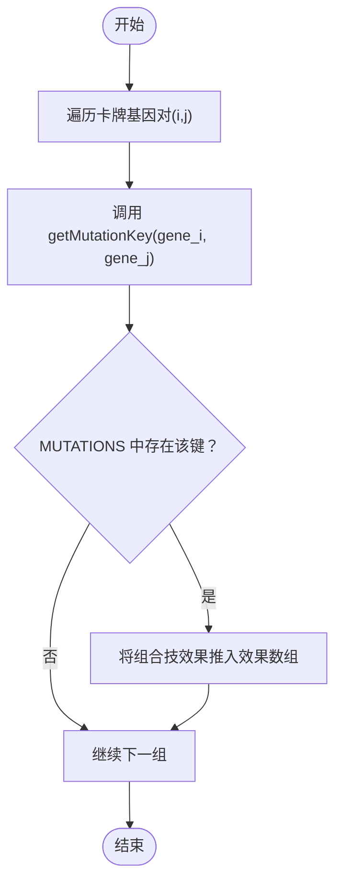
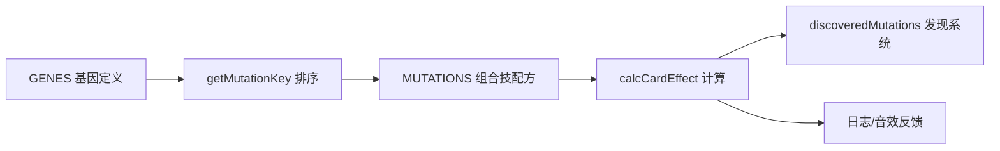

# 组合技系统

<cite>
**本文引用的文件**
- [App.jsx](file://src/App.jsx)
- [main.jsx](file://src/main.jsx)
- [README.md](file://README.md)
- [游戏设计文档.md](file://游戏设计文档.md)
</cite>

## 目录
1. [简介](#简介)
2. [项目结构](#项目结构)
3. [核心组件](#核心组件)
4. [架构总览](#架构总览)
5. [详细组件分析](#详细组件分析)
6. [依赖关系分析](#依赖关系分析)
7. [性能考量](#性能考量)
8. [故障排查指南](#故障排查指南)
9. [结论](#结论)
10. [附录](#附录)

## 简介
本文件面向《小雪闯上海》的组合技系统，围绕“基因组合机制”“组合技效果实现”“触发条件与叠加机制”“发现系统与进度跟踪”展开，提供代码级可视化与扩展指南，帮助开发者快速理解并定制新的组合技。

## 项目结构
- 前端采用 React + Vite 构建，主入口为 src/main.jsx，核心游戏逻辑集中在 src/App.jsx。
- 游戏设计文档对系统目标、玩法循环、卡牌与基因系统、组合技设计、敌人AI等进行了完整说明，便于理解组合技在整体系统中的定位。

图表来源
- [main.jsx:1-8](file://src/main.jsx#L1-L8)
- [App.jsx:1-20](file://src/App.jsx#L1-L20)

章节来源
- [main.jsx:1-8](file://src/main.jsx#L1-L8)
- [README.md:1-17](file://README.md#L1-L17)
- [游戏设计文档.md:1-250](file://游戏设计文档.md#L1-L250)

## 核心组件
- 基因常量 GENES：定义8种基础基因及其属性（表情、名称、颜色、描述）。
- 组合技常量 MUTATIONS：定义10种组合技配方（基因对映射到效果）。
- 排序函数 getMutationKey：用于将两个基因按字典序拼接，保证组合键稳定唯一。
- 计算函数 calcCardEffect：综合基础卡牌属性、基因加成、组合技触发与技能效果，返回最终伤害/护甲/治疗与效果数组。
- 发现系统 discoveredMutations：记录玩家在本局游戏中已发现的组合技名称，用于图鉴与统计。

章节来源
- [App.jsx:9-37](file://src/App.jsx#L9-L37)
- [App.jsx:169-216](file://src/App.jsx#L169-L216)
- [App.jsx:235-235](file://src/App.jsx#L235-L235)

## 架构总览
组合技系统贯穿“卡牌生成—基因注入—组合检测—效果叠加—触发反馈”的完整链路，配合“传染系统”实现基因传播与组合技学习。

图表来源
- [App.jsx:62-89](file://src/App.jsx#L62-L89)
- [App.jsx:169-216](file://src/App.jsx#L169-L216)
- [App.jsx:34-37](file://src/App.jsx#L34-L37)
- [App.jsx:1092-1116](file://src/App.jsx#L1092-L1116)
- [App.jsx:1250-1286](file://src/App.jsx#L1250-L1286)

## 详细组件分析

### 基因与组合技常量
- 基因定义 GENES：包含利齿、硬毛、疾跑、嗅探、卖萌、吠叫、零食、忠诚等，每项含表情、名称、颜色、描述。
- 组合技定义 MUTATIONS：以“基因1+基因2”为键，值包含表情、名称、描述、效果类型与数值。

图表来源
- [App.jsx:9-18](file://src/App.jsx#L9-L18)
- [App.jsx:21-32](file://src/App.jsx#L21-L32)

章节来源
- [App.jsx:9-37](file://src/App.jsx#L9-L37)
- [游戏设计文档.md:74-89](file://游戏设计文档.md#L74-L89)

### 排序算法与组合检测
- getMutationKey：对两个基因进行排序并拼接，确保“利齿+疾跑”与“疾跑+利齿”得到相同键。
- 组合检测：在 calcCardEffect 中，双重循环遍历卡牌基因对，生成组合键并查询 MUTATIONS，若命中则将组合技效果加入效果数组。

图表来源
- [App.jsx:34-37](file://src/App.jsx#L34-L37)
- [App.jsx:206-213](file://src/App.jsx#L206-L213)
- [App.jsx:169-216](file://src/App.jsx#L169-L216)

章节来源
- [App.jsx:34-37](file://src/App.jsx#L34-L37)
- [App.jsx:206-213](file://src/App.jsx#L206-L213)
- [App.jsx:169-216](file://src/App.jsx#L169-L216)

### 组合技效果实现与触发条件
- 攻击型组合技（如铁齿铜牙、闪电爪、致命一击、狂吠乱咬）：在执行攻击时触发，效果类型通常为伤害或冻结。
- 防御型组合技（如铜墙铁壁、幽灵犬）：提供护甲或闪避保护。
- 辅助型组合技（如治愈之吻、狮吼功、寻味追踪、大餐时间）：回血、范围伤害、抽牌等。

触发条件与叠加机制：
- 触发条件：当卡牌携带两个特定基因时，组合技被触发；在攻击卡牌使用时，若组合技效果为攻击/冻结/范围伤害等，则直接作用于敌人；在非攻击卡牌使用时，组合技效果同样生效。
- 叠加机制：组合技效果与基础卡牌效果、基因加成、增益（如磨牙棒）共同叠加；例如“利齿+忠诚”使伤害翻倍，再叠加组合技伤害。

章节来源
- [App.jsx:21-32](file://src/App.jsx#L21-L32)
- [App.jsx:1092-1116](file://src/App.jsx#L1092-L1116)
- [App.jsx:1250-1286](file://src/App.jsx#L1250-L1286)
- [App.jsx:170-182](file://src/App.jsx#L170-L182)

### 组合技发现系统与进度跟踪
- discoveredMutations：在本局游戏中记录已触发的组合技名称，用于图鉴展示与统计。
- 触发时机：在组合技效果应用时，若该组合技未在本局中被发现，则将其加入 discoveredMutations，并播放音效提示。
- UI 展示：在“图鉴”弹窗中列出所有组合技及其配方与描述；在游戏结束/胜利界面展示本次学会的组合技。

章节来源
- [App.jsx:235-235](file://src/App.jsx#L235-L235)
- [App.jsx:1092-1116](file://src/App.jsx#L1092-L1116)
- [App.jsx:1250-1286](file://src/App.jsx#L1250-L1286)
- [App.jsx:2410-2425](file://src/App.jsx#L2410-L2425)
- [App.jsx:2099-2106](file://src/App.jsx#L2099-L2106)
- [App.jsx:2203-2221](file://src/App.jsx#L2203-L2221)

### 传染系统与组合技学习
- 传染阶段：每击败一组敌人后进入“技能传授”阶段，随机将相邻卡牌的基因复制到左右相邻卡牌，从而形成新的基因组合。
- 组合技学习：在传染过程中，若某张卡牌的基因组合满足 MUTATIONS 键，将标记该卡牌为“已突变”，并在下一轮开始时播放音效提示。

章节来源
- [App.jsx:787-862](file://src/App.jsx#L787-L862)
- [App.jsx:832-840](file://src/App.jsx#L832-L840)
- [App.jsx:847-851](file://src/App.jsx#L847-L851)

### 效果应用与日志
- 攻击路径：executeAttack 中计算效果，应用伤害、护甲吸收、吸血、冻结、弹射、抽牌等；若存在组合技效果，记录日志并更新 discoveredMutations。
- 非攻击路径：playCard 中处理防御、回血、增益与技能类卡牌，同样会触发组合技效果并记录日志。

章节来源
- [App.jsx:1030-1131](file://src/App.jsx#L1030-L1131)
- [App.jsx:1133-1293](file://src/App.jsx#L1133-L1293)

## 依赖关系分析
- 组合技系统依赖：
  - GENES：提供基因属性与排序依据。
  - MUTATIONS：提供组合技配方与效果定义。
  - getMutationKey：保证组合键稳定。
  - calcCardEffect：统一计算入口，串联基因与组合技。
  - discoveredMutations：记录发现状态。
  - UI 日志与音效：提供反馈。

图表来源
- [App.jsx:9-18](file://src/App.jsx#L9-L18)
- [App.jsx:21-32](file://src/App.jsx#L21-L32)
- [App.jsx:34-37](file://src/App.jsx#L34-L37)
- [App.jsx:169-216](file://src/App.jsx#L169-L216)
- [App.jsx:235-235](file://src/App.jsx#L235-L235)

章节来源
- [App.jsx:9-37](file://src/App.jsx#L9-L37)
- [App.jsx:169-216](file://src/App.jsx#L169-L216)
- [App.jsx:235-235](file://src/App.jsx#L235-L235)

## 性能考量
- 组合检测复杂度：对每张卡牌的基因对进行双重循环，时间复杂度 O(n^2·k^2)，其中 n 为手牌数，k 为每张卡牌平均基因数。当前实现简洁直观，适合小规模卡牌场景。
- 优化建议：
  - 使用哈希表缓存已检测的组合键，避免重复计算。
  - 在卡牌基因变化时（如传染），仅对受影响卡牌重新检测。
  - 将组合技效果映射为可复用的 effect 函数，减少分支判断。

[本节为通用建议，无需代码引用]

## 故障排查指南
- 组合技未触发
  - 检查基因顺序是否一致：确保使用 getMutationKey 对基因进行排序后再查询 MUTATIONS。
  - 检查卡牌基因数量：组合技要求至少两个基因。
- 效果未叠加
  - 确认 calcCardEffect 的返回值是否被正确消费（攻击路径与非攻击路径均需处理）。
- 发现系统无效
  - 确认 discoveredMutations 的更新逻辑在组合技触发时执行。
- UI 未显示
  - 检查图鉴弹窗与日志展示逻辑，确认组合技名称与描述正确写入。

章节来源
- [App.jsx:34-37](file://src/App.jsx#L34-L37)
- [App.jsx:169-216](file://src/App.jsx#L169-L216)
- [App.jsx:1092-1116](file://src/App.jsx#L1092-L1116)
- [App.jsx:1250-1286](file://src/App.jsx#L1250-L1286)
- [App.jsx:2410-2425](file://src/App.jsx#L2410-L2425)

## 结论
组合技系统通过“基因对+排序键+配方表”的简洁机制，实现了丰富策略与可预期的反馈。结合传染系统与发现系统，玩家可在单局内逐步构建强力组合技 Build，提升策略深度与可玩性。现有实现清晰易懂，扩展性强，适合进一步添加新基因、新组合技与新效果类型。

[本节为总结，无需代码引用]

## 附录

### 组合技配置示例（路径参考）
- 基因定义：[App.jsx:9-18](file://src/App.jsx#L9-L18)
- 组合技配方：[App.jsx:21-32](file://src/App.jsx#L21-L32)
- 排序函数：[App.jsx:34-37](file://src/App.jsx#L34-L37)
- 计算入口：[App.jsx:169-216](file://src/App.jsx#L169-L216)
- 触发与发现：[App.jsx:1092-1116](file://src/App.jsx#L1092-L1116), [App.jsx:1250-1286](file://src/App.jsx#L1250-L1286)
- 发现系统状态：[App.jsx:235-235](file://src/App.jsx#L235-L235)

### 扩展指南
- 新增基因
  - 在 GENES 中添加新基因项，包含表情、名称、颜色、描述。
  - 在牌库生成逻辑中为卡牌注入新基因（可参考现有注入比例）。
- 新增组合技
  - 在 MUTATIONS 中添加新配方，键为“基因1+基因2”的排序结果。
  - 设计效果类型与数值，确保与现有效果体系兼容。
- 新增效果类型
  - 在 calcCardEffect 与效果应用处扩展分支，新增效果枚举与处理逻辑。
  - 在 UI 日志与音效中补充对应反馈。
- 自定义组合的实现步骤
  - 定义基因与组合技配方（参考路径见上）。
  - 在组合检测与效果应用处接入新类型。
  - 在图鉴与日志中展示新组合技。

章节来源
- [App.jsx:9-37](file://src/App.jsx#L9-L37)
- [App.jsx:169-216](file://src/App.jsx#L169-L216)
- [App.jsx:1092-1116](file://src/App.jsx#L1092-L1116)
- [App.jsx:1250-1286](file://src/App.jsx#L1250-L1286)
- [游戏设计文档.md:74-89](file://游戏设计文档.md#L74-L89)