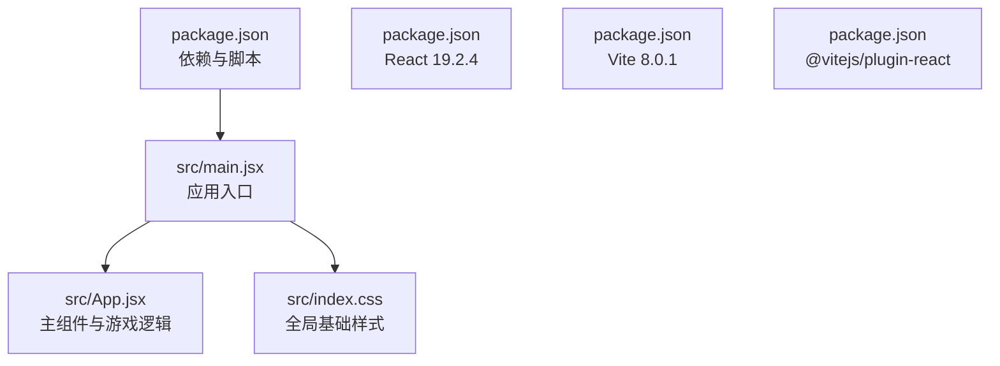
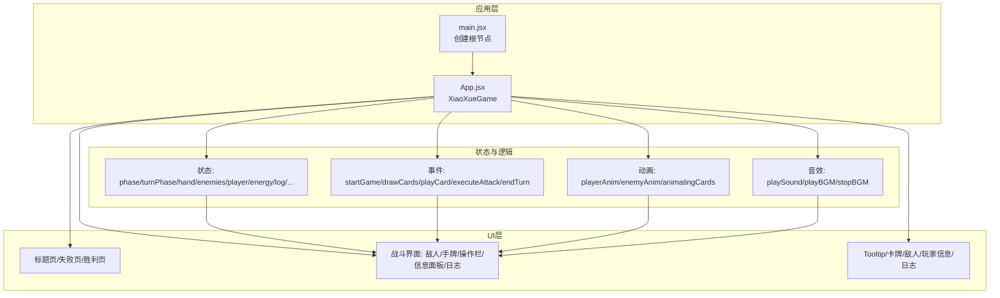
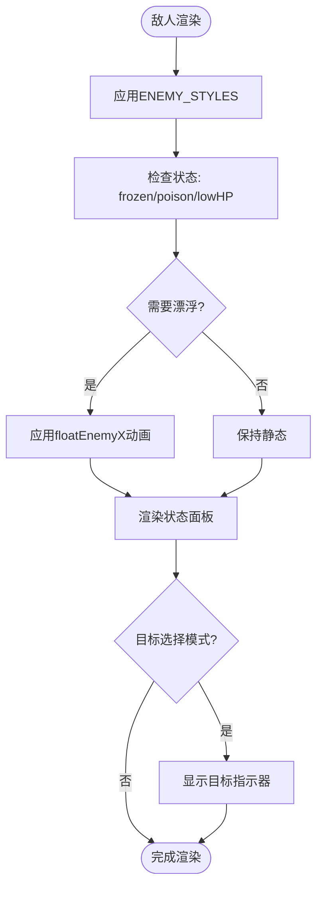
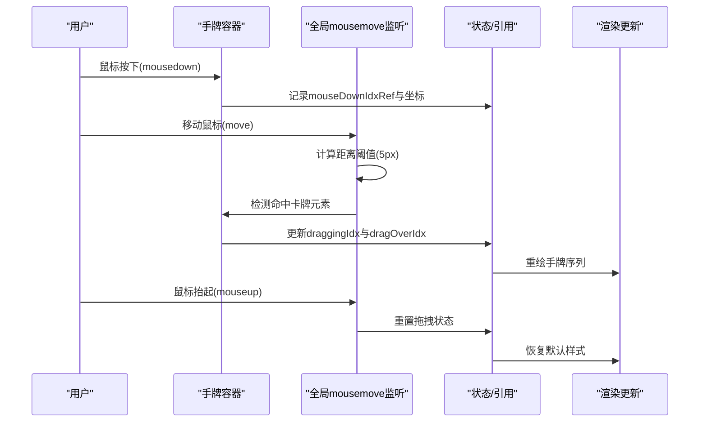
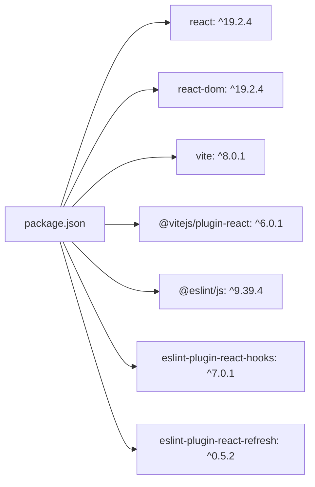

# 界面与交互系统

<cite>
**本文引用的文件列表**
- [src/App.jsx](file://src/App.jsx)
- [src/main.jsx](file://src/main.jsx)
- [src/index.css](file://src/index.css)
- [package.json](file://package.json)
</cite>

## 更新摘要
**变更内容**
- 新增完整的3D敌人渲染系统，包含立体怪物样式和动画效果
- 完善卡牌拖拽系统，支持实时位置交换和视觉反馈
- 实现Tooltip悬浮提示系统，支持PC端悬停和移动端长按
- 增强动画系统，包含CSS关键帧动画和JavaScript驱动的动画
- 优化响应式设计，支持多种屏幕尺寸的自适应布局
- 扩展音效系统，包含8bit风格的音效和BGM播放

## 目录
1. [简介](#简介)
2. [项目结构](#项目结构)
3. [核心组件](#核心组件)
4. [架构总览](#架构总览)
5. [详细组件分析](#详细组件分析)
6. [依赖关系分析](#依赖关系分析)
7. [性能考量](#性能考量)
8. [故障排查指南](#故障排查指南)
9. [结论](#结论)
10. [附录](#附录)

## 简介
本文档深入解析《小雪闯上海》的界面与交互系统，围绕React组件架构、状态管理模式、拖拽交互机制、CSS3动画体系、响应式设计与移动端适配、以及用户界面组件进行全面分析。系统包含完整的3D敌人渲染、卡牌拖拽系统、Tooltip悬浮提示、动画系统等核心功能，为开发者提供详细的实现指导和技术参考。

## 项目结构
项目采用现代化的Vite + React开发环境，采用单一组件架构设计，将所有游戏逻辑集中在App.jsx中，便于状态管理和组件通信。

**章节来源**
- [src/main.jsx:1-8](file://src/main.jsx#L1-L8)
- [src/index.css:1-9](file://src/index.css#L1-L9)
- [package.json:1-28](file://package.json#L1-L28)

## 核心组件
- **主组件**: XiaoXueGame（包含标题页、战斗页、失败页、胜利页）
- **交互组件**:
  - Tooltip（悬浮提示，支持PC端悬停和移动端长按）
  - renderCard（卡牌渲染，支持拖拽、选中、感染态）
  - renderEnemy3D（3D敌人渲染，立体怪物样式和动画）
  - renderPlayerCard（玩家信息面板）
  - renderLog（行动日志）
- **状态管理**: 集中式useState管理，配合useEffect/useRef实现复杂交互
- **音效系统**: Web Audio API实现的8bit风格音效与BGM
- **动画系统**: CSS关键帧与JavaScript驱动的混合动画

**章节来源**
- [src/App.jsx:219-2710](file://src/App.jsx#L219-L2710)

## 架构总览
应用采用"单组件多阶段"架构，通过phase状态切换不同视图，战斗阶段通过turnPhase控制玩家回合与敌人回合。系统集成了完整的交互状态管理、事件处理和用户体验优化。

**图表来源**
- [src/main.jsx:1-8](file://src/main.jsx#L1-L8)
- [src/App.jsx:219-2710](file://src/App.jsx#L219-L2710)

## 详细组件分析

### 3D敌人渲染系统
系统实现了完整的立体怪物渲染，每个敌人都有独特的3D样式和动画效果。

- **样式系统**: ENEMY_STYLES定义了每个敌人的独特外观，包括渐变背景、阴影效果和透视变换
- **动画系统**: 
  - floatEnemyX关键帧实现漂浮动画
  - shake关键帧处理低血量时的震动效果
  - 攻击/受击动画通过enemyAnim状态驱动
- **状态可视化**: 血条、护甲、中毒、冻结等状态通过右侧胶囊样式面板展示
- **交互反馈**: 目标选择模式下提供视觉指示器和动画效果

**图表来源**
- [src/App.jsx:118-162](file://src/App.jsx#L118-L162)
- [src/App.jsx:1635-1816](file://src/App.jsx#L1635-L1816)

**章节来源**
- [src/App.jsx:118-162](file://src/App.jsx#L118-L162)
- [src/App.jsx:1635-1816](file://src/App.jsx#L1635-L1816)

### 卡牌拖拽交互系统
实现了完整的卡牌拖拽功能，支持实时位置交换和视觉反馈。

- **事件监听**: 在手牌容器上注册全局mousemove监听，精确跟踪鼠标位置
- **拖拽阈值**: 5像素距离阈值防止误触发，确保拖拽体验流畅
- **插入算法**: insertCard方法基于fromIdx与toIdx计算插入位置，避免重复索引
- **视觉反馈**: 
  - 拖拽中卡牌提升、旋转、阴影增强
  - 插入时卡片轻微缩放与透明度变化
  - 选中态通过边框和阴影区分
- **状态管理**: 通过draggingIdx、dragFrom、dragOverIdx等状态精确控制拖拽过程

**图表来源**
- [src/App.jsx:264-335](file://src/App.jsx#L264-L335)

**章节来源**
- [src/App.jsx:264-335](file://src/App.jsx#L264-L335)

### Tooltip悬浮提示系统
实现了跨平台的悬浮提示功能，支持PC端悬停和移动端长按。

- **设备检测**: 自动检测触摸设备，选择合适的交互方式
- **位置计算**: 动态计算提示框位置，确保在可视区域内
- **动画效果**: PC端使用200ms延时，移动端使用长按触发
- **内容渲染**: 支持卡牌和敌人的详细信息展示
- **事件处理**: 不干扰原生事件系统，避免影响拖拽和点击

**章节来源**
- [src/App.jsx:1302-1390](file://src/App.jsx#L1302-L1390)

### 卡牌渲染与效果系统
卡牌系统支持多种类型和效果，提供丰富的视觉反馈。

- **数据模型**: 卡牌包含id、name、baseType、power、image、desc、genes、mutated等属性
- **基因系统**: 通过基因组合产生组合技效果
- **渲染策略**: 
  - 根据baseType应用不同颜色和样式
  - 选中态、拖拽态、感染态、组合技态有差异化样式
  - Tooltip提供详细信息展示
- **交互行为**: 点击选中、拖拽排序、使用卡牌触发效果

**章节来源**
- [src/App.jsx:169-216](file://src/App.jsx#L169-L216)
- [src/App.jsx:1392-1633](file://src/App.jsx#L1392-L1633)

### 敌人回合与战斗系统
实现了完整的敌人AI和战斗逻辑。

- **回合管理**: 通过turnPhase控制玩家回合与敌人回合
- **AI决策**: 基于BOSS_SKILLS的概率系统决定技能使用
- **状态效果**: 支持冻结、中毒、困惑等状态效果
- **伤害计算**: 考虑护甲吸收和状态效果的影响
- **动画反馈**: 攻击、受击、死亡等动画效果

**章节来源**
- [src/App.jsx:864-988](file://src/App.jsx#L864-L988)
- [src/App.jsx:1001-1028](file://src/App.jsx#L1001-L1028)

### 音效与BGM系统
使用Web Audio API实现了完整的音效和背景音乐系统。

- **音效类型**: 
  - 卡牌音效：爪击、扑咬、翻滚、防御、回血、增益
  - Boss技能音效：猫爪三连、狂吠震慑、肥猫压顶、网兜抓捕、撕咬、扔石头、终极抓捕
  - 通用音效：出牌、普通攻击、技能传授、组合技触发、敌人攻击、受伤
- **BGM系统**: 
  - Loading界面：可爱狗狗主题的轻快BGM
  - 战斗界面：紧张刺激的战斗BGM
  - 循环播放，支持暂停和切换
- **音效技术**: 使用AudioContext、Oscillator、Gain、Filter等Web Audio API特性

**章节来源**
- [src/App.jsx:341-719](file://src/App.jsx#L341-L719)

### CSS3动画系统
系统包含丰富的CSS关键帧动画和过渡效果。

- **卡牌动画**: lift、slide等基础动画
- **敌人动画**: floatEnemyX、shake等怪物特定动画
- **玩家动画**: attackSwipe、shieldPulse、healFloat等角色动画
- **页面动画**: float、spin、bounce、runHome、fadeIn/fadeInUp等场景动画
- **性能优化**: 使用will-change、transform-origin、backface-visibility等优化属性

**章节来源**
- [src/App.jsx:2550-2667](file://src/App.jsx#L2550-L2667)

### 响应式设计与移动端适配
系统实现了完整的响应式设计，支持多种屏幕尺寸。

- **媒体查询**: 针对768px与480px断点，调整布局和样式
- **手牌适配**: 在小屏幕上自动调整手牌尺寸和间距
- **敌人面板**: 移动端将右侧状态面板移动到底部
- **交互适配**: 
  - Tooltip在移动端采用长按显示
  - 手牌容器支持横向滚动
  - 触摸设备优化拖拽体验

**章节来源**
- [src/App.jsx:2618-2666](file://src/App.jsx#L2618-L2666)

### 用户界面组件详解
系统提供了完整的用户界面组件集合。

- **标题页**: 启动按钮、游戏介绍、BGM播放
- **失败页**: 战绩展示、学会的组合技
- **胜利页**: 背景动画、脚印轨迹、再玩一次按钮
- **战斗界面**: 敌人区域、手牌区域、操作栏、玩家信息面板、日志
- **图鉴弹窗**: 展示狗狗技能、组合技、卡牌配置与Boss技能

**章节来源**
- [src/App.jsx:2021-2244](file://src/App.jsx#L2021-L2244)
- [src/App.jsx:2354-2481](file://src/App.jsx#L2354-L2481)

## 依赖关系分析
项目使用现代化的前端技术栈，依赖关系简洁明确。

**图表来源**
- [package.json:12-26](file://package.json#L12-L26)

**章节来源**
- [package.json:1-28](file://package.json#L1-L28)

## 性能考量
系统在多个方面进行了性能优化。

- **动画性能**: 
  - 使用transform与opacity动画，避免频繁重排
  - will-change与backface-visibility减少绘制成本
  - CSS动画优先于JavaScript动画
- **事件处理**: 
  - 全局mousemove监听在组件卸载时正确清理
  - 拖拽阈值与延迟隐藏减少误触
  - useRef存储高频引用，避免闭包陷阱
- **渲染优化**: 
  - useCallback缓存回调，减少子组件重渲染
  - useRef存储状态引用，提高访问效率
- **音效性能**: 
  - Web Audio上下文复用，避免重复创建
  - BGM循环使用setTimeout，避免阻塞主线程

**章节来源**
- [src/App.jsx:277-335](file://src/App.jsx#L277-L335)
- [src/App.jsx:341-719](file://src/App.jsx#L341-L719)

## 故障排查指南
常见问题及解决方案。

- **拖拽无效**:
  - 检查鼠标按下事件是否正确记录索引与坐标
  - 确认容器存在且包含卡牌元素
  - 查看距离阈值是否过大导致未触发
- **插入异常**:
  - 核对insertCard的fromIdx/toIdx边界与插入位置计算
  - 确认draggingIdxRef与dragFrom状态同步
- **动画不生效**:
  - 检查CSS关键帧是否正确注入
  - 确认will-change与transform-origin设置
- **音效无声**:
  - 确认AudioContext状态为running或已resume
  - 检查playSound分支与类型映射
- **移动端交互异常**:
  - 检查移动端长按与触摸事件绑定
  - 确认媒体查询断点与样式覆盖

**章节来源**
- [src/App.jsx:277-335](file://src/App.jsx#L277-L335)
- [src/App.jsx:1302-1390](file://src/App.jsx#L1302-L1390)
- [src/App.jsx:341-719](file://src/App.jsx#L341-L719)

## 结论
《小雪闯上海》界面与交互系统展现了现代React应用的优秀实践。通过单一组件架构、完善的状态管理、丰富的交互功能和优化的性能设计，系统实现了完整的卡牌战斗体验。3D敌人渲染、拖拽交互、Tooltip系统、动画和音效等核心功能的集成，为移动端和桌面端用户提供了优质的视觉和交互体验。建议后续可考虑模块化重构、增加单元测试和类型安全，以进一步提升代码质量和可维护性。

## 附录
- **示例片段路径**（仅列出路径，不展示具体代码内容）
  - [3D敌人渲染:118-162](file://src/App.jsx#L118-L162)
  - [拖拽事件处理:264-335](file://src/App.jsx#L264-L335)
  - [Tooltip系统:1302-1390](file://src/App.jsx#L1302-L1390)
  - [卡牌渲染:1392-1633](file://src/App.jsx#L1392-L1633)
  - [敌人回合:864-988](file://src/App.jsx#L864-L988)
  - [音效系统:341-719](file://src/App.jsx#L341-L719)
  - [CSS动画:2550-2667](file://src/App.jsx#L2550-L2667)
  - [应用入口:1-8](file://src/main.jsx#L1-L8)
  - [全局样式:1-9](file://src/index.css#L1-L9)