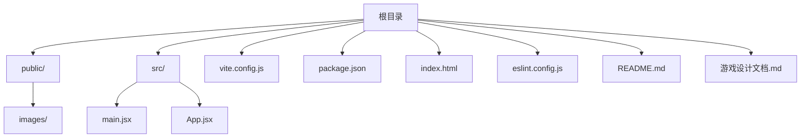
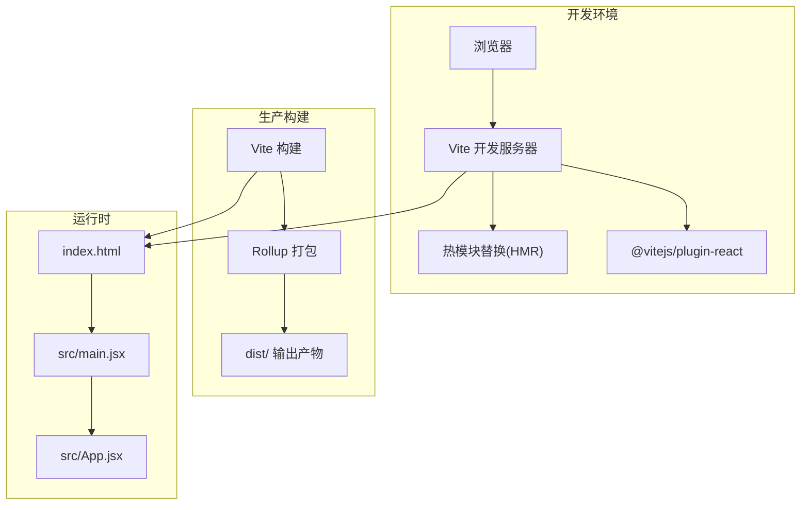
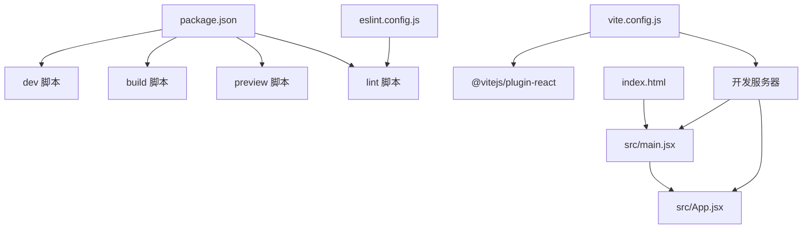

# 配置与部署

<cite>
**本文引用的文件**
- [vite.config.js](file://vite.config.js)
- [package.json](file://package.json)
- [README.md](file://README.md)
- [index.html](file://index.html)
- [eslint.config.js](file://eslint.config.js)
- [src/main.jsx](file://src/main.jsx)
- [src/App.jsx](file://src/App.jsx)
- [游戏设计文档.md](file://游戏设计文档.md)
</cite>

## 目录
1. [简介](#简介)
2. [项目结构](#项目结构)
3. [核心组件](#核心组件)
4. [架构总览](#架构总览)
5. [详细组件分析](#详细组件分析)
6. [依赖关系分析](#依赖关系分析)
7. [性能考量](#性能考量)
8. [故障排查指南](#故障排查指南)
9. [结论](#结论)
10. [附录](#附录)

## 简介
本指南面向《小雪闯上海》项目的开发者，围绕 Vite 构建配置、脚本命令、开发与生产环境差异、构建优化策略、部署流程与最佳实践、环境变量与敏感信息保护、性能监控与错误追踪、以及常见部署问题排查进行全面说明。读者可据此独立完成项目的构建、测试与部署全流程。

## 项目结构
该项目采用 React + Vite 的最小化模板，核心目录与文件如下：
- 根目录包含构建配置、包管理、入口 HTML、ESLint 配置与源码入口
- 源码位于 src 目录，包含应用入口 main.jsx 与主组件 App.jsx
- public/images 用于存放静态图片资源
- 根目录还包含游戏设计文档，便于理解前端技术栈与实现要点

图表来源
- [index.html:1-14](file://index.html#L1-L14)
- [vite.config.js:1-8](file://vite.config.js#L1-L8)
- [package.json:1-28](file://package.json#L1-L28)
- [src/main.jsx:1-8](file://src/main.jsx#L1-L8)
- [src/App.jsx:1-800](file://src/App.jsx#L1-L800)

章节来源
- [index.html:1-14](file://index.html#L1-L14)
- [vite.config.js:1-8](file://vite.config.js#L1-L8)
- [package.json:1-28](file://package.json#L1-L28)
- [README.md:1-17](file://README.md#L1-L17)
- [游戏设计文档.md:156-197](file://游戏设计文档.md#L156-L197)

## 核心组件
- 构建配置：Vite 默认配置，启用 React 插件，未设置额外优化参数
- 包脚本：提供开发、构建、预览与代码检查命令
- ESLint 配置：推荐规则与 React Hooks、React Refresh 插件集成
- 应用入口：React DOM 渲染根节点，加载全局样式与主组件
- 主组件：包含卡牌系统、战斗逻辑、音效与动画等复杂业务

章节来源
- [vite.config.js:1-8](file://vite.config.js#L1-L8)
- [package.json:6-11](file://package.json#L6-L11)
- [eslint.config.js:1-30](file://eslint.config.js#L1-L30)
- [src/main.jsx:1-8](file://src/main.jsx#L1-L8)
- [src/App.jsx:1-800](file://src/App.jsx#L1-L800)

## 架构总览
下图展示从浏览器请求到页面渲染的关键路径，以及开发与生产构建的差异概览。

图表来源
- [vite.config.js:5-7](file://vite.config.js#L5-L7)
- [package.json:6-11](file://package.json#L6-L11)
- [index.html:9-12](file://index.html#L9-L12)
- [src/main.jsx:1-8](file://src/main.jsx#L1-L8)
- [src/App.jsx:1-800](file://src/App.jsx#L1-L800)

## 详细组件分析

### Vite 构建配置分析
- 插件启用：仅启用 React 插件，未配置额外的构建优化参数（如 rollupOptions、optimizeDeps 等）
- 默认行为：开发服务器默认开启 HMR；生产构建默认进行代码压缩与资源打包
- 可扩展性：可通过在现有配置中添加更多插件或自定义 rollupOptions 来实现代码分割、资源压缩与缓存策略

章节来源
- [vite.config.js:1-8](file://vite.config.js#L1-L8)

### package.json 脚本命令详解
- dev：启动 Vite 开发服务器，支持热更新
- build：执行生产构建，输出至 dist 目录
- preview：本地预览生产构建产物
- lint：运行 ESLint 对项目进行代码质量检查

章节来源
- [package.json:6-11](file://package.json#L6-L11)

### ESLint 配置与规则
- 推荐规则：基于 @eslint/js 推荐规则集
- React Hooks：启用 hooks 推荐规则
- React Refresh：集成 Vite 下的 React Refresh 规则
- 语言选项：启用最新 ECMAScript 与 JSX 支持
- 自定义规则：示例中对未使用变量的忽略模式进行了配置

章节来源
- [eslint.config.js:1-30](file://eslint.config.js#L1-L30)

### 应用入口与主组件
- 入口文件：创建根节点并渲染 App 组件，引入全局样式
- 主组件：包含卡牌系统、战斗逻辑、音效与动画等复杂业务，具备大量状态与副作用

章节来源
- [src/main.jsx:1-8](file://src/main.jsx#L1-L8)
- [src/App.jsx:1-800](file://src/App.jsx#L1-L800)

### 开发与生产环境差异
- 开发环境：使用 Vite 开发服务器，启用 HMR，便于快速迭代
- 生产环境：执行构建，输出 dist 目录，包含压缩后的静态资源与入口 HTML
- 部署差异：开发环境通常通过本地端口访问，生产环境需将 dist 目录部署到静态资源服务器或 CDN

章节来源
- [package.json:6-11](file://package.json#L6-L11)
- [index.html:1-14](file://index.html#L1-L14)

### 构建优化策略
- 代码分割：建议在 Vite 配置中通过 rollupOptions.output.manualChunks 或 splitChunks 策略实现按需加载
- 资源压缩：生产构建默认启用压缩，可进一步配置压缩器与资源内联策略
- 缓存配置：通过设置静态资源指纹与 HTTP 缓存头，提升二次加载性能
- 依赖预构建：利用 optimizeDeps 预构建第三方依赖，减少冷启动时间
- 资源外链：将不常变化的资源（如图标、字体）外链至 CDN，减少主包体积

章节来源
- [vite.config.js:5-7](file://vite.config.js#L5-L7)
- [package.json:16-26](file://package.json#L16-L26)

### 部署流程与最佳实践
- 本地构建：执行构建脚本生成 dist 目录
- 静态资源托管：将 dist 目录上传至静态服务器或 CDN
- 域名配置：在服务器或 CDN 上配置域名与路径映射，确保 index.html 与资源路径一致
- HTTPS 与缓存：启用 HTTPS，配置合理的缓存策略与安全头
- 预览验证：使用 preview 命令在本地验证生产构建效果

章节来源
- [package.json:6-11](file://package.json#L6-L11)
- [index.html:1-14](file://index.html#L1-L14)

### 环境变量与敏感信息保护
- 环境变量：Vite 默认支持以 VITE_ 前缀的环境变量注入到客户端代码
- 敏感信息：避免在客户端暴露密钥与令牌；如需服务端交互，通过代理或后端接口实现
- 安全建议：在 CI/CD 中使用环境变量注入，本地开发使用 .env 文件并加入 .gitignore

章节来源
- [vite.config.js:1-8](file://vite.config.js#L1-L8)
- [package.json:1-28](file://package.json#L1-L28)

### 性能监控与错误追踪
- 性能监控：结合浏览器性能面板与 Lighthouse，关注首屏加载、交互延迟与内存占用
- 错误追踪：在生产环境中接入错误上报（如 Sentry），记录堆栈与上下文信息
- 日志与埋点：在关键业务流程中埋点，记录用户行为与异常事件

章节来源
- [src/App.jsx:337-340](file://src/App.jsx#L337-L340)

### 常见部署问题排查
- 资源 404：检查 index.html 中的资源路径与实际 dist 目录结构是否匹配
- 跨域问题：若存在 API 请求，确认 CORS 配置与代理设置
- 缓存问题：清理浏览器缓存或强制刷新，确认静态资源指纹更新
- 预览失败：确认 dist 目录存在且权限正确，使用 preview 命令验证

章节来源
- [index.html:9-12](file://index.html#L9-L12)
- [package.json:6-11](file://package.json#L6-L11)

## 依赖关系分析
下图展示项目关键文件之间的依赖关系与交互路径。

图表来源
- [package.json:6-11](file://package.json#L6-L11)
- [vite.config.js:1-8](file://vite.config.js#L1-L8)
- [index.html:9-12](file://index.html#L9-L12)
- [src/main.jsx:1-8](file://src/main.jsx#L1-L8)
- [src/App.jsx:1-800](file://src/App.jsx#L1-L800)
- [eslint.config.js:1-30](file://eslint.config.js#L1-L30)

章节来源
- [package.json:1-28](file://package.json#L1-L28)
- [vite.config.js:1-8](file://vite.config.js#L1-L8)
- [index.html:1-14](file://index.html#L1-L14)
- [src/main.jsx:1-8](file://src/main.jsx#L1-L8)
- [src/App.jsx:1-800](file://src/App.jsx#L1-L800)
- [eslint.config.js:1-30](file://eslint.config.js#L1-L30)

## 性能考量
- 构建优化：通过拆分 vendor 与业务代码、启用压缩与 Tree Shaking 提升加载速度
- 资源优化：将图片与字体外链至 CDN，减少主包体积；使用懒加载与按需导入
- 运行时优化：避免不必要的重渲染，使用 React.memo 与 useMemo/useCallback；合理使用 ref 与副作用
- 音效与动画：使用 Web Audio API 动态合成音效，减少音频资源体积；CSS 动画使用 transform 与 opacity，避免布局抖动

章节来源
- [游戏设计文档.md:188-197](file://游戏设计文档.md#L188-L197)
- [src/App.jsx:341-720](file://src/App.jsx#L341-L720)

## 故障排查指南
- 构建失败：检查依赖安装与 Node 版本兼容性；查看构建日志定位具体报错
- 预览异常：确认 dist 目录存在且可读；使用 preview 命令验证
- 资源路径错误：核对 index.html 中的 script 与静态资源路径；确保与 dist 结构一致
- 热更新失效：重启开发服务器；检查防火墙与端口占用
- ESLint 报错：根据规则提示修复；必要时调整 eslint.config.js

章节来源
- [package.json:6-11](file://package.json#L6-L11)
- [index.html:9-12](file://index.html#L9-L12)
- [eslint.config.js:1-30](file://eslint.config.js#L1-L30)

## 结论
本指南基于仓库现有配置，系统梳理了 Vite 构建配置、脚本命令、开发与生产环境差异、构建优化策略、部署流程与最佳实践，并提供了环境变量与敏感信息保护、性能监控与错误追踪、以及常见部署问题的排查方案。建议在现有基础上逐步引入代码分割、资源压缩与缓存策略，完善生产环境的监控与错误追踪体系，以满足上线与长期维护需求。

## 附录
- 技术栈参考：React、Vite、ESLint、Web Audio API
- 入口与渲染：index.html 引入 src/main.jsx，main.jsx 渲染 App.jsx
- 游戏技术实现要点：拖拽交互、战斗计算、敌人 AI、传染系统、音效与动画、响应式设计与性能优化

章节来源
- [README.md:1-17](file://README.md#L1-L17)
- [游戏设计文档.md:156-197](file://游戏设计文档.md#L156-L197)
- [index.html:1-14](file://index.html#L1-L14)
- [src/main.jsx:1-8](file://src/main.jsx#L1-L8)
- [src/App.jsx:1-800](file://src/App.jsx#L1-L800)