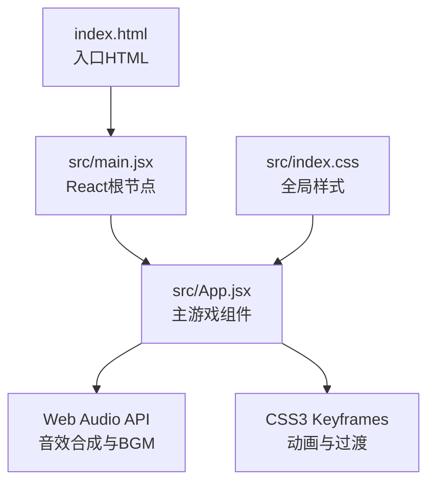
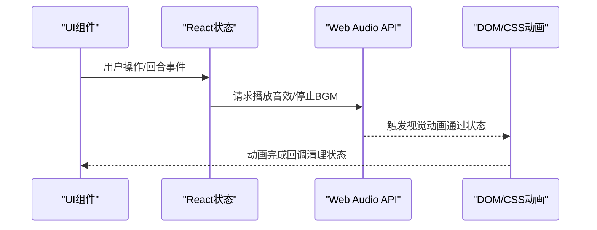
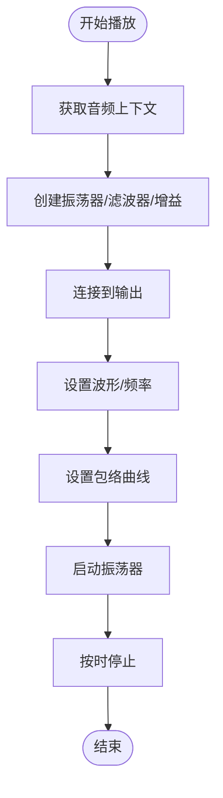
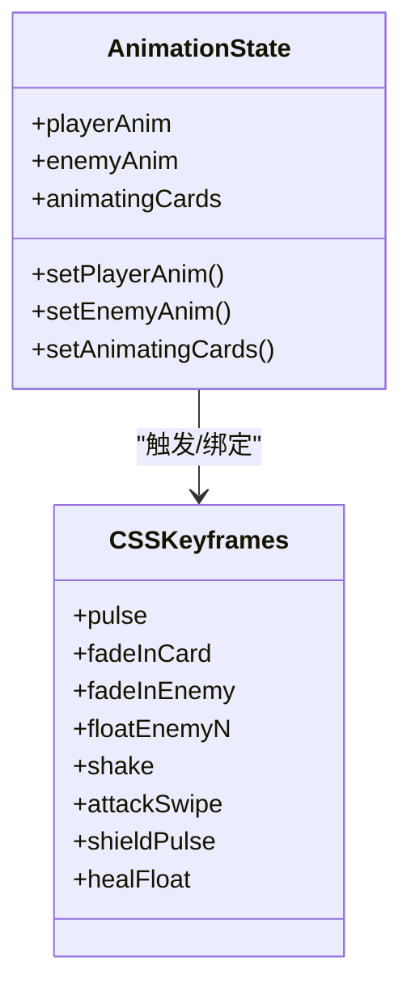
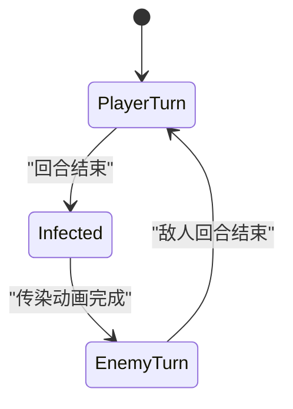
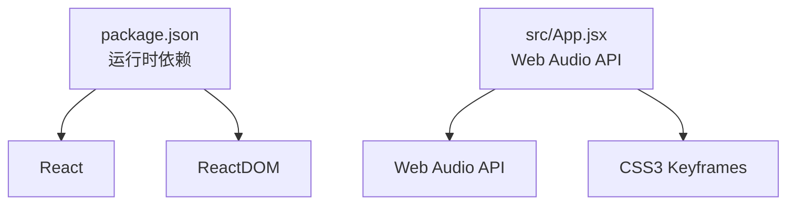

# 音效与动画系统

<cite>
**本文档引用的文件**
- [README.md](file://README.md)
- [package.json](file://package.json)
- [index.html](file://index.html)
- [src/main.jsx](file://src/main.jsx)
- [src/App.jsx](file://src/App.jsx)
- [src/index.css](file://src/index.css)
</cite>

## 更新摘要
**变更内容**
- 新增完整的Web Audio API音效系统实现
- 添加8bit风格BGM音乐播放系统
- 完善CSS3动画关键帧定义和状态管理
- 增强音效触发机制与动画联动策略
- 优化性能优化和跨浏览器兼容性

## 目录
1. [简介](#简介)
2. [项目结构](#项目结构)
3. [核心组件](#核心组件)
4. [架构总览](#架构总览)
5. [详细组件分析](#详细组件分析)
6. [依赖关系分析](#依赖关系分析)
7. [性能考量](#性能考量)
8. [故障排查指南](#故障排查指南)
9. [结论](#结论)
10. [附录](#附录)

## 简介
本文件面向《小雪闯上海》项目的音效与动画系统，聚焦以下目标：
- Web Audio API 的集成与使用：包括8bit音效合成、振荡器配置、包络控制与滤波器应用
- BGM 播放机制与音效管理系统
- CSS3 动画系统：关键帧定义、动画序列控制与性能优化
- 动画状态管理机制与游戏逻辑的同步方式
- 音效触发时机与动画联动策略
- 音效参数调节、动画时序控制与跨浏览器兼容性要点
- 实际代码示例路径与调优建议

## 项目结构
该项目采用 React + Vite 架构，核心逻辑集中在单文件组件中，音效与动画均以内联方式实现，便于集中管理和调试。

图表来源
- [index.html:1-14](file://index.html#L1-L14)
- [src/main.jsx:1-8](file://src/main.jsx#L1-L8)
- [src/App.jsx:1-2710](file://src/App.jsx#L1-L2710)
- [src/index.css:1-9](file://src/index.css#L1-L9)

章节来源
- [index.html:1-14](file://index.html#L1-L14)
- [src/main.jsx:1-8](file://src/main.jsx#L1-L8)
- [src/App.jsx:1-2710](file://src/App.jsx#L1-L2710)
- [src/index.css:1-9](file://src/index.css#L1-L9)

## 核心组件
- 音效系统（Web Audio API）
  - 音频上下文管理与唤醒
  - 狗叫声、呜咽声、吃东西声、低吼声等真实音效合成
  - 8bit风格扫频与噪声音效
  - BGM 8bit音符序列播放与包络控制
- 动画系统（CSS3）
  - 关键帧定义：浮动、脉冲、攻击/防御/治疗/受击等特效
  - 动画序列控制：基于状态机的状态切换与定时器联动
  - 性能优化：will-change、perspective、backface-visibility 等
- 状态管理与同步
  - React 状态驱动动画：playerAnim、enemyAnim、animatingCards
  - 与游戏逻辑的联动：回合阶段、技能触发、伤害反馈

章节来源
- [src/App.jsx:341-720](file://src/App.jsx#L341-L720)
- [src/App.jsx:1834-1848](file://src/App.jsx#L1834-L1848)
- [src/App.jsx:2565-2702](file://src/App.jsx#L2565-L2702)

## 架构总览
音效与动画系统围绕"状态驱动 + Web Audio API + CSS3 动画"的模式构建，通过 React 状态变化驱动 Web Audio 源的创建与停止，同时通过 CSS 动画实现视觉反馈。

图表来源
- [src/App.jsx:1030-1131](file://src/App.jsx#L1030-L1131)
- [src/App.jsx:864-988](file://src/App.jsx#L864-L988)
- [src/App.jsx:2565-2702](file://src/App.jsx#L2565-L2702)

## 详细组件分析

### Web Audio API 音效系统
- 音频上下文管理
  - 首次使用时创建 AudioContext 或 webkitAudioContext
  - 恢复挂起状态，保证首次交互后可播放
  - 示例路径：[音频上下文获取:344-352](file://src/App.jsx#L344-L352)
- 狗叫声合成（更真实的狗叫）
  - 使用三角波作为主音调，带通滤波器模拟共鸣
  - 频率指数衰减模拟叫声调型
  - 音量包络线性上升后指数衰减
  - 示例路径：[playBark:360-387](file://src/App.jsx#L360-L387)
- 呜咽声（悲伤效果）
  - 低通滤波器 + 正弦波 + 频率线性下降
  - 示例路径：[playWhine:390-417](file://src/App.jsx#L390-L417)
- 吃东西声（咀嚼）
  - 多个振荡器叠加，低通滤波器 + 随机频率
  - 示例路径：[playEat:420-445](file://src/App.jsx#L420-L445)
- 低吼声（威胁）
  - 双振荡器 + 低通滤波器 + 不和谐音
  - 示例路径：[playGrowl:448-483](file://src/App.jsx#L448-L483)
- 8bit 音效（噪声/扫频）
  - 噪声：方波/锯齿波 + 低通滤波器
  - 扫频：指数频率变化 + 包络
  - 示例路径：[play8BitNoise:486-508](file://src/App.jsx#L486-L508)、[playSweep:511-528](file://src/App.jsx#L511-L528)
- 音效触发映射
  - 卡牌使用、敌人攻击、受伤、技能传授、组合技触发等
  - 示例路径：[音效触发:1030-1131](file://src/App.jsx#L1030-L1131)、[敌人回合音效:938-964](file://src/App.jsx#L938-L964)
- BGM 系统（8bit 音符序列）
  - 音符频率表（C3~C6）
  - Loading 与 Battle 两套主题序列
  - 方波 + 线性+指数包络
  - 示例路径：[NOTE_FREQ:626-633](file://src/App.jsx#L626-L633)、[loadingBGM:636-647](file://src/App.jsx#L636-L647)、[battleBGM:650-661](file://src/App.jsx#L650-L661)、[playBGM:677-719](file://src/App.jsx#L677-L719)、[stopBGM:663-675](file://src/App.jsx#L663-L675)

图表来源
- [src/App.jsx:360-387](file://src/App.jsx#L360-L387)
- [src/App.jsx:486-508](file://src/App.jsx#L486-L508)
- [src/App.jsx:511-528](file://src/App.jsx#L511-L528)

章节来源
- [src/App.jsx:341-720](file://src/App.jsx#L341-L720)
- [src/App.jsx:1030-1131](file://src/App.jsx#L1030-L1131)
- [src/App.jsx:938-964](file://src/App.jsx#L938-L964)

### CSS3 动画系统
- 关键帧定义
  - 脉冲、淡入、浮动、摇摆、攻击/防御/治疗/受击特效
  - 示例路径：[关键帧定义:2565-2577](file://src/App.jsx#L2565-L2577)
- 动画序列控制
  - 基于 playerAnim/enemyAnim/animatingCards 状态切换
  - 通过 setTimeout 控制动画时序与清理
  - 示例路径：[玩家动画样式:1834-1848](file://src/App.jsx#L1834-L1848)、[敌人攻击/受击动画:1716-1729](file://src/App.jsx#L1716-L1729)、[玩家受击动画:959-963](file://src/App.jsx#L959-L963)
- 性能优化
  - will-change、perspective、backface-visibility
  - transform/opacity 等 GPU 加速友好属性
  - 示例路径：[性能优化样式:2583-2604](file://src/App.jsx#L2583-L2604)
- 响应式与小屏适配
  - 媒体查询调整尺寸与布局
  - 示例路径：[响应式样式:2633-2701](file://src/App.jsx#L2633-L2701)

图表来源
- [src/App.jsx:236-248](file://src/App.jsx#L236-L248)
- [src/App.jsx:1834-1848](file://src/App.jsx#L1834-L1848)
- [src/App.jsx:2565-2577](file://src/App.jsx#L2565-L2577)

章节来源
- [src/App.jsx:1834-1848](file://src/App.jsx#L1834-L1848)
- [src/App.jsx:1716-1729](file://src/App.jsx#L1716-L1729)
- [src/App.jsx:2565-2702](file://src/App.jsx#L2565-L2702)

### 动画状态管理与游戏逻辑同步
- 状态机
  - turnPhase：player/infecting/enemy
  - playerAnim/enemyAnim：attack/defend/heal/hit/null
  - animatingCards：技能传染动画集合
- 同步策略
  - 回合结束触发技能传染，播放音效并设置动画状态
  - 敌人回合根据意图播放不同音效与动画
  - 攻击/受击时分别播放音效与动画
- 示例路径：
  - [doInfection:787-862](file://src/App.jsx#L787-L862)
  - [doEnemyTurn:864-988](file://src/App.jsx#L864-L988)
  - [executeAttack:1030-1131](file://src/App.jsx#L1030-L1131)

图表来源
- [src/App.jsx:1295-1300](file://src/App.jsx#L1295-L1300)
- [src/App.jsx:787-862](file://src/App.jsx#L787-L862)
- [src/App.jsx:864-988](file://src/App.jsx#L864-L988)

章节来源
- [src/App.jsx:787-862](file://src/App.jsx#L787-L862)
- [src/App.jsx:864-988](file://src/App.jsx#L864-L988)
- [src/App.jsx:1030-1131](file://src/App.jsx#L1030-L1131)

### 音效触发时机与动画联动策略
- 卡牌使用
  - 根据卡牌类型/名称映射音效，播放后触发对应动画
  - 示例路径：[playCard:1133-1293](file://src/App.jsx#L1133-L1293)
- 敌人攻击
  - 根据首名攻击者类型选择音效，播放后触发敌人攻击动画与玩家受击动画
  - 示例路径：[doEnemyTurn:938-964](file://src/App.jsx#L938-L964)
- 技能传染与组合技
  - 传染时播放"技能传授"音效；组合技触发播放"组合技"音效
  - 示例路径：[doInfection:844-845](file://src/App.jsx#L844-L845)、[组合技音效:1092-1116](file://src/App.jsx#L1092-L1116)

章节来源
- [src/App.jsx:1133-1293](file://src/App.jsx#L1133-L1293)
- [src/App.jsx:938-964](file://src/App.jsx#L938-L964)
- [src/App.jsx:844-845](file://src/App.jsx#L844-L845)
- [src/App.jsx:1092-1116](file://src/App.jsx#L1092-L1116)

## 依赖关系分析
- 运行时依赖
  - React 与 ReactDOM：组件与状态管理
  - Vite：开发与构建工具链
- 浏览器能力
  - Web Audio API：音频合成与播放
  - CSS3 动画：关键帧与过渡
- 兼容性考虑
  - 使用 webkitAudioContext 兼容旧版 Safari
  - 使用 will-change 与 transform 提升动画性能
  - 媒体查询适配移动端

图表来源
- [package.json:12-15](file://package.json#L12-L15)
- [src/App.jsx:344-352](file://src/App.jsx#L344-L352)
- [src/App.jsx:2565-2577](file://src/App.jsx#L2565-L2577)

章节来源
- [package.json:12-15](file://package.json#L12-L15)
- [src/App.jsx:344-352](file://src/App.jsx#L344-L352)
- [src/App.jsx:2565-2577](file://src/App.jsx#L2565-L2577)

## 性能考量
- Web Audio 性能
  - 避免频繁创建/销毁源，复用上下文
  - 使用指数/线性包络减少 CPU 占用
  - 控制滤波器 Q 值，避免过度共振
- CSS 动画性能
  - 优先使用 transform/opacity
  - 合理使用 will-change，避免滥用
  - 使用 perspective/backface-visibility 提升 3D 动画表现
- 时序控制
  - 使用 setTimeout/setInterval 管理动画时序，避免阻塞主线程
  - 在状态变更后及时清理定时器，防止内存泄漏

## 故障排查指南
- 音频无法播放
  - 检查音频上下文是否处于 suspended 状态并进行 resume
  - 示例路径：[音频上下文恢复:348-350](file://src/App.jsx#L348-L350)
- 音效重叠或卡顿
  - 确认每个音效在播放完成后正确停止
  - 示例路径：[音效停止与清理:385-387](file://src/App.jsx#L385-L387)、[BGM 停止:663-675](file://src/App.jsx#L663-L675)
- 动画不流畅
  - 检查是否使用了 GPU 友好的属性（transform/opacity）
  - 确认未滥用 will-change 导致过度优化
  - 示例路径：[性能优化样式:2583-2604](file://src/App.jsx#L2583-L2604)
- 移动端体验差
  - 检查媒体查询与触摸事件处理
  - 示例路径：[响应式样式:2633-2701](file://src/App.jsx#L2633-L2701)

章节来源
- [src/App.jsx:348-350](file://src/App.jsx#L348-L350)
- [src/App.jsx:385-387](file://src/App.jsx#L385-L387)
- [src/App.jsx:663-675](file://src/App.jsx#L663-L675)
- [src/App.jsx:2583-2604](file://src/App.jsx#L2583-L2604)
- [src/App.jsx:2633-2701](file://src/App.jsx#L2633-L2701)

## 结论
本系统通过 Web Audio API 与 CSS3 动画实现了高质量的视听体验，结合 React 状态机实现了音效与动画的精准联动。通过合理的参数调节、时序控制与性能优化，能够在多平台环境下稳定运行。建议在后续迭代中进一步抽象音效工厂与动画控制器，提升可维护性与扩展性。

## 附录
- 实际代码示例路径（仅列出路径，不展示具体代码内容）
  - [音频上下文获取:344-352](file://src/App.jsx#L344-L352)
  - [playBark:360-387](file://src/App.jsx#L360-L387)
  - [playWhine:390-417](file://src/App.jsx#L390-L417)
  - [playEat:420-445](file://src/App.jsx#L420-L445)
  - [playGrowl:448-483](file://src/App.jsx#L448-L483)
  - [play8BitNoise:486-508](file://src/App.jsx#L486-L508)
  - [playSweep:511-528](file://src/App.jsx#L511-L528)
  - [音效触发（卡牌/敌人）:1030-1131](file://src/App.jsx#L1030-L1131)
  - [敌人回合音效与动画:938-964](file://src/App.jsx#L938-L964)
  - [NOTE_FREQ:626-633](file://src/App.jsx#L626-L633)
  - [loadingBGM:636-647](file://src/App.jsx#L636-L647)
  - [battleBGM:650-661](file://src/App.jsx#L650-L661)
  - [playBGM:677-719](file://src/App.jsx#L677-L719)
  - [stopBGM:663-675](file://src/App.jsx#L663-L675)
  - [doInfection:787-862](file://src/App.jsx#L787-L862)
  - [doEnemyTurn:864-988](file://src/App.jsx#L864-L988)
  - [playCard:1133-1293](file://src/App.jsx#L1133-L1293)
  - [关键帧定义:2565-2577](file://src/App.jsx#L2565-L2577)
  - [性能优化样式:2583-2604](file://src/App.jsx#L2583-L2604)
  - [响应式样式:2633-2701](file://src/App.jsx#L2633-L2701)