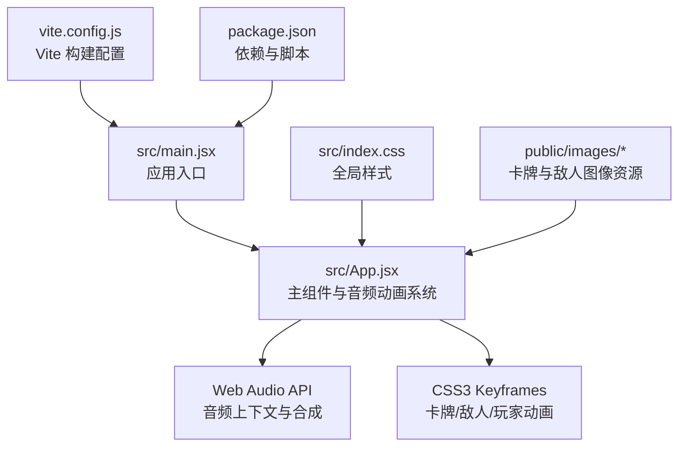
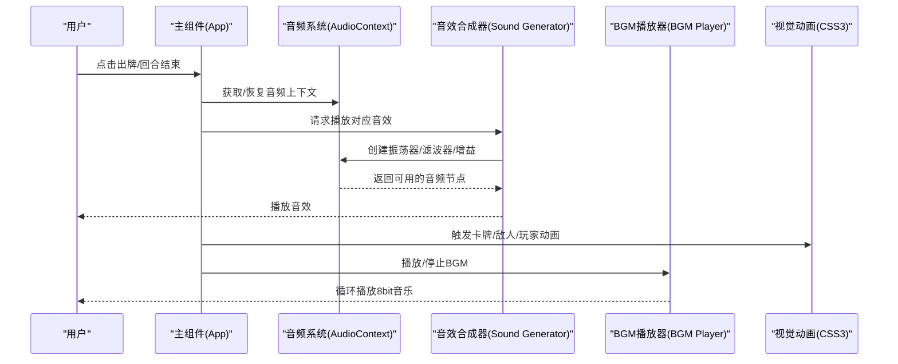
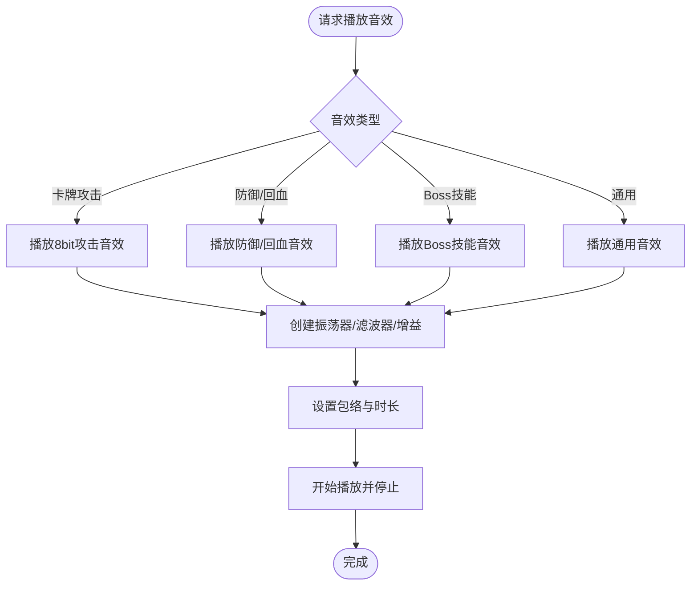
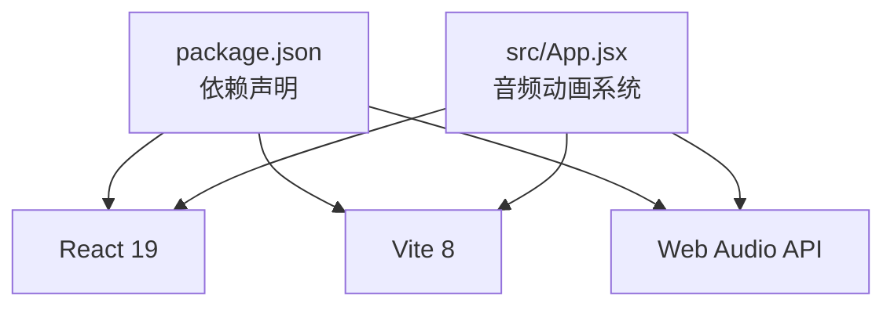

# 音频动画系统

<cite>
**本文引用的文件**
- [README.md](file://README.md)
- [package.json](file://package.json)
- [vite.config.js](file://vite.config.js)
- [src/App.jsx](file://src/App.jsx)
- [src/main.jsx](file://src/main.jsx)
- [src/index.css](file://src/index.css)
- [游戏设计文档.md](file://游戏设计文档.md)
</cite>

## 目录
1. [简介](#简介)
2. [项目结构](#项目结构)
3. [核心组件](#核心组件)
4. [架构总览](#架构总览)
5. [详细组件分析](#详细组件分析)
6. [依赖关系分析](#依赖关系分析)
7. [性能考量](#性能考量)
8. [故障排除指南](#故障排除指南)
9. [结论](#结论)
10. [附录](#附录)

## 简介
本项目是一个基于 React + Vite 的音频动画系统，结合了 Web Audio API 的 8bit 音效合成与丰富的 CSS3 动画效果，为卡牌战斗游戏提供沉浸式的听觉与视觉体验。系统围绕「小雪闯上海」这一主题，通过音频上下文管理、8bit 音效合成、BGM 播放控制、战斗动画联动等模块，实现了完整的音频动画闭环。

## 项目结构
项目采用标准的 Vite + React 前端工程结构，核心文件集中在 src 目录，公共资源位于 public 目录。音频动画系统主要由主应用组件负责集成，通过模块化的函数与 Hook 实现状态管理、事件驱动与动画联动。

**图表来源**
- [src/main.jsx:1-8](file://src/main.jsx#L1-L8)
- [src/App.jsx:1-2708](file://src/App.jsx#L1-L2708)
- [vite.config.js:1-8](file://vite.config.js#L1-L8)
- [package.json:1-28](file://package.json#L1-L28)
- [src/index.css:1-9](file://src/index.css#L1-L9)

**章节来源**
- [README.md:1-17](file://README.md#L1-L17)
- [package.json:1-28](file://package.json#L1-L28)
- [vite.config.js:1-8](file://vite.config.js#L1-L8)
- [src/main.jsx:1-8](file://src/main.jsx#L1-L8)
- [src/index.css:1-9](file://src/index.css#L1-L9)

## 核心组件
音频动画系统的核心由以下模块构成：
- 音频上下文管理：统一创建与恢复 AudioContext，避免重复初始化与暂停问题。
- 8bit 音效合成：基于 Web Audio API 的振荡器、滤波器与包络控制，生成多样音效（爪击、扑咬、防御、回血、技能等）。
- BGM 播放控制：循环播放加载界面与战斗场景的 8bit 音乐，支持停止与切换。
- 动画联动：将音效与卡牌、敌人、玩家的状态变化绑定，实现听觉与视觉的同步反馈。
- 响应式与性能优化：使用 CSS3 动画与 GPU 加速，配合防抖与节流策略，保证流畅体验。

**章节来源**
- [src/App.jsx:341-720](file://src/App.jsx#L341-L720)
- [src/App.jsx:1828-1842](file://src/App.jsx#L1828-L1842)
- [src/App.jsx:2558-2676](file://src/App.jsx#L2558-L2676)

## 架构总览
音频动画系统采用「事件驱动 + 状态联动」的设计思路。主组件维护游戏状态，当用户执行操作（出牌、回合结束、敌人行动）时，系统根据当前状态触发相应的音效与动画，并更新 UI。

**图表来源**
- [src/App.jsx:341-720](file://src/App.jsx#L341-L720)
- [src/App.jsx:1828-1842](file://src/App.jsx#L1828-L1842)

## 详细组件分析

### 音频上下文管理
- 单例 AudioContext：通过 useRef 缓存实例，首次访问时创建，若处于 suspended 状态则主动 resume，确保音效可立即播放。
- 错误处理：在播放过程中捕获异常并记录日志，避免中断游戏流程。
- 生命周期：BGM 播放时创建定时器序列，停止时清理定时器与振荡器，防止内存泄漏。

**章节来源**
- [src/App.jsx:341-352](file://src/App.jsx#L341-L352)
- [src/App.jsx:663-675](file://src/App.jsx#L663-L675)

### 8bit 音效合成器
- 音效类型：卡牌音效（爪击、扑咬、翻滚、防御、回血、增益）、Boss 技能音效（猫爪三连、狂吠震慑、肥猫压顶、网兜抓捕、撕咬、扔石头、终极抓捕）、通用音效（出牌、攻击、受伤、技能传授、组合技触发）。
- 合成技术：使用振荡器（三角波、锯齿波、正弦波）与带通/低通滤波器模拟狗叫声、呜咽声、咀嚼声、低吼声等；通过指数/线性包络控制音量衰减，营造 8bit 风格。
- 多音效叠加：部分音效采用多个振荡器组合（如低吼声使用两个振荡器），增强音色层次。
- 时序控制：使用 setTimeout 实现音效的延时与叠加，确保节奏感与层次感。

**图表来源**
- [src/App.jsx:530-617](file://src/App.jsx#L530-L617)

**章节来源**
- [src/App.jsx:530-617](file://src/App.jsx#L530-L617)

### BGM 播放控制器
- 曲目：加载界面 BGM（轻快跳跃感）、战斗界面 BGM（紧张急促）。
- 频率表：使用标准 8bit 音符频率映射，支持休止符。
- 循环播放：通过定时器序列播放音符，支持停止与切换。
- 状态管理：使用 useRef 标记播放状态，避免竞态条件。

**章节来源**
- [src/App.jsx:619-719](file://src/App.jsx#L619-L719)

### 动画联动系统
- 卡牌动画：拖拽、选中、插入、感染（发光）等状态通过 CSS3 动画与 transform 实现。
- 敌人动画：攻击、受击、浮动、状态变化（冰冻、中毒、虚弱）等反馈。
- 玩家动画：攻击、防御、回血、受击等状态通过样式过渡与关键帧动画表现。
- 日志与提示：使用 CSS 动画实现提示框淡入淡出与脉冲效果。

**章节来源**
- [src/App.jsx:1828-1842](file://src/App.jsx#L1828-L1842)
- [src/App.jsx:2558-2676](file://src/App.jsx#L2558-L2676)

### 事件驱动与状态联动
- 出牌事件：根据卡牌类型与效果播放音效并触发相应动画，更新手牌与能量。
- 回合结束：触发技能传授阶段，播放技能传授音效与组合技触发音效。
- 敌人行动：根据 Boss 技能概率播放对应音效与动画，计算伤害并更新玩家状态。
- 胜负判定：胜利与失败场景分别播放对应 BGM 与动画。

**章节来源**
- [src/App.jsx:1030-1131](file://src/App.jsx#L1030-L1131)
- [src/App.jsx:1295-1300](file://src/App.jsx#L1295-L1300)
- [src/App.jsx:864-988](file://src/App.jsx#L864-L988)
- [src/App.jsx:2031-2106](file://src/App.jsx#L2031-L2106)
- [src/App.jsx:2108-2254](file://src/App.jsx#L2108-L2254)

### CSS3 动画系统
- 关键帧定义：包含 float、spin、bounce、runHome、fadeIn、fadeInUp 等基础动画。
- 动画应用：广泛应用于卡牌悬浮、敌人浮动、攻击特效、受击反馈、胜利动画等场景。
- 性能优化：使用 transform 和 opacity 实现 GPU 加速，避免触发布局重排。

**章节来源**
- [src/App.jsx:2216-2240](file://src/App.jsx#L2216-L2240)

## 依赖关系分析
- React 与 Vite：提供开发与构建环境，支持热更新与快速预览。
- Web Audio API：核心音频能力来源，用于实时音效合成与播放控制。
- CSS3 动画：提供高性能的视觉反馈，与音频事件同步。

**图表来源**
- [package.json:12-26](file://package.json#L12-L26)
- [src/App.jsx:341-720](file://src/App.jsx#L341-L720)

**章节来源**
- [package.json:12-26](file://package.json#L12-L26)

## 性能考量
- 音频性能
  - 单例 AudioContext：避免重复创建导致的性能损耗与兼容性问题。
  - 振荡器复用：同一音效序列内复用节点，减少频繁创建销毁。
  - 包络优化：使用线性/指数包络控制音量，避免过度 CPU 占用。
- 动画性能
  - 使用 transform 与 opacity 实现 GPU 加速，避免触发布局重排。
  - CSS3 Keyframes 与 will-change 提升动画流畅度。
  - 防抖与节流：在拖拽与滚动场景中减少重绘频率。
- 资源优化
  - 图像资源集中于 public/images，按需加载，减少网络开销。
  - 响应式设计：使用 clamp() 与 vw 单位，适配多设备。

## 故障排除指南
- 音频无法播放
  - 检查浏览器权限与用户手势要求，确保 AudioContext 已恢复。
  - 查看控制台错误日志，确认音效函数未抛出异常。
- 音效重复或卡顿
  - 确认音效播放完成后及时停止振荡器，避免残留声音。
  - 检查定时器是否正确清理，防止内存泄漏。
- 动画卡顿
  - 确保关键动画使用 transform 与 opacity，避免影响布局的属性。
  - 在移动端启用硬件加速，检查 CSS 动画的性能指标。
- BGM 不循环
  - 确认播放状态与定时器逻辑，检查是否被意外停止。

**章节来源**
- [src/App.jsx:341-352](file://src/App.jsx#L341-L352)
- [src/App.jsx:663-675](file://src/App.jsx#L663-L675)
- [src/App.jsx:2558-2676](file://src/App.jsx#L2558-L2676)

## 结论
音频动画系统通过 Web Audio API 与 CSS3 动画的有机结合，为卡牌战斗提供了沉浸式的听觉与视觉体验。系统采用事件驱动与状态联动的设计，确保音效与动画与游戏流程紧密契合。在性能方面，系统通过单例音频上下文、GPU 加速动画与资源优化，保障了跨设备的流畅体验。未来可在音效开关、BGM 曲目扩展与移动端适配上进一步完善。

## 附录
- 开发与运行
  - 使用 npm 脚本启动开发服务器、构建生产包与预览。
  - Vite 提供热更新与快速打包能力，适合前端快速迭代。
- 设计文档参考
  - 游戏设计文档详细描述了卡牌系统、基因与突变机制、敌人 AI 与战斗流程，为音频动画系统提供了明确的触发点与反馈目标。

**章节来源**
- [README.md:1-17](file://README.md#L1-L17)
- [游戏设计文档.md:156-197](file://游戏设计文档.md#L156-L197)