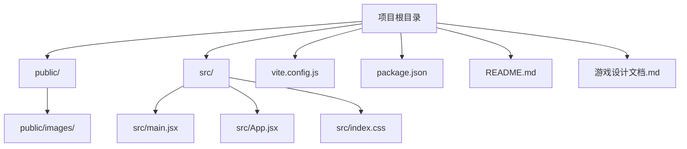
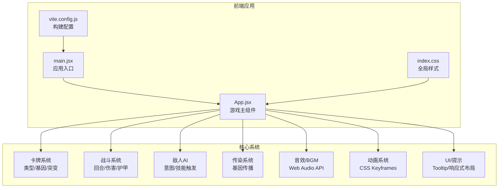
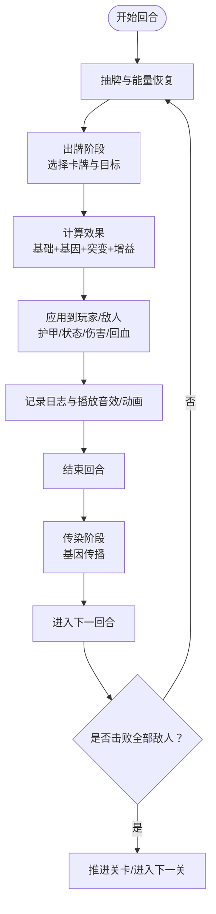
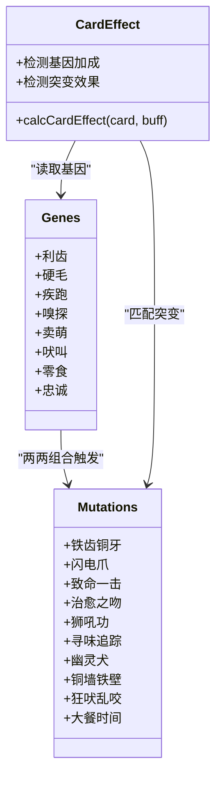
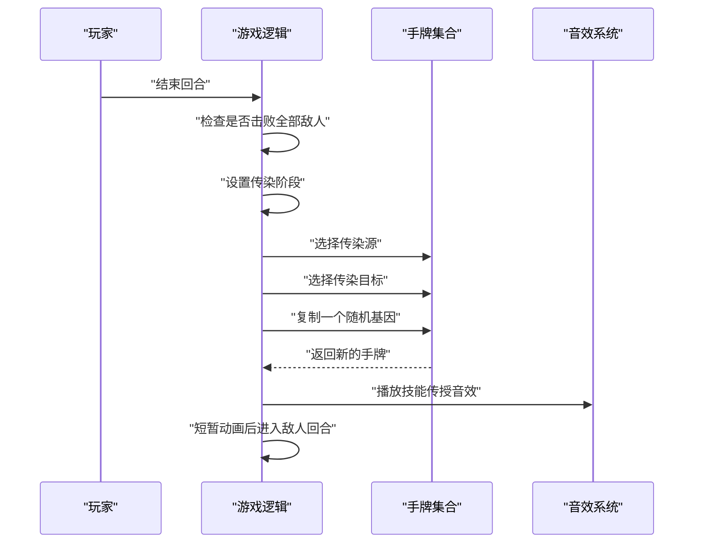
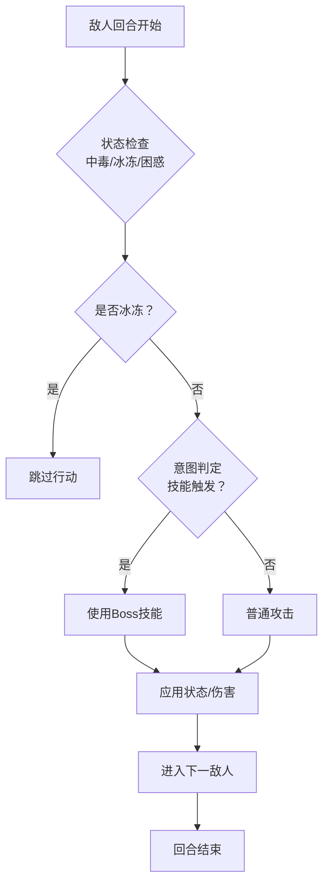
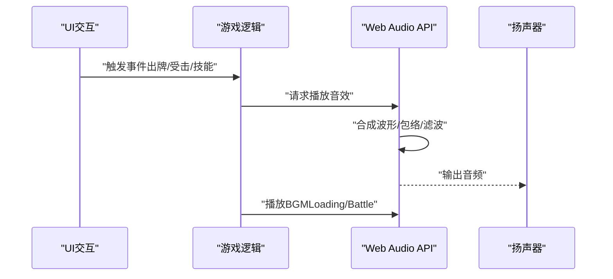
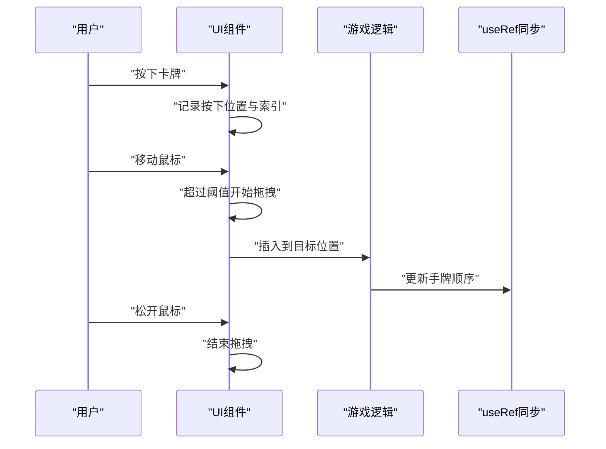
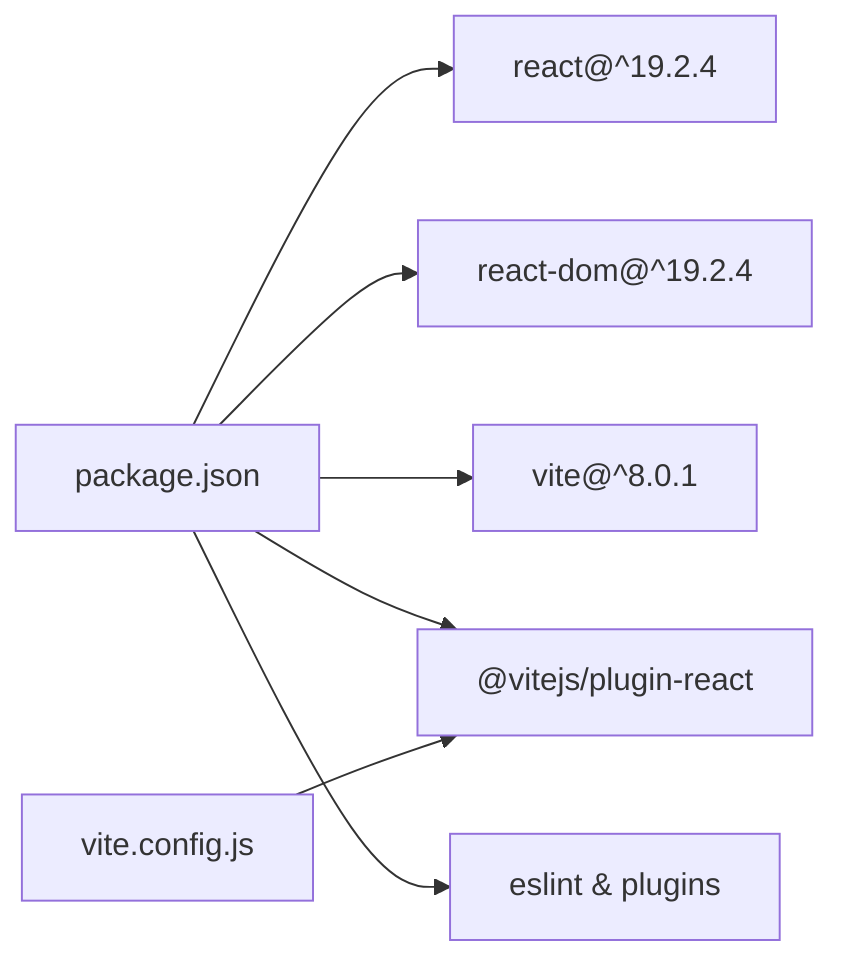

# 项目概述

<cite>
**本文引用的文件**
- [README.md](file://README.md)
- [package.json](file://package.json)
- [vite.config.js](file://vite.config.js)
- [src/main.jsx](file://src/main.jsx)
- [src/App.jsx](file://src/App.jsx)
- [src/index.css](file://src/index.css)
- [游戏设计文档.md](file://游戏设计文档.md)
</cite>

## 目录
1. [引言](#引言)
2. [项目结构](#项目结构)
3. [核心组件](#核心组件)
4. [架构总览](#架构总览)
5. [详细组件分析](#详细组件分析)
6. [依赖分析](#依赖分析)
7. [性能考量](#性能考量)
8. [故障排查指南](#故障排查指南)
9. [结论](#结论)
10. [附录](#附录)

## 引言
《小雪闯上海》是一款以雪纳瑞犬“小雪”为主角的卡牌Roguelike游戏。玩家扮演小雪，在上海街头与坏猫咪、恶霸犬、城管大叔等敌人展开策略性战斗。游戏融合了Roguelike的永久死亡与卡牌构筑的深度策略，通过“基因系统”、“组合技（突变）机制”和“传染系统”，在单局游戏中实现卡牌的持续进化与Build成型，带来高重复游玩价值与即时策略乐趣。

## 项目结构
该项目采用前端单页应用架构，核心由React 19.2.4 + Vite 8.0.1 构建，代码集中在 src 目录内，公共资源位于 public/images。整体结构清晰，便于初学者理解与扩展。

图表来源
- [package.json:1-28](file://package.json#L1-L28)
- [vite.config.js:1-8](file://vite.config.js#L1-L8)
- [src/main.jsx:1-8](file://src/main.jsx#L1-L8)
- [src/App.jsx:1-20](file://src/App.jsx#L1-L20)
- [src/index.css:1-9](file://src/index.css#L1-L9)

章节来源
- [package.json:1-28](file://package.json#L1-L28)
- [vite.config.js:1-8](file://vite.config.js#L1-L8)
- [src/main.jsx:1-8](file://src/main.jsx#L1-L8)
- [src/App.jsx:1-20](file://src/App.jsx#L1-L20)
- [src/index.css:1-9](file://src/index.css#L1-L9)

## 核心组件
- 应用入口与挂载
  - main.jsx 负责创建根节点并渲染 App 根组件，是整个应用的启动点。
- 游戏主组件
  - App.jsx 是核心逻辑所在，包含卡牌系统、战斗流程、敌人AI、基因/突变/传染机制、音效与BGM、动画与提示系统等。
- 构建与运行配置
  - vite.config.js 使用 @vitejs/plugin-react 插件，提供快速热更新与开发体验。
  - package.json 定义了 React 19.2.4 与 Vite 8.0.1 的依赖及脚本命令。

章节来源
- [src/main.jsx:1-8](file://src/main.jsx#L1-L8)
- [src/App.jsx:1-20](file://src/App.jsx#L1-L20)
- [vite.config.js:1-8](file://vite.config.js#L1-L8)
- [package.json:1-28](file://package.json#L1-L28)

## 架构总览
游戏采用函数式组件 + Hooks 的 React 架构，结合 Web Audio API 实现8bit风格音效与BGM，配合CSS动画与响应式布局，形成完整的前端体验。核心数据流围绕“手牌 -> 计算效果 -> 应用到玩家/敌人 -> 日志与动画 -> 下一阶段”的闭环。

图表来源
- [src/main.jsx:1-8](file://src/main.jsx#L1-L8)
- [src/App.jsx:1-20](file://src/App.jsx#L1-L20)
- [vite.config.js:1-8](file://vite.config.js#L1-L8)
- [src/index.css:1-9](file://src/index.css#L1-L9)

## 详细组件分析

### 游戏核心系统总览
- 卡牌系统
  - 类型：攻击、防御、回血、增益、技能
  - 基因：利齿、硬毛、疾跑、嗅探、卖萌、吠叫、零食、忠诚
  - 突变（组合技）：基于基因两两组合触发的强力效果
- 战斗系统
  - 回合制：每回合抽牌、消耗能量、出牌、结束回合
  - 伤害计算：基础伤害 + 基因加成 + 突变效果 + 增益（如磨牙棒）
  - 护甲与状态：护甲抵伤、冰冻/虚弱/暴露/标记等状态影响
- 敌人系统
  - 7种Boss，随关卡递增难度，具备概率触发的特殊技能
  - AI意图：每回合预测下回合行动（普通攻击或技能）
- 传染系统
  - 每关胜利后触发，随机将一个基因复制到另一张手牌，实现卡牌进化
- 音效与BGM
  - Web Audio API 动态合成8bit风格音效与BGM，按场景切换
- 动画与提示
  - 卡牌拖拽、悬浮提示、攻击/受击/回血动画、响应式布局

章节来源
- [src/App.jsx:8-32](file://src/App.jsx#L8-L32)
- [src/App.jsx:164-216](file://src/App.jsx#L164-L216)
- [src/App.jsx:787-862](file://src/App.jsx#L787-L862)
- [src/App.jsx:864-988](file://src/App.jsx#L864-L988)
- [src/App.jsx:1030-1293](file://src/App.jsx#L1030-L1293)
- [src/App.jsx:1302-1407](file://src/App.jsx#L1302-L1407)
- [src/App.jsx:341-720](file://src/App.jsx#L341-L720)

### 卡牌系统与战斗流程
- 卡牌生成与基因注入
  - 依据配置生成完整牌库，按比例随机注入基因，保证至少1/3带基因
- 效果计算
  - 攻击类：基础伤害 + 基因加成 + 突变效果
  - 防御类：护甲加成（每回合结束清零）
  - 回血类：生命恢复
  - 技能类：特殊效果（削弱、迷惑、标记、抽牌等）
- 出牌与目标选择
  - 攻击类卡牌默认需要选择目标；若存在突变AOE/穿透等效果可自动生效
- 战斗结算
  - 应用护甲减免、状态效果（流血、冰冻、虚弱等）
  - 记录日志与播放音效/动画

图表来源
- [src/App.jsx:721-746](file://src/App.jsx#L721-L746)
- [src/App.jsx:750-785](file://src/App.jsx#L750-L785)
- [src/App.jsx:1030-1293](file://src/App.jsx#L1030-L1293)
- [src/App.jsx:1295-1300](file://src/App.jsx#L1295-L1300)
- [src/App.jsx:787-862](file://src/App.jsx#L787-L862)
- [src/App.jsx:1001-1028](file://src/App.jsx#L1001-L1028)

章节来源
- [src/App.jsx:61-89](file://src/App.jsx#L61-L89)
- [src/App.jsx:169-216](file://src/App.jsx#L169-L216)
- [src/App.jsx:1030-1293](file://src/App.jsx#L1030-L1293)
- [src/App.jsx:750-785](file://src/App.jsx#L750-L785)

### 基因系统与组合技机制
- 基因定义与效果
  - 提供8种基因，覆盖伤害、护甲、先攻、标记、吸血、弹射、抽牌、效果翻倍等
- 突变（组合技）
  - 基于两基因组合触发，产生强力效果（如全体伤害、冻结、无视护甲、回血等）
- 突变检测
  - 在卡牌效果计算时遍历基因组合，匹配预设配方并应用效果

图表来源
- [src/App.jsx:8-18](file://src/App.jsx#L8-L18)
- [src/App.jsx:20-32](file://src/App.jsx#L20-L32)
- [src/App.jsx:169-216](file://src/App.jsx#L169-L216)

章节来源
- [src/App.jsx:8-32](file://src/App.jsx#L8-L32)
- [src/App.jsx:169-216](file://src/App.jsx#L169-L216)

### 传染系统（卡牌进化）
- 触发时机
  - 每关胜利后进入传染阶段
- 传播机制
  - 随机选择一张手牌作为“传染源”，随机选择另一张手牌作为“传染目标”
  - 将传染源的一个随机基因复制到目标卡牌
- 影响
  - 可能触发突变，形成新的Build
  - 为Roguelike体验提供“单局内成长”的核心动力

图表来源
- [src/App.jsx:1295-1300](file://src/App.jsx#L1295-L1300)
- [src/App.jsx:787-862](file://src/App.jsx#L787-L862)
- [src/App.jsx:597-601](file://src/App.jsx#L597-L601)

章节来源
- [src/App.jsx:787-862](file://src/App.jsx#L787-L862)
- [src/App.jsx:1295-1300](file://src/App.jsx#L1295-L1300)

### 敌人AI与Boss技能
- AI意图
  - 每回合结束生成下回合意图（普通攻击或技能），并以概率控制技能触发
- 技能类型
  - 多重攻击、重击、流血、终极技能等
- 状态影响
  - 冰冻（无法行动）、迷惑（可能跳过回合）、虚弱（攻击力降低）、暴露（额外伤害）、标记（持续伤害）

图表来源
- [src/App.jsx:864-988](file://src/App.jsx#L864-L988)
- [src/App.jsx:926-928](file://src/App.jsx#L926-L928)

章节来源
- [src/App.jsx:91-100](file://src/App.jsx#L91-L100)
- [src/App.jsx:102-116](file://src/App.jsx#L102-L116)
- [src/App.jsx:864-988](file://src/App.jsx#L864-L988)

### 音效与BGM系统
- Web Audio API
  - 动态合成8bit风格音效（方波、锯齿波、三角波、正弦波）
  - 包络、扫频、带通/低通滤波等技术营造真实狗叫声与打击感
- BGM
  - Loading界面与战斗界面分别使用不同旋律与节拍
- 音效映射
  - 每种卡牌与Boss技能均有专属音效，增强沉浸感

图表来源
- [src/App.jsx:341-720](file://src/App.jsx#L341-L720)
- [src/App.jsx:597-617](file://src/App.jsx#L597-L617)
- [src/App.jsx:677-719](file://src/App.jsx#L677-L719)

章节来源
- [src/App.jsx:341-720](file://src/App.jsx#L341-L720)

### UI与交互系统
- 卡牌拖拽
  - 鼠标按下检测、拖拽阈值、容器内目标定位、插入动画
- 悬浮提示
  - 支持PC端延迟显示与移动端长按显示，展示卡牌/敌人详情
- 响应式布局
  - 使用 clamp() 与 vw 单位，适配桌面与移动端

图表来源
- [src/App.jsx:264-335](file://src/App.jsx#L264-L335)
- [src/App.jsx:1302-1407](file://src/App.jsx#L1302-L1407)

章节来源
- [src/App.jsx:264-335](file://src/App.jsx#L264-L335)
- [src/App.jsx:1302-1407](file://src/App.jsx#L1302-L1407)
- [src/index.css:1-9](file://src/index.css#L1-L9)

## 依赖分析
- 运行时依赖
  - React 19.2.4 与 react-dom 19.2.4：提供组件化与渲染能力
- 开发依赖
  - Vite 8.0.1：快速构建与热更新
  - @vitejs/plugin-react：React插件（Oxc/SWC）
  - ESLint 及相关插件：代码质量保障
- 配置
  - vite.config.js 仅启用 React 插件，保持最小化配置

图表来源
- [package.json:12-26](file://package.json#L12-L26)
- [vite.config.js:1-8](file://vite.config.js#L1-L8)

章节来源
- [package.json:1-28](file://package.json#L1-L28)
- [vite.config.js:1-8](file://vite.config.js#L1-L8)

## 性能考量
- React 19.2.4
  - 使用函数组件与 Hooks，减少类组件复杂度，提升渲染效率
- Vite 8.0.1
  - 快速冷启动与热更新，缩短开发迭代周期
- Web Audio API
  - 单例 AudioContext，避免频繁创建；使用低延迟振荡器直接合成
- 动画与渲染
  - 使用 transform/opacity 实现 GPU 加速；避免触发布局重排
- 状态管理
  - useRef 同步关键状态，避免闭包陷阱；函数式更新避免竞态

章节来源
- [package.json:12-26](file://package.json#L12-L26)
- [src/App.jsx:341-720](file://src/App.jsx#L341-L720)
- [src/App.jsx:257-263](file://src/App.jsx#L257-L263)

## 故障排查指南
- 音效无法播放
  - 检查浏览器手势要求与 AudioContext 状态（需在用户交互后激活）
  - 确认未处于 suspended 状态并尝试 resume
- 卡牌拖拽异常
  - 确认鼠标按下/移动/松开事件绑定正确
  - 检查拖拽阈值与容器内目标定位逻辑
- BGM 未切换
  - 确认 isPlayingBGM 标志与 interval 清理逻辑
  - 检查 notes 数组与 noteIndex 循环
- 卡牌效果未生效
  - 检查 calcCardEffect 的基因与突变匹配逻辑
  - 确认 effects 数组中 mutation 对象的 effect 字段映射

章节来源
- [src/App.jsx:341-720](file://src/App.jsx#L341-L720)
- [src/App.jsx:264-335](file://src/App.jsx#L264-L335)
- [src/App.jsx:169-216](file://src/App.jsx#L169-L216)

## 结论
《小雪闯上海》以简洁而富有深度的Roguelike卡牌战斗为核心，通过基因系统、组合技与传染机制，构建了高策略性与可玩性的单局体验。技术栈选择（React 19.2.4 + Vite 8.0.1）兼顾开发效率与性能表现，Web Audio API 与CSS动画进一步提升了沉浸感。该设计既适合初学者快速上手，也为有经验的开发者提供了可扩展的架构与深入优化的空间。

## 附录
- 设计文档要点
  - 游戏类型：单局制Roguelike卡牌
  - 关卡与难度：6个关卡，逐步递增
  - 核心循环：战斗 -> 传染进化 -> 再战斗
  - 技术实现：React + Vite + Web Audio API + CSS动画
- 未来扩展方向
  - 新卡牌/新敌人/新关卡
  - 难度选择、存档系统、成就与统计
  - 视觉与音效增强（插画、BGM曲目、音量调节）

章节来源
- [游戏设计文档.md:1-250](file://游戏设计文档.md#L1-L250)